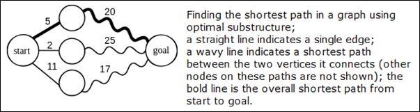

.. contents:: Table of Contents

Dynamic Programming
========================

Dynamic Programming
-----------------------

Dynamic programming (also known as dynamic optimization) is a method for solving a complex problem by breaking it down into a collection of simpler subproblems, solving each of those subproblems just once, and storing their solutions. The next time the same subproblem occurs, instead of recomputing its solution, one simply looks up the previously computed solution.

The technique of storing solutions to subproblems instead of recomputing them is called **"memoization"**.

often used for optimization

Using a dynamic programming algorithm always guarantee an optimal solution, whereas a greedy algorithm does not

One advantage of a greedy algorithm over a dynamic programming algorithm is that the greedy algorithm is often faster and simpler to calculate. Some greedy algorithms (such as Kruskal's or Prim's for minimum spanning trees) are known to lead to the optimal solution.

There are two key attributes that a problem must have in order for dynamic programming to be applicable: **optimal substructure and overlapping sub-problems**.

If a problem can be solved by combining optimal solutions to non-overlapping sub-problems, the strategy is called "divide and conquer" instead.

.. list-table::
    
    *   -   Dynamic programming
        -   optimal substructure
        -   overlapping sub-problems
    
    *   -   Divide and conquer
        -   optimal substructure
        -   non-overlapping sub-problems

Optimal substructure
^^^^^^^^^^^^^^^^^^^^^^^^^

Optimal substructure means that the solution to a given optimization problem can be obtained by the combination of optimal solutions to its sub-problems. Such optimal substructures are usually described by means of recursion.

Example, given a graph G=(V, E), the shortest path p from a vertex u to a vertex v exhibits optimal substructure: take any intermediate vertex w on this shortest path p. If p is truly the shortest path, then it can be split into sub-paths p1 from u to w and p2 from w to v such that these, in turn, are indeed the shortest paths between the corresponding vertices.

Overlapping sub-problems
^^^^^^^^^^^^^^^^^^^^^^^^^^^

Overlapping sub-problems means that the space of sub-problems must be small, that is, any recursive algorithm solving the problem should solve the same sub-problems over and over, rather than generating new sub-problems.

Example, consider the recursive formulation for generating the Fibonacci series: Fi = Fi−1 + Fi−2, with base case F1 = F2 = 1. Then F43 = F42 + F41, and F42 = F41 + F40. Now F41 is being solved in the recursive sub-trees of both F43 as well as F42.

This can be achieved in either of two ways:

1.	Top-down approach
^^^^^^^^^^^^^^^^^^^^^^^^^

This is the direct fall-out of the recursive formulation of any problem. If the solution to any problem can be formulated recursively using the solution to its sub-problems, and if its sub-problems are overlapping, then one can easily memoize or store the solutions to the sub-problems in a table. Whenever we attempt to solve a new sub-problem, we first check the table to see if it is already solved. If a solution has been recorded, we can use it directly, otherwise we solve the sub-problem and add its solution to the table.

2.	Bottom-up approach
^^^^^^^^^^^^^^^^^^^^^^^^^

Once we formulate the solution to a problem recursively as in terms of its sub-problems, we can try reformulating the problem in a bottom-up fashion: try solving the sub-problems first and use their solutions to build-on and arrive at solutions to bigger sub-problems. This is also usually done in a tabular form by iteratively generating solutions to bigger and bigger sub-problems by using the solutions to small sub-problems.

Example, if we already know the values of F41 and F40, we can directly calculate the value of F42.

Examples: Computer algorithms
-----------------------------

#.  Dijkstra's algorithm for the shortest path problem
#.  Fibonacci sequence
#.  A type of balanced 0–1 matrix
#.  Checkerboard
#.  Sequence alignment
#.  Tower of Hanoi puzzle
#.  Egg dropping puzzle
#.  Faster DP solution using a different parametrization
#.  Matrix chain multiplication

How to solve a Dynamic Programming Problem?
---------------------------------------------------

Dynamic Programming (DP) is a technique that solves some particular type of problems in Polynomial Time. Dynamic Programming solutions are faster than exponential brute method and can be easily proved for their correctness.

Steps to solve a DP

#.  Identify if it is a DP problem
#.  Decide a state expression with least parameters
#.  Formulate state relationship    
#.  Do tabulation (or add memoization)

Step 1 : How to classify a problem as a Dynamic Programming Problem?
^^^^^^^^^^^^^^^^^^^^^^^^^^^^^^^^^^^^^^^^^^^^^^^^^^^^^^^^^^^^^^^^^^^^^^^^^^

Typically, all the problems that require to maximize or minimize certain quantity or counting problems that say to count the arrangements under certain condition or certain probability problems can be solved by using Dynamic Programming.

All dynamic programming problems satisfy the overlapping subproblems property and most of the classic dynamic problems also satisfy the optimal substructure property. Once, we observe these properties in a given problem, be sure that it can be solved using DP.

Step 2 : Deciding the state
^^^^^^^^^^^^^^^^^^^^^^^^^^^^^^^

This is the most basic step which must be done very carefully because the state transition depends on the choice of state definition you make.

State A state can be defined as the set of parameters that can uniquely identify a certain position or standing in the given problem. This set of parameters should be as small as possible to reduce state space.

For example: In famous Knapsack problem, we define our state by two parameters index and weight i.e DP[index][weight]. Here DP[index][weight] tells us the maximum profit it can make by taking items from range 0 to index having the capacity of sack to be weight. Therefore, here the parameters index and weight together can uniquely identify a subproblem for the knapsack problem.

So, our first step will be deciding a state for the problem after identifying that the problem is a DP problem.

As we know DP is all about using calculated results to formulate the final result.

So, our next step will be to find a relation between previous states to reach the current state.

Step 3 : Formulating a relation among the states
^^^^^^^^^^^^^^^^^^^^^^^^^^^^^^^^^^^^^^^^^^^^^^^^^^^^^

This part is the hardest part of for solving a DP problem and requires a lots of intuition, observation and practice. 

Example Consider a sample problem

Given 3 numbers {1, 3, 5}, we need to tell the total number of ways we can form a number 'N' using the sum of the given three numbers. (allowing repetitions and different arrangements).

Total number of ways to form 6 is : 8

1+1+1+1+1+1

1+1+1+3

1+1+3+1

1+3+1+1

3+1+1+1

3+3

1+5

5+1

Let’s think dynamically for this problem. So, first of all, we decide a state for the given problem. We will take a parameter n to decide state as it can uniquely identify any subproblem. So, our state dp will look like state(n). Here, state(n) means the total number of arrangements to form n by using {1, 3, 5} as elements.

Now, we need to compute state(n).

How to do it? 

So here the intuition comes into action. As we can only use 1, 3 or 5 to form a given number. Let us assume that we know the result for n = 1,2,3,4,5,6 ; being termilogistic let us say we know the result for the

state (n = 1), state (n = 2), state (n = 3) ……… state (n = 6)

Now, we wish to know the result of the state (n = 7). See, we can only add 1, 3 and 5. Now we can get a sum total of 7 by the following 3 ways:

#.  Adding 1 to all possible combinations of state (n = 6)

    Eg : [ (1+1+1+1+1+1) + 1]

    [ (1+1+1+3) + 1]

    [ (1+1+3+1) + 1]

    [ (1+3+1+1) + 1]

    [ (3+1+1+1) + 1]

    [ (3+3) + 1]

    [ (1+5) + 1]

    [ (5+1) + 1]

#.  Adding 3 to all possible combinations of state (n = 4);

    Eg : [(1+1+1+1) + 3]

    [(1+3) + 3]

    [(3+1) + 3]

#.  Adding 5 to all possible combinations of state(n = 2)

    Eg : [ (1+1) + 5]

Now, think carefully and satisfy yourself that the above three cases are covering all possible ways to form a sum total of 7;

Therefore, we can say that result for

state(7) = state (6) + state (4) + state (2)

or

state(7) = state (7-1) + state (7-3) + state (7-5)

In general,

state(n) = state(n-1) + state(n-3) + state(n-5)

So, our code will look like:

.. code:: cpp

    // Returns the number of arrangements to form 'n' 
    int solve(int n) { 
        // base case
        if (n < 0) 
            return 0;
        if (n == 0)  
            return 1;  

        return solve(n-1) + solve(n-3) + solve(n-5);
    }

The above code seems exponential as it is calculating the same state again and again. So, we just need to add a memoization.

Step 4 : Adding memoization or tabulation for the state
^^^^^^^^^^^^^^^^^^^^^^^^^^^^^^^^^^^^^^^^^^^^^^^^^^^^^^^^^^^

This is the easiest part of a dynamic programming solution. We just need to store the state answer so that next time that state is required, we can directly use it from our memory

Adding memoization to the above code

.. code:: cpp

    // initialize to -1
    int dp[MAXN];
    
    // this function returns the number of arrangements to form 'n' 
    int solve(int n) {
        // base case
        if (n < 0)
            return 0;
        if (n == 0)
            return 1;
            
        // checking if already calculated
        if (dp[n]!=-1)
            return dp[n];
            
        // storing the result and returning
        return dp[n] = solve(n-1) + solve(n-3) + solve(n-5);
    }

Another way is to add tabulation and make solution iterative. Please refer tabulation and memoization for more details.

Tabulation vs Memoizatation
------------------------------

Two different ways to store the values so that the values of a problem can be reused:

#.  Tabulation: Bottom Up
#.  Memoization: Top Down

1.	Tabulation: Bottom Up
^^^^^^^^^^^^^^^^^^^^^^^^^^^^^^^

Code to calculate the factorial of a number using bottom up approach. In this case, we define a state as dp[x], where dp[x] tis to find the factorial of x. Now, it is quite obvious that dp[x+1] = dp[x] * (x+1)

.. code:: cpp

    // Tabulated version to find factorial x.
    int dp[MAXN];

    // base case
    int dp[0] = 1;
    for (int i = 1; i< =n; i++) {
        dp[i] = dp[i-1] * i;
    }

The above code clearly follows the bottom up approach as it starts its transition from the bottom most base case dp[0] and reaches it destination state dp[n]. Here, we may notice that the dp table is being populated sequentially and we are directly accessing the calculated states from the table itself and hence, we call it tabulation method.

2.	Memoization: Top Down
^^^^^^^^^^^^^^^^^^^^^^^^^^^^^^

.. code:: cpp

    // Memoized version to find factorial x. To speed up we store the values of calculated states

    // initialized to -1
    int dp[MAXN]

    // return fact x!
    int solve(int x) {
        if (x==0)
            return 1;
        if (dp[x]!=-1)
            return dp[x];
            
        return (dp[x] = x * solve(x-1));
    }

As we can see we are storing the most recent cache up to a limit so that if next time we got a call for the same state we simply return it from the memory. So, this is why we call it memoization as we are storing the most recent state values.

In this case the memory layout is linear that’s why it may seem that the memory is being filled in a sequential manner like the tabulation method, but you may consider any other top down DP having 2D memory layout like Min Cost Path, here the memory is not filled in a sequential manner.

.. list-table::
    :header-rows: 1

    *   -   
        -   Tabulation
        -   Memoization

    *   -   State
        -   State transition relation is difficult to think
        -   State transition relation is easy to think

    *   -   Code
        -   Code gets complicated when lot of conditions are required
        -   Code is easy and less complicated

    *   -   Speed
        -   Fast, as we directly access previous states from the table
        -   Slow die to lot of recursive calls and return statements

    *   -   Subproblem solving
        -   If all subproblem must be solved at least once, a bottom-up dynamic-programming algorithm usually outperforms a top-down memoized algorithm by a constant factor
        -   If some subproblems in the subproblem space need not be solved at all, the memoized solution has the advantage of solving only those subproblems that are definitely required

    *   -   Table Entries
        -   In Tabulated version, starting from the first entry, all entries are filled one by one
        -   Unlike the Tabulated version, all entries of the lookup table are not necessarily filled in Memoized version. The table is filled on.

 
References
-----------

https://www.geeksforgeeks.org/dynamic-programming/

