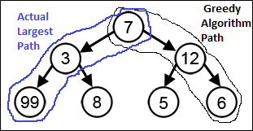

.. contents:: Table of Contents

Greedy Algorithm
==================

Greedy Algorithm
-----------------

A greedy algorithm is an algorithmic paradigm that follows the problem solving heuristic of making the locally optimal choice at each stage with the hope of finding a global optimum.
In many problems, a greedy strategy does not in general produce an optimal solution.

In general, greedy algorithms have five components:

#.  A **candidate set**, from which a solution is created
#.  A **selection function**, which chooses the best candidate to be added to the solution
#.  A **feasibility function**, that is used to determine if a candidate can be used to contribute to a solution
#.  An **objective function**, which assigns a value to a solution, or a partial solution, and
#.  A **solution function**, which will indicate when we have discovered a complete solution

Greedy algorithms produce good solutions on some mathematical problems, but not on others. Most problems for which they work will have two properties

**Greedy choice property**

Make whatever choice seems best at the moment and then solve the subproblems that arise later. It iteratively makes one greedy choice after another, reducing each given problem into a smaller one. In other words, a **greedy algorithm never reconsiders its choices**. 

This is the main difference from dynamic programming, after every stage, dynamic programming makes decisions based on all the decisions made in the previous stage, and may reconsider the previous stage's algorithmic path to solution.

**Optimal substructure**

A problem exhibits optimal substructure if an optimal solution to the problem contains optimal solutions to the sub-problems.

Cases of failure
------------------

For many problems, greedy algorithms fail to produce the optimal solution, and may even produce the unique worst possible solution. 

Example: With a goal of reaching the largest-sum, at each step, the greedy algorithm will choose what appears to be the optimal immediate choice, so it will choose 12 instead of 3 at the second step, and will not reach the best solution, which contains 99.

Types
-----------

Greedy algorithms can be characterized as being 'short sighted', and also as 'non-recoverable'. They are ideal only for problems which have 'optimal substructure'. Despite this, for many simple problems (e.g. giving change), the best suited algorithms are greedy algorithms. There are a few variations to the greedy algorithm:

#.  Pure greedy algorithms
#.  Orthogonal greedy algorithms
#.  Relaxed greedy algorithms

Applications
---------------

Greedy algorithms mostly (but not always) fail to find the globally optimal solution, because they usually do not operate exhaustively on all the data. They can make commitments to certain choices too early which prevent them from finding the best overall solution later.

If a greedy algorithm can be proven to yield the global optimum for a given problem class, it typically becomes the method of choice because it is faster than other optimization methods like dynamic programming.

Examples

-   Kruskal's algorithm 
-   Prim's algorithm for finding minimum spanning trees
-   Algorithm for finding optimum Huffman trees

Greedy algorithms appear in network routing as well. Using greedy routing, a message is forwarded to the neighboring node which is "closest" to the destination. The notion of a node's location (and hence "closeness") may be determined by its physical location, as in geographic routing used by ad hoc networks. Location may also be an entirely artificial construct as in small world routing and distributed hash table.

Examples
-------------

#.  The activity selection problem is characteristic to this class of problems, where the goal is to pick the maximum number of activities that do not clash with each other.
#.  A greedy algorithm is used to construct a Huffman tree during Huffman coding where it finds an optimal solution.
#.  In decision tree learning, greedy algorithms are commonly used, however they are not guaranteed to find the optimal solution.
#.  In the Macintosh computer game Crystal Quest the objective is to collect crystals, in a fashion similar to the travelling salesman problem. 
#.  The matching pursuit is an example of greedy algorithm applied on signal approximation.
#.  A greedy algorithm finds the optimal solution to Malfatti's problem of finding three disjoint circles within a given triangle that maximize the total area of the circles; it is conjectured that the same greedy algorithm is optimal for any number of circles.

References
-------------

https://www.geeksforgeeks.org/greedy-algorithms/
