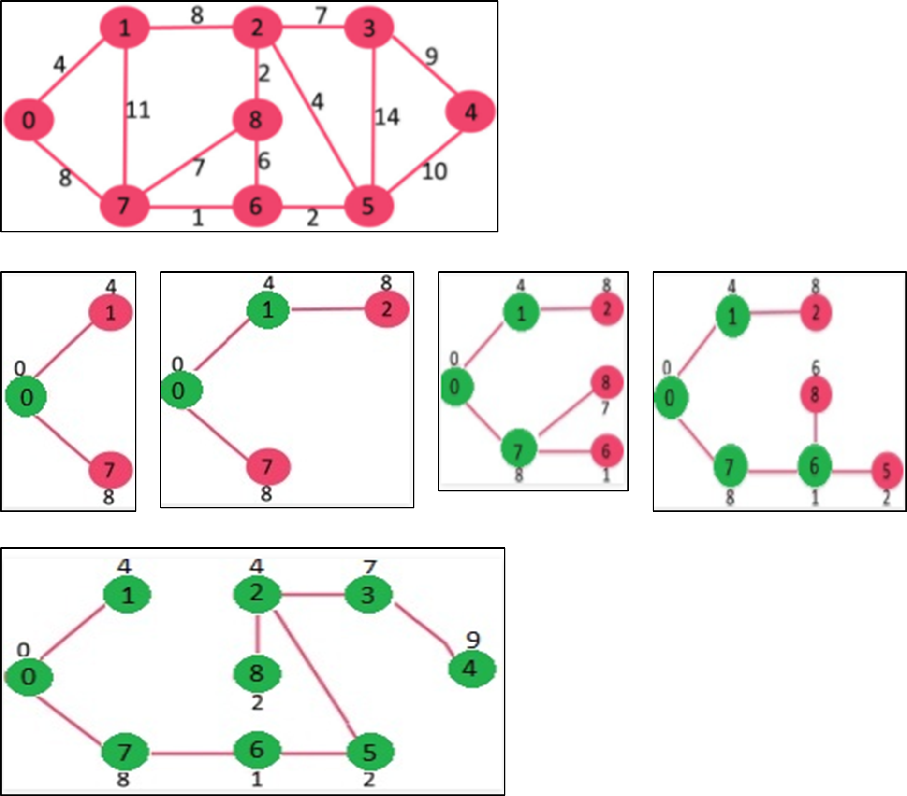
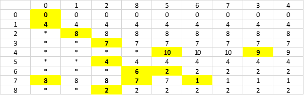
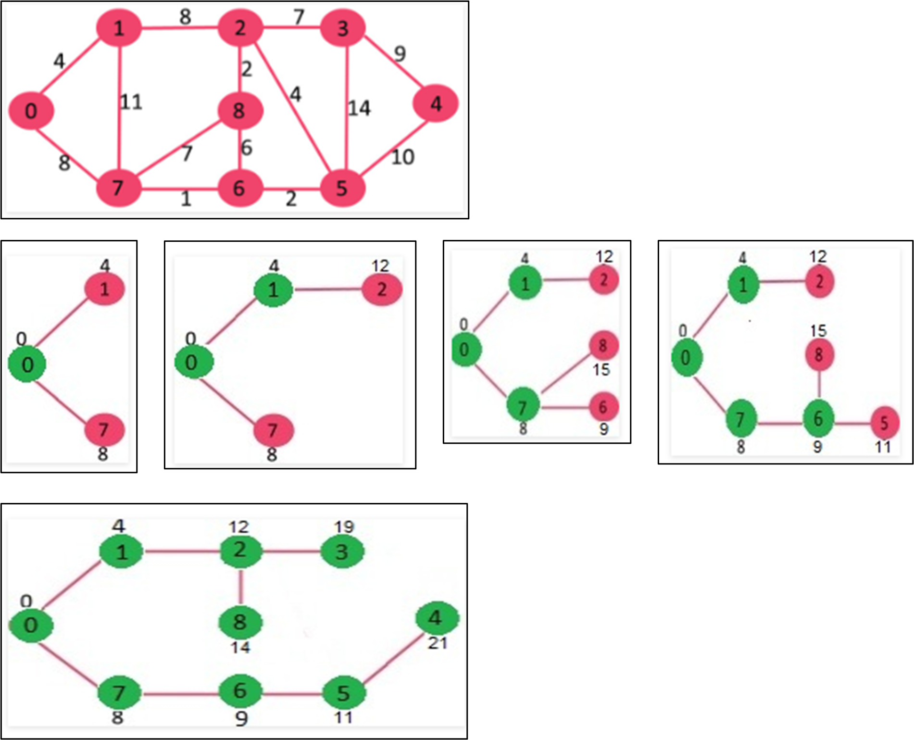
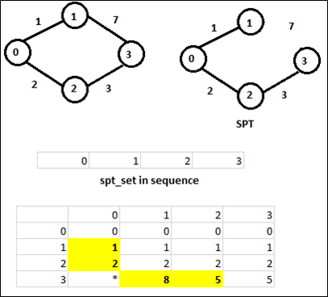

.. contents:: Table of Contents

1.	Kruskal’s Minimum Spanning Tree Algorithm
------------------------------------------------

2.	Prim’s Minimum Spanning Tree Algorithm
------------------------------------------------

A spanning tree means all vertices must be connected. So the two disjoint subsets (discussed above) of vertices must be connected to make a Spanning Tree. And they must be connected with the minimum weight edge to make it a Minimum Spanning Tree.

**Algorithm**

#.  Create a set mstSet that keeps track of vertices already included in MST.
#.  Assign a key value to all vertices in the input graph. Initialize all key values as INFINITE. Assign key value as 0 for the first vertex so that it is picked first.
#.  While mstSet doesn’t include all vertices

    I.  Pick a vertex u which is not there in mstSet and has minimum key value.
    II. Include u to mstSet.
    III.    Update key value of all adjacent vertices of u. To update the key values, iterate through all adjacent vertices. For every adjacent vertex v, if weight of edge u-v is less than the previous key value of v, update the key value as weight of u-v.

The idea of using key values is to pick the minimum weight edge from cut. The key values are used only for vertices which are not yet included in MST, the key value for these vertices indicate the minimum weight edges connecting them to the set of vertices included in MST.
 

mst_set in sequence::

    0   1   2   8   5   6   7   3   4

* means infinity

.. code:: cpp

    // A C / C++ program for Prim's Minimum Spanning Tree (MST) algorithm. 
    // The program is for adjacency matrix representation of the graph

    #include <stdio.h>
    #include <limits.h>

    // Number of vertices in the graph
    #define V 9

    // A utility function to find the vertex with minimum key value, from
    // the set of vertices not yet included in MST
    int minKey(int key[], bool mstSet[]) {
        // Initialize min value
        int min = INT_MAX, min_index;

        for (int v = 0; v < V; v++)
            if (mstSet[v] == false && key[v] < min)
                min = key[v], min_index = v;

        return min_index;
    }

    // A utility function to print the constructed MST stored in parent[]
    int printMST(int parent[], int n, int graph[V][V]) {
        printf("\nEdge \t Weight\n");
        for (int i = 1; i < V; i++)
            printf("%d - %d \t %d \n", parent[i], i, graph[i][parent[i]]);
    }

    // Function to construct and print MST for a graph represented using adjacency
    // matrix representation
    void primMST(int graph[V][V]) {
        int parent[V];		// Array to store constructed MST
        int key[V];		// Key values used to pick minimum weight edge in cut
        bool mstSet[V];	// To represent set of vertices not yet included in MST

        // Initialize all keys as INFINITE
        for (int i = 0; i < V; i++)
            key[i] = INT_MAX, mstSet[i] = false;

        // Always include first 1st vertex in MST.
        key[0] = 0;		// Make key 0 so that this vertex is picked as first vertex
        parent[0] = -1;	// First node is always root of MST 

        // The MST will have V vertices
        for (int count = 0; count < V-1; count++) {
            // Pick the minimum key vertex from the set of vertices not yet included in MST
            int u = minKey(key, mstSet);
            printf("%d ", u);
            
            // Add the picked vertex to the MST Set
            mstSet[u] = true;

            // Update key value and parent index of the adjacent vertices of
            // the picked vertex. Consider only those vertices which are not yet
            // included in MST
            for (int v = 0; v < V; v++)

            // graph[u][v] is non zero only for adjacent vertices of m
            // mstSet[v] is false for vertices not yet included in MST
            // Update the key only if graph[u][v] is smaller than key[v]
                if (graph[u][v] && mstSet[v] == false && graph[u][v] < key[v])
                    parent[v] = u, key[v] = graph[u][v];
        }

        printf("\n");
        
        // print the constructed MST
        printMST(parent, V, graph);
    }

    // driver program to test above function
    int main() {

    int graph[V][V] =	{	{0, 4, 0, 0, 0, 0, 0, 8, 0},
                    {4, 0, 8, 0, 0, 0, 0, 11, 0},
                    {0, 8, 0, 7, 0, 4, 0, 0, 2},
                    {0, 0, 7, 0, 9, 14, 0, 0, 0},
                    {0, 0, 0, 9, 0, 10, 0, 0, 0},
                    {0, 0, 4, 14, 10, 0, 2, 0, 0},
                    {0, 0, 0, 0, 0, 2, 0, 1, 6},
                    {8, 11, 0, 0, 0, 0, 1, 0, 7},
                    {0, 0, 2, 0, 0, 0, 6, 7, 0}
                            };

        // Print the solution
        primMST(graph);

        return 0;
    }

Output::

    0 1 2 8 5 6 7 3

    Edge     Weight
    0 - 1    4
    1 - 2    8
    2 - 3    7
    3 - 4    9
    2 - 5    4
    5 - 6    2
    6 - 7    1
    2 - 8    2

3.	Dijkstra’s Shortest Path Algorithm
----------------------------------------

**Algorithm**

#.  Create a set sptSet (shortest path tree set) that keeps track of vertices included in shortest path tree, i.e., whose minimum distance from source is calculated and finalized. Initially, this set is empty.
#.  Assign a distance value to all vertices in the input graph. Initialize all distance values as INFINITE. Assign distance value as 0 for the source vertex so that it is picked first.
#.  While sptSet doesn’t include all vertices

    i.  Pick a vertex u which is not there in sptSetand has minimum distance value.
    ii. Include u to sptSet.
    iii.    Update distance value of all adjacent vertices of u. To update the distance values, iterate through all adjacent vertices. For every adjacent vertex v, if sum of distance value of u (from source) and weight of edge u-v, is less than the distance value of v, then update the distance value of v.
        

.. code:: cpp

    // A C++ program for Dijkstra's single source shortest path algorithm.
    // The program is for adjacency matrix representation of the graph

    #include <stdio.h>
    #include <limits.h>

    // Number of vertices in the graph
    #define V 9

    // A utility function to find the vertex with minimum distance value, from
    // the set of vertices not yet included in shortest path tree
    int minDistance(int dist[], bool sptSet[]) {
        // Initialize min value
        int min = INT_MAX, min_index;

        for (int v = 0; v < V; v++)	
            if (sptSet[v] == false && dist[v] <= min)
                min = dist[v], min_index = v;

        return min_index;
    }

    // A utility function to print the constructed distance array
    int printSolution(int dist[], int n) {
        printf("Vertex \t Distance from Source\n");
        for (int i = 0; i < V; i++)
            printf("%d \t\t %d\n", i, dist[i]);
    }

    // Funtion that implements Dijkstra's single source shortest path algorithm
    // for a graph represented using adjacency matrix representation
    void dijkstra(int graph[V][V], int src) {
        int dist[V];	 // The output array. dist[i] will hold the shortest
                        // distance from src to i

        bool sptSet[V]; // sptSet[i] will true if vertex i is included in shortest
                        // path tree or shortest distance from src to i is finalized

        // Initialize all distances as INFINITE and stpSet[] as false
        for (int i = 0; i < V; i++)
            dist[i] = INT_MAX, sptSet[i] = false;

        // Distance of source vertex from itself is always 0
        dist[src] = 0;

        // Find shortest path for all vertices
        for (int count = 0; count < V-1; count++) {
            // Pick the minimum distance vertex from the set of vertices not
            // yet processed. u is always equal to src in first iteration.
            int u = minDistance(dist, sptSet);
            
            // Mark the picked vertex as processed
            sptSet[u] = true;
            
            // Update dist value of the adjacent vertices of the picked vertex.
            for (int v = 0; v < V; v++)
            
                // Update dist[v] only if is not in sptSet, 
                // there is an edge from u to v, and 
                // total weight of path from src to v through u is 
                // smaller than current value of dist[v]
        
                // do not calculate distance of those nodes which are already visited
                if (!sptSet[v] && graph[u][v] && dist[u] != INT_MAX 
                                    && dist[u]+graph[u][v] < dist[v])
                    dist[v] = dist[u] + graph[u][v];
        }

        // print the constructed distance array
        printSolution(dist, V);
    }

    // driver program to test above function
    int main() {

    /* Let us create the example graph discussed above */
    int graph[V][V] =	{	{0, 4, 0, 0, 0, 0, 0, 8, 0},
                    {4, 0, 8, 0, 0, 0, 0, 11, 0},
                    {0, 8, 0, 7, 0, 4, 0, 0, 2},
                    {0, 0, 7, 0, 9, 14, 0, 0, 0},
                    {0, 0, 0, 9, 0, 10, 0, 0, 0},
                    {0, 0, 4, 14, 10, 0, 2, 0, 0},
                    {0, 0, 0, 0, 0, 2, 0, 1, 6},
                    {8, 11, 0, 0, 0, 0, 1, 0, 7},
                    {0, 0, 2, 0, 0, 0, 6, 7, 0}
                };

        dijkstra(graph, 0);

        return 0;
    }

Output::

    Vertex 	 Distance from Source
    0 		 0
    1 		 4
    2 		 12
    3 		 19
    4 		 21
    5 		 11
    6 		 9
    7 		 8
    8 		 14

#.  The code is for undirected graph, same dijkstra function can be used for directed graphs also.
#.  The code finds shortest distances from source to all vertices. If we are interested only in shortest distance from source to a single target, we can break the for loop when the picked minimum distance vertex is equal to target.
#.  Time Complexity of the implementation is O(V^2). If the input graph is represented using adjacency list, it can be reduced to O(E log V) with the help of binary heap.
#.  Dijkstra’s algorithm doesn’t work for graphs with negative weight edges. For graphs with negative weight edges, Bellman–Ford algorithm can be used.

4.	Graph coloring
--------------------

References
----------------

https://www.geeksforgeeks.org/greedy-algorithms/

