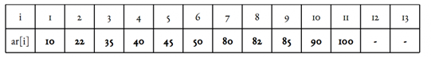
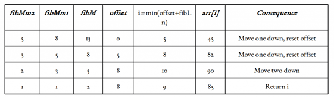
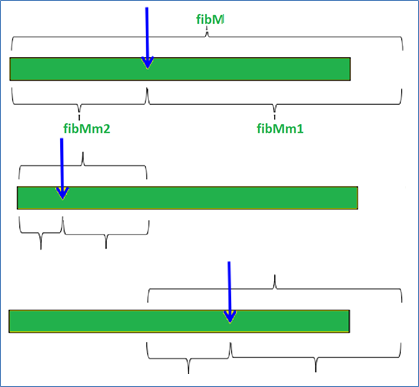
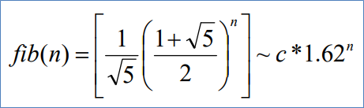

.. contents:: Table of Contents

Fibonacci search
===================

Fibonacci search
-------------------

Fibonacci search is derived from Golden section search, an algorithm by Jack Kiefer (1953) to search for the maximum or minimum of a unimodal function in an interval.

The Fibonacci search technique is a method of searching a sorted array using a divide and conquer algorithm that narrows down possible locations with the aid of Fibonacci numbers.

Fibonacci search divides the array into two parts that have sizes that are consecutive Fibonacci numbers. On average, this leads to about 4% more comparisons to be executed.

Similarities with Binary Search
^^^^^^^^^^^^^^^^^^^^^^^^^^^^^^^^^^^^

#.  Works for sorted arrays
#.  A Divide and Conquer Algorithm
#.  Has Log n time complexity

Differences with Binary Search
^^^^^^^^^^^^^^^^^^^^^^^^^^^^^^^^^^^^

#.  Fibonacci Search divides given array in unequal parts
#.  Binary Search uses division operator to divide range. Fibonacci Search doesn’t use /, but uses + and -. The division operator may be costly on some CPUs.
#.  Fibonacci Search examines relatively closer elements in subsequent steps. So when input array is big that cannot fit in CPU cache or even in RAM, Fibonacci Search can be useful.

Advantage
^^^^^^^^^^^^^^

#.  One only needs addition and subtraction to calculate the indices of the accessed array elements, while classical binary search needs bit-shift, division or multiplication. 
#.  Fibonacci search may have the advantage over binary search in slightly reducing the average time needed to access a storage location. If the machine executing the search has a direct mapped CPU cache, binary search may lead to more cache misses because the elements that are accessed often tend to gather in only a few cache lines; this is mitigated by splitting the array in parts that do not tend to be powers of two.

Observations
^^^^^^^^^^^^^^^^^^

Below observation is used for range elimination, and hence for the O(log(n)) complexity.

F(n - 2) &approx; (1/3)*F(n)

F(n - 1) &approx; (2/3)*F(n)

Algorithm
----------

Let k be defined as an element in F, the array of Fibonacci numbers. n = Fm is the array size. If n is not a Fibonacci number, let Fm be the smallest number in F that is greater than n.

The array of Fibonacci numbers is defined where Fk+2 = Fk+1 + Fk, when k ≥ 0, F1 = 1, and F0 = 0.

To test whether an item is in the list of ordered numbers, follow these steps:

#.  Set k = m.
#.  If k = 0, stop. There is no match; the item is not in the array.
#.  Compare the item against element in Fk−1.
#.  If the item matches, stop.
#.  If the item is less than entry Fk−1, discard the elements from positions Fk−1 + 1 to n. Set k = k − 1 and return to step 2.
#.  If the item is greater than entry Fk−1, discard the elements from positions 1 to Fk−1. Renumber the remaining elements from 1 to Fk−2, set k = k − 2, and return to step 2.

Alternative implementation (from "Sorting and Searching" by Knuth):

Given a table of records R1, R2, ..., RN whose keys are in increasing order K1 < K2 < ... < KN, the algorithm searches for a given argument K. Assume N+1 = Fk+1

**Step1 -** [Initialize] i ← Fk, p ← Fk-1, q ← Fk-2 (throughoutthealgorithmp and q will be consecutive Fibonacci numbers)

**Step2 -** [Compare] If K < Ki, go to Step 3; if K > Ki go to Step 4; and if K = Ki, the algorithm terminates successfully.

**Step3 -** [Decrease i] If q=0, the algorithm terminates unsuccessfully. Otherwise set (i, p, q) ← (p, q, p - q) (which moves p and q one position back in the Fibonacci sequence); then return to Step 2

**Step4 -** [Increase i] If p=1, the algorithm terminates unsuccessfully. Otherwise set (i,p,q) ← (i + q, p - q, 2q - p) (which moves p and q two positions back in the Fibonacci sequence); and return to Step 2

The two variants of the algorithm presented above always divide the current interval into a larger and a smaller subinterval. The original algorithm, however, would divide the new interval into a smaller and a larger subinterval in Step 4. This has the advantage that the new i is closer to the old i and is more suitable for accelerating searching on magnetic tape.

Pseudocode
-------------

.. code:: cpp

    function fibonacci_search(item: integer; arr: sort_array) return index 
    is
        l : index := arr'first; -- first element of array
        u : index := arr'last; -- last element of array
        m : index := (u+l)/2;
        x,a,b : integer; 
    begin
        a := (Fn-3);
        b := (Fn-2)-(Fn-3);  
        discrete (f2,f1) := (Fn-2,Fn-3)
            new (f2,f1) := (f2-f1,2*f1-f2) | (a,b)
        with i := u-l+1
            new i=i/2 loop
        loop
            if item <arr(m) then
                m := m-f1; -- compute new position of compared element 
                f2 := f2-f1;
                f1 := f1-f2;
            elsif item >arr(m) then
                m := m+f1; -- compute new position of compared element
                x := f1;
                f1 := f2-f1;
                f2 := x; 
                a := f2; b := f1;
            else
                return m; -- return index of found item
            end if;
            i := i/2; 
        end loop;
    end fibonacci_search;

Illustration
--------------

Let us understand the algorithm with below example

Illustration assumption: 1-based indexing. Target element x is 85. Length of array n = 11.

Smallest Fibonacci number greate than or equal to 11 is 13. As per our illustration, fibMm2 = 5, fibMm1 = 8, and fibM = 13.

Another implementation detail is the offset variable (zero initialized). It marks the range that has been eliminated, starting from the front. We will update it time to time.

Now since the offset value is an index and all indices inclusive it and below it has been eliminated, it only makes sense to add something to it. Since fibMm2 marks approximately one-third of our array, as well as the indices it marks are sure to be valid ones, we can add fibMm2 to offset and check the element at index 

**i = min(offset + fibMm2, n)**
 

Visualization
---------------

Complexity
--------------

Let's assume we can always compute x assume we can always compute                     x ~ l+2 * (r - l)/3 using only integer additions and subtractions.

The worst case will occur when we have our target in the larger (2/3) fraction of the array, as we proceed finding it. In other words, we are eliminating the smaller (1/3) fraction of the array every time. We call once for n, then for(2/3)n, then for (4/9)n….. i.e., we look at arrays of size fib(n-1), fib(n-2), fib(n-3)

for n~c*1,62n’ (for some n’) we make O(n’) comparisons We thus need **1/c*log1,62(n)=O(log(n))** comparisons

.. list-table::
    :header-rows: 2
	
	*	-   Algorithm
        -   Time Complexity
        -
        -

    *   -   Name
        -   Best
        -   Average
        -   Worst

    *   -   Selection Sort
        -   Ω(\ :sup:`2` \)
        -   θ(\ :sup:`2` \)
        -   O(\ :sup:`2` \)

    *   -   Bubble Sort
        -   Ω(n)
        -   θ(n\ :sup:`2` \)
        -   O(n\ :sup:`2` \)

    *   -   Insertion Sort
        -   Ω(n)
        -   θ(n\ :sup:`2` \)
        -   O(n\ :sup:`2` \)

    *   -   Heap Sort
        -   Ω(n log(n))
        -   θ(n log(n))
        -   O(n log(n))

    *   -   Quick Sort
        -   Ω(n log(n))
        -   θ(n log(n))
        -   O(\ :sup:`2` \)

    *   -   Merge Sort
        -   Ω(n log(n))
        -   θ(n log(n))
        -   O(n log(n))

    *   -   Bucket Sort
        -   Ω(n+k)
        -   θ(n+k)
        -   O(\ :sup:`2` \)

    *   -   Radix Sort
        -   Ω(nk)
        -   θ(nk)
        -   O(nk)

.. list-table::
    :header-rows: 1

    *   -   Name
        -   Memory
        -   Stable
        -   Method
        -   Other notes

    *   -   Selection Sort
        -   1
        -   No
        -   Selection
        -   Stable with O(n) extra space, for example using lists

    *   -   Bubble Sort
        -   1
        -   Yes
        -   Exchanging
        -   Tiny code size

    *   -   Insertion Sort
        -   1
        -   Yes
        -   Insertion
        -   O(n + d), in the worst case over sequences that have d inversions.
    
    *   -   Heap Sort
        -   1
        -   No
        -   Selection
        -   

    *   -   Quick Sort
        -   log n on average worst case space complexity n Sedgewick variation is log n worst case
        -   Typical in-place sort is not stable; stable versions exist
        -   Partitioning
        -   Quicksort is usually done in-place with O(log n) stack space

    *   -   Merge Sort
        -   A hybrid block merge sort is O(1) mem
        -   Yes
        -   Merging
        -   Highly parallelizable (up to O(log n) using the Three Hungarians' Algorithm or, more practically, Cole's parallel merge sort) for processing large amounts of data.

    *   -   Bucket Sort
        -   
        -   
        -   
        -   
			
    *   -   Radix Sort
        -   
        -   
        -   
        - 

.. list-table::
    :header-rows: 1

    *   -   Algorithm
        -   Best case
        -   Average case
        -   Worst case
        -   Space Complexity

    *   -   Linear Search
        -   O(1)
        -   O(n)
        -   O(n)
        -   O(1)

    *   -   Binary Search
        -   O(1)
        -   O(logn)
        -   O(logn)
        -   O(1)*

    *   -   Jump Search
        -   O(1)
        -   O(√ n)
        -   O(√ n)
        -   O(1)

    *   -   Interpolation Search
        -   O(1)
        -   O (log log n))
        -   O(n)
        -   O(1)

    *   -   Exponential Search
        -   O(1)
        -   O(log i)
        -   O(log i)
        -   O(1)

    *   -   Fibonacci Search
        -   O(1)
        -   O(logn)
        -   O(logn)
        -   O(1)

Application
--------------

Example
-----------

.. code:: cpp

    // C program for Fibonacci Search
    #include <stdio.h>

    // Utility function to find minimum of two elements
    intmin(int x, int y) { return (x<=y)? x : y; }

    /* Returns index of x if present,  else returns -1 */
    int fibMonaccianSearch(intarr[], int x, int n)
    {
        /* Initialize fibonacci numbers */
        int fibMMm2 = 0;   // (m-2)'th Fibonacci No.
        int fibMMm1 = 1;   // (m-1)'th Fibonacci No.
        intfibM = fibMMm2 + fibMMm1;  // m'th Fibonacci

        /* fibM is going to store the smallest Fibonacci Number greater than or equal to n */
        while (fibM< n)
        {
            fibMMm2 = fibMMm1;
            fibMMm1 = fibM;
            fibM  = fibMMm2 + fibMMm1;
        }

        // Marks the eliminated range from front
        int offset = -1;

        /* while there are elements to be inspected. Note that we compare arr[fibMm2] with x. When fibM becomes 1, fibMm2 becomes 0 */
        while (fibM> 1)
        {
            // Check if fibMm2 is a valid location
            inti = min(offset+fibMMm2, n-1);

            /* If x is greater than the value at index fibMm2,
            cut the subarray array from offset to i */
            if (arr[i] < x)
            {
                fibM  = fibMMm1;
                fibMMm1 = fibMMm2;
                fibMMm2 = fibM - fibMMm1;
                offset = i;
            }

            /* If x is greater than the value at index fibMm2, cut the subarray after i+1 */
            else if (arr[i] > x)
            {
                fibM= fibMMm2;
                fibMMm1 = fibMMm1 - fibMMm2;
                fibMMm2 = fibM - fibMMm1;
            }

            /* element found. return index */
            else return i;
        }

        /* comparing the last element with x */
        if(fibMMm1 &&arr[offset+1]==x)
            return offset+1;
        
        /*element not found. return -1 */
        return -1;
    }

    /* driver function */
    int main(void)
    {
        intarr[] = {10, 22, 35, 40, 45, 50, 80, 82,
                        85, 90, 100};
        int n = sizeof(arr)/sizeof(arr[0]);
        int x = 85;
        printf("Found at index: %d",
        fibMonaccianSearch(arr, x, n));
        return 0;
    }

Output::

    Found at index: 8

References
------------

https://www.geeksforgeeks.org/searching-algorithms/

https://www.geeksforgeeks.org/fibonacci-search/

