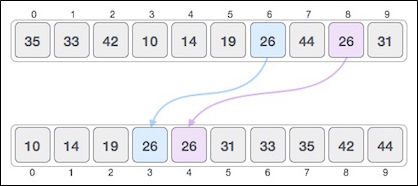
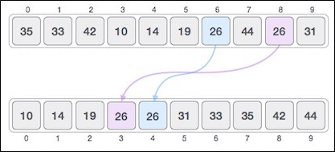

.. contents:: Table of Contents

Sorting Algorithm
======================

Sorting Algorithm
---------------------

A sorting algorithm is an algorithm that puts elements of a list in a certain order. The most-used orders are numerical order and lexicographical order. Efficient sorting is important for optimizing the use of other algorithms (such as search and merge algorithms) which require input data to be in sorted lists; it is also often useful for canonicalizing data and for producing human-readable output. More formally, the output must satisfy two conditions:

-   The output is in nondecreasing order (each element is no smaller than the previous element according to the desired total order);
-   The output is a permutation (reordering but with all of the original elements) of the input.

Examples:

-   Telephone Directory
-   Dictionary

Classification of sorting algorithms
------------------------------------

#.  Time complexity
#.  Space complexity or Memory usage
#.  Stability
#.  Internal or external sort
#.  Recursive or non-recursive
#.  Adaptive and Non-Adaptive Sorting Algorithm

1.	Time complexity
^^^^^^^^^^^^^^^^^^^^^^^

Let x be the maximum number of comparisons in a sorting algorithm. The maximum height of the decision tree would be x. A tree with maximum height x has at most 2x leaves.

n!  <= 2\ :sup:`x` \

Taking Log on both sides.

log \ :sub:`2` \ (n!)  <= x

Since log \ :sub:`2` \ (n!) = Θ(nLogn),  we can say

x = Ω(nlog\ :sub:`2` \n)

Therefore, any comparison based sorting algorithm must make at least nlog2n comparisons to sort the input array, and Heapsort and merge sort are asymptotically optimal comparison sorts.

2.	Space complexity or Memory usage
^^^^^^^^^^^^^^^^^^^^^^^^^^^^^^^^^^^^^^^^^

**In-place Sorting:** Sorting algorithms do not require any extra space and sorting is said to happen in-place, or for example, within the array itself

Example: Bubble sort

**Not-in-place Sorting:** Sorting algorithm requires space which is more than or equal to the elements being sorted

Example: Merge-sort

3.	Stability
^^^^^^^^^^^^^^^

**Stable sorting:** If a sorting algorithm, after sorting the contents, does not change the sequence of similar content in which they appear
 

Example: Bubble Sort, Insertion Sort, Merge Sort, Count Sort etc.

**Unstable sorting:** If a sorting algorithm, after sorting the contents, changes the sequence of similar content in which they appear

Example: Quick Sort, Heap Sort etc.

**Can we make any sorting algorithm stable?**

Any given sorting algo which is not stable can be modified to be stable. There can be sorting algo specific ways to make it stable, but in general, any comparison based sorting algorithm which is not stable by nature can be modified to be stable by changing the key comparison operation so that the comparison of two keys considers position as a factor for objects with equal keys.

**Can we make any sorting algorithm stable?**

Any given sorting algorithm which is not stable can be modified to be stable. There can be sorting algorithm specific ways to make it stable, but in general, any comparison based sorting algorithm which is not stable by nature can be modified to be stable by changing the key comparison operation so that the comparison of two keys considers position as a factor for objects with equal keys.

4.	Internal or external sort
^^^^^^^^^^^^^^^^^^^^^^^^^^^^^^^^^

**Internal Sort:** All records in main memory or RAM

**External Sort:** Records are on disk/tapes

5.	Recursive or non-recursive
^^^^^^^^^^^^^^^^^^^^^^^^^^^^^^^^^^^^^

**Recursive:** Implemented using recursive function

Example: Quick sort, Merge sort

**Non-recursive:** Implemented using non-recursive function

Example: Insertion sort, Selection sort

6.	Adaptive and Non-Adaptive Sorting Algorithm
^^^^^^^^^^^^^^^^^^^^^^^^^^^^^^^^^^^^^^^^^^^^^^^^^^^

**Adaptive:** A sorting algorithm is said to be adaptive, if it takes advantage of already 'sorted' elements in the list that is to be sorted. That is, while sorting if the source list has some element already sorted, adaptive algorithms will take this into account and will try not to re-order them.

**Non-Adaptive:** A non-adaptive algorithm is one which does not take into account the elements which are already sorted. They try to force every single element to be re-ordered to confirm their sortedness.

Important Terms
------------------

1.	Increasing Order
^^^^^^^^^^^^^^^^^^^^^^^^^^^^

A sequence of values is said to be in increasing order, if the successive element is greater than the previous one. 

Example: 1, 3, 4, 6, 8, 9

2.	Decreasing Order
^^^^^^^^^^^^^^^^^^^^^^^^^^^^

A sequence of values is said to be in decreasing order, if the successive element is less than the current one. 

Example: 9, 8, 6, 4, 3, 1

3.	Non-Increasing Order
^^^^^^^^^^^^^^^^^^^^^^^^^^^^

A sequence of values is said to be in non-increasing order, if the successive element is less than or equal to its previous element in the sequence. This order occurs when the sequence contains duplicate values. 

Example: 9, 8, 6, 3, 3, 1

4.	Non-Decreasing Order
^^^^^^^^^^^^^^^^^^^^^^^^^^^^

A sequence of values is said to be in non-decreasing order, if the successive element is greater than or equal to its previous element in the sequence. This order occurs when the sequence contains duplicate values. 

Example: 1, 3, 3, 6, 8, 9

Comparison of algorithms
--------------------------

https://en.wikipedia.org/wiki/Sorting_algorithm#Comparison_of_algorithms

.. list-table::
    :header-rows: 2
	
	*	-   Algorithm
        -   Time Complexity
        -
        -

    *   -   Name
        -   Best
        -   Average
        -   Worst

    *   -   Selection Sort
        -   Ω(\ :sup:`2` \)
        -   θ(\ :sup:`2` \)
        -   O(\ :sup:`2` \)

    *   -   Bubble Sort
        -   Ω(n)
        -   θ(n\ :sup:`2` \)
        -   O(n\ :sup:`2` \)

    *   -   Insertion Sort
        -   Ω(n)
        -   θ(n\ :sup:`2` \)
        -   O(n\ :sup:`2` \)

    *   -   Heap Sort
        -   Ω(n log(n))
        -   θ(n log(n))
        -   O(n log(n))

    *   -   Quick Sort
        -   Ω(n log(n))
        -   θ(n log(n))
        -   O(\ :sup:`2` \)

    *   -   Merge Sort
        -   Ω(n log(n))
        -   θ(n log(n))
        -   O(n log(n))

    *   -   Bucket Sort
        -   Ω(n+k)
        -   θ(n+k)
        -   O(\ :sup:`2` \)

    *   -   Radix Sort
        -   Ω(nk)
        -   θ(nk)
        -   O(nk)

.. list-table::
    :header-rows: 1

    *   -   Name
        -   Memory
        -   Stable
        -   Method
        -   Other notes

    *   -   Selection Sort
        -   1
        -   No
        -   Selection
        -   Stable with O(n) extra space, for example using lists

    *   -   Bubble Sort
        -   1
        -   Yes
        -   Exchanging
        -   Tiny code size

    *   -   Insertion Sort
        -   1
        -   Yes
        -   Insertion
        -   O(n + d), in the worst case over sequences that have d inversions.
    
    *   -   Heap Sort
        -   1
        -   No
        -   Selection
        -   

    *   -   Quick Sort
        -   log n on average worst case space complexity n Sedgewick variation is log n worst case
        -   Typical in-place sort is not stable; stable versions exist
        -   Partitioning
        -   Quicksort is usually done in-place with O(log n) stack space

    *   -   Merge Sort
        -   A hybrid block merge sort is O(1) mem
        -   Yes
        -   Merging
        -   Highly parallelizable (up to O(log n) using the Three Hungarians' Algorithm or, more practically, Cole's parallel merge sort) for processing large amounts of data.

    *   -   Bucket Sort
        -   
        -   
        -   
        -   
			
    *   -   Radix Sort
        -   
        -   
        -   
        - 

Popular sorting algorithms
-----------------------------

1.	Simple sorts
^^^^^^^^^^^^^^^^^^^^

I.  Insertion sort
II. Selection sort

2.	Efficient sorts
^^^^^^^^^^^^^^^^^^^^

I.  Merge sort
II. Heapsort
III.    Quicksort

3.	Bubble sort and variants
^^^^^^^^^^^^^^^^^^^^^^^^^^^^^^^

I.  Bubble sort
II. Shellsort
III.    Comb sort

4.	Distribution sort
^^^^^^^^^^^^^^^^^^^^^^^

I.  Counting sort
II. Bucket sort
III.    Radix sort

References
------------

https://www.geeksforgeeks.org/sorting-algorithms/

https://en.wikipedia.org/wiki/Sorting_algorithm#Comparison_of_algorithms

