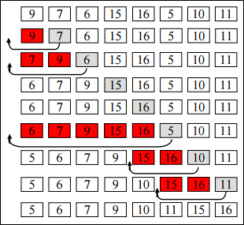

.. contents:: Table of Contents

Insertion Sort
=================

Insertion Sort
-----------------

This is an in-place comparison-based sorting algorithm. Here, a sub-list is maintained which is always sorted. For example, the lower part of an array is maintained to be sorted. An element which is to be 'insert'ed in this sorted sub-list, has to find its appropriate place and then it has to be inserted there. Hence the name, insertion sort.

The array is searched sequentially and unsorted items are moved and inserted into the sorted sub-list (in the same array). This algorithm is not suitable for large data sets as its average and worst case complexity are of Ο(n2), where n is the number of items.

Note::

#.  Insertion sort is generally faster than selection sort in practice, due to fewer comparisons and good performance on almost-sorted data, and thus is preferred in practice, but selection sort uses fewer writes, and thus is used when write performance is a limiting factor.
#.  Shellsort is a variant of insertion sort that is more efficient for larger lists.

Advantages
-----------

-   **Simple implementation:** Jon Bentley shows a three-line C version, and a five-line optimized version[2]
-   **Efficient** for (quite) small data sets, much like other quadratic sorting algorithms
-   More efficient in practice than most other simple quadratic (i.e., O(n2)) algorithms such as selection sort or bubble sort
-   **Adaptive**, i.e., efficient for data sets that are already substantially sorted: the time complexity is O(nk) when each element in the input is no more than k places away from its sorted position
-   **Stable**; i.e., does not change the relative order of elements with equal keys
-   **In-place**; i.e., only requires a constant amount O(1) of additional memory space
-   **Online**; i.e., can sort a list as it receives it

Algorithm
----------

**Step 1 −** If it is the first element, it is already sorted. return 1

**Step 2 −** Pick next element

**Step 3 −** Compare with all elements in the sorted sub-list

**Step 4 −** Shift all the elements in the sorted sub-list that is greater than the value to be sorted

**Step 5 −** Insert the value

**Step 6 −** Repeat until list is sorted

Example: 

Pseudocode
-------------

1.	For zero based arrays
^^^^^^^^^^^^^^^^^^^^^^^^^^^^

.. code:: cpp

    i ← 1
    while i < length(A)
        j ← i
        while j > 0 and A[j-1] > A[j]
            swap A[j] and A[j-1]
            j ← j - 1
        end while
        
        i ← i + 1
    end while

2.	Faster Algorithm
^^^^^^^^^^^^^^^^^^^^^^^^^^^^

After expanding the swap operation in-place as x ← A[j]; A[j] ← A[j-1]; A[j-1] ← x (where x is a temporary variable), a slightly faster version can be produced that moves A[i] to its position in one go and only performs one assignment in the inner loop body:

.. code:: cpp

    i ← 1
    while i < length(A)
        x ← A[i]
        j ← i - 1

        while j >= 0 and A[j] > x
            A[j+1] ← A[j]
            j ← j - 1
        end while
        
        A[j+1] ← x[4]
        i ← i + 1
    end while

3.	Recursive way
^^^^^^^^^^^^^^^^^^^^^^^^^^^^

The recursion just replaces the outer loop, calling itself and storing successively smaller values of n on the stack until n equals 0, where the function then returns back up the call chain to execute the code after each recursive call starting with n equal to 1, with n increasing by 1 as each instance of the function returns to the prior instance. The initial call would be insertionSortR(A, length(A)-1) .

.. code:: cpp

    function insertionSortR(array A, int n)

        if n>0
            insertionSortR(A,n-1)
            x ← A[n]
            j ← n-1
            while j >= 0 and A[j] > x
                A[j+1] ← A[j]
                j ← j-1
            end while
            
            A[j+1] ← x
        end if

    end function

4.	For zero based arrays
^^^^^^^^^^^^^^^^^^^^^^^^^^^^

.. code:: cpp

    procedure insertionSort( A : array of items )
        int holePosition
        int valueToInsert
        
        for i = 1 to length(A) inclusive do:
        
            /* select value to be inserted */
            valueToInsert = A[i]
            holePosition = i
            
            /*locate hole position for the element to be inserted */
            while holePosition > 0 and A[holePosition-1] > valueToInsert 
            do:
            A[holePosition] = A[holePosition-1]
            holePosition = holePosition -1
            end while
            
            /* insert the number at hole position */
            A[holePosition] = valueToInsert
            
        end for

    end procedure

**What is Binary Insertion Sort?**

We can use binary search to reduce the number of comparisons in normal insertion sort. Binary Insertion Sort find use binary search to find the proper location to insert the selected item at each iteration. In normal insertion, sort it takes O(i) (at ith iteration) in worst case. we can reduce it to O(logi) by using binary search. The algorithm as a whole still has a running worst case running time of O(n2) because of the series of swaps required for each insertion. Refer this for implementation.

Complexity
-------------

**Time Complexity:** O(n\ :sup:`2` \)

**Auxiliary Space:** O(1)

**Boundary Cases:** Insertion sort takes maximum time to sort if elements are sorted in reverse order. And it takes minimum time (Order of n) when elements are already sorted.

**Algorithmic Paradigm:** Incremental Approach

**Sorting In Place:** Yes

**Stable:** Yes

**Online:** Yes

**Uses:** Insertion sort is used when number of elements is small. It can also be useful when input array is almost sorted, only few elements are misplaced in complete big array.

.. list-table::
    :header-rows: 2
	
	*	-   Algorithm
        -   Time Complexity
        -
        -

    *   -   Name
        -   Best
        -   Average
        -   Worst

    *   -   Selection Sort
        -   Ω(\ :sup:`2` \)
        -   θ(\ :sup:`2` \)
        -   O(\ :sup:`2` \)

    *   -   Bubble Sort
        -   Ω(n)
        -   θ(n\ :sup:`2` \)
        -   O(n\ :sup:`2` \)

    *   -   Insertion Sort
        -   Ω(n)
        -   θ(n\ :sup:`2` \)
        -   O(n\ :sup:`2` \)

    *   -   Heap Sort
        -   Ω(n log(n))
        -   θ(n log(n))
        -   O(n log(n))

    *   -   Quick Sort
        -   Ω(n log(n))
        -   θ(n log(n))
        -   O(\ :sup:`2` \)

    *   -   Merge Sort
        -   Ω(n log(n))
        -   θ(n log(n))
        -   O(n log(n))

    *   -   Bucket Sort
        -   Ω(n+k)
        -   θ(n+k)
        -   O(\ :sup:`2` \)

    *   -   Radix Sort
        -   Ω(nk)
        -   θ(nk)
        -   O(nk)

.. list-table::
    :header-rows: 1

    *   -   Name
        -   Memory
        -   Stable
        -   Method
        -   Other notes

    *   -   Selection Sort
        -   1
        -   No
        -   Selection
        -   Stable with O(n) extra space, for example using lists

    *   -   Bubble Sort
        -   1
        -   Yes
        -   Exchanging
        -   Tiny code size

    *   -   Insertion Sort
        -   1
        -   Yes
        -   Insertion
        -   O(n + d), in the worst case over sequences that have d inversions.
    
    *   -   Heap Sort
        -   1
        -   No
        -   Selection
        -   

    *   -   Quick Sort
        -   log n on average worst case space complexity n Sedgewick variation is log n worst case
        -   Typical in-place sort is not stable; stable versions exist
        -   Partitioning
        -   Quicksort is usually done in-place with O(log n) stack space

    *   -   Merge Sort
        -   A hybrid block merge sort is O(1) mem
        -   Yes
        -   Merging
        -   Highly parallelizable (up to O(log n) using the Three Hungarians' Algorithm or, more practically, Cole's parallel merge sort) for processing large amounts of data.

    *   -   Bucket Sort
        -   
        -   
        -   
        -   
			
    *   -   Radix Sort
        -   
        -   
        -   
        - 

Example
---------

.. code:: cpp

    // C program for insertion sort
    #include <stdio.h>
    #include <math.h>
    
    /* Function to sort an array using insertion sort*/
    void insertionSort(int arr[], int n)
    {
        int i, key, j;
        for (i = 1; i < n; i++)
        {
            key = arr[i];
            j = i-1;
            
            /* Move elements of arr[0..i-1], that are greater than key, to one position ahead of their current position */
            while (j >= 0 && arr[j] > key)
            {
                arr[j+1] = arr[j];
                j = j-1;
            }
            arr[j+1] = key;
        }
    }
    
    // A utility function to print an array of size n
    void printArray(int arr[], int n)
    {
        int i;
        for (i=0; i < n; i++)
            printf("%d ", arr[i]);
        printf("\n");
    }
    

    
    /* Driver program to test insertion sort */
    int main()
    {
        int arr[] = {12, 11, 13, 5, 6};
        int n = sizeof(arr)/sizeof(arr[0]);
        
        insertionSort(arr, n);
        printArray(arr, n);
        
        return 0;
    }

Output::

    5 6 11 12 13

Variants
-----------

Shell sort
^^^^^^^^^^^^^^

The sorting algorithm compares elements separated by a distance that decreases on each pass. Shell sort has distinctly improved running times in practical work, with two simple variants requiring O(n3/2) and O(n4/3) running time.

Binary insertion sort
^^^^^^^^^^^^^^^^^^^^^^^^^

Binary insertion sort employs a binary search to determine the correct location to insert new elements, and therefore performs ⌈log2(n)⌉ comparisons in the worst case, which is O(n log n). The algorithm as a whole still has a running time of O(n2) on average because of the series of swaps required for each insertion.

Quiz
-------

Which sorting algorithm will take least time when all elements of input array are identical? Consider typical implementations of sorting algorithms.

A.  **Insertion Sort**
B.  Heap Sort
C.  Merge Sort
D.  Selection Sort

The insertion sort will take \theta(n) time when input array is already sorted.

References
---------------

https://www.geeksforgeeks.org/sorting-algorithms/

https://www.geeksforgeeks.org/insertion-sort-algorithm/

