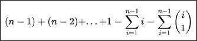
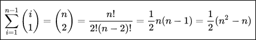

.. contents:: Table of Contents

Selection Sort
===============

Selection Sort
-----------------

Selection sort is a simple sorting algorithm. This sorting algorithm is an in-place comparison-based algorithm, in which the list is divided into two parts,

-   the sorted part at the left end
-   the unsorted part at the right end

Initially, the sorted part is empty and the unsorted part is the entire list.

The smallest element is selected from the unsorted array and swapped with the leftmost element, and that element becomes a part of the sorted array. This process continues moving unsorted array boundary by one element to the right.

Advantages
-------------

#.  Selection sort is noted for its simplicity 
#.  It has performance advantages over more complicated algorithms in certain situations, particularly where auxiliary memory is limited.

Algorithm
-------------

**Step 1 −** Set MIN to location 0

**Step 2 −** Search the minimum element in the list

**Step 3 −** Swap with value at location MIN

**Step 4 −** Increment MIN to point to next element

**Step 5 −** Repeat until list is sorted

Note::

Selection sort can be implemented as a stable sort. If, rather than swapping in step 2, the minimum value is inserted into the first position (that is, all intervening items moved down), the algorithm is stable. However, this modification either requires a data structure that supports efficient insertions or deletions, such as a linked list, or it leads to performing Θ(n2) writes.

Example:

arr[] = 64 25 12 22 11

// Find the minimum element in arr[0...4] and place it at beginning

**11** 25 12 22 64

// Find the minimum element in arr[1...4] and place it at beginning of arr[1...4]

11 **12** 25 22 64

// Find the minimum element in arr[2...4] and place it at beginning of arr[2...4]

11 12 **22** 25 64

// Find the minimum element in arr[3...4] and place it at beginning of arr[3...4]

11 12 22 **25** 64 

Pseudocode
-----------

.. code:: cpp

    procedure selection sort
        list: array of items
        n: size of list
        
        for i = 1 to n - 1
            /* set current element as minimum*/
            min = i
        
            /* check the element to be minimum */
            for j = i+1 to n
                if list[j] < list[min] then
                    min = j;
                end if
            end for
            
            /* swap the minimum element with the current element*/
            if indexMin != i  then
                swap list[min] and list[i]
            end if
            
        end for
    end procedure

Complexity
----------------

Selecting the minimum requires scanning n elements (taking n-1 comparisons) and then swapping it into the first position. Finding the next lowest element requires scanning the remaining n-1 elements and so on. Therefore, the total number of comparisons is

By the hockey-stick identity,
 

which is of complexity O(n2) in terms of number of comparisons. Each of these scans requires one swap for n-1 elements (the final element is already in place).

**Time Complexity:** O(n2) as there are two nested loops.

**Auxiliary Space:** O(1)

**Selection sort makes O(n) swaps which is minimum among Selection Sort, Heap Sort, Insertion Sort and Merge Sort.**

The good thing about selection sort is it never makes more than O(n) swaps and can be useful when memory write is a costly operation.

This algorithm is not suitable for large data sets as its average and worst case complexities are of Ο(n2), where n is the number of items.

.. list-table::
    :header-rows: 2
	
	*	-   Algorithm
        -   Time Complexity
        -
        -

    *   -   Name
        -   Best
        -   Average
        -   Worst

    *   -   Selection Sort
        -   Ω(\ :sup:`2` \)
        -   θ(\ :sup:`2` \)
        -   O(\ :sup:`2` \)

    *   -   Bubble Sort
        -   Ω(n)
        -   θ(n\ :sup:`2` \)
        -   O(n\ :sup:`2` \)

    *   -   Insertion Sort
        -   Ω(n)
        -   θ(n\ :sup:`2` \)
        -   O(n\ :sup:`2` \)

    *   -   Heap Sort
        -   Ω(n log(n))
        -   θ(n log(n))
        -   O(n log(n))

    *   -   Quick Sort
        -   Ω(n log(n))
        -   θ(n log(n))
        -   O(\ :sup:`2` \)

    *   -   Merge Sort
        -   Ω(n log(n))
        -   θ(n log(n))
        -   O(n log(n))

    *   -   Bucket Sort
        -   Ω(n+k)
        -   θ(n+k)
        -   O(\ :sup:`2` \)

    *   -   Radix Sort
        -   Ω(nk)
        -   θ(nk)
        -   O(nk)

.. list-table::
    :header-rows: 1

    *   -   Name
        -   Memory
        -   Stable
        -   Method
        -   Other notes

    *   -   Selection Sort
        -   1
        -   No
        -   Selection
        -   Stable with O(n) extra space, for example using lists

    *   -   Bubble Sort
        -   1
        -   Yes
        -   Exchanging
        -   Tiny code size

    *   -   Insertion Sort
        -   1
        -   Yes
        -   Insertion
        -   O(n + d), in the worst case over sequences that have d inversions.
    
    *   -   Heap Sort
        -   1
        -   No
        -   Selection
        -   

    *   -   Quick Sort
        -   log n on average worst case space complexity n Sedgewick variation is log n worst case
        -   Typical in-place sort is not stable; stable versions exist
        -   Partitioning
        -   Quicksort is usually done in-place with O(log n) stack space

    *   -   Merge Sort
        -   A hybrid block merge sort is O(1) mem
        -   Yes
        -   Merging
        -   Highly parallelizable (up to O(log n) using the Three Hungarians' Algorithm or, more practically, Cole's parallel merge sort) for processing large amounts of data.

    *   -   Bucket Sort
        -   
        -   
        -   
        -   
			
    *   -   Radix Sort
        -   
        -   
        -   
        - 

		

Example
---------

.. code:: cpp

    // C program for implementation of selection sort
    #include <stdio.h>
    
    void swap(int *xp, int *yp)
    {
        int temp = *xp;
        *xp = *yp;
        *yp = temp;
    }
    
    void selectionSort(int arr[], int n) {
        int i, j, min_idx;
        
        // One by one move boundary of unsorted subarray
        for (i = 0; i < n-1; i++) {
            
            // Find the minimum element in unsorted array
            min_idx = i;
            for (j = i+1; j < n; j++)
                if (arr[j] < arr[min_idx])
                    min_idx = j;
                    
            // Swap the found minimum element with the first element
            swap(&arr[min_idx], &arr[i]);
        }
    }
    
    /* Function to print an array */
    void printArray(int arr[], int size)
    {
        int i;
        for (i=0; i < size; i++)
            printf("%d ", arr[i]);
        printf("\n");
    }
    
    // Driver program to test above functions
    int main()
    {
        int arr[] = {64, 25, 12, 22, 11};
        int n = sizeof(arr)/sizeof(arr[0]);
        selectionSort(arr, n);
        printf("Sorted array: \n");
        printArray(arr, n);
        
        return 0;
    }

Output::

    Sorted array:
    11 12 22 25 64

Variants
----------

Cocktail sort or Double selection sort
^^^^^^^^^^^^^^^^^^^^^^^^^^^^^^^^^^^^^^^^^^^^

A bidirectional variant of selection sort, called cocktail sort, is an algorithm which **finds both the minimum and maximum values in the list in every pass.** This **reduces the number of scans of the list by a factor of 2,** eliminating some loop overhead **but not actually decreasing the number of comparisons or swaps.** Note, however, that cocktail sort more often refers to a bidirectional variant of bubble sort. Sometimes this is double selection sort.

Heapsort
^^^^^^^^^^^

Heapsort greatly improves the basic algorithm by using an implicit heap data structure to speed up finding and removing the lowest datum. If implemented correctly, the heap will allow finding the next lowest element in Θ(log n) time instead of Θ(n) for the inner loop in normal selection sort, reducing the total running time to Θ(n log n).

Bingo sort
^^^^^^^^^^^^^

In the bingo sort variant, items are ordered by repeatedly looking through the remaining items to find the greatest value and moving all items with that value to their final location.[1] Like counting sort, this is an efficient variant if there are many duplicate values. Indeed, selection sort does one pass through the remaining items for each item moved. Bingo sort does one pass for each value (not item): after an initial pass to find the biggest value, the next passes can move every item with that value to its final location while finding the next value.

References
-------------

https://www.geeksforgeeks.org/sorting-algorithms/

https://www.geeksforgeeks.org/selection-sort-algorithm-2/

