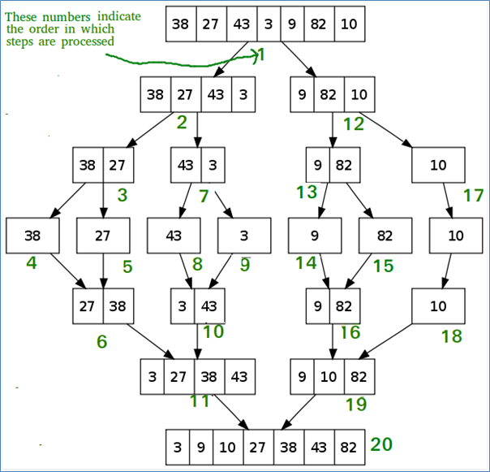

.. contents:: Table of Contents

Merge Sort
============

Merge Sort
-------------

Merge sort is an efficient, general-purpose, comparison-based sorting algorithm. Most implementations produce a stable sort, which means that the implementation preserves the input order of equal elements in the sorted output. Merge sort is a divide and conquer algorithm.

**Invented by John von Neumann in 1945**

-   divide and conquer algorithm
-   stable sort

Advantage and Application
--------------------------

#.  Merge Sort is useful for sorting linked lists in O(nLogn) time
#.  Inversion Count Problem
#.  Used in External Sorting

Disadvantages
-----------------

Algorithm
-----------

Conceptually, a merge sort works as follows:

#.  Divide the unsorted list into n sublists, each containing 1 element (a list of 1 element is considered sorted).
#.  Repeatedly merge sublists to produce new sorted sublists until there is only 1 sublist remaining. This will be the sorted list.

    MergeSort(arr[], l,  r)

    If r > l

        1.	Find the middle point to divide the array into two halves:

            **middle m = (l+r)/2**
        2.	Call mergeSort for first half:

            **Call mergeSort(arr, l, m)**
        3.	Call mergeSort for second half:

            **Call mergeSort(arr, m+1, r)**
        4.	Merge the two halves sorted in step 2 and 3:

            **Call merge(arr, l, m, r)**

Pseudocode
----------------

1.	Top-down implementation
^^^^^^^^^^^^^^^^^^^^^^^^^^^^^^^^

top down merge sort algorithm that recursively splits the list (called runs in this example) into sublists until sublist size is 1, then merges those sublists to produce a sorted list. The copy back step is avoided with alternating the direction of the merge with each level of recursion.

.. code:: cpp

    // Array A[] has the items to sort; array B[] is a work array.
    TopDownMergeSort(A[], B[], n) {
        CopyArray(A, 0, n, B);           // duplicate array A[] into B[]
        TopDownSplitMerge(B, 0, n, A);   // sort data from B[] into A[]
    }

    // Sort the given run of array A[] using array B[] as a source.
    // iBegin is inclusive; iEnd is exclusive (A[iEnd] is not in the set).
    TopDownSplitMerge(B[], iBegin, iEnd, A[]) {
        if(iEnd - iBegin < 2)                       // if run size == 1
            return;                                 //   consider it sorted
            
        // split the run longer than 1 item into halves
        iMiddle = (iEnd + iBegin) / 2;              // iMiddle = mid point
        
        // recursively sort both runs from array A[] into B[]
        TopDownSplitMerge(A, iBegin,  iMiddle, B);  // sort the left  run
        TopDownSplitMerge(A, iMiddle,    iEnd, B);  // sort the right run
        
        // merge the resulting runs from array B[] into A[]
        TopDownMerge(B, iBegin, iMiddle, iEnd, A);
    }

    // Left source half is A[ iBegin:iMiddle-1].
    // Right source half is A[iMiddle:iEnd-1   ].
    // Result is            B[ iBegin:iEnd-1   ].
    TopDownMerge(A[], iBegin, iMiddle, iEnd, B[]) {
        i = iBegin, j = iMiddle;
        
        // While there are elements in the left or right runs...
        for (k = iBegin; k < iEnd; k++) {
            
            // If left run head exists and is <= existing right run head.
            if (i < iMiddle && (j >= iEnd || A[i] <= A[j])) {
                B[k] = A[i];
                i = i + 1;
            }
            else {
                B[k] = A[j];
                j = j + 1;
            }
        }
    }

    CopyArray(A[], iBegin, iEnd, B[]) {
        for(k = iBegin; k < iEnd; k++)
            B[k] = A[k];
    }

2.	Bottom-up implementation
^^^^^^^^^^^^^^^^^^^^^^^^^^^^^^^^

3.	Top-down implementation using lists
^^^^^^^^^^^^^^^^^^^^^^^^^^^^^^^^^^^^^^^^^^

4.	Bottom-up implementation using lists
^^^^^^^^^^^^^^^^^^^^^^^^^^^^^^^^^^^^^^^^^^

Implementation
-------------------

.. code:: cpp

    /* C program for Merge Sort */
    #include <stdlib.h>
    #include <stdio.h>
    
    // Merges two subarrays of arr[].
    // First subarray is arr[l..m]
    // Second subarray is arr[m+1..r]
    void merge(int arr[], int l, int m, int r) {
        int i, j, k;
        int n1 = m - l + 1;
        int n2 =  r - m;
        
        /* create temp arrays */
        int L[n1], R[n2];
        
        /* Copy data to temp arrays L[] and R[] */
        for (i = 0; i < n1; i++)
            L[i] = arr[l + i];
        for (j = 0; j < n2; j++)
            R[j] = arr[m + 1+ j];
        
        /* Merge the temp arrays back into arr[l..r]*/
        i = 0; // Initial index of first subarray
        j = 0; // Initial index of second subarray
        k = l; // Initial index of merged subarray
        while (i < n1 && j < n2) {
            if (L[i] <= R[j]) {
                arr[k] = L[i];
                i++;
            }
            else {
                arr[k] = R[j];
                j++;
            }
            k++;
        }
        
        /* Copy the remaining elements of L[], if there are any */
        while (i < n1) {
            arr[k] = L[i];
            i++;
            k++;
        }
        
        /* Copy the remaining elements of R[], if there are any */
        while (j < n2) {
            arr[k] = R[j];
            j++;
            k++;
        }
    }
    
    /* l is for left index and r is right index of the sub-array of arr to be sorted */
    void mergeSort(int arr[], int l, int r) {
        if (l < r) {
            // same as (l+r)/2, but avoids overflow for large l and h
            int m = l+(r-l)/2;
            
            // Sort first and second halves
            mergeSort(arr, l, m);
            mergeSort(arr, m+1, r);
            
            merge(arr, l, m, r);
        }
    }
    
    /* UTILITY FUNCTIONS */
    /* Function to print an array */
    void printArray(int A[], int size) {
        int i;
        for (i=0; i < size; i++)
            printf("%d ", A[i]);
        
        printf("\n");
    }
    
    /* Driver program to test above functions */
    int main() {
        int arr[] = {12, 11, 13, 5, 6, 7};
        int arr_size = sizeof(arr)/sizeof(arr[0]);
        
        printf("Given array is \n");
        printArray(arr, arr_size);
        
        mergeSort(arr, 0, arr_size - 1);
        
        printf("\nSorted array is \n");
        printArray(arr, arr_size);
        
        return 0;
    }

Output::

    Given array is
    12 11 13 5 6 7

    Sorted array is
    5 6 7 11 12 13

Complexity
---------------

.. list-table::
    :header-rows: 1

    *   -   Class
        -   Sorting algorithm

    *   -   Data structure
        -   Array

    *   -   Worst-case performance
        -   O(n log n)

    *   -   Best-case performance
        -   O(n log n) typical,
            O(n) natural variant

    *   -   Average performance
        -   O(n log n)

    *   -   Worst-case space complexity
        -   О(n) total with O(n) auxiliary, O(1) auxiliary with linked lists

**Number of comparisons** (n [lg n] - 2^[lg n] + 1) which is between (n lg n - n + 1) and (n lg n + n + O(lg n))

**Stable:** Yes

**In place:** No

**Algorithmic Paradigm:** Divide and Conquer

In the worst case, merge sort does about 39% fewer comparisons than quicksort does in the average case. In terms of moves, merge sort's worst case complexity is O(n log n)—the same complexity as quicksort's best case, and merge sort's best case takes about half as many iterations as the worst case.

Merge sort is more efficient than quicksort for some types of lists if the data to be sorted can only be efficiently accessed sequentially.

.. list-table::
    :header-rows: 2
	
	*	-   Algorithm
        -   Time Complexity
        -
        -

    *   -   Name
        -   Best
        -   Average
        -   Worst

    *   -   Selection Sort
        -   Ω(\ :sup:`2` \)
        -   θ(\ :sup:`2` \)
        -   O(\ :sup:`2` \)

    *   -   Bubble Sort
        -   Ω(n)
        -   θ(n\ :sup:`2` \)
        -   O(n\ :sup:`2` \)

    *   -   Insertion Sort
        -   Ω(n)
        -   θ(n\ :sup:`2` \)
        -   O(n\ :sup:`2` \)

    *   -   Heap Sort
        -   Ω(n log(n))
        -   θ(n log(n))
        -   O(n log(n))

    *   -   Quick Sort
        -   Ω(n log(n))
        -   θ(n log(n))
        -   O(\ :sup:`2` \)

    *   -   Merge Sort
        -   Ω(n log(n))
        -   θ(n log(n))
        -   O(n log(n))

    *   -   Bucket Sort
        -   Ω(n+k)
        -   θ(n+k)
        -   O(\ :sup:`2` \)

    *   -   Radix Sort
        -   Ω(nk)
        -   θ(nk)
        -   O(nk)

.. list-table::
    :header-rows: 1

    *   -   Name
        -   Memory
        -   Stable
        -   Method
        -   Other notes

    *   -   Selection Sort
        -   1
        -   No
        -   Selection
        -   Stable with O(n) extra space, for example using lists

    *   -   Bubble Sort
        -   1
        -   Yes
        -   Exchanging
        -   Tiny code size

    *   -   Insertion Sort
        -   1
        -   Yes
        -   Insertion
        -   O(n + d), in the worst case over sequences that have d inversions.
    
    *   -   Heap Sort
        -   1
        -   No
        -   Selection
        -   

    *   -   Quick Sort
        -   log n on average worst case space complexity n Sedgewick variation is log n worst case
        -   Typical in-place sort is not stable; stable versions exist
        -   Partitioning
        -   Quicksort is usually done in-place with O(log n) stack space

    *   -   Merge Sort
        -   A hybrid block merge sort is O(1) mem
        -   Yes
        -   Merging
        -   Highly parallelizable (up to O(log n) using the Three Hungarians' Algorithm or, more practically, Cole's parallel merge sort) for processing large amounts of data.

    *   -   Bucket Sort
        -   
        -   
        -   
        -   
			
    *   -   Radix Sort
        -   
        -   
        -   
        - 

			
Examples
-----------

Variants
------------

Quiz
-------------

https://www.geeksforgeeks.org/quiz-mergesort-gq/

**Which sorting algorithm will take least time when all elements of input array are identical? Consider typical implementations of sorting algorithms.**

A.  **Insertion Sort**
B.  Heap Sort
C.  Merge Sort
D.  Selection Sort

The insertion sort will take \theta(n) time when input array is already sorted.

**Which of the following sorting algorithms has the lowest worst-case complexity?**

A.  **Merge Sort**
B.  Bubble Sort
C.  Quick Sort
D.  Selection Sort

**Worst case complexities for the above sorting algorithms are as follows:**

-   Merge Sort — nLogn 
-   Bubble Sort — n\ :sup:`2` \
-   Quick Sort — n\ :sup:`2` \
-   Selection Sort — n\ :sup:`2` \

**Which of the following is true about merge sort?**

A.  Merge Sort works better than quick sort if data is accessed from slow sequential memory.
B.  Merge Sort is stable sort by nature
C.  Merge sort outperforms heap sort in most of the practical situations.
D.  **All of the above.**

**What is the best sorting algorithm to use for the elements in array are more than 1 million in general?**

A.  Merge sort
B.  Bubble sort
C.  **Quick sort**
D.  Insertion sort

**Assume that a merge sort algorithm in the worst case takes 30 seconds for an input of size 64. Which of the following most closely approximates the maximum input size of a problem that can be solved in 6 minutes?**

A.  256
B.  **512**
C.  1024
D.  2048

Time complexity of merge sort is Θ(nLogn)

c*64Log64 is 30

c*64*6 is 30

c is 5/64

For time 6 minutes

5/64*nLogn = 6*60

nLogn = 72*64 = 512 * 9

n = 512

References
-----------

https://www.geeksforgeeks.org/sorting-algorithms/

https://www.geeksforgeeks.org/merge-sort/

https://www.geeksforgeeks.org/quiz-mergesort-gq/

