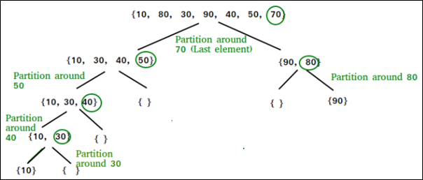
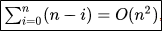

.. contents:: Table of Contents

Quick Sort
=============

Quicksort (partition-exchange sort) is an efficient sorting algorithm, serving as a systematic method for placing the elements of an array in order. 

**Developed by Tony Hoare in 1959 and published in 1961.**

When implemented well, it can be about two or three times faster than its main competitors, merge sort and heapsort.

Quicksort is a comparison sort, meaning that it can sort items of any type for which a "less-than" relation (formally, a total order) is defined. In efficient implementations it is not a stable sort, meaning that the relative order of equal sort items is not preserved. Quicksort can operate in-place on an array, requiring small additional amounts of memory to perform the sorting. It is very similar to selection sort, except that it does not always choose worst-case partition.

Mathematical analysis of quicksort shows that, on average, the algorithm takes O(nlogn) comparisons to sort n items. In the worst case, it makes O(n2) comparisons, though this behaviour is rare.

Advantage and Application
--------------------------

Disadvantages
------------------

Algorithm
-------------

Quicksort is a divide and conquer algorithm.

The steps are:

#.  Pick an element, called a pivot, from the array.
#.  **Partitioning:** reorder the array so that all elements with values less than the pivot come before the pivot, while all elements with values greater than the pivot come after it (equal values can go either way). After this partitioning, the pivot is in its final position. This is called the partition operation.
#.  Recursively apply the above steps to the sub-array of elements with smaller values and separately to the sub-array of elements with greater values.

The base case of the recursion is arrays of size zero or one, which are in order by definition, so they never need to be sorted.

The pivot selection and partitioning steps can be done in several different ways; the choice of specific implementation schemes greatly affects the algorithm's performance.

There are many different versions of quick sort that pick pivot in different ways.

#.  Always pick first element as pivot
#.  Always pick last element as pivot
#.  Pick a random element as pivot
#.  Pick median as pivot

Pseudocode
------------

.. code:: cpp

    // Pseudo Code for recursive quick sort function
    /* low  --> Starting index,  high  --> Ending index */

    quickSort(arr[], low, high) {
        if (low < high) {
            /* pi is partitioning index, arr[pi] is now at right place */
            
            pi = partition(arr, low, high);
            
            quickSort(arr, low, pi - 1);  // Before pi
            quickSort(arr, pi + 1, high); // After pi
        }
    }

    // Pseudo code for partition
    /* This function takes last element as pivot, places the pivot element at its correct position in sorted array, and places all smaller (smaller than pivot) to left of pivot and all greater elements to right of pivot */

    partition (arr[], low, high) {
        
        // pivot (Element to be placed at right position)
        pivot = arr[high];  
        
        i = (low - 1)  // Index of smaller element
        
        for (j = low; j <= high- 1; j++) {
        
            // If current element is smaller than or equal to pivot
            if (arr[j] <= pivot) {
                i++;    // increment index of smaller element
                swap arr[i] and arr[j]
            }
        }
        
        swap arr[i + 1] and arr[high])
        return (i + 1)
    }

Implementation
-------------------

1.	Recursive
^^^^^^^^^^^^^^^^^^

.. code:: cpp

    /* C implementation QuickSort */
    #include<stdio.h>
    
    // A utility function to swap two elements
    void swap(int* a, int* b) {
        int t = *a;
        *a = *b;
        *b = t;
    }
    
    /* This function takes last element as pivot, places the pivot element at its correct position in sorted array, and places all smaller (smaller than pivot) to left of pivot and all greater elements to right of pivot */

    int partition (int arr[], int low, int high) {
        int pivot = arr[high];		// pivot
        int i = (low - 1);		// Index of smaller element
        
        for (int j = low; j <= high- 1; j++) {
            // If current element is smaller than or equal to pivot
            if (arr[j] <= pivot) {
                i++;		// increment index of smaller element
                swap(&arr[i], &arr[j]);
            }
        }
        
        swap(&arr[i + 1], &arr[high]);
        return (i + 1);
    }
    
    /* The main function that implements QuickSort 
        arr[] --> Array to be sorted,
        low  --> Starting index,
        high  --> Ending index 
    */

    void quickSort(int arr[], int low, int high) {
        if (low < high) {
            /* pi is partitioning index, arr[p] is now at right place */
            int pi = partition(arr, low, high);
            
            // Separately sort elements before
            // partition and after partition
            quickSort(arr, low, pi - 1);
            quickSort(arr, pi + 1, high);
        }
    }
    
    // Driver program to test above functions
    int main() {
        int arr[] = {10, 7, 8, 9, 1, 5};
        int n = sizeof(arr)/sizeof(arr[0]);
        
        quickSort(arr, 0, n-1);
        
        printf("Sorted array: n");
        for (i=0; i < n; i++)
            printf("%d ", arr[i]);
        printf("\n");
        
        return 0;
    }

Output::

    Sorted array:
    1 5 7 8 9 10

2.	Iterative
^^^^^^^^^^^^^^^^^^^^^

.. code:: cpp

    // An iterative implementation of quick sort
    #include <stdio.h>
    
    // A utility function to swap two elements
    void swap ( int* a, int* b ) {
        int t = *a;
        *a = *b;
        *b = t;
    }
    
    /* This function is same in both iterative and recursive*/
    int partition (int arr[], int l, int h) {
        int x = arr[h];
        int i = (l - 1);
        
        for (int j = l; j <= h- 1; j++) {
            if (arr[j] <= x) {
                i++;
                swap (&arr[i], &arr[j]);
            }
        }
        swap (&arr[i + 1], &arr[h]);
        return (i + 1);
    }
    
    /* 
        A[] --> Array to be sorted,
        l  --> Starting index,
        h  --> Ending index 
    */
    void quickSortIterative (int arr[], int l, int h)
    {
        // Create an auxiliary stack
        int stack[ h - l + 1 ];
        
        // initialize top of stack
        int top = -1;
        
        // push initial values of l and h to stack
        stack[ ++top ] = l;
        stack[ ++top ] = h;
        
        // Keep popping from stack while is not empty
        while ( top >= 0 ) {
            // Pop h and l
            h = stack[ top-- ];
            l = stack[ top-- ];
            
            // Set pivot element at its correct position in sorted array
            int p = partition( arr, l, h );
            
            // If there are elements on left side of pivot, then push left side to stack
            if ( p-1 > l ) {
                stack[ ++top ] = l;
                stack[ ++top ] = p - 1;
            }
            
            // If there are elements on right side of pivot, then push right side to stack
            if ( p+1 < h ) {
                stack[ ++top ] = p + 1;
                stack[ ++top ] = h;
            }
        }
    }
    
    // Driver program to test above functions
    int main() {
        int arr[] = {4, 3, 5, 2, 1, 3, 2, 3};
        int n = sizeof( arr ) / sizeof( *arr );
        int i = 0;
        
        quickSortIterative( arr, 0, n - 1 );
        
        for ( i = 0; i < n; ++i )
            printf( "%d ", arr[i] );
        printf("\n");
        
        return 0;
    }

Output::

    1 2 2 3 3 3 4 5

Quick sort can also be applied to iterative version:

#.  Partition process is same in both recursive and iterative. The same techniques to choose optimal pivot can also be applied to iterative version.
#.  To reduce the stack size, first push the indexes of smaller half.
#.  Use insertion sort when the size reduces below a experimentally calculated threshold.

Complexity Analysis
---------------------

.. list-table::
    :header-rows: 1

    *   -   Class
        -   Sorting algorithm

    *   -   Worst-case performance
        -   O(n\ :sup:`2` \)

    *   -   Best-case performance
        -   O(n log n) (simple partition)

            or 

            O(n) (three-way partition and equal keys)

    *   -   Average performance
        -   O(n log n)

    *   -   Worst-case space complexity	
        -   O(n) auxiliary (naive) 

            O(log n) auxiliary (Sedgewick 1978)

Time taken by Quick sort in general can be written as following:

**T(n) = T(k) + T(n-k-1) + Ɵ(n)**

The first two terms are for two recursive calls; the last term is for the partition process. k is the number of elements which are smaller than pivot.

The time taken by Quick sort depends upon the input array and partition strategy.

1.	Worst Case
^^^^^^^^^^^^^^^^^^

This may occur if the pivot happens to be the smallest or largest element in the list, or in some implementations when all the elements are equal.
In this each recursive call processes a list of size one less than the previous list. Consequently, we can make n − 1 nested calls before we reach a list of size 1. This means that the call tree is a linear chain of n − 1 nested calls. The ith call does O(n − i) work to do the partition, and

Also
T(n) = T(0) + T(n-1) + Ɵ(n),	which is equivalent to

T(n) = T(n-1) + Ɵ(n)

	= Ɵ(n\ :sup:`2` \)

2.	Best Case
^^^^^^^^^^^^^^^^^^

Best case occurs when the partition process always picks the middle element as pivot. Following is recurrence for best case.

T(n) = 2T(n/2) + (n)

	 = Ɵ(n log n)

3.	Average Case
^^^^^^^^^^^^^^^^^^

To do average case analysis, we need to consider all possible permutation of array and calculate time taken by every permutation which doesn’t look easy.

O(n log n)

Although the worst case time complexity of Quick sort is O(n2) which is more than many other sorting algorithms like Merge Sort and Heap Sort, Quick sort is faster in practice, because its inner loop can be efficiently implemented on most architectures.

Quick sort can be implemented in different ways by changing the choice of pivot, so that the worst case rarely occurs for a given type of data. However, merge sort is generally considered better when data is huge and stored in external storage.

Space Complexity
^^^^^^^^^^^^^^^^^^

The space used by quicksort depends on the version used.

The in-place version of quicksort has a space complexity of O(log n), even in the worst case, when it is carefully implemented using the following strategies:

-   In-place partitioning is used. This unstable partition requires O(1) space.
-   After partitioning, the partition with the fewest elements is (recursively) sorted first, requiring at most O(log n) space.

Why Quick Sort is preferred over merge sort for sorting Arrays?
----------------------------------------------------------------------

Quick Sort in its general form is an in-place sort (i.e. it doesn’t require any extra storage) whereas merge sort requires O(n) extra storage.

Comparing average complexity, we find that both type of sorts has O(n log n) average complexity but the constants differ. For arrays, merge sort loses due to the use of extra O(n) storage space.

Most practical implementations of Quick Sort use randomized version, and randomized Quick Sort works well in practice.

Quick Sort is also a cache friendly sorting algorithm as it has good locality of reference when used for arrays.

Quick Sort is also tail recursive, therefore tail call optimizations is done.

Why Merge sort is preferred over Quick sort for Linked Lists?
----------------------------------------------------------------

Unlike arrays, linked list nodes may not be adjacent in memory. 

Unlike array, in linked list, we can insert items in the middle in O(1) extra space and O(1) time. 

Therefore, merge operation of merge sort can be implemented without extra space for linked lists.

In arrays, we can do random access as elements are continuous in memory. Unlike arrays, we cannot do random access in linked list.

Quick Sort requires a lot of this kind of access. In linked list to access i’th index, we have to travel each and every node from the head to i’th node as we don’t have continuous block of memory.

Therefore, the overhead increases for quick sort. Merge sort accesses data sequentially and the need of random access is low.

Examples
---------

Variants
----------

References
--------------

https://www.geeksforgeeks.org/sorting-algorithms/

https://www.geeksforgeeks.org/quick-sort-algorithm/

