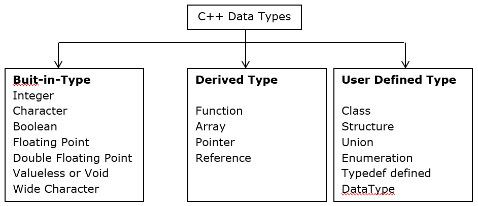
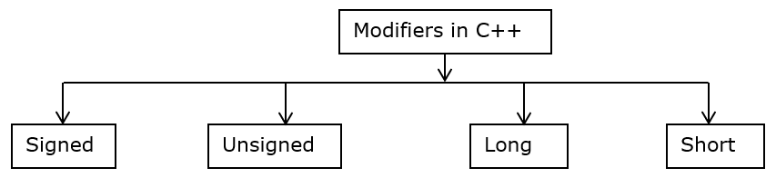
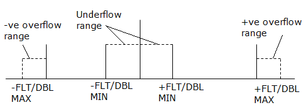

.. contents:: Table of Contents

Data Types
==========

Data Type
---------

A data type is a classification that specifies which type of value a variable has and what type of mathematical, relational or logical operations can be applied to it without causing an error.

The data type defines which operations can safely be performed to create, transform and use the variable in another computation. When a program language requires a variable to only be used in ways that respect its data types, the language is said to be strongly typed.

Data Type Modifiers
-------------------

As the name implies, data type modifiers are used with the built-in data types to modify the length of data that a particular data type can hold.

Points about data-types and modifiers in C/C++
----------------------------------------------

#. If no data type is given to a variable, the compiler automatically converts it to int data type.

.. code:: cpp

        signed a;
 
#. Signed is the default modifier for char and int data types.
#. We **can’t use any modifiers in float data type.** If programmer tries to use it, the compiler automatically gives compile time error.

.. code:: cpp

    signed float a; 
    short float b; 
    [Compilation Error] Both 'signed' and 'float' in declaration specifiers
    [Compilation Error] Both 'short' and 'float' in declaration specifiers

#. **Only long modifier is allowed in double data types.** We can’t use any other specifier with double data type. If we try any other specifier, compiler will give compile time error.

.. code:: cpp

    long double a;
    short double a; 
    signed double b;
    [Compilation Error] Both 'short' and 'double' in declaration specifiers
    [Compilation Error] Both 'signed' and 'double' in declaration specifiers

Data Type Ranges and their macros in C++
----------------------------------------

Visit

| https://en.cppreference.com/w/cpp/language/types
| https://en.cppreference.com/w/cpp/types/climits

.. note::

        - Data type and pointer size are compiler dependent
        - void is not a valid type for declaring variables void * is though

size_t Data Type
----------------

It’s a type which is used to represent the size of objects in bytes and is therefore used as the return type by the sizeof operator. 

It is guaranteed to be big enough to contain the size of the biggest object the host system can handle. Basically the maximum permissible size is dependent on the compiler; if the compiler is 32 bit then it is simply a typedef(i.e., alias) for unsigned int but if the compiler is 64 bit then it would be a typedef for unsigned long long. 

**The size_t data type is never negative.**

What happen when we exceed valid range of built-in data types in C++?
--------------------------------------------------------------------

#. Program to show what happens when we cross range of ‘char’
   
   .. code:: cpp

        #include <iostream>
        using namespace std;
        int main()  {
                for (char a = 0; a <= 225; a++)
                        cout << a;
                return 0;
        }
        
   Will this code print ‘a’ till it becomes 226?

   The answer is indefinite loop.

   Because here ‘a’ is declared as a char and its valid range is -128 to +127. When ‘a’ become 128 through a++, the range is exceeded and as a result the first number from negative side of the range (i.e. -128) gets assigned to a. Hence the condition “a <= 225” is satisfied and control remains within the loop.

#. Program to show what happens when we cross range of ‘bool’:
   
   .. code:: cpp

        #include <iostream>
        using namespace std;
        int main() {
                // declaring Boolean variable with true value 
                bool a = true;
                for (a = 1; a <= 5; a++)
                        cout << a;
                return 0; 
        } 
    
   This code will print ‘1’ infinite time because here ‘a’ is declared as ‘bool’ and its valid range is 0 to 1. And for a Boolean variable anything else than 0 is 1 (or true). When ‘a’ tries to become 2 (through a++), 1 gets assigned to ‘a’. The condition a<=5 is satisfied and the control remains with in the loop. See this for Bool data type.

Qualifier
---------

Type qualifiers provide additional information about the variables they precede

**Const**       objects of type const cannot be changed by program during execution

**Volatile**    volatile tells the compiler that a variable’s value may be changed in ways not explicitly specified by the program

**Restrict**    a pointer qualified by restrict is initially the only means by which the object it points to can be accessed.

.. note::   
    restrict keyword has no equivalent in c++

For more info visit

| https://en.cppreference.com/w/c/language/const
| https://en.cppreference.com/w/c/language/volatile
| https://en.cppreference.com/w/c/language/restrict
| https://en.cppreference.com/w/cpp/language/cv

Typedef declarations
--------------------

You can create a new name for an existing type using typedef

.. code:: cpp

    typedef     type    new_name;
    typedef     int     feet;
    //Now feet can be used to define variables
    feet distance, height;

Use of bool in C
----------------

The C99 standard for C language supports bool variables. Unlike C++, where no header file is needed to use bool, a header file “stdbool.h” must be included to use bool in C.

.. list-table::
	:header-rows: 1

    *   - C
        - C++
        
    *   -
            .. code:: cpp
                
                #include <stdbool.h>
                int main()  {
                    bool arr[2] = {true, false};
                    return 0; 
                }
        
        -
            .. code:: cpp
            
                int main()  {
                    bool arr[2] = {true, false};
                    return 0; 
                }

Integer Promotions in C
-----------------------

Some data types like char , short int take less number of bytes than int, these data types are **automatically promoted to int or unsigned int when an operation is performed on them**.

**This may lead to unexpected result**

For more info check

C++ Weekly - Ep 310 - Your Small Integer Operations Are Broken
https://www.youtube.com/watch?v=R6_PFqOSa_c

C++ Weekly - Ep 284 - C++20's Safe Integer Comparisons
https://www.youtube.com/watch?v=iNeHHczBTIs

For example no arithmetic calculation happens on smaller types like char, short and enum. They are first converted to int or unsigned int, and then arithmetic is done on them.

If an int can represent all values of the original type, the value is converted to an int. Otherwise, it is converted to an unsigned int.

.. code:: cpp

    #include <stdio.h>  
    int main() { 
    	char a = 30, b = 40, c = 10;
    	// no arithmetic overflow will occur
    	char d = (a * b) / c;
    	
    	printf ("%d ", d);  
    	return 0; 
    }
    Output: 120	

.. code:: cpp
    
    char a = 0xfb;	
    unsigned char b = 0xfb;
    if(a == b)		// false

.. note::

    if(sizeof(int) > -1)
    	cout << “Yes” << endl;
    else
    	cout << “No” << endl;
    
    Negative numbers are stored in 2’s complement form and unsigned value of the 2’s complement form is much higher than size of int
    
    When an integer value is compared with an unsigned int, the int is promoted to unsigned

::

    nC3 = n* (n-1)/2 * (n-2)/3;  
    
    Do not use this nC3 = n*(n-1)*(n-2)/6
    
    n*(n-1) is always an even number, so n*(n-1)/2 would always produce an integer, which means no precision loss in this sub-expression
    (n*(n-1))/2 * (n-2) will always give a number which is multiple of 3, so dividing it with 3 won’t have any loss

Comparison of a float with a value in C
---------------------------------------

.. code:: cpp

    printf("%d %d %d", sizeof(x), sizeof(0.1), sizeof(0.1f)); 
    Output:	4 8 4

.. list-table::
	:header-rows: 1

    *   - Example-1
        - Example-2
        
    *   -
                .. code:: cpp
            
                        #include<stdio.h>
                        int main() {
                                float x = 0.1; 
                                if (x == 0.1) 
                                        printf("IF"); 
                                else if (x == 0.1f) 
                                        printf("ELSE IF"); 
                                else
                                        printf("ELSE");
                                return 0;
                                
                        }

                Output::
               
                        ELSE IF

        -
                .. code:: cpp

                        #include<stdio.h>
                        int main() { 
                                float x = 0.5; 
                                if (x == 0.5) 
                                        printf("IF"); 
                                else if (x == 0.5f) 
                                        printf("ELSE IF"); 
                                else
                                        printf("ELSE");
                                return 0;
                        }
                        
                Output::
                
                        IF
            
**Example 1**

In float 

=> (0.1)10 = (0.00011001100110011001100)2

In double after promotion of float ...(1)

=> (0.1)10 = (0.00011001100110011001100000000000000000...)2

In double without promotion ... (2)

=> (0.1)10 = (0.0001100110011001100110011001100110011001100110011001)2

Hence, we can see the result of both equations is different. Therefore the ‘if’ statement can never be executed.

**Example 2**

Here binary equivalent of (0.5)10 is (0.100000…)2

(No precision will be lost in both float and double type). 

Therefore, if compiler pad the extra zeroes at the time of promotion, then we would get the same result in decimal equivalent of both left and right side in comparison (x == 0.5).

Difference between float and double in C/C++
--------------------------------------------

For representing floating point numbers, we use float, double and long double.

What’s the difference?

#. **double** has 2x more precision then float.
#. **float** is a 32 bit IEEE 754 single precision Floating Point Number (1 bit for the sign, 8 bits for the exponent, and 2 * for the value), i.e. float has 7 decimal digits of precision.
#.	**double** is a 64 bit IEEE 754 double precision Floating Point Number (1 bit for the sign, 11 bits for the exponent, and 52* bits for the value), i.e. double has 15 decimal digits of precision.

Type Conversion in C
--------------------

A type cast is basically a conversion from one type to another. There are two types of type conversion:

Implicit Type Conversion
^^^^^^^^^^^^^^^^^^^^^^^^

#. Done by the compiler
#. Generally, takes place when in an expression more than one data type is present. In such condition type conversion (type promotion) takes place to avoid loss of data.
#. All the data types of the variables are upgraded to the data type of the variable with largest data type.
   ::
   bool -> char -> short int -> int -> unsigned int -> long -> unsigned -> long long -> float -> double -> long double

#. It is possible for implicit conversions to lose information, signs can be lost (when signed is implicitly converted to unsigned), and overflow can occur (when long long is implicitly converted to float).
   .. code:: cpp
    
        #include <stdio.h> 
        int main()  { 
        	int x = 10;		// integer x 
        	char y = 'a';		// character c
        	x = x + y;
        	float z = x + 1.0;
        	printf("x = %d, z = %f", x, z); 
        	return 0; 
        } 

   Output::

        x = 107, z = 108.000000

Explicit Type Conversion
^^^^^^^^^^^^^^^^^^^^^^^^

This process is also called type casting and it is user defined. Here the user can type cast the result to make it of a particular data type.

The syntax in C

::
(type) expression

.. code:: cpp

    #include <stdio.h>
    int main() {
    	double x = 1.2;
    	sum = (int)x + 1;
    	printf("sum = %d", sum);
    	return 0; 
    } 

Output::

    sum = 2

**Advantages of Type Conversion**

- This is done to take advantage of certain features of type hierarchies or type representations.
- It helps us to compute expressions containing variables of different data types.

For more info visit:

For C

| https://en.cppreference.com/w/c/language/cast
| https://en.cppreference.com/w/c/language/conversion

For C++

| https://en.cppreference.com/w/cpp/language/expressions#Conversions

Floating Point Representation – Basics
--------------------------------------

Details of IEEE 754 binary floating-point representation

The discussion confines to single and double precision formats

A real number in binary will be represented in the following format

**Im Im-1 … I2 I1 I0.F1 F2 … Fn Fn-1**

Where Im and Fn will be either 0 or 1 of integer and fraction parts respectively

A finite number can also be represented by four integers components, 

- a sign (s) 
- a base (b)
- a significand (m) 
- an exponent (e)

Then the numerical value of the number is evaluated as

::
(-1) :sup:`s`  * m * b :sup:`e`  - - - - - - -  Where m < |b|

Depending on base and the number of bits used to encode various components, the IEEE 754 standard defines five basic formats

The binary32 and the binary64 formats are single precision and double precision formats respectively in which the base is 2

.. list-table::
        :header-rows: 1

    *   -   Precision
        -   Base
        -   Sign
        -   Exponent
        -   Significand
        
    *   -   Single precision
        -   2
        -   1
        -   8
        -   23+1
        
    *   -   Double precision
        -   2
        -   1
        -   11
        -   52+1

Single Precision Format
^^^^^^^^^^^^^^^^^^^^^^^

Single precision format has 23 bits for significand (1 represents implied bit, details below), 8 bits for exponent and 1 bit for sign.

For example, the rational number 9÷2 can be converted to single precision float format as following,

9 :sub:`(10)`  ÷  2 :sub:`(10)` = 4.5 :sub:`(10)` = 100.1 :sub:`(2)`

Normalized
~~~~~~~~~~

if it is represented with leading 1 bit, i.e. 

1.001 :sub:`(2)`  *  2 :sup:`2`

Omitting this implied 1 on left extreme gives us the mantissa of float number.

**A normalized number provides more accuracy than corresponding de-normalized number. (Why?)**

The floating-point numbers are to be represented in normalized form.

Subnormal (de-normalized) numbers
~~~~~~~~~~~~~~~~

- The implied most significant bit can be used to represent even more accurate significand (23 + 1 = 24 bits) which is called subnormal representation.

- The subnormal numbers fall into the category of de-normalized numbers

- Subnormal representation slightly reduces the exponent range and can’t be normalized since that would result in an exponent which doesn’t fit in the field

- Subnormal numbers are less accurate, i.e. they have less room for nonzero bits in the fraction field, than normalized numbers

- Accuracy drops as the size of the subnormal number decreases

- Subnormal representation is useful in filing gaps of floating-point scale near zero.

Above result can be written as 

(-1) :sup:`0` * 1.001 :sub:`(2)` * 2 :sup:`2`

which yields the integer components as s = 0, b = 2, significand (m) = 1.001, mantissa = 001 and e = 2

The corresponding single precision floating number can be represented in binary as shown below,

========    ==============  =================================
1           1000 0001       010 0000 0000 0000 0000 0000
========    ==============  =================================
S           E               M
========    ==============  =================================

**Biased exponent**

The exponent field is supposed to be 2, yet encoded as 129 (127+2)

The biased exponent is used for the representation of negative exponents

The biased exponent has advantages over other negative representations in performing bitwise comparing of two floating point numbers for equality

A bias of (2 :sup:`(n-1)` – 1), where n is # of bits used in exponent, is added to the exponent (e) to get biased exponent (E). So, the biased exponent (E) of single precision number can be obtained as

**E = e + 127	and 	e = E - 127**

The range of exponent in single precision format is -128 to +127. Other values are used for special symbols.

.. note::

    When we unpack a floating-point number the exponent obtained is the biased exponent. Subtracting 127 from the biased exponent we can extract unbiased exponent.

Double Precision Format
^^^^^^^^^^^^^^^^^^^^^^^

Double precision format has 

- 52 bits for significand (1 represents implied bit), 
- 11 bits for exponent and 
- 1 bit for sign

All other definitions are same for double precision format, except for the size of various components.

Precision
~~~~~~~~~

The smallest change that can be represented in floating point representation is called as precision.

The fractional part of a single precision normalized number has exactly 23 bits of resolution, (24 bits with the implied bit).

This corresponds to log :sub:`(10)` (2 :sup:`23`) = 6.924 = 7 (the characteristic of logarithm) decimal digits of accuracy.

Similarly, in case of double precision numbers the precision is log :sub:`(10)` (2 :sup:`52`) = 15.654 = 16 decimal digits.

Accuracy
~~~~~~~

Accuracy in floating point representation is governed by number of significand bits, whereas range is limited by exponent. 

Not all real numbers can exactly be represented in floating point format. 

For any number which is not floating-point number, there are two options for floating point approximation

- the closest floating-point number less than x as x\_ 
- the closest floating-point number greater than x as x+

A rounding operation is performed on number of significant bits in the mantissa field based on the selected mode.

- The round down mode causes x set to x\_, 
- The round up mode causes x set to x+, 
- The round towards zero mode causes x is either x\_ or x+ whichever is between zero and. 
- The round to nearest mode sets x to x\_ or x+ whichever is nearest to x.

**Usually round to nearest is most used mode.**

**Accuracy** is measure of closeness of floating-point representation to the actual value.

Overflow
--------

Overflow is said to occur when the true result of an arithmetic operation is finite but larger in magnitude than the largest floating-point number which can be stored using the given precision. 

Underflow
---------

Underflow is said to occur when the true result of an arithmetic operation is smaller in magnitude (infinitesimal) than the smallest normalized floating-point number which can be stored. Overflow can’t be ignored in calculations whereas underflow can effectively be replaced by zero.

Endianness
----------

The IEEE 754 standard defines a binary floating-point format. The architecture details are left to the hardware manufacturers. The storage order of individual bytes in binary floating-point numbers varies from architecture to architecture.

References
----------

| https://www.geeksforgeeks.org/c-data-types/
| https://www.geeksforgeeks.org/interesting-facts-about-data-types-and-modifiers-in-c-cpp/
| https://www.geeksforgeeks.org/what-happen-when-we-exceed-valid-range-of-built-in-data-types-in-cpp/
| https://en.cppreference.com/w/cpp/language/types
| https://en.cppreference.com/w/c/types/limits

