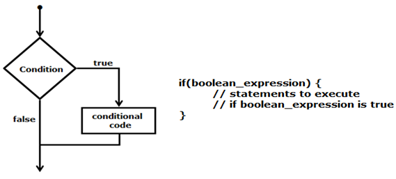
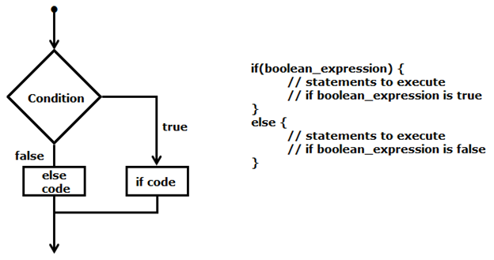
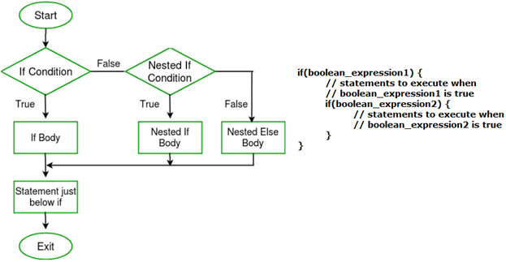
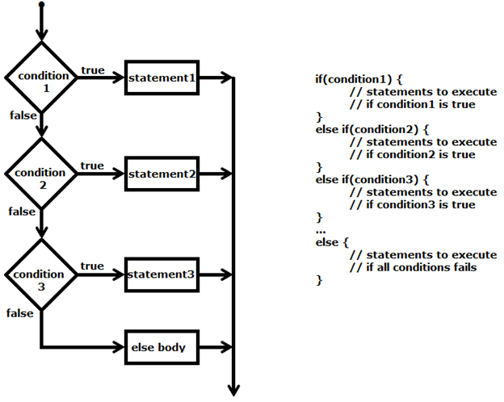

.. contents:: Table of Contents

Decision Making Statements
==========================

Decision Making
---------------

In decision making structure programmer specify one or more conditions to be evaluated or tested by the program
Along with statement(s) to be executed if condition is true otherwise other statement(s) to be executed if condition is false

Types
-----

#. if statement
#. if..else statements
#. nested if statements
#. if-else if - else statement
#. switch statements

if statement
------------

If Boolean expression is true then a block of statements is executed otherwise not

.. code :: cpp

        if(a < 20)
                std::cout << “a is less than 20” << std::endl;

if..else statements
-------------------

.. code :: cpp

        if(a < 20) 
                Std::cout << “a is less than 20” << std::endl;
        else
                Std::endl << “a is not less than 20” << std::endl;

nested if statements
--------------------

Nested if statements mean an if statement inside another if statement

.. code:: cpp

        if (10 < i) { 
                // First if statement 
                if (i < 15) 
                        printf("i is smaller than 15\n"); 

                // Nested - if statement Will only be 
                // executed if statement above is true 
                if (i < 12) 
                        printf("i is smaller than 12 too\n"); 
                else
                        printf("i is greater than 15"); 
        }

if-else if - else statement
---------------------------

if statement can be followed by optional multiple else if statements and one else statement

useful to test various conditions

else if after if statement is optional

else after else if statement is optional

.. code:: cpp

        if (i == 10) 
                printf("i is 10"); 
        else if (i == 15) 
                printf("i is 15"); 
        else if (i == 20) 
                printf("i is 20"); 
        else
                printf("i is not present");

**NOTE**

`else if` in C/C++ is a lie. It is just `else` followed by a one-line implied block. Which means you could also make `else while` and others.

**In the second form of if statement (the one including else), if the first substatement is also an if statement then that inner if statement shall contain an else part.**

Reference:
https://eel.is/c++draft/stmt.if
https://twitter.com/jntrnr/status/1522725730567995392

.. code:: cpp

        #include <iostream>

        int main() {
        int val = 0;
        if(0 != val) {
                ++val;
        }
                else while(val < 10) {
                                std::clog << val++ << ' ';
                }
                std::clog << '\n';
                return 0;
        }
        Output
        0 1 2 3 4 5 6 7 8 9

switch statements
-----------------

Switch Statement in C/C++

Switch case statements are a substitute for long if statements that compare a variable to several integral values

The switch statement is a multiway branch statement. It provides an easy way to dispatch execution to different parts of code based on the value of the expression.

Switch is a control statement that allows a value to change control of execution.

Important Points about Switch Case Statements:

#. The expression used in switch must be integral type ( int, char and enum). The expression provided in the switch should result in a constant value otherwise it would not be valid.
        Valid expressions for switch:

        // Constant expressions allowed
        
        switch(1+2+23)
        
        switch(1*2+3%4)

        // Variable expression are allowed provided
        
        // they are assigned with fixed values
        
        switch(a*b+c*d)
        
        switch(a+b+c)

#. Duplicate case values are not allowed.
#. “switch” body may not have any “case” label at all and it would still compile
#. An expression gets evaluated in a case label
#. The default statement is optional. Even if the switch case statement does not have a default statement, it would run without any problem.
#. The default block can be placed anywhere. The position of default doesn’t matter, it is still executed if no match found.
#. “switch” body can have the “default” label at first i.e. before any “case” labels
#. default could be anywhere inside “switch” body
#. The break statement is used inside the switch to terminate a statement sequence. When a break statement is reached, the switch terminates, and the flow of control jumps to the next line following the switch statement.
#. The break statement is optional. If omitted, execution will continue on into the next case. The flow of control will fall through to subsequent cases until a break is reached.
#. Nesting of switch statements are allowed, which means you can have switch statements inside another switch. However nested switch statements should be avoided as it makes program more complex and less readable.
#. In nesting switch statements inner and outer switch can contain common values
        256 levels of nesting is allowed
#. The statements written above cases are never executed after the switch statement, the control transfers to the matching case, the statements written before case are not executed.

.. code:: cpp

        #include <stdio.h>
        #include <stdlib.h>
        #include <string.h>

        int main() {

                float flt = 12.75;
                int arr[] = {1, 2, 3, 4, 5};
                
                //switch(flt)     // error: switch quantity not an integer
                switch(arr[0])
                {
                
                        printf("This line will never be printed.\n");
                        
                        case 1:	printf("case 1\ncase 2 will also be printed after this as there is not break statement after case 1\n");  
                        //case arr[0]:    printf("case arr[0]\n"); break; // error: case label does not reduce to an integer constant
                        case 2:	printf("case 2\n"); break;
                        case 3:	printf("case 3\n"); break;
                        //case 3:	printf("case 3\n"); break;  // error: duplicate case value
                        default:	printf("case default\n"); break;
                        case 4:	printf("case 4\n"); break;
                        case 5:	printf("case 5\n"); break;
                        
                }
                
                return 0;
        }

Using range in switch case in C/C++
^^^^^^^^^^^^^^^^^^^^^^^^^^^^^^^^^^^

You can use range of numbers instead of a single number or character in case statement

That is the case range **extension of the GNU C** compiler and **not standard C or C++**

You can specify a range of consecutive values in a single case label, like this

::

        case low ... high:

It can be used for ranges of ASCII character codes like this:

::

        case 'A' ... 'Z':

You need to Write spaces around the ellipses … . For example, write this:

::

        // Correct  	-   case 1 ... 5:
        // Wrong 	-    case 1...5:

**Error conditions**

- low > high : The compiler gives with an error message.
- Overlapping case values : If the value of a case label is within a case range that has already been used in the switch statement, the compiler gives an error message.

Conditional operator
--------------------

Can be used to replace if … else statements

exp1?exp2:exp3

for detail check in `operators <03_Operators.rst>`_ chapter

References
-----------

| https://www.geeksforgeeks.org/decision-making-c-c-else-nested-else/
| https://www.geeksforgeeks.org/range-based-loop-c/
| https://www.geeksforgeeks.org/loops-in-c-and-cpp/
| Selection statements https://en.cppreference.com/w/cpp/language/statements
| Chapter 7 | Control Flow and Error Handling	https://www.learncpp.com/

