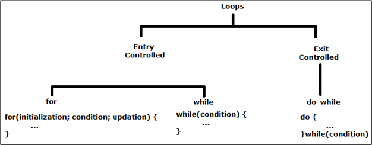
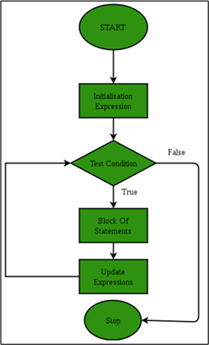
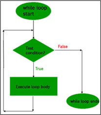
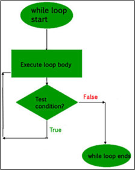

.. contents:: Table of Contents

Loops
======

Loops are used when we need to repeatedly execute a block of statements.

Types of loops
--------------

**Entry Controlled loops:**	In this type of loops the test condition is tested before entering the loop body.
**Exit Controlled Loops:**	In this type of loops the test condition is tested or evaluated at the end of loop body.

 
For loop
--------

A for loop is a repetition control structure

It is used to efficiently write a loop that needs to execute a specific number of times

.. note:: When the condition expression is absent it is assumed to be true.

**Syntax**

.. code:: cpp

	for(initialization expr; condition expr; update expr) {    
	     // statements to execute
	}

.. code:: cpp

	int a = 0;
	for(a = 10; a < 20; ++a) {
		printf(“Value of a : %d\n”, a);
	}

Range based for loop
^^^^^^^^^^^^^^^^^^^^

Added since C++ 11, it executes for loop over a range. 

Used as a more readable equivalent to the traditional for loop operating over a range of values, such as all elements in a container.

**Syntax**

.. code:: cpp

	for(range_declaration : range_expression) {
		// statements to execute
	}

.. code:: cpp

	std::vector<int> v = {0, 1, 2, 3, 4, 5};
	for (auto i : v) {
		std::cout << i << ' ';
	}

For each loop
-------------

Present in C++ algorithm

This loop accepts a function which executes over each of the container elements. 

This loop is defined in the header file “algorithm”, and hence has to be included for successful operation of this loop.
 
**Syntax**

.. code:: cpp

	std::for_each (InputIterator first, InputIterator last, Function fn);

Why to use for_each?

- It is versatile, i.e can work with any container.
- It reduces chances of errors one can commit using generic for loop
- It makes code more readable
- for_each loops improve overall performance of code

.. code:: cpp

	void printx2(int a) {
		cout << a * 2 << " "; 
	}

	cout << "Multiple of 2 of elements are : ";
	for_each(arr, arr + 5, printx2);

While loop
----------

While loops are used in situations where we do not know the exact number of iterations of loop beforehand

The loop execution is terminated on the basis of test condition.

Tests the condition before executing the loop body

**Syntax**

.. code:: cpp

	initialization expression;
	while (test_expression) {
		// statements
		// update_expression;
	}

.. code:: cpp
	
	int i = 1;		// initialization expression
	while (i < 6) {		// test expression
		printf( "Hello World\n");
		i++;		// update expression 
	}

do … while loop
---------------

Similar to a while loop, except that it tests the condition at the end of the loop body

It is guaranteed to execute at least one time
 		 

**Syntax**

.. code:: cpp

	initialization expression;

	int i = 2;		// Initialization expression
	do {
		printf( "Hello World\n");	
		i++;		// update expression
	} while (i < 1);	// test expression

Nested Loop
-----------

A loop can be nested inside of another loop

C++ allows at least 256 levels of nesting

.. code:: cpp

	for(initialization expr; condition expr; update expr) {   
		for(initialization expr; condition expr; update expr) {
			// statements to execute
		}	
		// statements to execute
	}

References
----------

| https://www.geeksforgeeks.org/loops-in-c-and-cpp/
| https://www.geeksforgeeks.org/range-based-loop-c/
| Chapter 7 | Control Flow and Error Handling https://www.learncpp.com/
| Iteration statements https://en.cppreference.com/w/cpp/language/statements

