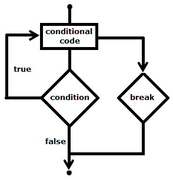
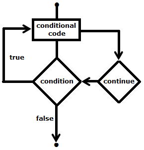
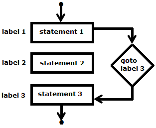

.. contents:: Table of Contents

Control Statements
==================

Break Statement
---------------

The break in C or C++ is a loop control statement which is used to terminate the loop. 

As soon as the break statement is encountered from within a loop, the loop iterations stops there and control returns from the loop immediately to the first statement after the loop.

**In simple loop:**	When encountered inside a loop, the loop is immediately terminated and program control resumes at the next statement following the loop

**In switch-case:**	In Switch statement used to terminate a case

**In nested loop:**	If break statement is used in innermost loop, control will come out only from the innermost loop.

**Syntax**

.. code:: cpp

	break;

.. code:: cpp

    int a = 0;
    do {
        ++a;
        if(15 < a)
            break;
        std::cout << a << " ";
    }while(a < 20);

Output::

	1 2 3 4 5 6 7 8 9 10 11 12 13 14 15

Continue statement
------------------

Continue statement is opposite to that of break statement, instead of terminating the loop; it forces to execute the next iteration of the loop.

In case of for loop, continue causes the conditional test and increment portions of the loop to execute

For while and do-while loops, program control passes to the conditional tests
 		 

**Syntax**

.. code:: cpp

	continue;

.. code:: cpp

	int a = 0;
	do {
		++a;
		if((10 < a) && (16 > a))
			continue;
		std::cout << a << " ";
	}while(a < 20);

Output::

	1 2 3 4 5 6 7 8 9 10 16 17 18 19 20

goto statement
--------------

The goto statement can be used to jump from anywhere to anywhere within a function

- Transfers control to the labeled statement
- Can be used in case want to exit from innermost loop to next statement after loop
- Use of goto is highly discouraged

**Disadvantage**

- Difficult to trace the control flow of a program
- Makes program hard to modify

**Syntax**

.. code:: cpp

	{
		goto label:
		...
		label:
	}

	{
		label:
		...
		goto label:
	}

.. code:: cpp

    void checkEvenOrNot(int num) { 
		if (num % 2 == 0) 
			goto even;	// jump to even 		  
		else
			goto odd;	// jump to odd
			
		even: 
			printf("%d is even", num);
			return;		// return if even		
		odd: 
			printf("%d is odd", num);
			return;		// return if odd		
	}

Infinite Loop
-------------

A loop becomes infinite loop if a condition never becomes false

For loop is used for this purpose

Example

.. code:: cpp

	for( ;  ; ) {
		// this is infinite loop
	}

**NOTE: above loop is undefined behavior**

Why undefined behavior for infinite loops?

https://www.open-std.org/jtc1/sc22/wg14/www/docs/n1528.htm

References
----------

| Chapter 7 | Control Flow and Error Handling https://www.learncpp.com/
| Jump statements https://en.cppreference.com/w/cpp/language/statements

