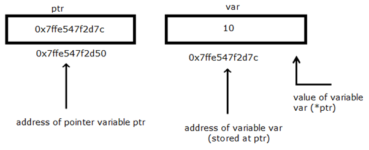
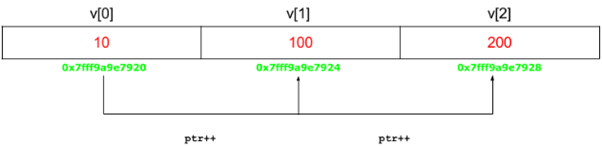

.. contents:: Table of Contents

Pointers
========

Pointers store address of variables or a memory location

Pointer variable declaration

::

	type *  var_name;

type – 	Pointer’s base type

var_name – Name of the pointer variable

& and * operator in case of pointer
-----------------------------------

&
^^

To access address of a variable to a pointer

& returns the address of the variable

::
	
	printf("%p", &x);	// Prints address of x

\*
^^^^^

used for two things

#. To declare a pointer variable
   
   ::
   
    int * ptr;		// pointer to an integer type

#. To access the value stored in the address
   
   .. code:: cpp
   
        #include <stdio.h>
        int main() {
            int Var = 10; 
            int *ptr = &Var;
            printf("Value of Var = %d\n", *ptr); 
            printf("Address of Var = %p\n", ptr);	
            return 0;
        }
        
   Output::
    
        Value of Var = 10
        Address of Var = 0x7ffe547f2d7c
   
   ::

    (a)	int	*p;
    (b)	int*	p;
    (c)	int  * 	p;
    
    All three declarations are same

 
Pictorial representation
------------------------

 
Pointer Expressions and Pointer Arithmetic
------------------------------------------

A pointer may be

- Incremented ( ++ )
- Decremented ( -- )
- An integer may be added to a pointer ( + or += )
- An integer may be subtracted from a pointer ( – or -= )

.. note:: 

    - Pointer arithmetic can be performed only on an array

.. code:: cpp

	#include <stdio.h>
	int main() { 
	    int v[3] = {10, 100, 200}; 
	    int *ptr; 
	    ptr = v;	// assign the address of v[0] to ptr
	    for (int i = 0; i < 3; i++) { 
		printf("Value of *ptr = %d\n", *ptr); 
		printf("Value of ptr = %p\n\n", ptr); 
		ptr++; 
	    }
		return 0;
	}
        
Output::

	Value of *ptr = 10
	Value of ptr = 0x7ffe2b446610

	Value of *ptr = 100
	Value of ptr = 0x7ffe2b446614

	Value of *ptr = 200
	Value of ptr = 0x7ffe2b446618

 
Pointer Comparisons
-------------------

Pointers may be compared using relational operators ==, < and >

.. code:: cpp

	while(ptr <= var[3 - 1]) { 
		…
	}

Array name as pointers
----------------------

An array name acts like a pointer constant value of this pointer constant is the address of the first element

For an array named val, val and &val[0] can be used interchangeably

.. code:: cpp

	#include <stdio.h>
	int main() {
		int val[3] = {10, 15, 20};
		int * ptr = val;
		printf("Array elements: %d %d %d\n", ptr[0], ptr[1], ptr[2]);
		return 0;
	}

Output::

	Array elements: 10 15 20

Pointers and Multidimensional Arrays
------------------------------------

int nums[2][3]  =  { {16, 18, 20}, {25, 26, 27} };

In general, **nums[i][j] is equivalent to \*(\*(nums+i)+j)**

.. list-table::
    :header-rows: 1

	*	-	Pointer notation	
		-	Array notation		
		-	Value

	*	-	\*(\*nums)
		-	nums[0][0]		
		-	16
	
	*	-	\*(\*nums + 1)
		-	nums[0][1]		
		-	18

	*	-	\*(\*nums + 2)
		-	nums[0][2]
		-	20

	*	-	\*(\*(nums + 1))
		-	nums[1][0]
		-	25

	*	-	\*(\*(nums + 1) + 1)
		-	nums[1][1]
		-	26

	*	-	\*(\*(nums + 1) + 2)
		-	nums[1][2]
		-	27

Double Pointer (Pointer to Pointer) in C
-----------------------------------------

First pointer is used to store the address of the variable, and 

The second pointer is used to store the address of the first pointer

.. code:: cpp

	#include <stdio.h>
	int main() { 
		int var = 789; 
		int *ptr1;
		int **ptr2; 
		ptr1 = &var; 
		ptr2 = &ptr1; 
		printf("Value of var = %d\n", var ); 
		printf("Value of var using single pointer = %d\n", *ptr1 ); 
		printf("Value of var using double pointer = %d\n", **ptr2);    
		return 0; 
	}

Output::

	Value of var = 789
	Value of var using single pointer = 789
	Value of var using double pointer = 789

Why C treats array parameters as pointers?
------------------------------------------

Array parameters treated as pointers because of efficiency

It is inefficient to copy the array data in terms of both memory and time

The following two definitions of function look different, but to the compiler they mean exactly the same thing. It’s preferable to use whichever syntax is more accurate for readability.

If the pointer coming in really is the base address of a whole array, then we should use [ ].

.. code:: cpp

    #include <stdio.h>
    void fun1(int arr_param[]) {
        arr_param[0] = 11;
        arr_param[1] = 12;
        arr_param[2] = 13;
    }
    void fun2(int *arr_param) {
        arr_param[0] = 21;
        arr_param[1] = 22;
        arr_param[2] = 23;
    }
    int main() {
        int arr[] = {1, 2, 3};
        printf("Array elements: %d %d %d\n", arr[0], arr[1], arr[2]);
        fun1(arr);
        printf("After fun1(), Array elements: %d %d %d\n", arr[0], arr[1], arr[2]);
        fun2(arr);
        printf("After fun2(), Array elements: %d %d %d\n", arr[0], arr[1], arr[2]);
        return 0;
    }

Output::

	Array elements: 1 2 3
	After fun1(), Array elements: 11 12 13
	After fun2(), Array elements: 21 22 23

An Uncommon representation of array elements
---------------------------------------------
Because compiler converts the array operation in pointers before accessing the array elements

::

	arr[i] and i[arr] is same
	arr[i] = *(arr + i) and i[arr] = *(i + arr)

Pointer vs Array in C
---------------------

Most of the time, pointer and array accesses can be treated as acting the same, the major exceptions being

#. **The sizeof() operator**

   - sizeof(array) returns the amount of memory used by all elements in array
   - sizeof(pointer) only returns the amount of memory used by the pointer variable itself

#. **The & operator**

   - &array is an alias for &array[0] and returns the address of the first element in array
   - &pointer returns the address of pointer

#. **A string literal initialization of a character array**

   - ``char array[] = “abc”`` sets the first four elements in array to ‘a’, ‘b’, ‘c’, and ‘\0’
   - ``char *pointer = “abc”`` sets pointer to the address of the “abc” string (which may be stored in read-only memory and thus unchangeable)

#. **Pointer variable can be assigned a value whereas array variable cannot**

   .. code:: cpp

    int a[10];
    int *p;
    p=a;		/* legal */
    a=p;		/* illegal */

#. **Arithmetic on pointer variable is allowed**

   .. code:: cpp

    p++;		/* legal */
    a++;		/* illegal */

Array Decay
-----------

The **loss of type and dimensions** of an array is known as decay of an array.

This generally occurs when we pass the array into function by value or pointer. 

What it does is, it sends first address to the array which is a pointer, hence the size of array is not the original one, but the one occupied by the pointer in the memory.

.. code:: cpp

	#include<iostream> 
	using namespace std;

	// Passing array by value 
	void aDecay(int *p) { 
	    // Printing size of pointer 
	    cout << "Modified size of array is by "
		    "passing by value: "; 
	    cout << sizeof(p) << endl; 
	}
	  
	// Passing array by pointer
	void pDecay(int (*p)[7]) { 
	    // Printing size of array 
	    cout << "Modified size of array by "
		    "passing by pointer: "; 
	    cout << sizeof(p) << endl; 
	} 
	  
	int main() { 
		int a[7] = {1, 2, 3, 4, 5, 6, 7,};
		
		// Printing original size of array 
		cout << "Actual size of array is: "; 
		cout << sizeof(a) <<endl;
		
		aDecay(a);
		pDecay(&a);
		
		return 0; 
	} 

Output::

	Actual size of array is: 28
	Modified size of array is by passing by value: 8
	Modified size of array by passing by pointer: 8

How to prevent Array Decay?
----------------------------

Pass size of array also as a parameter and not use sizeof() on array parameters

Send the array into functions by reference. This prevents conversion of array into a pointer, hence prevents the decay.

.. code:: cpp

    #include <iostream>
    using namespace std;
    
    // by passing array by reference
    void fun(int (&p)[7]) { 
		// Printing size of array 
		cout << "Modified size of array by "
				"passing by reference: "; 
		cout << sizeof(p) << endl;
    }

    int main() { 
		int a[7] = {1, 2, 3, 4, 5, 6, 7,}; 
		
		// Printing original size of array 
		cout << "Actual size of array is: "; 
		cout << sizeof(a) <<endl;
		
		fun(a);	// Calling function by reference 
		
		return 0;
    } 

Output::

	Actual size of array is: 28
	Modified size of array by passing by reference: 28

Dereference, Reference, Dereference, Reference …
-------------------------------------------------

.. code:: cpp

	#include<stdio.h> 
	int main() { 
		char *ptr = "Learning C++"; 
		printf("%c\n", *&*&*ptr); 
		return 0; 
	}

Output::

	L

.. code:: cpp

	#include<stdio.h> 
	int main() { 
		char *ptr = "Learning C++"; 
		printf("%s\n", *&*&ptr); 
		return 0; 
	}

Output::

	Learning C++

**Explanation**

\* and & operators cancel effect of each other when used one after another

\*ptr gives us g, &*ptr gives address of g, \*&\*ptr again g, &*&*ptr address of g, and finally \*&*&*ptr gives g

NULL, Void, Wild and Dangling Pointer
-------------------------------------

NULL Pointer
^^^^^^^^^^^^

A pointer which is pointing to nothing

In case, if we don’t have address to be assigned to a pointer, then we can simply use NULL.

.. code:: cpp

    #include <stdio.h>
    int main() {
        int *ptr = NULL;
        printf("The value of ptr is %p", ptr);
        return 0;
    }

Output::

	The value of ptr is (nil)

**Common use cases for NULL**

- To initialize a pointer variable when that pointer variable isn’t assigned any valid memory address yet
- To check for a null pointer before accessing any pointer variable
- To pass a null pointer to a function argument when we don’t want to pass any valid memory address

**NULL vs Uninitialized Pointer**

An Uninitialized pointer stored an undefined value

A NULL pointer stores a defined value, but one that is defined by the environment to net is a valid address for any memory or object

**NULL vs Void Pointer**

NULL pointer is a value, while void pointer is a type

**NULL pointer**

C standards say about null pointer. From C11 standard clause 6.3.2.3,

“An integer constant expression with the value 0, or such an expression cast to type ``void *``, is called a null pointer constant. If a null pointer constant is converted to a pointer type, the resulting pointer, called a null pointer, is guaranteed to compare unequal to a pointer to any object or function.”

Since **NULL is defined as ((void \*)0)**, we can think of NULL as a special pointer and its size would be equal to any pointer.

As per C11 standard “The void type comprises an empty set of values, it is an incomplete object type that cannot be completed”

Even C11 clause 6.5.3.4 mentions that “The sizeof operator shall not be applied to an expression that has function type or an incomplete type, to the parenthesized name of such a type, or to an expression that designates a bit-field member.” 

Basically, it means that void is an incomplete type whose size doesn’t make any sense in C programs but implementations (such as gcc) can choose sizeof(void) as 1 so that the flat memory pointed by void pointer can be viewed as untyped memory i.e. a sequence of bytes.

.. note::

    - Always initialize pointer variable as NULL
    - Always perform NULL check before accessing any pointer

.. code:: cpp

	#include <stdio.h>
	int main() {
		printf("%zu\n",sizeof(void));
		printf("%zu\n",sizeof(void *));
		printf("%zu\n",sizeof(NULL));

		printf("%c\n",NULL);
		//printf("%s\n",NULL);
		// This line causes SIGSEGV in C11 and C++
		
		printf("%f\n",NULL);
		return 0;
	}

Output::

    1
    8
    8

    0.000000

Void Pointer
^^^^^^^^^^^^

- Pointer type void *
- A pointer that points to some data location in storage, which does not have any specific type
- Void refers to the type
- **The type of data that it points to can be any**
- If we assign address of char data type to void pointer it will became char pointer
- **Any pointer type is convertible to a void pointer hence it can point to any value**
- Void pointers **cannot be dereferenced**
- It can be dereferenced using typecasting the void pointer
- Pointer arithmetic is not possible on pointers of void due to lack of concrete value and thus size
- A void pointer is a pointer that has no associated data type with it
- A void pointer can hold address of any type and can be typcasted to any type

**Advantage**

- malloc() and calloc() return void* type and this allows these functions to be used to allocate memory of any data type
- Used to implement generic functions in C

.. code:: cpp

    int* ptr = malloc(sizeof(int) * 10);

C	- no error

C++	- Error invalid conversion from ‘void*’ to ‘int*’

C++	- Explicit typecast is necessary in C++

.. code:: cpp

	int* ptr = (int*) malloc( sizeof(int) * 10);

Correct in both C and C++

.. note::

    - Void pointers cannot be dereferenced
    - C standard does not allow pointer arithmetic with void pointers (in GNU C it is allowed by considering the size of void is 1)

.. code:: cpp

	#include <stdio.h>
	int main() {
		int a = 10;
		void * ptr = &a;
		//printf("%d\n", *ptr);       
		// error: 'void*' is not a pointer-to-object type
		
		printf("%d\n", *(int*)ptr);
		return 0;
	}

Output::

	10

.. code:: cpp

	#include <stdio.h>
	int main() {
		int a[2] = {1, 2};
		void * ptr = &a;
		ptr = ptr + sizeof(int);
		// warning: pointer of type 'void *' used in arithmetic [-Wpointer-arith]
		
		printf("%d", *(int*)ptr);
		return 0;
	}

Output::

	2

Wild Pointer
^^^^^^^^^^^^

A pointer which has not been initialized to anything (not even NULL)

Pointer may be initialized to a non-NULL garbage value that may not be a valid address

.. code:: cpp

	int * ptr;	// wild pointer
	int x = 10;
	p = &x;		// p is not a wild pointer

Dangling Pointer
^^^^^^^^^^^^^^^^^

A pointer pointing to a memory location that has been deleted (or freed)

3 different ways where Pointer acts as dangling pointer

#. **De-allocation of memory**

   .. code:: cpp
    
    int * ptr = (int*) malloc (sizeof(int));
    free(ptr);		// ptr becomes a dangling after free call
    ptr = NULL;		// no more dangling

#. **Function Call**

   // Pointer pointing to local variable becomes dangling

   .. list-table::

    *
        -
            .. code:: cpp

                #include <stdio.h>
                int * fun() {
                    int x = 5;
                    return &x;
                }
                int main() {
                    int * ptr = fun();
                    fflush(stdin);
                    printf("%d", ``*ptr``);
                    return 0;
                }

            Output::
            
                Compilation warning: function returns address of local variable [-Wreturn-local-addr]

                Runtime Errors
                Segmentation Fault (SIGSEGV)

        -
            .. code:: cpp

                #include <stdio.h>
                int * fun() {
                    static int x = 5;
                    return &x;
                }
                int main() {
                    int * ptr = fun();
                    fflush(stdin);
                    printf("%d", ``*ptr``);
                    return 0;
                }

            Output::

                5

#. **Variable goes out of scope**

   .. code:: cpp
    int main() {
        int * ptr;
        {
            int ch;
            ptr = &ch;
        }
    }

Near, far and huge pointers
----------------------------

Near pointer
^^^^^^^^^^^^

- Used to store 16 digit addresses
- We can only access 64kb of data at a time
- Generates code which is fast
- Only a limited amount of memory is needed

Far pointer & Huge pointer
^^^^^^^^^^^^^^^^^^^^^^^^^^

- Generates code which is usually slower
- To access a large amount of memory
- Because an additional page/bank register has to be calculated, configured, saved/restored
- 32 bit that can access memory outside current segment
- Compiler allocates a segment register to store segment address, then another register to store offset within current segment

In case of far pointers 

- a segment is fixed
- the segment part cannot be modified, but in huge it can be

**How to declare near and far pointers in C?**

It used to be a good question 30 years ago.

Right now you don't have to know anything about near and far pointers; but if you still use a 16-bit compiler, select 'Large Model' (or 'Huge Model'), and forget 'near' and 'far'.

Function Pointer in C
----------------------

We can have pointers to functions also

.. code:: cpp

	#include <stdio.h>
	void fun(int a) {
		printf("Value of a is %d\n", a); 
	} 
	  
	int main() {
		void (*fun_ptr)(int) = &fun;
		/* The above line is equivalent of following two 
		void (*fun_ptr)(int); 
		fun_ptr = &fun;  
		*/

		(*fun_ptr)(10);	// Invoking fun() using fun_ptr
		return 0; 
	} 

Output::

	Value of a is 10

How to declare a pointer to a function?
^^^^^^^^^^^^^^^^^^^^^^^^^^^^^^^^^^^^^^^^

.. code:: cpp

	int foo(int);         // function with one int argument
	int (*fun_ptr)(int);  // pointer to function

	int * fun_ptr(int);   // WRONG

	// not a function pointer because operator () will take priority

NOTES about function pointer
^^^^^^^^^^^^^^^^^^^^^^^^^^^^

#. A function pointer points to code, not data. Typically a function pointer stores the start of executable code
#. We do not allocate de-allocate memory using function pointers
#. A function’s name can also be used to get functions’ address

   .. code:: cpp

    void (*fun_ptr)(int) = &fun;
    void (*fun_ptr)(int) = fun;     // & removed

#. Like normal pointers, we can have an array of function pointers
#. Function pointer can be used in place of switch case.

   .. code:: cpp

    void (*fun_ptr_arr[])(int, int) = {add, subtract, multiply};
    if (ch > 2) return 0;
    (*fun_ptr_arr[ch])(a, b);

#. Like normal data pointers, a function pointer can be passed as an argument and can also be returned from a function

   .. code:: cpp

    #include <stdio.h>
    void fun1() { printf("Fun1\n"); } 
    void fun2() { printf("Fun2\n"); }
    void wrapper(void (*fun)()) {
        fun();
    }
    int main() {
        wrapper(fun1);
        wrapper(fun2);
        return 0;
    }
    
   Output::

    Fun1
    Fun2

#. Many object oriented features in C++ are implemented using function pointers in C.

References
----------

| Pointers and References | https://www.geeksforgeeks.org/c-plus-plus/
| Chapter 9 Compound Types: References and Pointers | https://learncpp.com/
| https://en.cppreference.com/w/cpp/language/pointer
| https://en.cppreference.com/w/cpp/language/reference
| https://en.cppreference.com/w/cpp/language/this

