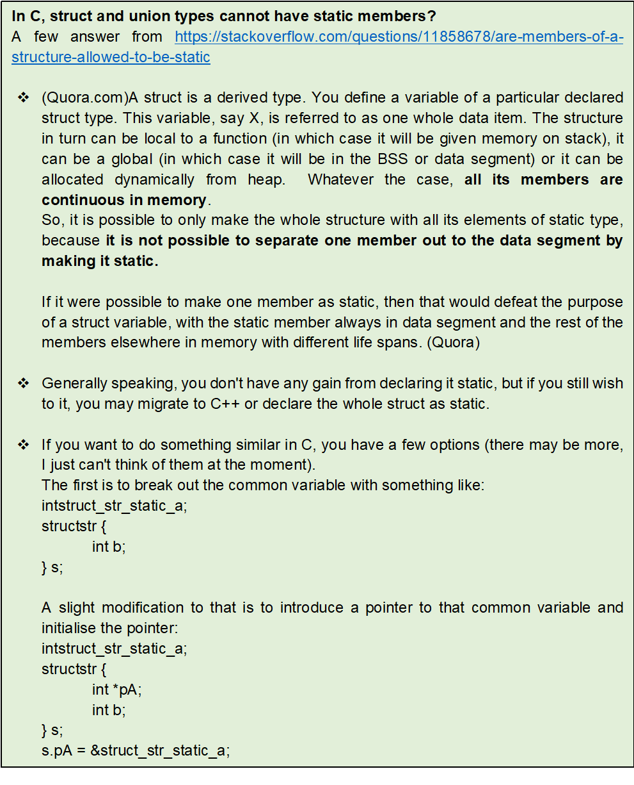

.. contents:: Table of Contents

Notes
=====

- In C,   struct and union types cannot have static members. 	?
- In C++, struct types are allowed to have static members	?
- In C++, union cannot have static members			?

.. code:: cpp

	struct st {
	    int x;
	    static int y;
        // In C, CE: expected specifier-qualifier-list before 'static'
	};

	For union In C++, CE: ???????????

.. list-table::
    :header-rows: 1

    *   - 
		-   C
		-   C++

	*	-   struct	
		-   | Static member
            | CE: expected specifier-qualifier-list before ‘static’	
		-   Static member

	*	- 
		-   Const member
		-   | Const member
            | //compilation error will begerated if not initialized at time of variable declaration
            | error: uninitialized const member in ‘struct st’

	*	- 
		-   | Const static member
            | CE: expected identifier or ‘(’ before ‘static’
		-   Const static member

	*	-   union
		-   | Static member
            | CE: expected specifier-qualifier-list before ‘static’
		-   | Static member
            | CE: ‘st::y’ may not be static because it is a member of a union

	*   - 
		-   Const member
		-   Const member

	*   - 
	    -   | Const static member
            | CE: expected identifier or ‘(’ before ‘static’
		-   | Const static member
            | CE: ‘st::y’ may not be static because it is a member of a union

 

- A structure cannot contain a member of its own type  because if this is allowed then it becomes impossible for compiler to know size of such struct
- Although a pointer of same type can be a member because pointers of all types are of same size and compiler can calculate size of struct

.. code:: cpp

	struct st { 
	    intx; 
	    structst next;// In C, CE: field 'next' has incomplete type
			// In C++, CE: field 'next' has incomplete type 'st'
	}; 

Question
--------

.. code:: cpp

	#include<stdio.h>
	union test {
	    intx;
	    chararr[4];
	    inty;
	};
	 
	int main() {
	    uniontest t;
	    t.x = 0;
	    t.arr[1] = 'G';
	    printf("%s", t.arr);
	    return0;
	}

Answer::

	Nothing is printed

Explanation:

Since x and arr[4] share the same memory, when we set x = 0, all characters of arr are set as 0. O is ASCII value of '\0'. When we do "t.arr[1] = 'G'", arr[] becomes "\0G\0\0". When we print a string using "%s", the printf function starts from the first character and keeps printing till it finds a \0. Since the first character itself is \0, nothing is printed.

Question
--------

.. code:: cpp

	# include <stdio.h>
	# include <string.h>
	struct Test{
		char str[20];
	};
	int main() {
		struct Test st1, st2;
		strcpy(st1.str, "GeeksQuiz");
		st2 = st1;
		st1.str[0] = 'S';
		printf("%s", st2.str);
		return 0;
	}

Answer::

	SeeksQuiz	[x]
	GeeksQuiz	[y]

Explanation:

**Array members are deeply copied** when a struct variable is assigned to another one. See Are array members deeply copied? for more details.

Question
--------

.. code:: cpp

	/* First declaration */
	struct node {
		int data;
		struct node * nextPtr;
	};

	/* Second declaration */
	typedef struct node{
		int data;
		NODEPTR nextPtr;
	} * NODEPTR;

	If we use the first declaration, “struct node * nodePtr;” would be used to declare pointer to a node. If we use the second declaration, “NODEPTR nodePtr;” can be used to declare pointer to a node.

Answer::

    TRUE	[x]
    FALSE	[y]	// second declaration is wrong

Explanation:

The typedef usage is incorrect. Basically, we can’t use yet to be typedef-ed data type inside while applying typedef itself. Here, NODEPTR is yet to be defined (i.e. typedef-ed) and we are using NODEPTR inside the struct itself.

Question
--------

.. code:: cpp

	/* First declaration */
	typedef struct node {
		int data;
		struct node *nextPtr;
	}* NODEPTR;

	/* Second declaration */
	struct node {
		int data;
		struct node * nextPtr;
	};
	typedefstruct node * NODEPTR;

Answer::

	TRUE		[y]
	FALSE		[x]

Explanation:

Yes. Both are equivalent. Either of the above declarations can be used for “NODEPTR nodePtr;”. 
In fact, first one is the compact form of second one.

Question
--------

.. code:: cpp

	#include "stdio.h"
	int main() {
		printf("%d %d %d %d",arr[0].a[0],arr[0].a[1],arr[1].a[0],arr[1].a[1]);
		return 0;
	}

Answer::
	No compile error and it’ll print 1 0 2 0

Explanation:

Here, struct type definition and definition of arr using that struct type has been done in the same line. This is okay as per C standard. Even initialization is also correct. The point to note is that array size of arr[] would be 2 i.e. 2 elements of this array of this struct type. This is decided due to the way it was initialized above. Here, arr[0].a[0] would be 1 and arr[1].a[0] would be 2. The remaining elements of the array would be ZERO. correct answer is E.

Following is also correct

..code:: cpp

    struct {int a[2];} arr[] = {1,2};

No compile error and it’ll create array arr of 1 element. Each of the element of arr contain a struct field of int array of 2 elements. arr[0]. a[0] would be 1 and arr[0].a[1] would be 2.

.. code:: cpp

	struct {int a[2], b;} arr[] = {[0].a = {1}, [1].a = {2}, [0].b = 1, [1].b = 2};
	printf("%d %d %d and",arr[0].a[0],arr[0].a[1],arr[0].b);
	printf("%d %d %d\n",arr[1].a[0],arr[1].a[1],arr[1].b);

No compile error and two elements of arr[] would be defined and initialized. 
Output would be “1 0 1 and 2 0 2”.

.. code:: cpp

	struct {inti; char c;} myVar = {.c ='A',.i = 100};
	printf("%d %c",myVar.i, myVar.c);

No compile error and it’ll print 100 A.

.. code:: cpp

	union {int i1; int i2;} myVar = {.i2 =100};
	printf("%d %d",myVar.i1, myVar.i2);

No compile error and it’ll print “100 100”

References
----------

| https://www.geeksforgeeks.org/c-language-2-gq/structure-union-gq/

