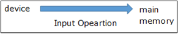
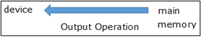

.. contents:: Table of Contents

Basic Input Output in C++
=============================

C++ I/O occurs in streams, which are sequences of bytes

   
I/O Library Header Files
------------------------

#. <iostream>

   cin, cout, cerr and clog objects

#. <iomanip>

   declares services useful for performing formatted I/O with so-called parameterized stream manipulators

   ex: setw and setprecision

#. <fstream>

   - declares services for user-controlled file processing
   - used to handle the data being read from a file as input or 
   - data being written into the file as output
   - will discuss about it in detail in File and Stream

Standard Output Stream (cout)
-------------------------------

- cout is an instance of ostream class
- cout object is connected to the standard output device (like display screen)
- cout is used in conjunction with the stream insertion operator (<<)
- << operator is overloaded to output data items of built-in types integer, float, double, strings and pointer values
- C++ compiler also determines the data type of variable to be output and selects the appropriate stream insertion operator to display the value
- insertion operator << may be used more than once in a single statement 
- endl or '\\n' is used to add a new-line at the end of the line

.. code:: cpp

    #include <iostream>
    using namespace std;
    
    int main() {
        char str[] = "Hello C++";
        cout << "Value of str is : " << str << endl;
    }

Output::

	Value of str is : Hello C++

Standard Input Stream (cin)
----------------------------

- cin is an instance of istream class
- cin object is said to be attached to the standard input device (like keyboard)
- cin is used in conjunction with the stream extraction operator (>>)

- C++ compiler also determines the data type of the entered value and selects the appropriate stream extraction operator to extract the value
- >> may be used more than once in a single statement

**Example:**

- cin >> name >> age;
- cin >> name;
- cin >> age;

.. code:: cpp

    #include <iostream>
    using namespace std;
    
    int main() {
        char name[50];\
        
        cout << "Please enter your name: ";
        cin >> name;
        cout << "Your name is: " << name << endl;
        return 0;
    }

Output::

	Please enter your name: cplusplus
	Your name is: cplusplus

Standard Error Stream (cerr)
----------------------------

- cerr is an instance of ostream class
- cerr object is said to be attached to the standard error device (like display screen)
- cerr is un-buffered and each stream insertion to cerr causes its output to appear immediately
- cerr is also used in conjunction with the stream insertion operator (<<)

.. code:: cpp

    #include <iostream>
    using namespace std;
    
    int main() {
        char str[] = "Unable to read....";
        cerr << "Error message : " << str << endl;
        return 0;
    }

Output::

    Error message : Unable to read....

Standard Log Stream (clog)
--------------------------

- clog is an instance of ostream class
- clog object is said to be attached to the standard error device (like display screen)
- clog is buffered - This means that each insertion to clog could cause its output to be held in a buffer until the buffer is filled or until the buffer is flushed.
- clog is also used in conjunction with the stream insertion operator (<<)

.. code:: cpp

    #include <iostream>
    using namespace std;
    
    int main() {
        char str[] = "Unable to read....";
        clog << "Error message : " << str << endl;
        return 0;
    }

Output::

	Error message : Unable to read....

endl vs '\\n' in C++
------------------

- cout << endl  : Inserts a new line and flushes the stream
- cout << "\n"  : Only inserts a new line
- cout << endl; can be said equivalent to cout << ‘\n’ << flush;
- cout << “\n” seems performance wise better than cout << endl; unless flushing of stream is required.

Problem with scanf()
--------------------

- scanf() reads an integer and leaves a newline character in buffer
- This causes problem with scanf() when there is fgets()/gets()/scanf() after it

.. code:: cpp

    #include <stdio.h>
    int main() {
        int x;
        char str[100];
        
        scanf("%d", &x);
        fgets(str, 100, stdin);
        printf("x = %d, str = %s", x, str);
        return 0;
    }

Input::

	10 
	test

Output::

	x = 10, str =  

**problem in this code**

- scanf() reads an integer and leaves a newline character in buffer
- So fgets() only reads newline and the string “test” is ignored by the program.

.. code:: cpp

    // C program to demonstrate the problem when scanf() is used in a loop
    #include <stdio.h>
    int main() {
        char c;
        printf("......Enter q to quit......\n");

        do {
            printf("Enter a character\n");
            scanf("%c", &c);
            printf("%c\n", c);
        }
        while (c != 'q');
        return 0;
    }

Input::

	a
	b
	q

Output::

	......Enter q to quit......
	Enter a character
	a
	Enter a character

	Enter a character
	b
	Enter a character

	Enter a character
	q

*This happens because every scanf() leaves a newline character in buffer that is read by next scanf*

**How to solve above problem?**

- use scanf("%d\n", &x) or scanf("%d ", &x)
- add a getchar() after scanf() to read an extra newline.

Clearing The Input Buffer In C/C++
-----------------------------------

- Buffer: Temporary storage area
- All standard input and output devices contain input and output buffer

**Example**

when we press the key on keyboard, it isn’t send to your program, 

rather it is buffered by operating system till the time is allotted to the program.

**How does it affect Programming?**

you may need to clear the unwanted buffer so as to get the next input in the desired container and not in the buffer of previous variable

Example

C after encountering “scanf()” , if we need to input a character array or character

C++, after encountering “cin” statement, we require to input a character array or a string

we require to clear the input buffer or else the desired input is occupied by buffer of previous variable

**How can it be resolved?**

Following are used to clear buffer after scanf()

In case of C
^^^^^^^^^^^^^

#. Using **"while ((getchar()) != ‘\n’);"**

   - reads the buffer characters till the end and discards them(including newline)
   - using it after the “scanf()” statement clears the input buffer and allows the input in the desired container

#. Using **"fflush(stdin)"**

   - fflush(stdin)” after “scanf()” statement clears the input buffer
   - use of it is avoided and is termed to be **“undefined” for input stream as per the C++11 standards**

In case of C++
^^^^^^^^^^^^^^^

Following are used to clear buffer after cin

#. Using **"cin.ignore(numeric_limits::max(), '\\n');"**

   - discards everything in the input stream including the newline

#. Using **"cin.sync()"**

   - "cin.sync()" after the “cin” statement discards all that is left in buffer
   - "cin.sync()" does not work in all implementations (According to C++11 and above standards).

#. Using **"cin >> ws"**

   - "cin>>ws" after “cin” statement ignores buffer and 
   - also discard all the whitespaces before the actual content of string or character array

How to use getline() in C++ when there are blank lines in input?
----------------------------------------------------------------

getline() : read till it encounters newline or sees a delimiter provided by user

.. code:: cpp

	#include <iostream>
	#include <cstring>
	using namespace std;

	int main() {
	    string str;
	    int t = 4;
	    while (t--) {
		// Read a line from standard input in str
		getline(cin, str);
		cout << str << " : newline" << endl;
	    }
	    return 0;
	}

Sample Input::

	This
	is
	Geeks
	for

As expected output is::

	This : newline
	is  : newline
	Geeks : newline
	for : newline

Sample Input::

	This

	is 

	Geeks

	for

Output::

	This : newline
	 : newline
	is  : newline
	 : newline
 
modified code to exclude such blank lines

.. code:: cpp

	#include <iostream>
	#include <cstring>
	using namespace std;

	int main() {
	    string str;
	    int t = 4;
	    while (t--) {
		getline(cin, str);
	 
		// Keep reading a new line while there is a blank line
		while (str.length()==0 )
		    getline(cin, str);
	 
		cout << str << " : newline" << endl;
	    }
	    return 0;
	}

Input::

	This

	is 

	Geeks

	for

Output::

	This : newline
	is  : newline
	Geeks : newline
	for : newline

scanf() and fscanf() in C – Simple Yet Poweful
----------------------------------------------

to read only a part of the input:

Input: “this is the value 100”,

Output: value read is 100

Input : “this is the value 21.2”,

Output : value read is 21.2

.. code:: cpp

	#include <stdio.h>
	int main() {
	    int a;
	    scanf("This is the value %d", &a);
	    printf("Input value read : a = %d", a);
	    return 0;
	}

Input::

	This is the value 100

Output::

	Input value read : a = 100

when we don’t know what the preceding characters are but we surely know that the last value is an integer

%*s and %*d
^^^^^^^^^^^^^

%*s in scanf()  is used to ignore the input until the next space or new line

%*d it will ignore integers until the next space or new line

.. code:: cpp

	int fscanf(FILE *ptr, const char *format, ...);

.. code:: cpp

    /*c program demonstrating fscanf and its usage*/
    /*
        Assume file is successfully opened and
        abc.txt has content in below format
        NAME    AGE   CITY
        abc     12    hyderbad
        bef     25    delhi
        cce     65    bangalore
    */
    
    #include <stdio.h>
    int main() {
        {
            FILE* ptr = fopen("/app/abc.txt","r");
            char* buf[100];
            while (fscanf(ptr,"%*s %*s %s",buf)==1)
                printf("%s\n", buf);
            fclose(ptr);
        }
        
        {
            FILE* ptr = fopen("/app/abc.txt","r");
            char* buf[100];
            while (fscanf(ptr,"%*s %s %*s",buf)==1)
                printf("%s\n", buf);
            fclose(ptr);
        }
        return 0;
    }

Output::

    CITY
    hyderbad
    delhi
    bangalore
    AGE
    12
    25
    65

`Check this code in Compiler Explorer <https://godbolt.org/z/MajccPWo6>`_

Exercise: Count the number of words, characters and lines in a file using fscanf!

How to change the output of printf() in main()?
------------------------------------------------

use Macro Arguments to change the output of printf()

.. code:: cpp

    #include <stdio.h>
    void fun() {
        // add statement to print 10 in main
        //#define printf(X, Y) printf(X, 10)		// added macro, case - 1
								// no macro - case - 2
    }
    int main() {
        int i = 10;
        fun();
        i = 20;
        printf("%d\n", i);
        return(0);
    }

Output::

    10  // case - 1
    20  // case – 2

put() and get() functions
-------------------------

- to handle single unformatted character I/O operation
- since these functions are members of the I/O stream classes we must invoke them using an appropriate object

.. list-table::

        *       -       single character
                -       
                        .. code:: cpp

                                int get();
                                istream & get (char& c);

        *       -       c-string
                -       
                        .. code:: cpp

                                 istream & get (char* s, streamsize n);
                                 istream & get (char* s, streamsize n, char delim);

        *       -       stream buffer
                -       
                        .. code:: cpp

                                istream & get (streambuf& sb);
                                istream& get (streambuf& sb, char delim);

.. code:: cpp

	ostream& put (char ch);

.. list-table::
                
        *       -
                        .. code:: cpp

                                char c;
                                cin.get(c);

                -       
                        .. code:: cpp
                                
                                char c;
                                c = cin.get();

                -       
                        .. code:: cpp

                                char c;
                                cout.put(c);
                                cout.put(68);
                                cout.put('A');

getline() and write() functions
--------------------------------

std::getline()
^^^^^^^^^^^^^^

get line from stream into string

.. code:: cpp

        istream & getline (istream &  is, string & str, char delim);
        istream & getline (istream && is, string & str, char delim);       //(since C++ 11)
                        
        istream & getline (istream &  is, string & str);
        istream & getline (istream && is, string & str);                   //(since C++ 11)

Extracts characters from stream is and stores them into str until the delimitation character delim is found (or the newline character, '\\n', for (2))

Stop if end of file is reached in is or any other error occurred

If delimiter is found, it is discarded (not stored and next I/O operation will begin)

Any content in str before the call is replaced by the newly extracted sequence

**For std::istream::getline**

.. code:: cpp

        cin.getline(line, size);
        // reading is terminated when ‘\n’ or (size - 1) characters are read
        // ‘\n’ is replaced by null character

std::ostream::write
^^^^^^^^^^^^^^^^^^^^

.. code:: cpp

        ostream& write (const char* s, streamsize n);

- Write block of data
- Inserts the first n characters of the array pointed by s into the stream
- simply copies a block of data, without checking its contents: The array may contain null characters, which are also copied
- if line size is graeter than the length of the line, then it displays beyond the bounds of the line

.. code:: cpp

    #include <iostream>
    int main() {
        char str[8];
        std::cin.getline(str, 5);
        std::cout << str << std::endl;
        std::cout.write("GCC", 5);
        return 0;
    }
Input::

    Learning CPP

Output::

    Lear
    GCC__	// __ represents space

Formatted console I/O Operations
-------------------------------

ios class function and flags

Manipulators

User defined output functions

ios format functions
^^^^^^^^^^^^^^^^^^^^

- ios member functions return the previous format state
- Most important ios class member functions

.. list-table::
    :header-rows: 1

    *   -   Function
        -   Task

    *   -   width()
        -   To specify the required field size for displaying an O/P value

    *   -   precision()
        -   To specify the no of digits to be displayed after the decimal point of a float value

    *   -   fill()
        -   To specify a character that is used to fill the unused portion of a filed

    *   -   setf()
        -   To specify format flags that can control the form of output display (left or right justification)

    *   -   unsetf()
        -   To clear the flags specified

Manipulators
^^^^^^^^^^^^^

- Special functions that can be included in the I/O statements to alter the format parameters of a stream
- Manipulators and ios functions may be jointly used in a program
- Manipulator does not return the previous format state

.. list-table::
    :header-rows: 1

    *   -   Manipulator
        -   Meaning
        -   Equivalent

    *   -   setw(int w)
        -   Set the field width to w
        -   width()

    *   -   setprecision(int d)
        -   Set the floating point precision to d
        -   precision()

    *   -   setfill(int c)
        -   Set the fill character to c
        -   fill()

    *   -   setiosflags(long f)
        -   Set the format flag f
        -   setf()

    *   -   resetiosflags(long f)
        -   Set the format flag f
        -   unsetf()

    *   -   endl
        -   Insert new line and flush stream
        -   '\\n'

Flags that do not have bit fields
^^^^^^^^^^^^^^^^^^^^^^^^^^^^^^^^^^

- These flags do not possess a named bit field
- These flags are not mutually exclusive and therefore can be set or cleared independently

.. list-table::
    :header-rows: 1

    *   -   Flag
        -   Meaning

    *   -   ios::showbase
        -   Use base indicator on O/P

    *   -   ios::showpos
        -   Print + before positive numbers

    *   -   ios::showpoint
        -   Show trailing decimal point and zeros

    *   -   ios::uppercase
        -   Use uppercase letter for the hex output

    *   -   ios::skipus
        -   Skip whitespace on input

    *   -   ios::unitbuf
        -   Flush all streams after insertion

    *   -   ios::stdio
        -   Flush stdout and stderr after insertion

Flags and bit fields for setf() function
^^^^^^^^^^^^^^^^^^^^^^^^^^^^^^^^^^^^^^^^^

.. list-table::
    :header-rows: 1

    *   -   Format required
        -   Flag (arg1)
        -   Bit-field (arg2)

    *   -   Left justified O/P
        -   ios::left
        -   ios::adjustfield

    *   -   Right justified O/P
        -   ios::right
        -   ios::adjustfield

    *   -   Padding after sign or base (Indicator like +##20)
        -   ios::internal
        -   ios::adjustfield

    *   -   Scientific notation
        -   ios::scientific
        -   ios::floatfield

    *   -   Fixed point notation
        -   ios::fixed
        -   ios:: floatfield

    *   -   Decimal base
        -   ios::doc
        -   ios::basefield

    *   -   Octal base
        -   ios::oct
        -   ios:: basefield

    *   -   Hexadecimal base
        -   ios::hex
        -   ios::basefield

.. code:: cpp

        cout.setf(arg1, arg2);
        cout.unsetf();

**Examples**

.. list-table::

    *   -
            .. code:: cpp

                cout.width(5);
                cout << 543;
                cout.width(5);
                cout << 12;

            Output::

                +---+---+---+---+---+---+---+---+---+---+
                |   |   | 5 | 4 | 3 |   |   |   | 1 | 2 |
                +---+---+---+---+---+---+---+---+---+---+

        -
            .. code:: cpp

                cout.precision(4);
                cout << sqrt(4) << endl;
                cout << 3.14159 << endl;
                cout << 2.50032 << endl;

            Output::

                1.141   (Truncated)
                3.142   (Rounded)
                2.5		(No trailing 0)

    *   -
            .. code:: cpp

                cout.precision(3);
                cout.width(5);
                cout << 1.2345 << endl;

            Output::
            
                +---+---+---+---+---+
                |   | 1 |   | 2 | 3 |
                +---+---+---+---+---+

        -
            .. code:: cpp

                cout.fil(‘-’);
                cout.width(5);
                cout << 123 << endl;
                
                cout.width(5);
                cout << 789 << endl;

            Output::
            
                --123
                --789

.. list-table::

    *   -   
            .. code:: cpp

                cout.fill(‘#’);
                cout.precision(3);
                cout.self(ios::internal, ios::adjustfiled);
                cout.setf(ios::scientific, ios::floatfiled);
                cout.width(5);
                cout << -12.345 << endl;

            Output::
            
                -#####1.235e+01
                
    *   -
            .. code:: cpp

                cout.fill(‘#’); 				            // +__123.450
                cout.setf(ios::showpoint); 			        // +##123.450
                cout.setf(ios::showpos); 			        // ###123.450
                cout.precision(3); 				            // +123.450000
                cout.setf(ios::internal, ios::adjustfiled); // ##+123.450
                cout.setf(ios::fixed, ios::floatfiled); 	// +#####123.
                cout.width(10);                             // +123.450
                cout << 123.45 << endl;
                
            Output::
            
                +##123.45

    *   -
            .. code:: cpp

                cout << setprecision(4);
                cout << setiosflags(ios::scientific);
                cout << setw(10) << 123.456 << endl;
                
            Output::
            
                1.2346e+02
                // --123.4560 (fixed)

Designing your own manipulator
^^^^^^^^^^^^^^^^^^^^^^^^^^^^^^

.. code:: cpp

    ostream & <manipulator> (ostream & output) {
        // code
        return output;
    }

**Example**

.. code:: cpp

    ostream & unit(ostream & output) {
        output << “inches”;
        return output;
    }

Some useful examples

.. list-table::

    *   -
            .. code:: cpp

                int main() {
                    char a[16];
                    char b[16];
                    char c[16];

                    printf(" %d\n", scanf("%s %s %s", a, b, c));
                    return 0;
                }
                
        -
            Output::

                3
                // scanf returns the no. of inputs it has successfully read

    *   -
            .. code:: cpp

                int main() {
                    printf("\new-c-question\by");
                    printf("\rgeeksforgeeks");
                    return 0;
                }

        -
        
            Output::
            
                Depends on terminal configuration
                // \b, \r, \a etc. it is upto the terminal
                // implementation then how those characters get actually displayed

    *   -   printf(5 + “Geeksquiz”);
        -   // compiler adds 5 to the base address of the string
          
    *   -   printf(“%c”, 5[“Geeksquiz”]);
        -   // expression 5[“Geeksquiz”] is broken down by compiler as ``*(5 + “Geeksquiz”)``
          
    *   -   scanf(“%4s”, str);
        -   Read max 4 chars from console

            Input::
            
                Geeksquiz

            Output::
            
                Geek

    *   -   .. code:: cpp
      
                int main() {
                    char * str = "Geeks quiz";
                    int n = 7;
                    printf("%.*s\n", n, str);
                    return 0;
                }
        -
            Output::
            
                Geeks q
                // .* means precision is not specified in the format string but as an additional integer value
                // argument preceding the argument that has to be formatted

    *   -   I/O protection is ensured by
            
            ::
            
                Operating system routine(s)     [✓]
                A hardware trap	                [x]
                During system configuration	[x]
                Not possible		        [x]

        -   | //All I/O requests are handled through
            | //system calls that must be performed in kernel mode
            | //user applications are not allowed to perform I/O in user mode
                        
References
----------

https://www.geeksforgeeks.org/basic-input-output-c/

