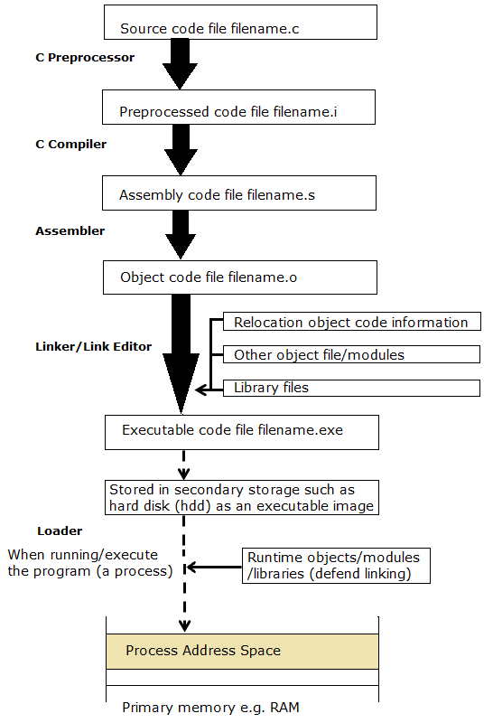
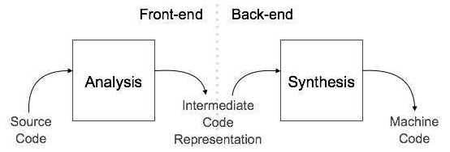
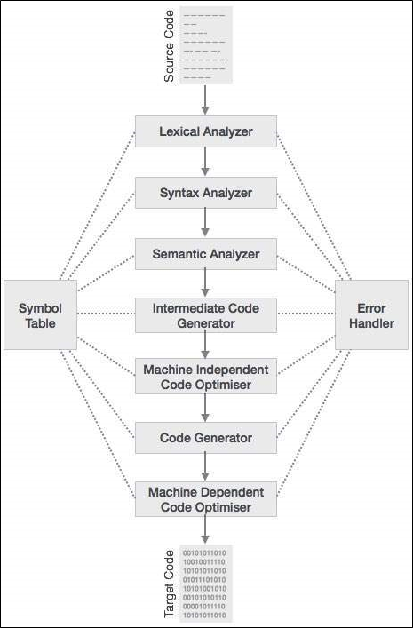
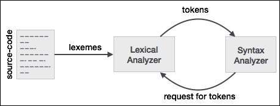

.. contents:: Table of Contents

Compilation and Linking Process
===================

https://www.geeksforgeeks.org/compiling-a-c-program-behind-the-scenes/

Basic four phases of the process includes:

#. Pre-processing
#. Compilation
#. Assembly
#. Linking

By executing below command, We get the all intermediate files in the current directory along with the executable

::

	$gcc –Wall –save-temps filename.c –o filename 

filename.c	filename.i	filename.s	filename.o	filename

Pre-processing
---------

This phase include:

- Removal of Comments
- Expansion of Macros
- Expansion of the included files
- Conditional compilation

The preprocessed output is stored in the filename.i

This file is filled with lots and lots of info, but at the end our code is preserved.

**Analysis**

- Macros have expanded
- Comments are stripped off
- Header files have been expanded and included in our source file

Compilation
------

This steps compile filename.i and produce an; intermediate compiled output file filename.s. This file is in assembly level instructions, which assembler can understand.

 
Figure 1 Compilation Process and Running Executable

Assembly
------

In this phase the filename.s is taken as input and turned into filename.o by assembler. This file contains machine level instructions. 

At this phase, only existing code is converted into machine language, the function calls like printf() are not resolved.

Linking
-----

This is the final phase in which all the linking of function calls with their definitions are done. Linker knows where all these functions are implemented. Linker does some extra work also, it adds some extra code to our program which is required when the program starts and ends.

Sizes of an executable file increases from an object file to an executable file. This is because of the extra code that linker adds with our program.

GCC by default does dynamic linking, so printf() is dynamically linked in above program.

Compilation Phases in Detail
-------------------

Copied from https://www.tutorialspoint.com/compiler_design/index.htm

Check above link for more detail.

Broadly two major phases divided into multiple parts:

1. Analysis Phase

   I. Lexical Analysis

   II. Syntax Analysis

   III. Semantic Analysis

   IV. Intermediate Code Generation

2. Synthesis Phase

   V. Code Optimization

   VI. Code Generation

1. Analysis Phase
^^^^^^^^^^

The compiler reads the source program, divides it into core parts and then checks for lexical, grammar and syntax errors.The analysis phase generates an intermediate representation of the source program and symbol table, which should be fed to the Synthesis phase as input.

2. Synthesis Phase
^^^^^^^^^

Generates the target program with the help of intermediate source code representation and symbol table

A compiler can have many phases and passes:

**Pass:** A pass refers to the traversal of a compiler through the entire program.
**Phase:** A phase of a compiler is a distinguishable stage, which takes input from the previous stage, processes and yields output that can be used as input for the next stage. A pass can have more than one phase.

 

1. Analysis Phase
----------------

I. Lexical Analysis
^^^^^^^^^^^^

It takes the modified source code from language preprocessors that are written in the form of sentences. The lexical analyzer breaks these syntaxes into a series of tokens, by removing any whitespace or comments in the source code.

If the lexical analyzer finds a token invalid, it generates an error. The lexical analyzer works closely with the syntax analyzer.

 
**Longest Match Rule**

When the lexical analyzer read the source-code, it scans the code letter by letter; and when it encounters a whitespace, operator symbol, or special symbols, it decides that a word is completed.

For example

::

        int intvalue;

While scanning both lexemes till ‘int’, the lexical analyzer cannot determine whether it is a keyword int or the initials of identifier int value.

The Longest Match Rule states that the lexeme scanned should be determined based on the longest match among all the tokens available.

The lexical analyzer also follows rule priority where a reserved word, e.g., a keyword, of a language is given priority over user input. That is, if the lexical analyzer finds a lexeme that matches with any existing reserved word, it should generate an error.

II. Syntax Analysis
^^^^^^^^^^

This phase uses context-free grammar (CFG), which is recognized by push-down automata.

A syntax analyzer or parser analyzes the source code (token stream) against the production rules to detect any errors in the code. The output of this phase is a parse tree.

This way, the parser accomplishes two tasks, i.e., parsing the code, looking for errors and generating a parse tree as the output of the phase.

Parsers are expected to parse the whole code even if some errors exist in the program. Parsers use error recovering strategies, which we will learn later in this chapter.

**Limitations of Syntax Analyzers**

- It cannot determine if a token is valid,
- It cannot determine if a token is declared before it is being used,
- It cannot determine if a token is initialized before it is being used,
- It cannot determine if an operation performed on a token type is valid or not.

III. Semantic Analysis
^^^^^^^^^^^

Semantics of a language provide meaning to its constructs, like tokens and syntax structure. Semantics help interpret symbols, their types, and their relations with each other. Semantic analysis judges whether the syntax structure constructed in the source program derives any meaning or not.

::

        CFG + semantic rules = Syntax Directed Definitions

For example

::

        int a = “value”;

should not issue an error in lexical and syntax analysis phase, as it is lexically and structurally correct, but it should generate a semantic error as the type of the assignment differs.

**Semantic Errors**

- Type mismatch
- Undeclared variable
- Reserved identifier misuse
- Multiple declaration of variable in a scope
- Accessing an out of scope variable
- Actual and formal parameter mismatch

IV. Intermediate Code Generation
^^^^^^^^^^

**Why we need to translate the source code into an intermediate code?**

- If a compiler translates the source language to its target machine language without having the option for generating intermediate code, then for each new machine, a full native compiler is required.
- Intermediate code eliminates the need of a new full compiler for every unique machine by keeping the analysis portion same for all the compilers.
- The second part of compiler, synthesis, is changed according to the target machine.
- It becomes easier to apply the source code modifications to improve code performance by applying code optimization techniques on the intermediate code.

2. Synthesis Phase
-----------

V. Code Optimization
^^^^^^^^^^^^

Optimization tries to improve the code by making it consume less resources (i.e. CPU, Memory) and deliver high speed.

In optimization, high-level general programming constructs are replaced by very efficient low-level programming codes. A code optimizing process must follow the three rules given below:

- The output code must not, in any way, change the meaning of the program.
- Optimization should increase the speed of the program and if possible, the program should demand less number of resources.
- Optimization should itself be fast and should not delay the overall compiling process.

Efforts for an optimized code can be made at various levels of compiling the process.

- At the beginning, users can change/rearrange the code or use better algorithms to write the code.
- After generating intermediate code, the compiler can modify the intermediate code by address calculations and improving loops.
- While producing the target machine code, the compiler can make use of memory hierarchy and CPU registers.

Optimization can be categorized broadly into two:

- Machine independent optimization
- Machine dependent optimization

Machine independent optimization
~~~~~~~~~~~~~

In this optimization, the compiler takes in the intermediate code and transforms a part of the code that does not involve any CPU registers and/or absolute memory locations.

For example

.. list-table::
    :header-rows: 1

        *       -       Example code
                -       Improved code

        *       -       
                        .. code:: cpp

                                do {
                                   item = 10;
                                   value = value + item; 
                                } while(value<100);

                        
                -       
                        .. code:: cpp

                                Item = 10;
                                do {
                                   value = value + item; 
                                } while(value<100);

Example code involves repeated assignment of the identifier item

Improved code should not only save the CPU cycles, but can be used on any processor

Machine dependent optimization
~~~~~~~~~~~~~~~~

Machine-dependent optimization is done after the target code has been generated and when the code is transformed according to the target machine architecture. 

It involves CPU registers and may have absolute memory references rather than relative references. 

Machine-dependent optimizers put efforts to take maximum advantage of memory hierarchy.

VI. Code Generation
^^^^^^^^^^^^^

Code generation can be considered as the final phase of compilation. Through post code generation, optimization process can be applied on the code, but that can be seen as a part of code generation phase itself. The code generated by the compiler is an object code of some lower-level programming language, for example, assembly language. 

We have seen that the source code written in a higher-level language is transformed into a lower-level language that results in a lower-level object code, which should have the following minimum properties:

- It should carry the exact meaning of the source code
- It should be efficient in terms of CPU usage and memory management

Symbol Table
---------

For detail check

| https://www.tutorialspoint.com/compiler_design/compiler_design_symbol_table.htm
| https://www.geeksforgeeks.org/symbol-table-compiler/

References
--------

https://www.tutorialspoint.com/compiler_design

