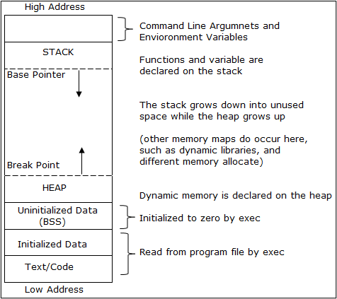

.. contents:: Table of Contents

Memory Layout of C program
==========================

A typical memory representation of C program consists of following sections:
1. Text or Code Segment
2. Initialized Data Segments
3. Uninitialized Data Segments
4. Stack Segment
5. Heap Segment

1. Text or Code Segment
-----------------------

The sections of a program in an object file or in memory, which contains executable instructions

As a memory region, a text segment may be placed below the heap or stack in order to prevent heaps and stack overflows from overwriting it

Usually, the text segment is sharable so that only a single copy needs to be in memory for frequently executed programs, such as text editors, the C compiler, the shells, and so on

It is often read-only, to prevent a program from accidentally modifying its instructions

2. Initialized Data Segments
----------------------------

A data segment is a portion of virtual address space of a program, which contains the global variables and static variables that are initialized by the programmer.

It is not read-only, since the values of the variables can be altered at run time.

classified into 
- initialized read-only area
- initialized read-write area

In C global variables like char s[] = "hello world" and int debug = 1 would be stored in initialized read-write area.

const char * str = "hello world"  makes the string literal “hello world” to be stored in initialized read-only area and the character pointer variable string in initialized read-write area.

Ex: static int i = 10 will be stored in data segment and global int i = 10 will also be stored in data segment

3. Uninitialized Data Segments
------------------------------

Also called BSS segment **BSS(Block Started by Symbol)**

Data in this segment is initialized by the kernel to arithmetic 0 before the program starts executing

It contains all global variables and static variables that are initialized to zero or do not have explicit initialization in source code

For example: static int i; and global int j;

4. Stack Segment
----------------

The stack area traditionally adjoined the heap area and grew the opposite direction; when the stack pointer met the heap pointer, free memory was exhausted. (With modern large address spaces and virtual memory techniques they may be placed almost anywhere, but they still typically grow opposite directions.)

The stack area contains the program stack, a LIFO structure, typically located in the higher parts of memory.

A “stack pointer” register tracks the top of the stack; it is adjusted each time a value is “pushed” onto the stack. The set of values pushed for one function call is termed a “stack frame”; A stack frame consists at minimum of a return address.

Stack, where automatic variables are stored, along with information that is saved each time a function is called. 

Each time a function is called, the address of where to return to and certain information about the caller’s environment, such as some of the machine registers, are saved on the stack. The newly called function then allocates room on the stack for its automatic and temporary variables. 

This is how recursive functions in C can work. Each time a recursive function calls itself, a new stack frame is used, so one set of variables doesn’t interfere with the variables from another instance of the function.

5. Heap Segment
---------------

Heap is the segment where dynamic memory allocation usually takes place.

The Heap area is managed by malloc, realloc, and free, which may use the brk and sbrk system calls to adjust its size (note that the use of brk/sbrk and a single “heap area” is not required to fulfill the contract of malloc/realloc/free; they may also be implemented using mmap to reserve potentially non-contiguous regions of virtual memory into the process’ virtual address space). 

The Heap area is shared by all shared libraries and dynamically loaded modules in a process.

`Check this for memory layout of a binary <memory_layout>`_

References
----------

| https://www.scaler.com/topics/c/memory-layout-in-c/
| https://www.geeksforgeeks.org/memory-layout-of-c-program/

