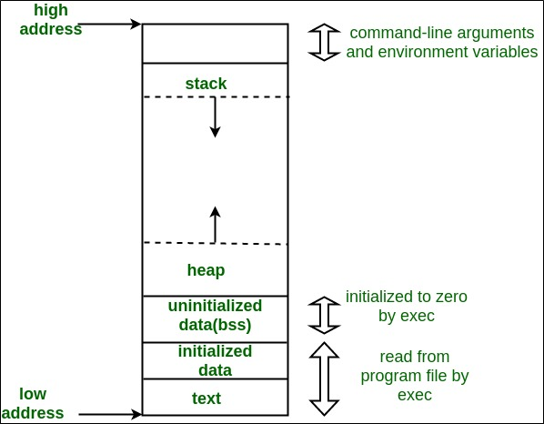

.. contents:: Table of Contents

Memory Management
===================

Memory Layout of C Programs
---------------------------

#. Text segment
#. Data segment
	- Initialized data segment
	- Uninitialized data segment
#. Stack
#. Heap

C functions for memory management
----------------------------------

.. code:: cpp

	void* malloc (size_t size);
	void* calloc (size_t num, size_t size);

	void* realloc (void* ptr, size_t size);

	void free (void* ptr);

	void *aligned_alloc( size_t alignment, size_t size );		// C11

C++ operators
-------------

new
^^^^

.. list-table::

	*	-	throwing (1)
		-	void* operator new (std::size_t size) throw (std::bad_alloc);

	*	-	nothrow (2)
		-	void* operator new (std::size_t size, const std::nothrow_t& nothrow_value) throw();

	*	-	placement (3)
		-	void* operator new (std::size_t size, void* ptr) throw();

.. list-table::

	*	-	throwing (1)
		-	void* operator new (std::size_t size);

	*	-	nothrow (2)
		-	void* operator new (std::size_t size, const std::nothrow_t& nothrow_value) noexcept;

	*	-	placement (3)
		-	void* operator new (std::size_t size, void* ptr) noexcept;

delete
^^^^^^^^

.. list-table::

	*	-	ordinary (1)
		-	void operator delete (void* ptr) throw();

	*	-	nothrow (2)
		-	void operator delete (void* ptr, const std::nothrow_t& nothrow_constant) throw();

	*	-	placement (3)
		-	void operator delete (void* ptr, void* voidptr2) throw();

.. list-table::

	*	-	ordinary (1)
		-	void operator delete (void* ptr) noexcept;

	*	-	nothrow (2)
		-	void operator delete (void* ptr, const std::nothrow_t& nothrow_constant) noexcept;

	*	-	placement (3)
		-	void operator delete (void* ptr, void* voidptr2) noexcept;

.. list-table::

	*	-	ordinary (1)
		-	void operator delete (void* ptr) noexcept;

	*	-	nothrow (2)
		-	void operator delete (void* ptr, const std::nothrow_t& nothrow_constant) noexcept;

	*	-	placement (3)
		-	void operator delete (void* ptr, void* voidptr2) noexcept;

	*	-	with size (4)
		-	void operator delete (void* ptr, std::size_t size) noexcept;

	*	-	nothrow with size (5)
		-	void operator delete (void* ptr, std::size_t size, const std::nothrow_t& nothrow_constant) noexcept;

malloc() versus calloc()
-------------------------

.. list-table::

	*	-	malloc()
		-	calloc()

	*	-	allocate memory dynamically
		-	allocate memory dynamically

	*	-	Takes 1 argument
		-	Takes 2 argument

	*	-	void * malloc(size_t size);
		-	void * calloc(size_t num, size_t size);

	*	-	allocates memory block of given size (in bytes)
		-	allocates memory block of num * size (in bytes)

	*	-	returns a pointer to the beginning of the block	
		-	returns a pointer to the beginning of the block

	*	-	doesn’t initialize the allocated memory
		-	initializes the allocates memory block to zero

	*	-	If we try to access the content of memory block then we’ll get garbage values
		-	If we try to access the content of these blocks then we’ll get 0

**NOTE**

It would be better to use malloc over calloc, unless we want the zero-initialization because malloc is faster than calloc. So if we just want to copy some stuff or do something that doesn’t require filling of the blocks with zeros, then malloc would be a better choice.

realloc()
----------

Size of dynamically allocated memory can be changed by using realloc().

.. code:: cpp

	void *realloc(void *ptr, size_t size);

Realloc deallocates the old object pointed to by ptr and returns a pointer to a new object that has the size specified by size. 

The content of the new object is identical to that of the old object prior to deallocation, up to the lesser of the new and old sizes. Any bytes in the new object beyond the size of the old object have indeterminate values.

.. code:: cpp

	int *ptr = (int *)malloc(sizeof(int)*2);
	int *ptr_new;
	ptr_new = (int *)realloc(ptr, sizeof(int)*3);

*The point to note is that realloc() should only be used for dynamically allocated memory. If the memory is not dynamically allocated, then behaviour is undefined.*

.. code:: cpp

	int arr[2];
	int *ptr_new;
	int *ptr = arr;
	ptr_new = (int *)realloc(ptr, sizeof(int)*3); // incorrect use of new_ptr: undefined behaviour

.. note::

	If size is zero, the memory previously allocated at ptr is deallocated as if a call to free was made, and a null pointer is returned.	//C90 (C++98)

	If size is zero, the return value depends on the particular library implementation: it may either be a null pointer or some other location that shall not be dereferenced.	// C99/C11 (C++11)

 
How to deallocate memory without using free() in C?
-----------------------------------------------------

Standard library function realloc() can be used to deallocate previously allocated memory. Below is function declaration of “realloc()” from “stdlib.h”

- If “size” is zero, then call to realloc is equivalent to “free(ptr)” //C90 (C++98)
- if “ptr” is NULL and size is non-zero then call to realloc is equivalent to “malloc(size)”
  .. code :: cpp

        int *ptr = (int*) malloc(10);
        realloc(ptr, 0);

How does free() know the size of memory to be deallocated?
------------------------------------------------------------

.. code:: cpp

        void free (void* ptr);

Note that the free function does not accept size as a parameter. 

When memory allocation is done, the actual heap space allocated is one word larger than the requested memory. The extra word is used to store the size of the allocation and is later used by free().

What is Memory Leak? How can we avoid?
------------

Memory leak occurs when programmers create a memory in heap and forget to delete it.

Memory leaks are particularly serious issues for programs like daemons and servers which by definition never terminate.

To avoid memory leaks, memory allocated on heap should always be freed when no longer needed.

memory leak

.. code:: cpp

        int *ptr = (int *) malloc(sizeof(int));

no memory leak 

.. code:: cpp

        int *ptr = (int *) malloc(sizeof(int));
        free(ptr);
        ptr = NULL;	// to avoid dangling pointer

new operator
--------

The new operator denotes a request for memory allocation on the Heap. If sufficient memory is available, new operator initializes the memory and returns the address of the newly allocated and initialized memory to the pointer variable.

Syntax
^^^^^^
**pointer-variable = new data-type;**

Here, pointer-variable is the pointer of type data-type. Data-type could be any built-in data type including array or any user defined data types including structure and class.

Initialize memory
^^^^^^^^^^^^^^^^

**pointer-variable = new data-type(value);**

Example

.. code:: cpp

        int *p = new int(25);
        float *q = new float(75.25);

Allocate block of memory
^^^^^^^^^^^^^^^^^^^^^^

new operator is also used to allocate a block(an array) of memory of type data-type.

**pointer-variable = new data-type[size];**

where size(a variable) specifies the number of elements in an array.

Example

.. code:: cpp

        int *p = new int[10];

Dynamically allocates memory for 10 integers continuously of type int and returns pointer to the first element of the sequence, which is assigned to p(a pointer). p[0] refers to first element, p[1] refers to second element and so on.

What if enough memory is not available during runtime?
^^^^^^^^^^^^^^^

If enough memory is not available in the heap to allocate, the new request indicates failure by throwing an exception of type std::bad_alloc and new operator returns a pointer. Therefore, it may be good idea to check for the pointer variable produced by new before using it program.

.. code:: cpp

        int *p = new int;
        if (!p) {   cout << "Memory allocation failed\n"; }

Exception handling of new operator
^^^^^^^^^^^^

When new operator request for the memory then if there is a free memory is available then it returns valid address either it throws bad_alloc exception.

.. code:: cpp

        int *piValue = NULL;
        try {
                piValue = new int[9999999999999]; // allocate huge amount of memory
        }
        catch(...) {
                cout<<"Free memory is not available"<<endl;
                return -1;
        }

nothrow
~~~~~~~~~

To avoid the exception throw we can use “nothrow” with the new operator. When we are used “nothrow” with new operator then it returns a valid address if it is available either return 0 (NULL).

.. code:: cpp

        #include <new>	// include new for nothrow for new
        int *piValue = NULL;
        piValue = new(nothrow) int[999999999999999]; // We are using nothrow here.

        if(piValue == NULL) {
                cout<<"Free memory is not available"<<endl;
        }
        else {
                cout<<"Free memory available"<<endl;
                delete []piValue;
        }

delete operator
------------

It is programmer’s responsibility to deallocate dynamically allocated memory using delete

Syntax
^^^^^^^

.. code:: cpp

        data_t pointer-variable = new data_t;
        delete pointer-variable;

pointer-variable is the pointer that points to the data object created by new

To free the dynamically allocated array pointed by pointer-variable, use following form of delete:

.. code:: cpp

        delete[] pointer-variable;

new vs malloc
-------------

================================        ===========================
new	                                malloc
================================        ===========================
calls constructor                       does not calls constructors
It is an operator                       It is a function
Returns exact data type                 Returns void *
on failure, Throws                      On failure, returns NULL
Memory allocated from free store	Memory allocated from heap
can be overridden                       cannot be overridden
size is calculated by compiler          size is calculated manually
================================        ===========================

delete vs free
-------------

===========================     ===============================
Delete                          free
===========================     ===============================
is an operator                  is a library function
calls destructor                does not call destructor
Returns exact data type         Returns void *
on failure, Throws              On failure, returns NULL
===========================     ===============================

std::get_temporary_buffer in C++
-------------

Get a block of temporary memory. In C++ STL library, there is a function get_temporary_buffer which is mostly used to get a temporary block.

This function takes a size n and return the largest available buffer up to size n which can be fit into physical memory.

This function is used to get a memory of temporary nature mostly used for the operation of an algorithm as some algorithms required extra space to perform correctly.

Once the the memory block which is assigned is not needed anymore it shall be released by calling **return_temporary_buffer**.

get_temporary_buffer
^^^^^^^^^^^^^^

.. code:: cpp

        template <class T>
        pair <T*, ptrdiff_t> get_temporary_buffer ( ptrdiff_t n );	        // C++ 98
        pair <T*, ptrdiff_t> get_temporary_buffer ( ptrdiff_t n ) noexcept;     // C++ 11

Get block of temporary memory: Requests a temporary block of storage to contain up to n elements of type T temporarily.

n	Number of elements of type T for which temporary memory is requested. ptrdiff_t is an integral type.

return_temporary_buffer
^^^^^^^^^^^

.. code:: cpp

        template <class T>
        void return_temporary_buffer (T* p);

Return block of temporary memory: Releases the memory block pointed by p.

p	Pointer to a block of temporary memory returned by a previous call to get_temporary_buffer.

References
-------

| https://www.geeksforgeeks.org/c-plus-plus/#Dynamic%20memory%20allocation
| https://en.cppreference.com/w/cpp/memory
| https://www.learncpp.com/cpp-tutorial/dynamic-memory-allocation-with-new-and-delete/

