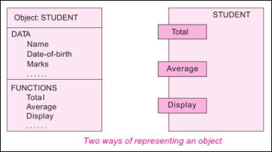
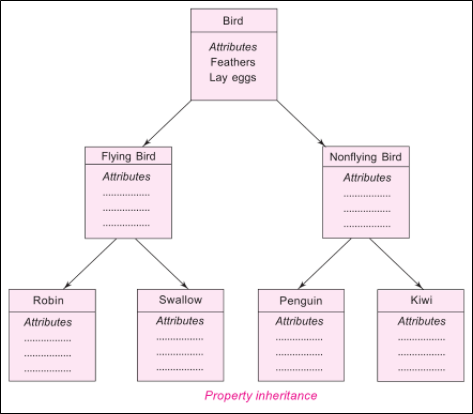
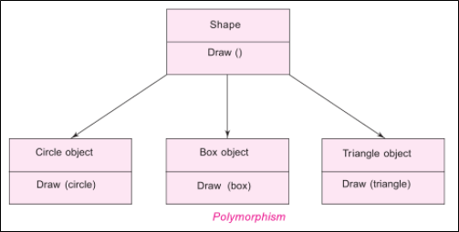
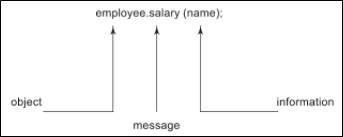

.. contents:: Table of Contents

C++ - OOP
========

What is OOP?
-----------

Object-oriented programming (OOP) is a programming paradigm based on the concept of "objects", which may contain data, in the form of fields, often known as attributes; and code, in the form of procedures, often known as methods.

In OOP, computer programs are designed by making them out of objects that interact with one another. There is significant diversity of OOP languages, but the most popular ones are class-based, meaning that objects are instances of classes, which typically also determine their type.

Significant object-oriented languages include Java, C++, C#, Python, PHP, Ruby, Perl, Object Pascal, Objective-C, Dart, Swift, Scala, Common Lisp, and Smalltalk.

**Object-oriented programming is an approach that provides a way of modularizing programs by creating partitioned memory area for both data and functions that can be used as templates for creating copies of such modules on demand.**

Features of object-oriented programming are

#. Emphasis is on data rather than procedure
#. Programs are divided into what are known as objects
#. Data structures are designed such that they characterize the objects
#. Functions that operate on the data of an object are tied together in the data structure
#. Data is hidden and cannot be accessed by external function
#. Objects may communicate with each other through functions
#. New data and functions can be easily added whenever necessary
#. Follows bottom-up approach in program design

OOP concepts include

#. Objects
#. Classes
#. Data abstraction and encapsulation
#. Inheritance
#. Polymorphism
#. Dynamic binding
#. Message Passing

1. Objects
---------

#. Objects are basic run-time entities in an object oriented system
#. Objects are instances of a class these are defined user defined data types
#. Object take up space in memory and have an associated address like a record in Pascal or structure or union in C
#. When a program is executed the objects interact by sending messages to one another
#. Each object contains data and code to manipulate the data
#. Objects can interact without having to know details of each other’s data or code, it is sufficient to know the type of message accepted and type of response returned by the objects

.. code:: cpp

	class person {
		char name[20];
		int id;

		public:
		void getdetails(){}
	};
	int main() {
		person p1; //p1 is a object 
	}

 
2. Classes
--------

#. Class is a blueprint of data and functions or methods
#. Class does not take any space
#. Class is a user defined data type like structures and unions in C
#. By default class variables are private but in case of structure it is public
#. Classes are user defined data type and behave like the built-in types of a programming language

Syntax for class

.. code:: cpp

	class class_name {
		private:
		//data members and member functions declarations

		public:
		//data members and member functions declarations

		protected:
		//data members and member functions declarations
	};

In above example person is a class

3. Data abstraction and encapsulation
------------------

**Encapsulation:** Wrapping up (combing) of data and functions into a single unit is known as encapsulation. 

The data is not accessible to the outside world and only those functions which are wrapping in the class can access it. This insulation of the data from direct access by the program is called data hiding or information hiding.

**Abstraction:** Data abstraction refers to, providing only needed information to the outside world and hiding implementation details. 

The attributes are sometimes called **data members** because they hold information. The functions that operate on these data are sometimes called **methods or member functions**.

For example, consider a class Complex with public functions as getReal() and getImag(). We may implement the class as an array of size 2 or as two variables. The advantage of abstractions is, we can change implementation at any point, users of Complex class wont’t be affected as out method interface remains same. Had our implementation be public, we would not have been able to change it.

.. note::

	Abstract Data Types (ADT): Since the classes use the concept of data abstraction, they are known as Abstract Data Types (ADT).

4. Inheritance
-----------

#. Inheritance is the process by which objects of one class acquire the properties of objects of another class. 
#. It supports the concept of hierarchical classification. 
#. Inheritance provides reusability. 
#. This means that we can add additional features to an existing class without modifying it.

 
5. Polymorphism
------------

Polymorphism means ability to take more than one form. An operation may exhibit different behaviours in different instances. The behaviour depends upon the types of data used in the operation. 

C++ supports operator overloading and function overloading. 

Operator overloading is the process of making an operator to exhibit different behaviours in different instances is known as operator overloading. 

Function overloading is using a single function name to perform different types of tasks. Polymorphism is extensively used in implementing inheritance.

 
6. Dynamic binding
----------

#. In dynamic binding, the code to be executed in response to function call is decided at runtime. 
#. It is associated with polymorphism and inheritance. 
#. C++ has virtual functions to support this.

7. Message Passing
-------------

Objects communicate with one another by sending and receiving information to each other. 

A message for an object is a request for execution of a procedure and therefore will invoke a function in the receiving object that generates the desired results.

Message passing involves specifying the name of the object, the name of the function and the information to be sent.

Objects have a life cycle. They can be created and destroyed.

Communication with an object is feasible as long as it is alive.

Benefits of OOP
-----------

#. Through inheritance, we can eliminate redundant code extend the use of existing Classes.
#. We can build programs from the standard working modules that communicate with one another, rather than having to start writing the code from scratch. This leads to saving of development time and higher productivity.
#. The principle of data hiding helps the programmer to build secure program that cannot be invaded by code in other parts of a programs.
#. It is possible to have multiple instances of an object to co-exist without any interference.
#. It is possible to map object in the problem domain to those in the program.
#. It is easy to partition the work in a project based on objects.
#. The data-centred design approach enables us to capture more detail of a model can implemental form.
#. Object-oriented system can be easily upgraded from small to large system.
#. Message passing techniques for communication between objects makes to interface descriptions with external systems much simpler.
#. Software complexity can be easily managed.

References
--------

| https://www.geeksforgeeks.org/object-oriented-programming-in-cpp/
| https://www.learncpp.com/cpp-tutorial/welcome-to-object-oriented-programming/

