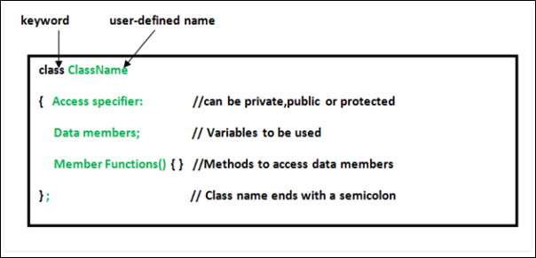
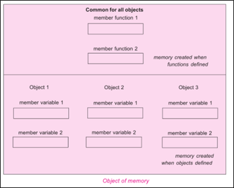

.. contents:: Table of Contents

Classes and Objects
=============

Class
-----

It is a user defined data type, which holds its own data members and member functions, which can be accessed and used by creating an instance of that class. A class is like a blueprint for an object.

An Object is an instance of a Class. When a class is defined, no memory is allocated** but when it is instantiated (i.e. an object is created) memory is allocated. This statement is only partly true, for more info check `Memory allocation for objects`_

Defining Class
------------

A class is defined in C++ using keyword "class" followed by the name of class. The body of class is defined inside the curly brackets and terminated by a semicolon at the end.

.. note::

	- The reason for semi-colons at end of class is compiler checks if user is trying to create an instance of class at the end of it.

 
Declaring Objects
-----------

When a class is defined, only the specification for the object is defined; no memory or storage is allocated. To use the data and access functions defined in the class, you need to create objects.

Syntax

.. code:: cpp

	ClassName object_name;

Accessing data members and member functions
-------------------

The Public data members and member functions of class can be accessed using the dot(‘.’) operator with the object. Like

.. code:: cpp

	object_name.memberFunctionName();
	object_name.data_memeber;

Private and Protected members cannot be accessed.

Access modifiers in C++ give this access control.

There are three access modifiers: public, private and protected.

.. code:: cpp

    // C++ program to demonstrate accessing of data members
    #include <iostream>
    using namespace std;
    class Student {
        string private_name;
        
        public:                 // Access specifier
        string name;            // Data Members
        void printName() {      // Member Functions()
            cout << "Name is: " << name << '\n';
        }
    };
    int main() {
        Student sobj;               // Declare an object of class Student
        sobj.name = "Learning C++"; // accessing data member
        sobj.printName();           // accessing member function
        
        //sobj.private_name = "Accessing private member is not allowed";
        //CE: 'std::string Student::private_name' is private within this context
        return 0;
    }

Output::

    Name is: Learning C++

Member Functions in Classes
------------

There are 2 ways to define a member function

#. Inside class definition
#. Outside class definition

To define a member function outside the class definition we have to use the scope resolution :: operator along with class name and function name.

.. code:: cpp

    // C++ program to demonstrate function declaration outside class
    #include <iostream>
    using namespace std;
    class Student {
        public:
        string name;
        int id;
        void displayInside() {
            std::clog << "Name is " << name << ", Id is " << id << '\n';
        }
        void displayOutside();
    };
    
    // Definition of member funciton outside class using scope resolution operator ::
    void Student::displayOutside() {
        std::clog << "Name is " << name << ", Id is " << id << '\n';
    }
    
    int main() {
        Student sobj;
        sobj.name = "C++";
        sobj.id = 98;
        
        sobj.displayInside();
        sobj.displayOutside();
        return 0;
    }

Output::

    Name is C++, Id is 98
    Name is C++, Id is 98

All the member functions defined inside the class definition are by default inline, but you can also make any non-class function inline by using keyword inline with them. Inline functions are actual functions, which are copied everywhere during compilation, like pre-processor macro, so the overhead of function calling is reduced.

Declaring a friend function is a way to give private access to a non-member function.

Const member functions in C++
-----------------

A function becomes const when const keyword is used in function’s declaration and definition.

The idea of const functions is to not allow them to modify the object on which they are called. 

It is recommended practice to make as many functions const as possible so that accidental changes to objects are avoided.

**A const object can call only const member functions.**

.. code:: cpp

    #include <iostream>
    using namespace std;
    
    class Test  {
        int value;
        public:
        Test(int v = 0) { value = v; }  // constructor
        // We get compiler error if we add a line like "value = 100;" in this function.
        int constfun() const {
            //value = 50; // error: assignment of member 'Test::value' in read-only object
            return value;
        }
        int fun() {
            value = 30;
            return value;
        }
    };
    
    int main()  {
        Test non_const_obj(20);
        cout << non_const_obj.constfun() << '\n';
        cout << non_const_obj.fun() << '\n';
        cout << '\n';
        
        const Test const_obj(70);
        cout << const_obj.constfun() << '\n';
        //cout << const_obj.fun() << '\n'; // error: passing 'const Test' as 'this' argument discards qualifiers
        return 0;
    }

Output::

    20
    30

    70

Constructors
----------

Constructors are special class members which are called by the compiler every time an object of that class is instantiated. Constructors have the same name as the class and may be defined inside or outside the class definition.

Types of constructors

#. Default constructor
#. Parametrized constructor
#. Copy constructor
#. Move constructor

Syntax

.. code:: cpp

    ClassName()					{ }         // default constructor
    ClassName(parameters)			{ }     // parameterized constructor
    ClassName(const ClassName & other)	{ } // copy constructor
    ClassName(ClassName && other)	{ }     // move constructor

For more detail check `Constructor and Destructor <04_CPP_OOP_Constructor_Destructor.rst>`_

Destructor
-----

Destructor is another special member function that is called by the compiler when the scope of the object ends.

.. code:: cpp

    // C++ program to demonstrate constructors and destructor
    #include <iostream>
    using namespace std;
    class Student {
    
        public:
        int id;
        ~Student() {
            cout << "Destruct Student id " << id << '\n';
        }
        Student() : id{0} {         // Default Constructor
            cout << "Default Constructor\n";
        }
        Student(int x) : id{x} {    // Parametrized Constructor
            cout << "Parametrized Constructor\n";
        }
        Student(const Student & other) {    // Copy Constructor
            cout << "Copy Constructor\n";
            id = other.id;
        }
        Student(Student && other) {    // Move Constructor
            cout << "Move Constructor\n";
            id = std::move(other.id);
        }
        void display() {
            cout << "Student id " << id << '\n';
        }
    };
    
    int main() {
    
        int i = 0;
        while (i < 3) {
            Student student;
            student.id = i;
            i++;
        } // Scope for student ends here
        
        Student student0;	// student0 will call Default Constructor
        student0.display();
        
        Student student1(1);	// student1 will call Parametrized Constructor
        student1.display();
        
        {
            Student student1_copy(student1); // student1_copy will call copy constructor
            student1_copy.display();
            
            Student student_moved(std::move(student1_copy)); // student_moved will call move 
            student_moved.display();
        }   // student_moved scope ends
        
        cout << "After this clean up will take place for other\n";
        return 0;
    } // Scope for student0, student1 ends here

Output::

    Default Constructor
    Destruct Student id 0
    Default Constructor
    Destruct Student id 1
    Default Constructor
    Destruct Student id 2
    Default Constructor
    Student id 0
    Parametrized Constructor
    Student id 1
    Copy Constructor
    Student id 1
    Move Constructor
    Student id 1
    Destruct Student id 1
    Destruct Student id 1
    After this clean up will take place for other
    Destruct Student id 1
    Destruct Student id 0

Memory allocation for objects
-----------

When a class is defined, no memory is allocated but when it is instantiated (i.e. an object is created) memory is allocated. This statement is only partially true.

Actually, the member functions are created and placed in the memory space only once when they are defined in class specification. Since all the objects belonging to that class use the same member functions, no separate space is allocated for member functions when the objects are created. Only space for member variable is allocated separately for each object because member variable holds different value for different objects.

 
Size of an empty class
----------

**Why is the size of an empty class not zero in C++?**

Size of an empty class is not 0. It is 1 byte generally. 

It is nonzero to ensure that the two different objects will have different addresses.

For the same reason (different objects should have different addresses), “new” always returns pointers to distinct objects.

.. code:: cpp

    #include <iostream>
    using namespace std;
    class Empty { };
    class Derived: Empty { int a; };
    class DerivedEmpty: Empty { };
    
    int main() {
        Empty a, b;
        cout << "size of Empty : " << sizeof(Empty) << '\n';
        cout << "size of DerivedEmpty : " << sizeof(DerivedEmpty) << '\n';
        cout << "size of Derived : " << sizeof(Derived) << '\n';
        if (&a == &b)
            cout << "impossible " << '\n';
        else
            cout << "Fine " << '\n';
        return 0;
    }

Output::

    size of Empty : 1
    size of DerivedEmpty : 1
    size of Derived : 4
    Fine

size of Derived is 4 because

There is an interesting rule that says that an empty base class need not be represented by a separate byte. 

So compilers are free to make optimization in case of empty base classes.

Class object of Self type 
----------

*8Can a C++ class have an object of self type?**

A class declaration cannot have a non-static object of self type. **Although a class declaration can contain static object of self type and pointer to self type.**

If a non-static object is member then declaration of class is incomplete and compiler has no way to find out size of the objects of the class.

Static variables do not contribute to the size of objects. So no problem in calculating size with static variables of self type.

For a compiler, all pointers have a fixed size irrespective of the data type they are pointing to, so no problem with this also.

.. code:: cpp

    #include <iostream>
    using namespace std;
    class Test {
        static Test self;
        Test *ptr;
        //Test obj; // error: field 'obj' has incomplete type 'Test'
    };
    int main() {
        Test T;
        cout << "sizeof(Test) " << sizeof(Test) << '\n';
        return 0;
    }

Output::

    sizeof(Test) 8

Structure vs class in C++
-----------

In C++, a structure is same as class except the following differences

#. Members of a class are private by default and members of struct are public by default.
#. When deriving a struct from a class/struct, default access-specifier for a base class/struct is public. And when deriving a class, default access specifier is private.

Local Classes in C++
-----------

facts about local classes.

#. A local class type name can only be used in the enclosing function.
#. All the methods of Local classes must be defined inside the class only.
#. Member methods of local class can only access static and enum variables of the enclosing function. Non-static variables of the enclosing function are not accessible inside local classes.
#. Local classes can access global types, variables and functions. Also, local classes can access other local classes of same function. Global variables should be used with the scope operator (::).
#. Local class cannot use automatic local variables.

Restrictions:

#. A Local class cannot contain static data members. It may contain static functions though.
#. Enclosing function cannot access the private members of a local class. Although, we can achieve this by declaring the enclosing function as a friend.

Nested Classes in C++
-------------

A nested class is a class which is declared in another enclosing class.

A nested class is a member and as such has the same access rights as any other member.

The members of an enclosing class have no special access to members of a nested class; the usual access rules shall be obeyed.

A nested object is created in two stages

#. The member objects are created using their respective constructors
#. Then , the other members are created

It means, constructor of all the member objects should be called before its own constructor body is executed.

.. code:: cpp

    #include <iostream>
    using namespace std;
    
    class Enclosing {
        int x;
        
        class Nested {
            int y;
            void NestedFun(Enclosing *e) {
                cout<<e->x; // works fine: nested class can access private members of Enclosing class
            }
        }; // declaration Nested class ends here
        
        void EnclosingFun(Nested *n) {
            // cout<<n->y; // error: 'int Enclosing::Nested::y' is private
                // error: within this context
        }
    }; // declaration Enclosing class ends here
    
    int main() {
        return 0;
    }

References
------

| https://www.geeksforgeeks.org/c-classes-and-objects/
| https://www.learncpp.com/cpp-tutorial/classes-and-class-members/

