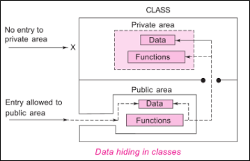

.. contents:: Table of Contents

Access Modifiers in C++
=============

Hiding the Implementation
----------

Setting limits
~~~~~~~~~~

In a C struct(UDDT), as with most things in C, there are no rules. Client programmers can do anything they want with that struct(UDDT), and there’s no way to force any particular behaviors. Even though you would really prefer that the client programmer not directly manipulate some of the members of your struct(UDDT), in C there’s no way to prevent it. Everything’s naked to the world.

Two reasons for controlling access to members

#. To keep the client programmer’s hands off tools they shouldn’t touch, tools that are necessary for the internal machinations of the data type, but not part of the interface the client programmer needs to solve their particular problems.
#. To allow the library designer to change the internal workings of the structure without worrying about how it will affect the client programmer.

The class
------

Access control is often referred to as implementation hiding. Access control is for two important reasons

#. You can build your internal mechanisms into the structure without worrying that client programmers will think that these mechanisms are part of the interface they should be using.
#. To separate the interface from the implementation.

C++ access control
----------

C++ introduces three new keywords to set the boundaries in a structure: public, private, and protected, used to implement Data Hiding feature of OOP

Access modifiers or Access Specifiers in a class are used to set the accessibility of the class members. 

That is, it sets some restrictions on the class members not to get directly accessed by the outside functions.

**Access modifiers are decided at compile time**

3 types of access modifiers available in C++

#. Public
#. Private
#. Protected

default access modifier for the members will be Private

 
1. Public
^^^^^^^^^

- All the class members declared under public will be available to everyone. 
- The data members and member functions declared public can be accessed by other classes too. 
- The public members of a class can be accessed from anywhere in the program using the direct member access operator (.) with the object of that class.

2. Private
^^^^^^^^^^

- The class members declared as private can be accessed only by the functions inside the class. 
- They are not allowed to be accessed directly by any object or function outside the class. 
- Only the member functions or the friend functions are allowed to access the private data members of a class.

3. Protected
^^^^^^^^^

- Similar to that of private access modifiers, 
- The difference is that the class member declared as Protected are inaccessible outside the class but they can be accessed by any subclass(derived class) of that class.

.. code:: cpp

	#include <iostream>
	using namespace std;
	class Base {
		string mb_private;
		protected:
	    string mb_protected;
		public:
		string mb_public;
	};
	class Derived : public Base {
		string md_private;
		protected:
		string md_protected;
		public:
		string md_public;

		void set() {  
        	// error: 'std::string Base::mb_private' is private within this context
        	//mb_private      = "Base Private can not be accessed in Derived";

        	mb_protected    = "Base protected is protected in Derived";
        	mb_public       = "Base public is accessible in Derived";

        	md_private      = "Derived private";
        	md_protected    = "Derived protected";
        	md_public       = "Derived public";
    	}
		void display() const {
			// error: 'std::string Base::mb_private' is private within this context
			//std::clog << "mb_private " << mb_private << '\n';

			std::clog << "mb_protected " << mb_protected << '\n';
			std::clog << "mb_public " << mb_public << '\n';
			std::clog << '\n';

			std::clog << "md_private " << md_private << '\n';
			std::clog << "md_protected " << md_protected << '\n';
			std::clog << "md_public " << md_public << '\n';
		}
	};

	int main() {
		Derived dobj;
		dobj.set();
		dobj.display();

		// error: 'std::string Derived::md_private' is private within this context
		// dobj.md_private = "Private member can only be accessed using public member funciton";

		// error: 'std::string Derived::md_protected' is protected within this context
		//dobj.md_protected = "Protected member can only be accessed using public member funciton"
		//                        "and can be inherited in derived class";

		return 0;
	}

Output::

	mb_protected Base protected is protected in Derived
	mb_public Base public is accessible in Derived

	md_private Derived private
	md_protected Derived protected
	md_public Derived public

Friends
--------

To explicitly grant access to a function that isn’t a member of the current structure. This is accomplished by declaring that function a friend inside the structure declaration. 

It’s important that the friend declaration occurs inside the structure declaration because you (and the compiler) must be able to read the structure declaration and see every rule about the size and behavior of that data type.

You can declare a global function as a friend, and you can also declare a member function of another structure, or even an entire structure, as a friend.

.. code:: cpp

	#include <iostream>
	using namespace std;

	struct X;
	struct Y { void f(X &); };

	struct X { // Definition
		private:
		string mx_private;
		public:
		void initialize();
		friend void g(X &, string); // Global friend
		// friend can be used this way to simultaneously declare the function and give it friend status

		friend void Y::f(X &);   // Struct member friend
		friend struct Z;          // Entire struct is a friend
		friend void h();
		void display() { cout << "mx_private " << mx_private << '\n'; }
	};
	void X::initialize() { mx_private = "X private member"; }
	void Y::f(X & x) { x.mx_private = "Another struct member function as friend"; }

	struct Z {
		private:
		string mz_private;
		public:
		void initialize();
		void g(X & x);
		void display() { cout << "mz_private " << mz_private << '\n'; }
	};

	void Z::initialize() { mz_private = "Z private member"; }
	void Z::g(X & x) { mz_private = x.mx_private;}

	void g(X & x, string msg) { x.mx_private = msg; }
	void h() { X x;  x.mx_private = "Global function accessing private member"; } // Direct data manipulation

	int main() {
		X x;
		x.initialize();
		x.display();

		Z z;
		z.initialize();
		z.display();

		z.g(x);
		x.display();
		z.display();
		return 0;
	}

Output::

	mx_private X private member
	mz_private Z private member
	mx_private X private member
	mz_private X private member

Nested friends
^^^^^^^^^^

Making a structure nested doesn’t automatically give it access to private members. To give access to private members. first, declare (without defining) the nested structure, then declare it as a friend, and finally define the structure. The structure definition must be separate from the friend declaration, otherwise it would be seen by the compiler as a non-member.

For more info visit https://stackoverflow.com/questions/5013717/are-inner-classes-in-c-automatically-friends

Since C++11 nested classes can access the private and protected members of the enclosing class.

.. code:: cpp

	#include <iostream>
	#include <string>
	using namespace std;

	class Outerclass {
		private:
		string m_outers;
		public:
		void set_outer() {
			m_outers = "Outer member";
		}
		void display_outer() {
			cout << "m_outers: " << m_outers << '\n';
		}

		class FriendNestedclass;
		friend FriendNestedclass;
		class FriendNestedclass {
			private:
			string m_inners;
			public:
			void set_inner(Outerclass & outref) {
				outref.m_outers = "Nested class can access private member of outer class";
				m_inners = "Nested member";
			}
			void display_inner(const Outerclass & outref) {
				cout << "outref.m_outers: " << outref.m_outers << '\n';
				cout << "m_inners: " << m_inners << '\n';
			}
		};
	};

	int main() {
		Outerclass outs;
		outs.set_outer();
		outs.display_outer();

		Outerclass::FriendNestedclass nested_friend_s;
		nested_friend_s.set_inner(outs);
		nested_friend_s.display_inner(outs);
		return 0;
	}

Output::

	m_outers: Outer member
	outref.m_outers: Nested class can access private member of outer class
	m_inners: Nested member

Is it pure?
^^^^^^^^

C++ is a hybrid object-oriented language, not a pure one, and friend was added to get around practical problems that crop up. It’s fine to point out that this makes the language less “pure,” because C++ is designed to be pragmatic, not to aspire to an abstract ideal.

Object layout
---------

In general, it’s not a good idea to depend on anything that’s implementation-specific when you’re writing a program. When you must have implementation-specific dependencies, encapsulate them inside a structure so that any porting changes are focused in one place.

Handle classes
----------

Access control in C++ allows you to separate interface from implementation, but the implementation hiding is only partial. The compiler must still see the declarations for all parts of an object in order to create and manipulate it properly.

Including the private implementation has two effects
The implementation is visible even if you can’t easily access it, and it can cause needless recompilation.

Hiding the implementation
^^^^^^^^^^

Hiding the implementation Some projects cannot afford to have their implementation visible to the client programmer. It may show strategic information in a library header file that the company doesn’t want available to competitors.
In all these situations, it’s valuable to have the actual structure compiled inside an implementation file rather than exposed in a header file.

Reducing recompilation
^^^^^^^^^^^

**fragile base-class problem**

Any time you make a change to a class, whether it’s to the public interface or to the private member declarations, you’ll force a recompilation of anything that includes that header file. This is often referred to as the fragile base-class problem.

The technique to solve this is sometimes called **handle classes or the “Cheshire cat”.**

Everything about the implementation disappears except for a single pointer, the “smile.” The pointer refers to a structure whose definition is in the implementation file along with all the member function definitions. 

Thus, as long as the interface is unchanged, the header file is untouched. The implementation can change at will, and only the implementation file needs to be recompiled and relinked with the project.

References
-------

| Chapter 5 | Thinking in C++, Volume 1, 2nd Edition
| https://stackoverflow.com/questions/5013717/are-inner-classes-in-c-automatically-friends

