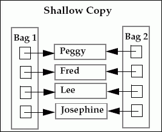
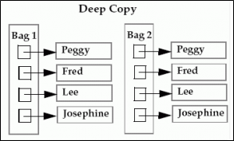
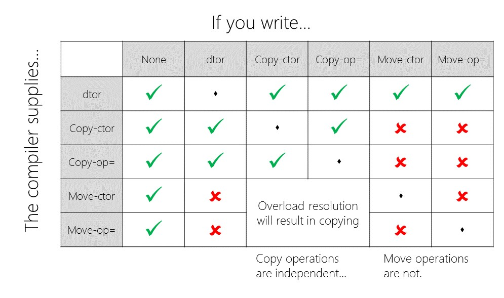

.. contents:: Table of Contents

Constructors and Destructor
===========================

Constructor is used for initialization and destructor is used for cleanup.

Constructors in C++
---------------------

Constructor is a special non-static member function of a class that is used to initialize objects of its class type.

A constructor must not be a coroutine. (since C++20)

In C++, Constructor is automatically called when object (instance of class) is created.

**Constructor function can also be defined as inline function.**

**Characteristics** of a constructor

#. Constructor has same name as the class itself
#. Constructor should be declared in the public section
#. Constructor do not have return type, not even void
#. A constructor is automatically called when an object is created
#. If we do not specify a constructor, C++ compiler generates a default constructor for us (expects no parameters and has an empty body)
#. Constructor can have default arguments
#. Constructor cannot be inherited, though a derived class can call the base class constructor
#. Constructor cannot be virtual
#. We cannot refer to constructor address
#. **An object with a constructor or destructor cannot be used as a member of a union**
#. Constructor makes implicit calls to the operators new and delete when memory allocation is required

Types of Constructors

#. Default Constructor
#. Parameterized Constructor
#. Copy Constructor
#. Move Constructor (Since C++11)

1. Default Constructor
----------------------

A default constructor is a constructor which can be called with no arguments (either defined with an empty parameter list, or with default arguments provided for every parameter). A type with a public default constructor is DefaultConstructible.

If no such constructor is defined, then the compiler supplies a default constructor. The default value of variables is 0 in case of automatic initialization.

.. code:: cpp

        A a;	// invokes the default constructor of the compiler to create the object a

**Does compiler create default constructor when we write our own?**

No, In C++, if we define our own constructor, compiler doesn’t create the default constructor.
For more info https://en.cppreference.com/w/cpp/language/default_constructor

2. Parameterized Constructor
----------------------------

It is possible to pass arguments to constructors. Typically, these arguments help initialize an object when it is created. 

To create a parameterized constructor, simply add parameters to it the way you would to any other function. When you define the constructor’s body, use the parameters to initialize the object.

**Uses** of Parameterized constructor

- It is used to initialize the various data elements of different objects with different values when they are created.
- It is used to overload constructors.

Parameterized constructor can be invoked in two ways

#. **Explicitly**

   integer int1 = integer(1, 100);

#. **Implicitly (shorthand method)**

   integer int1(1, 100);

**Can we have more than one constructors in a class?**

Yes, It is called Constructor Overloading.

For more info visit https://en.cppreference.com/w/cpp/language/constructor

Constructors with Default Parameters
^^^^^^^^^^^^^^^^^^^^^^^^^^^^^^^^^^^^

It is possible to define constructor with default parameters value.

The default parameters must be trailing ones.

If all parameters of a constructor have default value, then it may act as default constructor also.

Example-01

.. code:: cpp

    Complex(float real, float img = 0);
    Complex c1(5.2, 6.3);   // assigns 5.2 to real and 6.3 to img
    Complex c2(5.2);        // assigns 5.2 to real and 0.0 to img

Example-02

.. code:: cpp

    A::A(int i = 5) { }     // default parameter value constructor
    A a(1);                 // called with one argument
    A a;                    // called with no argument, assigns 5 to i	

When called with no arguments, it becomes a default constructor.

When both of these forms are used in a class, it may cause ambiguity.

.. code:: cpp

    A::A()	        { }
    A::A(int i = 5)     { }
    A a;			// compilation error due to ambiguity in call of constructor

Member Initializer List in C++
^^^^^^^^^^^^^^^^^^^^^^^^^^^^^^

Initializer List is used to initialize data members of a class. The list of members to be initialized is indicated with constructor as a comma separated list followed by a colon.

.. note::

    - Prefer initialization over assignment
    - Initialization happens before the body of the constructor is executed

 
#. For initialization of non-static const data members
#. For initialization of reference members
#. For initialization of member objects which do not have default constructor
#. For initialization of base class members: parameterized constructor of base class can only be called using Initializer List
#. When constructor’s parameter name is same as data member: If constructor’s parameter name is same as data member name, then the data member must be initialized either using this pointer or Initializer List
#. For Performance reasons

It is better to initialize all class variables in Initializer List instead of assigning values inside body.

Example for 1
~~~~~~~~~~~~~

.. code:: cpp

        #include <iostream>
        using namespace std;

        class Test {
            const int t;
        public:
            //Test(int x):t(x) {} //Initializer list must be used
            Test(int x) { t = x; }
            int getT() { return t; }
        };

        int main() {
            Test t1(10);
            cout << t1.getT();
            return 0;
        }

Compile Errors::

        prog.cpp: In constructor 'Test::Test(int)':
        prog.cpp:8:2: error: uninitialized const member in 'const int' [-fpermissive]
          Test(int x) { t = x; }
          ^
        prog.cpp:5:12: note: 'const int Test::t' should be initialized
          const int t;
                    ^
        prog.cpp:8:18: error: assignment of read-only member 'Test::t'
          Test(int x) { t = x; }
  
Example for 6
~~~~~~~~~~~~~

.. code:: cpp

        // Assume that Type is an already declared class and it has appropriate constructors and operators
        class MyClass {
            Type variable;
            public:
            MyClass(Type a) { variable = a; }
        };

Without the Initializer List, following steps are followed by compiler:

    - Type’s constructor is called first for “a”
    - The assignment operator of “Type” is called inside body of MyClass() constructor to assign
      variable = a;
    - And then finally destructor of “Type” is called for “a” since it goes out of scope.

.. code:: cpp

        // Assume that Type is an already declared class and it has appropriate constructors and operators
        class MyClass {
            Type variable;
            public:
            MyClass(Type a):variable(a) { 	}
        };

With the Initializer List, following steps are followed by compiler:

    - Copy constructor of “Type” class is called to initialize: variable(a). The arguments in initializer list are used to copy construct “variable” directly.
    - Destructor of “Type” is called for “a” since it goes out of scope.

If we use assignment inside constructor body there are three function calls: constructor + destructor + one addition assignment operator call. 

And if we use Initializer List there are only two function calls: copy constructor + destructor call.

Example:

.. code:: cpp

    #include <iostream>
    using namespace std;
         
    class A {
        public:
        ~A()	{ cout << "A's Destructor\n"; }
        A()	{ cout << "A's Constructor\n"; }
        A(const A &a)		{ cout << "A's Copy Constructor\n"; }
        A& operator=(const A &a) {
            if(this == &a) return *this; // Do not self-assign
                cout << "A's Assignment Operator\n";
                return *this;
            }
    };
        
    class B {
        A a;
        public:
        B(A &a) {
            this->a = a;
            cout << "B's Constructor\n";
        }
    };
    
    class C {
        A a;
        public:
        C(A &a) : a{a}{
            cout << "C's Constructor\n"; 
        }
    };
    
    int main() {
        A a1;
        {   cout << "\n=== Constructor without initialization list ===\n";
            B b(a1);
        }
        {   cout << "\n=== Constructor with initialization list ===\n";
            C c(a1);
        }
        return 0;
    }

Output::

        A's Constructor

        === Constructor without initialization list ===
        A's Constructor
        A's Assignment Operator
        B's Constructor
        A's Destructor

        === Constructor with initialization list ===
        A's Copy Constructor
        C's Constructor
        A's Destructor
        A's Destructor

Initialization order
~~~~~~~~~~~~~~~~~~~~~~

The actual order of initialization is as follows

#. If the constructor is for the most-derived class, virtual bases are initialized in the order in which they appear in depth-first left-to-right traversal of the base class declarations (left-to-right refers to the appearance in base-specifier lists)
#. Then, direct bases are initialized in left-to-right order as they appear in this class's base-specifier list
#. Then, non-static data members are initialized in order of declaration in the class definition.
#. Finally, the body of the constructor is executed

.. code:: cpp

        #include <iostream>
        using namespace std;

        class Test {
            private: 
            int y;
            int x; 
            public:
            Test() : x(10), y(x + 10) {}    // 1 incorrect intialization
            //Test() : x(y-10), y(20) {}    // 2 correct intialization
            void display() {
                cout<<"x = " << x << " y = " <<y << '\n';
            }
        };

        int main() {
            Test t;
            t.display();
            return 0; 
        }

Output::

        x = 10 y = 10	// 1 incorrect intialization
        x = 10 y = 20	// 2 correct intialization

Following two versions can be used to avoid the problem 1 in above code

Change the order of declaration. int x , int y;

Change the order of initialization. Test() : x(y-10), y(20) {}

// 1 program prints correct value of x, but some garbage value for y, because y is initialized before x as it appears before in the class declaration.

// 2 Initialization order has been changed, now program prints correct value

Conversion constructor and use of explicit keyword in C++
^^^^^^^^^^^^^^^^^^^^^^^^^^^^^^

If a class has a constructor which can be called with a single argument, then this constructor becomes conversion constructor because such a constructor allows conversion of the single argument to the class being constructed.

We can avoid such implicit conversions as these may lead to unexpected results. We can make the constructor explicit with the help of explicit keyword.

We can still typecast the values, if needed.

.. code:: cpp

        #include <iostream>
        using namespace std;
         
        class Test {
            int val;
            public:
            Test(int arg) : val{arg} { }
            void display() { cout << "value is : " << val << endl; }
        };

        class ExplicitTest {
            int val;
            public:
            explicit ExplicitTest(int arg) : val{arg} { }
            void display() { cout << "value is : " << val << endl; }
        };

        int main() {
            Test t1(100);
            Test t2 = 53.6;
            t1.display();
            t2.display();

            ExplicitTest et1(100);
            
            // error: conversion from 'double' to non-scalar type 'ExplicitTest' requested
            //ExplicitTest et2 = 53.6; 
            
            ExplicitTest et3 = (ExplicitTest)53.6; 
            et1.display();
            et3.display();

            return 0;
        }

Output::

        value is : 100
        value is : 53
        value is : 100
        value is : 53

3. Copy Constructor
-------------------

For more info visit
https://en.cppreference.com/w/cpp/language/copy_constructor

A copy constructor is a member function which initializes an object using another object of the same class. A copy constructor has the following general function prototype

.. code:: cpp

    ClassName (const ClassName &other_obj);

Copy constructor is called when a new object is created from an existing object, as a copy of the existing object. 

Assignment operator is called when an already initialized object is assigned a new value from another existing object.

A (A);			☒
A (const A &);	☑	// copy constructor

.. code:: cpp

        #include <iostream>
        using namespace std;

        class Point {
            int x, y;
            public:
            Point(int x1, int y1) : x{x1}, y{y1} { }
            Point(const Point &p2) { // Copy constructor
                cout << "Inside copy constructor" << '\n'; 
                x = p2.x; y = p2.y; 
            }
            void display() {
                cout << "x: " << x << " y: " << y << '\n';
            }
        };

        int main() {
            Point p1(10, 15); // Normal constructor is called here
            p1.display();
            
            Point p2 = p1; // Copy constructor is called here
            p2.display();
            
            Point p3(20, 25);
            p3.display();
            p3 = p2; // this is assignment , copy constructor is not called here
            p3.display();
         
            return 0;
        }

Output::

        x: 10 y: 15
        Inside copy constructor
        x: 10 y: 15
        x: 20 y: 25
        x: 10 y: 15

When is copy constructor called?
^^^^^^^^^^^^^^^^^^^^^^^^^^^^^^^^

In C++, a Copy Constructor may be called in following cases

#. When an object is constructed based on another object of the same class
#. When an object of the class is passed (to a function) by value as an argument
#. When an object of the class is returned by value
#. When compiler generates a temporary object

It is however, not guaranteed that a copy constructor will be called in all these cases, because the C++ Standard allows the compiler to optimize the copy away in certain cases.

Check https://en.wikipedia.org/wiki/Copy_elision#Return_value_optimization

When should we write our own copy constructor?
^^^^^^^^^^^^^^^^^^^^^^^^^^^^^^^^^^^^^^^^^^^^^^

If we don’t define our own copy constructor, the C++ compiler creates a default copy constructor for each class which does a member wise copy between objects. The compiler created copy constructor works fine in general. Don’t write a copy constructor if shallow copies are ok.

We need to define our own copy constructor only if an object has pointers or any run time allocation of resource like file handle, a network connection..etc.

Default copy constructor does only **shallow copy**

 
**Deep copy** is possible only with user defined copy constructor. In user defined copy constructor, we make sure that pointers (or references) of copied object point to new memory locations.

.. code:: cpp
 
        #include <cstring>
        #include <iostream>
        namespace nonstd {
        class String {
            char *s;
            int size;

           public:
            String(const char *str = NULL);             // constructor
            ~String() { delete[] s; }                   // destructor
            String(const String &);                     // copy constructor
            void display() { std::cout << s << '\n'; }  // Function to display string
            void change(const char *);                  // Function to change
        };

        String::String(const char *str) {
            size = strlen(str);
            s = new char[size + 1];
            strncpy(s, str, size);
        }

        String::String(const String &old_str) {
            size = old_str.size;
            s = new char[size + 1];
            strncpy(s, old_str.s, size);
        }

        void String::change(const char *str) {
            delete[] s;
            size = strlen(str);
            s = new char[size + 1];
            strncpy(s, str, size);
        }
        }  // namespace nonstd

        int main() {
            nonstd::String str1("Need for copy constructor");
            nonstd::String str2 = str1;
            str1.display();  // what is displayed ?
            str2.display();

            str2.change("New value of string");
            str1.display();  // what is displayed now ?
            str2.display();

            return 0;
        }

Output::

        Need for copy constructor
        Need for copy constructor
        Need for copy constructor
        New value of string

NOTE: In absence of copy constructor this code will result in runtime error

Can we make copy constructor private?
^^^^^^^^^^^^^^^^^^^^^^^^^^^^^^^

Yes, see section `Private Constructor`_

Why argument to a copy constructor must be passed as a reference?
^^^^^^^^^^^^^^^^^^^^^^^^^^^^^^^^^^^^^^^^^^^^^^^^^^^^

A copy constructor is called when an object is passed by value. Copy constructor itself is a function. So, **if we pass argument by value in a copy constructor, a call to copy constructor would be made to call copy constructor which becomes a non-terminating chain of calls.** Therefore, compiler doesn’t allow parameters to be pass by value.

**Can it be pointer?**

Pointers are not included because the whole point of references is to "be" aliases for objects, whereas pointers represent indirection.

Why copy constructor argument should be const in C++?
^^^^^^^^^^^^^^^^^^^^^^^^^^^^^^^^^^^^^^^^^^^^^^^^^^

#. So that objects are not accidentally modified
#. To return an object of a class in case of user defined copy constructor

.. code:: cpp

        #include <iostream>
        using namespace std;

        class Test {
           public:
            Test(const Test &t) { cout << "Copy Constructor Called" << '\n'; }
            Test() { cout << "Constructor Called" << '\n'; }
        };
        Test fun() {
            cout << "fun() Called" << '\n';
            Test t;
            return t;
        }
        int main() {
            Test t1;
            t1 = fun();
            Test t2 = fun();  // Compilation Error if const is not used in constructor
            return 0;
        }

Output::

        Constructor Called
        fun() Called
        Constructor Called
        fun() Called
        Constructor Called

        // Compilation Error if const is not used in constructor
        Compile Errors :
        prog.cpp: In function 'int main()':
        prog.cpp:19:15: error: invalid initialization of non-const reference of type 'Test&' from an rvalue of type 'Test'
          Test t2 = fun();
                       ^
        prog.cpp:6:3: note:   initializing argument 1 of 'Test::Test(Test&)'
           Test(Test &t) { cout << "Copy Constructor Called" << endl; }
           ^

The function fun() returns by value. So the compiler creates a temporary object which is copied to t2 using copy constructor in the original program (The temporary object is passed as an argument to copy constructor).

The **reason for compiler error** is, compiler created **temporary objects cannot be bound to non-const references** and the original program tries to do that. It doesn’t make sense to modify compiler created temporary objects as they can die any moment.

Copy Constructor in Inheritance
^^^^^^^^^^^^^^^^^^^^^^^^^^^^^^^

If you don't specify a base class constructor in the initializer list, its default constructor is called. If you want a constructor other than the default constructor to be called, you must specify which constructor (and with which arguments) you want to call.

**Why this is the case?**

In this case ambiguity is that If a Base class have multiple constructor which constructor should be called from the derived class constructor.

**Derived class copy constructor does not call the Base class copy constructor.** You need to call Base class copy constructor in initialization list of derived class copy constructor.

.. code:: cpp

        #include <iostream>
        using namespace std;

        class Base {
            public:
            Base() { cout << "Base default constructor" << '\n'; }
            Base(const Base &obj) { 
                cout << "Base copy constructor" << '\n';
            }
            ~Base() { cout << "Base destructor" << '\n'; }
        };

        class Derived : public Base {
           public:
            Derived() { cout << "Derived default constructor" << '\n'; }
            // CASE -1 Implicit call to base class default constructor
            Derived(const Derived &obj) { 
                cout << "Derived copy constructor" << '\n';
            }
            /* // CASE -2 Explicit call to base class copy constrcutor
            Derived(const Derived &obj) : Base(obj) {
                cout << "Derived copy constructor" << '\n';
            } */
            ~Derived() { cout << "Derived destrcutor" << '\n'; }
        };

        int main() {
            Derived d1;
            Derived d2(d1);
            return 0;
        }

Output::
        // (CASE -1)
        Base default constructor
        Derived default constructor
        Base default constructor
        Derived copy constructor
        Derived destrcutor
        Base destructor
        Derived destrcutor
        Base destructor

        // (CASE-2)
        Base default constructor
        Derived default constructor
        Base copy constructor
        Derived copy constructor
        Derived destrcutor
        Base destructor
        Derived destrcutor
        Base destructor

        Note:
        case-1 implicit call to base class default constructor
        case-2 explicit call to base class copy constructor

4. Move Constructor
--------------------

Since C++11 C++ has introduced move constructor.

A move constructor of class T is a non-template constructor whose first parameter is T&&, const T&&, volatile T&&, or const volatile T&&, and either there are no other parameters, or the rest of the parameters all have default values.

A move constructor enables the resources owned by an rvalue object to be moved into an lvalue without copying.

For more info visit

https://en.cppreference.com/w/cpp/language/move_constructor

https://learn.microsoft.com/en-us/cpp/cpp/move-constructors-and-move-assignment-operators-cpp?view=msvc-170

To move an object std::move() is used.

.. code:: cpp

        #include <iostream>
        using namespace std;

        class LearnMove {
            public:
            LearnMove() { cout << "LearnMove default constructor" << '\n'; }
            LearnMove(const LearnMove &obj) { 
                cout << "LearnMove copy constructor" << '\n';
            }
            LearnMove(LearnMove && obj) { 
                cout << "LearnMove move constructor" << '\n';
            }
            ~LearnMove() { cout << "LearnMove destructor" << '\n'; }
        };

        int main() {
            LearnMove l1;
            LearnMove l2 = l1;
            LearnMove l3 = std::move(l2);
            return 0;
        }

Output::

        LearnMove default constructor
        LearnMove copy constructor
        LearnMove move constructor
        LearnMove destructor
        LearnMove destructor
        LearnMove destructor

Destructors in C++
------------------

Destructor is a member function which destructs an object. Its purpose is to free all resources acquired during construction of the object.

**When is destructor called?**

A destructor function is called **automatically when the lifetime of an object ends and it goes out of scope**

#. The function ends
#. The program ends
#. A block containing local variables ends
#. A delete operator is called

.. note::

    - When the pointers to objects go out of scope, a destructor is not called implicitly. We need to write user defined destructor in this case.
    - Objects are destroyed in reverse order of their creation.

**How destructors are different from a normal member function?**

Destructors have same name as the class preceded by a tilde (~)

Destructors don’t take any argument and don’t return anything

**Can there be more than one destructor in a class?**

No, there can be only one destructor in a class with class name preceded by ~, no parameters and no return type.

**When do we need to write a user-defined destructor?**

If we do not write our own destructor in class, compiler creates a default destructor for us. The default destructor works fine unless we have dynamically allocated memory or pointer in class. 

When a class contains a pointer to memory allocated in class, we should write a destructor to release memory before the class instance is destroyed. This must be done to avoid memory leak.

**Can a destructor be virtual?**

Yes, in fact, it is always a good idea to make destructors virtual in base class when we have a virtual function. See section Virtual Destructors.

For more info visit https://en.cppreference.com/w/cpp/language/destructor

Playing with Destructors in C++
^^^^^^^^^^^^^^^^^^^^^^^^^^^^^^^

Example

.. code:: cpp

        #include <iostream>
        using namespace std;
         
        int i; 
        class A {
            public:
            ~A() { i=10; }
        };
         
        int foo() {
            i=3;
            A ob;
            return i;
        }
         
        int main() {
            cout << "i = " << foo() << endl;
            return 0;
        }

Output::

        i = 3

How to make the program to output “i = 10”?

1.	Return by Reference

.. code:: cpp

        int & foo() {
            i = 3;
            A ob;
            return i;
        }

The function foo() returns the l-value of the variable i. So, the address of i will be copied in the return value. Since, the references are automatically dereferenced. It will output “i = 10”.

2.	Create the object ob in a block scope

.. code:: cpp

        int foo() {
            i = 3; 
            {
                A ob;
            }
            return i;
        }

Since the object ob is created in the block scope, the destructor of the object will be called after the block ends, thereby changing the value of i to 10. Finally 10 will copied to the return value.

Is it possible to call constructor and destructor explicitly?
-------------------------------------------------------------

Yes, it is possible to call special member functions explicitly by programmer.

C++ standard says that

**Once a destructor is invoked for an object, the object no longer exists; the behaviour is undefined if the destructor is invoked for an object whose lifetime has ended.**

As mentioned here https://isocpp.org/wiki/faq/dtors#dont-call-dtor-on-local , we should never call destructor explicitly on local (automatic) object, because really bad results can be acquired by doing that.

Local objects are automatically destroyed by compiler when they go out of scope and this is the guarantee of C++ language. In general, special member functions shouldn’t be called explicitly.

Constructor and destructor can also be called from the member function of class.

Explicit call to destructor is only necessary when object is placed at particular location in memory by using placement new. Destructor should not be called explicitly when the object is dynamically allocated because delete operator automatically calls destructor.

.. code:: cpp

        #include <iostream>
        using namespace std;
         
        class Test {
        int id;
            public:
            Test(int id) : id{id}  { cout << id << "-Constructor is executed\n"; }
        Test(const Test & other) : id(other.id) { cout << id << "-Copy Constructor is executed\n"; }
            ~Test() { cout << id << "-Destructor is executed\n";  }
            friend void fun(Test t);
        };
        void fun(Test t) {
            Test(3);
            t.~Test();
        }

        int main() {
            Test(1);
            Test t(2);
            fun(t);
            return 0;
        }

Output::

        1-Constructor is executed
        1-Destructor is executed
        2-Constructor is executed
        2-Copy Constructor is executed
        3-Constructor is executed
        3-Destructor is executed
        2-Destructor is executed
        2-Destructor is executed
        2-Destructor is executed

When the constructor is called explicitly the compiler creates a nameless temporary object and it is immediately destroyed. That’s why at 2nd line destructor is called.

Compiler generated constructor and destructor
--------------------------------------------

Compiler generated special member functions

- a default constructor X(), that calls the default constructor of each class member and base class
- the destructor ~X(), that calls the destructor of each class member and base class. Note that this default-generated destructor is never virtual (unless it is for a class inheriting from one that has a virtual destructor)

- a copy constructor X(const X & other), that calls a copy constructor on each member and base class
- a copy assignment operator X& operator=(const X & other), that calls a copy assignment operator on each class member and base class
- The copy operation is generated only for classes lacking an explicitly declared copy operation, and it’s deleted if a move operation is declared.

- a move constructor X(X&& other), that calls a move constructor of each class member and base class
- a move assignment operator X& operator=(X&& other), that calls a move assignment operator on each class member and base class
- Move operations are generated only for classes lacking explicitly declared move operations, copy operations, and a destructor

Summary https://stackoverflow.com/questions/4943958/conditions-for-automatic-generation-of-default-copy-move-ctor-and-copy-move-assi

.. note::

        The implicitly-defined special member functions are typically incorrect if the class manages a resource whose handle is an object of non-class type (raw pointer, POSIX file descriptor, etc), whose destructor does nothing and copy constructor/assignment operator performs a "shallow copy" (copy the value of the handle, without duplicating the underlying resource).

Example – No Compiler Generated move when copy operations are present
^^^^^^^^^^^^^^^^^^^^^^^^^^^^^^^^^^^^^^^^^^^^^^^^^^^^^^^^^^^^^^^^

When copy operations are defined but move operations are not, performing move operations implicitly fall to copy operations

.. code:: cpp

    #include <iostream>
    using namespace std;
    
    class GenerateAll {
        int id;
        public:
        GenerateAll(int id) : id{id}  { 
            cout << id << "- GenerateAll generates destrtor, copy operations and move operations\n"; 
        }
    };
        
    class DoNotGenerateMove {
        int id;
        public:
        DoNotGenerateMove(int id) : id{id}  { 
            cout << id << "- DoNotGenerateMove becase destructor and copy constrcutor is present\n";
        }
        DoNotGenerateMove(const DoNotGenerateMove & other) : id{other.id} {
            cout << id << "- DoNotGenerateMove Copy Constructor is executed\n"; 
        }
        DoNotGenerateMove & operator=(const DoNotGenerateMove & other) {
            if(this == &other) { return *this;}
            id = other.id;
            cout << id << "- DoNotGenerateMove Copy assignment is executed\n"; 
            return *this;
        }
        ~DoNotGenerateMove() {
            cout << id << "- DoNotGenerateMove destructor is executed\n"; 
        }
    };
    
    int main() {
        GenerateAll gm1(1);
        GenerateAll gm = std::move(gm1);
        GenerateAll gm2(2);
        gm2 = std::move(gm1);
        cout << '\n';
        
        DoNotGenerateMove dgm1(1);
        DoNotGenerateMove dgm = std::move(dgm1); // move constructor falls to copy constructor
        DoNotGenerateMove dgm2(2);
        dgm2 = std::move(dgm1); // move assign falls to copy assign
        return 0;
    }

Output::

        1- GenerateAll generates destrtor, copy operations and move operations
        2- GenerateAll generates destrtor, copy operations and move operations

        1- DoNotGenerateMove becase destructor and copy constrcutor is present
        1- DoNotGenerateMove Copy Constructor is executed
        2- DoNotGenerateMove becase destructor and copy constrcutor is present
        1- DoNotGenerateMove Copy assignment is executed
        1- DoNotGenerateMove destructor is executed
        1- DoNotGenerateMove destructor is executed
        1- DoNotGenerateMove destructor is executed

Example – No Compiler Generated copy when move operations are present
^^^^^^^^^^^^^^^^^^^^^^^^^^^^^^^^^^^^^^^^^

When move operations are defined but copy operations are not, performing copy operations result in compilation error

.. code:: cpp

    #include <iostream>
    using namespace std; 

    class GenerateAll {
        int id;
        public:
        GenerateAll(int id) : id{id}  { 
            cout << id << "- GenerateAll generates destrtor, copy operations and move operations\n"; 
        } 
    };
    
    class DoNotGenerateCopyBecauseMoveIsPresent {
        int id;
        public:
        DoNotGenerateCopyBecauseMoveIsPresent(int id) : id{id}  { 
            cout << id << "- DoNotGenerateCopyBecauseMoveIsPresent\n";
        }
        DoNotGenerateCopyBecauseMoveIsPresent(DoNotGenerateCopyBecauseMoveIsPresent && other) : id{other.id} {
            cout << id << "- DoNotGenerateCopyBecauseMoveIsPresent move Constructor is executed\n"; 
        }
        DoNotGenerateCopyBecauseMoveIsPresent & operator= (DoNotGenerateCopyBecauseMoveIsPresent && other) {
            if(this == &other) { return *this;}
            id = other.id;
            other.id = 0;
            cout << id << "- DoNotGenerateCopyBecauseMoveIsPresent move assignment is executed\n"; 
            return *this;
        }
    };

    int main() {
        GenerateAll gc1(1);
        GenerateAll gc = gc1;
        GenerateAll gc2(2);
        gc2 = gc1; 
        cout << '\n';
        {
        DoNotGenerateCopyBecauseMoveIsPresent dgc1(1);
        // error: use of deleted function 'constexpr DoNotGenerateCopyBecauseMoveIsPresent::DoNotGenerateCopyBecauseMoveIsPresent(const DoNotGenerateCopyBecauseMoveIsPresent&)'
        //DoNotGenerateCopyBecauseMoveIsPresent dgc = dgc1;
        
        DoNotGenerateCopyBecauseMoveIsPresent dgc2(2);
        
        // error: use of deleted function 'DoNotGenerateCopyBecauseMoveIsPresent& DoNotGenerateCopyBecauseMoveIsPresent::operator=(const DoNotGenerateCopyBecauseMoveIsPresent&)'
        //dgc2 = dgc1;
        }   
        return 0;
    }

Output::

        1- GenerateAll generates destrtor, copy operations and move operations
        2- GenerateAll generates destrtor, copy operations and move operations

        1- DoNotGenerateCopyBecauseMoveIsPresent
        2- DoNotGenerateCopyBecauseMoveIsPresent

The rule of three/five/zero
^^^^^^^^^^^^^^^^^^^^^

Reference https://en.cppreference.com/w/cpp/language/rule_of_three

**Rule of three**

If a class requires a user-defined destructor, a user-defined copy constructor, or a user-defined copy assignment operator, it almost certainly requires all three.

**Rule of five**

Because the presence of a user-defined (or = default or = delete declared) destructor, copy-constructor, or copy-assignment operator prevents implicit definition of the move constructor and the move assignment operator, any class for which move semantics are desirable, has to declare all five special member functions.

**Rule of zero**

Classes that have custom destructors, copy/move constructors or copy/move assignment operators should deal exclusively with ownership. Other classes should not have custom destructors, copy/move constructors or copy/move assignment operators.

Elimination of the definition block
------------------------

In C, you must always define all the variables at the beginning of a block, after the opening brace.

In C++, however, there’s a significant problem in being forced to define all objects at the beginning of a scope. If a constructor exists, it must be called when the object is created. However, if the constructor takes one or more initialization arguments, how do you know you will have that initialization information at the beginning of a scope? 

Storage allocation
^^^^^^^^^^^^^^

A variable can now be defined at any point in a scope, so it might seem that the storage for a variable may not be defined until its point of definition.

The compiler even checks to make sure that you don’t put the object definition (and thus the constructor call) where the sequence point only conditionally passes through it, such as in a switch statement or somewhere a goto can jump past it.

.. code:: cpp

        #include <iostream>
        using namespace std;

        class X {
            public:
            X();
        };

        X::X() {}

        void f(int i) {
            if(i < 10) {
                goto jump1; // Error: goto bypasses init
            }

            X x1; // Constructor called here
            jump1:

            switch(i) {
                case 1 :
                    X x2; // Constructor called here
                    break;
                case 2 : // Error: case bypasses init
                    X x3; // Constructor called here
                    break;
            }
        }

        int main() {
            f(9);
            f(11);
            
            return 0;
        }

Compilation Error::

        cppmain.cpp: In function 'void f(int)':
        cppmain.cpp:17:2: error: jump to label 'jump1' [-fpermissive]
          jump1:
          ^
        cppmain.cpp:13:8: note:   from here
           goto jump1; // Error: goto bypasses init
                ^
        cppmain.cpp:16:4: note:   crosses initialization of 'X x1'
          X x1; // Constructor called here
            ^
        cppmain.cpp:23:8: error: jump to case label [-fpermissive]
           case 2 : // Error: case bypasses init
                ^
        cppmain.cpp:21:6: note:   crosses initialization of 'X x2'
            X x2; // Constructor called here
              ^
Aggregate initialization
------------------

An aggregate is just what it sounds like: a bunch of things clumped together.

Initializing aggregates can be error-prone and tedious. C++ aggregate initialization makes it much safer. When you create an object that’s an aggregate, all you must do is make an assignment, and the initialization will be taken care of by the compiler.

For an array of built-in types this is quite simple:

.. code:: cpp

    int a[5] = { 1, 2, 3, 4, 5 };

If you try to give more initializers than there are array elements, the compiler gives an error message. 

But what happens if you give fewer initializers? For example

.. code:: cpp

    int b[6] = {0};

Here, the compiler will use the first initializer for the first array element, and then use zero for all the elements without initializers.

A second shorthand for arrays is automatic counting, in which you let the compiler determine the size of the array based on the number of initializers:

.. code:: cpp

    int c[] = { 1, 2, 3, 4 };

Because structures are also aggregates, they can be initialized in a similar fashion.

.. code:: cpp

        struct X {
            int i;
            float f;
            char c;
        };
        X x1 = { 1, 2.2, 'c' };

If you have an array of such objects, you can initialize them by using a nested set of curly braces for each object:

.. code:: cpp

    X x2[3] = { {1, 1.1, 'a'}, {2, 2.2, 'b'} };

Here, the third object is initialized to zero.

For those type for which constructor is defined you must indicate constructor calls. The best approach is the explicit one as follows

.. code:: cpp

        struct Y {
            float f;
            int i;
            Y(int a);
        };
        Y y1[] = { Y(1), Y(2), Y(3) };

When are static objects destroyed?
---------------------------

**What is static keyword in C++?**

Static keyword can be applied to local variables, functions, class’s data members and objects in C++. 

Static local variable retains their values between function call and initialized only once. 

Static function can be directly called using the scope resolution operator preceded by class name. C++ also supports static objects.

https://www.geeksforgeeks.org/some-interesting-facts-about-static-member-functions-in-c/

https://www.geeksforgeeks.org/static-data-members-c/

**What are static objects in C++?**

An object become static when static keyword is used in its declaration. See the following two statements for example in C++.

.. code:: cpp

    Test t;         // Stack based object
    static Test t1; // Static object 

First statement when executes creates object on stack means storage is allocated on stack. Stack based objects are also called automatic objects or local objects. Static objects are initialized only once and live until the program terminates. Local object is created each time its declaration is encountered in the execution of program.

Static objects are allocated storage in static storage area. **Static object is destroyed at the termination of program.**

C++ supports

#. Local static object 
#. Global static object

Example: local static object

.. code:: cpp

        #include <iostream>
        using namespace std;

        class Test {
            int id;
            public:
            ~Test() { 
                cout << "Destructor is executed for " << id << '\n'; 
            }
            Test(int id) : id{id} { 
                cout << "Constructor is executed for " << id << '\n'; 
            }
        };

        static Test obj(1); // global static object

        void fun_with_static() {
            // static local object
            //destructor will be called when program is about to complete
            static Test obj(2);
        }
        void fun() { 
            // auto storage local object 
            //destructor will be when returning from function
            Test obj(3);      
        }

        int main() {
            Test obj1(4);
            static Test obj2(5);
            fun_with_static();
            fun();
            return 0;
        }

Output::

        Constructor is executed for 1
        Constructor is executed for 4
        Constructor is executed for 5
        Constructor is executed for 2
        Constructor is executed for 3
        Destructor is executed for 3
        Destructor is executed for 4
        Destructor is executed for 2
        Destructor is executed for 5
        Destructor is executed for 1

Private Constructor and Destructor
-----------------------------

Private Constructor 
^^^^^^^^^^^^^^^^^^^

**Can a constructor be private in C++?**

Yes, Constructor can be defined in private section of class. It is useful when called by a static member function or a friend function.

When we make a copy constructor private in a class, objects of that class become non-copyable. 

This is particularly **useful when our class has pointers or dynamically allocated resources.** In such situations, we can either write our own copy constructor like above String example, or make a private copy constructor so that users get compiler errors rather than surprises at run time.

.. code:: cpp

        #include <iostream>
        using namespace std;
        class A {
            A(){ cout << "constructor of A\n"; }
        };
        int main() {
            A a;
            return 0;
        }

Compile Errors::

        prog.cpp: In function 'int main()':
        prog.cpp:6:3: error: 'A::A()' is private
           A(){ cout << "constructor of A\n"; }
           ^
        prog.cpp:10:4: error: within this context
          A a;

**How to use Constructors in private section?**

#. Using Friend Class
#. Using Static function
#. Named Constructor Idiom

Using Friend Class
~~~~~~~~~~~~~~~~~~

If we want that class should not be instantiated by anyone else but only by a friend class.

.. code:: cpp

        #include <iostream>
        using namespace std;
        class A {
            A() { cout << "constructor of A\n"; }
            friend class B;
        };
        class B {
            public:
            B() {
                A a1;
                cout << "constructor of B\n";
            }
        };

        int main() {
            B b1;
            return 0;
        }

Output::

        constructor of A
        constructor of B

Using Static function
~~~~~~~~~~~~~~~~~~~~~~

A static member function can be used to call private constructor of a class and can return object, pointer or reference to the class which can be used further to access other public members of the class.

This is used in case of Singleton class. Check `Classic Singleton <../../Design_Patterns/01_Creational_Patterns_05_ClassicSingleton.cpp>`_ and `Meyers Singleton <../../Design_Patterns/01_Creational_Patterns_05_MeyersSingleton.cpp>`_

.. code:: cpp

        #include <iostream>
        using namespace std;
        class PrivateConstructor {
            /* Here will be the instance stored. */
            static PrivateConstructor* instance;
            /* Private constructor to prevent instancing. */
            PrivateConstructor();

            public:
            /* Static access method. */
            static PrivateConstructor* getPointer();
            static PrivateConstructor getObject();
        };

        /* Null, because instance will be initialized on demand. */
        PrivateConstructor* PrivateConstructor::instance = nullptr;

        PrivateConstructor * PrivateConstructor::getPointer() {
            if (nullptr == instance) {
                instance = new PrivateConstructor();
            }
            return instance;
        }

        PrivateConstructor PrivateConstructor::getObject() {
            PrivateConstructor p;
            return p;
        }

        PrivateConstructor::PrivateConstructor() { 
            cout << "Inside PrivateConstructor's constructor" << endl; 
        }

        int main() {
            //PrivateConstructor* s = new PrivateConstructor(); // compilation error
            PrivateConstructor* s = PrivateConstructor::getPointer(); // Ok
            PrivateConstructor p = PrivateConstructor::getObject();
            return 0;
        }

Output::

        Inside PrivateConstructor's constructor
        Inside PrivateConstructor's constructor

Named Constructor Idiom
~~~~~~~~~~~~~~~~~~~~~~~~

Since constructor has same name as of class, different constructors are differentiated by their parameter list, but if numbers of constructors are more, then implementation can become error prone.

With the Named Constructor Idiom, you declare all the class’s constructors in the private or protected sections, and then for accessing objects of class, you create public static functions.

.. code:: cpp

        #include <iostream>
        using namespace std;
        class Point {
            public:
            Point(float x, float y);
            Point(float r, float a);
        };
        int main() {
            Point p = Point(5.7, 1.2);
            return 0;
        }

Compile Errors::

        prog.cpp:6:3: error: 'Point::Point(float, float)' cannot be overloaded
           Point(float r, float a);
           ^
        prog.cpp:5:3: error: with 'Point::Point(float, float)'
           Point(float x, float y);
           ^

// Soluton for above problem

.. code:: cpp

        #include <iostream>
        #include <cmath>
        using namespace std;
        class Point {
            float x1, y1;
            Point(float x, float y) { x1 = x; y1 = y; };
            public:
            static Point Polar(float, float);
            static Point Rectangular(float, float);
            void display();
        };
        void Point :: display() {
            cout << "x :: " << x1 <<endl;
            cout << "y :: " << y1 <<endl;
        }

        Point Point :: Polar(float x, float y) {
            return Point(x*cos(y), x*sin(y));
        }

        Point Point :: Rectangular(float x, float y) {
            return Point(x,y);
        }

        int main() {
            Point pp = Point::Polar(5.7, 1.2);
            cout << "polar coordinates \n"; pp.display();
            
        Point pr = Point::Rectangular(5.7,1.2);
            cout << "rectangular coordinates \n"; pr.display();
            
            return 0;
        }

Output::

        polar coordinates 
        x :: 2.06544
        y :: 5.31262
        rectangular coordinates 
        x :: 5.7
        y :: 1.2

Private Destructor
^^^^^^^^^^^^^^^^^^

It is not compiler error to create private destructors. 

If object is not dynamically allocated, then it will generate compiler error.

If object is dynamically allocated then, it is programmer’s responsibility to delete it.

**What is the use of private destructor?**

Whenever we want to control destruction of objects of a class, we make the destructor private. For dynamically created objects, it may happen that you pass a pointer to the object to a function and the function deletes the object. If the object is referred after the function call, the reference will become dangling.

When a class has private destructor, only dynamic objects of that class can be created. Following is a way to create classes with private destructors and have a function as friend of the class. The function can only delete the objects.

Example: 01

.. code:: cpp

        #include <iostream>
        using namespace std; 
        class Test {
            ~Test() {}
        };
        int main() { 
            return 0;
        }

Compiles and runs fine. It is not compiler error to create private destructors.

Example: 02

.. code:: cpp

        #include <iostream>
        using namespace std;
        class Test {
            ~Test() {}
        };
        int main() { 
            Test t;
            return 0;
        }

Compile Errors::

        <source>:7:10: error: 'Test::~Test()' is private within this context
            7 |     Test t;
              |          ^
        <source>:4:5: note: declared private here
            4 |     ~Test() {}
              |     ^

Example: 03

.. code:: cpp

        #include <iostream>
        class Test {
            ~Test() {}
        };
        int main() {
            Test *t;
            return 0;
        }

There is no object being constructed, the program just creates a pointer of type “Test \*”, so nothing is destructed.

Example: 04

.. code:: cpp

        #include <iostream>
        class Test {
            ~Test() {}
        };
        int main() {
            Test *t = new Test;
            return 0;
        }

The above program also works fine. When something is created using dynamic memory allocation, it is programmer’s responsibility to delete it.

Example: 05

.. code:: cpp

        #include <iostream>
        class Test {
            ~Test() {}
        };
        int main() {
            Test *t = new Test;
            delete t;
            return 0;
        }

Compiler error::

        <source>:7:12: error: 'Test::~Test()' is private within this context
            7 |     delete t;
              |            ^
        <source>:3:5: note: declared private here
            3 |     ~Test() {}
              |     ^

Example: 06

.. code:: cpp

        #include <iostream>
        using namespace std;
        class Test {
            ~Test() {}
            friend void destructTest(Test*);
        };
        void destructTest(Test* ptr) { 
            delete ptr;
            ptr = nullptr;
        }
        int main() {
            Test* ptr = new Test;
            destructTest(ptr);
            return 0;
        }

No error friend function can call private destructor.

Virtual Constructor and Destructor
-------------------------------

Virtual Constructor
^^^^^^^^^^^^^^^

**Can we make a class constructor virtual in C++ to create polymorphic objects?**

No.

Some important link for virtual constructor and destructor

| https://www.quora.com/Why-Destructors-in-C++-can-be-virtual-but-constructors-cannot-be-virtual
| http://www.stroustrup.com/bs_faq2.html#virtual-ctor
| https://www.geeksforgeeks.org/advanced-c-virtual-constructor/
| https://www.geeksforgeeks.org/advanced-c-virtual-copy-constructor/

Virtual functions are used to implement polymorphic behaviour. It is used to call a function based on the type of object pointed by the pointer variable instead of the type of the pointer variable. Thus, “VIRTUAL” keyword allows us to call functions based on partial information only whereas to create an object of given data type you need to know exact information of what you want to create. Virtual tells the compiler that the type of the object used for calling the function should be determined at run-time, but for creating an object we need to know the type at compile type itself.

2 reasons why virtual constructor is not allowed

#. C++ being static typed language, it is meaningless to the C++ compiler to create an object polymorphically. The compiler must be aware of the class type to create the object. In other words, what type of object to be created is a compile time decision from C++ compiler perspective.

   If we make constructor virtual, compiler flags an error. In fact except inline, no other keyword is allowed in the declaration of constructor.

   .. code:: cpp

    inline constructor() {}          // only inline is allowed with constructor
    <any_keyword> constructor() {}   // other then inline nothing is allowed

   In practical scenarios we would need to create a derived class object in a class hierarchy based on some input. In other words, object creation and object type are tightly coupled which forces modifications to extended. The objective of virtual constructor is to decouple object creation from its type.

   See https://www.geeksforgeeks.org/advanced-c-virtual-constructor/

#. If we make constructor as virtual in base, it means that it could be redefined in derived. Keep in mind that constructor is invoked during object creation (object is not created yet. Still, it is in the status "creating". Object will create only after executing constructor part code). Assume you are trying to create object of the class which has virtual constructor. During this process constructor of the class will be invoked. It looks for virtual keyword. Now it tries to look for virtual constructor in derived. But not possible bcz there is no vptr and no vtable available at this point of time. So, when object is not created, then there is no vptr. If no vptr for this object, then how the constructor of derived is invoked? No address of this constructor will available in vtable.
   Hence there is no point in having virtual constructor

Note: **Never call virtual functions during construction or destruction**

See http://www.artima.com/cppsource/nevercall.html

Virtual Destructors
^^^^^^^^^^^^^^^^^^^

To work correctly, classes with virtual methods must also have virtual destructors. 

Destructors in the Base class can be Virtual. Whenever Upcasting is done, Destructors of the Base class must be made virtual for proper destruction of the object when the program exits.

NOTE: **Constructors are never Virtual, only Destructors can be Virtual.**

Upcasting without Virtual Destructor
~~~~~~~~~~~~~~~~~~~~~~~~~~~~~~~~~~~

Lets first see what happens when we do not have a virtual Base class destructor.

.. code:: cpp

        class Base {
            public:
            ~Base() {cout << "Base Destructor\t"; }
        };
        class Derived:public Base {
            public:
            ~Derived() { cout<< "Derived Destructor"; }
        }; 
        int main() {
            Base* b = new Derived;     //Upcasting
            delete b;
        }

Output::

        Base Destructor

In the above example, delete b will only call the Base class destructor, which is undesirable because, then the object of Derived class remains undestructed, because its destructor is never called. Which results in memory leak.

Upcasting with Virtual Destructor
~~~~~~~~~~~~~~~~~~~~~~~~~~~~~~~~

Now let’s see. what happens when we have Virtual destructor in the base class.

.. code:: cpp

        class Base {
            public:
            virtual ~Base() {cout << "Base Destructor\t"; }
        };
        class Derived:public Base {
            public:
            ~Derived() { cout<< "Derived Destructor"; }
        }; 
        int main() {
            Base* b = new Derived;     //Upcasting
            delete b;
        }

Output::

        Derived Destructor
        Base Destructor

When we have Virtual destructor inside the base class, then first Derived class's destructor is called and then Base class's destructor is called, which is the desired behaviour.

Pure Virtual Destructors
~~~~~~~~~~~~~~~~~~~~~~~~~

Pure Virtual Destructors are legal in C++. Also, **pure virtual Destructors must be defined, which is against the pure virtual behaviour.** This seems strange that how a virtual function is pure if it requires a function body? But destructors are always called in the reverse order of the class derivation. That means derived class destructor will be invoked first & then base class destructor will be called. If definition for the pure virtual destructor is not provided then what function body will be called during object destruction? Therefore compiler & linker enforce existence of function body for pure virtual destructor.

The only difference between Virtual and Pure Virtual Destructor is, that pure virtual destructor will make its Base class Abstract, hence you cannot create object of that class.

There is no requirement of implementing pure virtual destructors in the derived classes.

.. code:: cpp

        class Base {
            public:
            virtual ~Base() = 0;     //Pure Virtual Destructor
        };
        Base::~Base() { cout << "Base Destructor"; } //Definition of Pure Virtual Destructor
        class Derived:public Base {
            public:
            ~Derived() { cout<< "Derived Destructor"; }
        };

See http://www.gotw.ca/gotw/031.htm

Virtual Copy Constructor
^^^^^^^^^^^^^^^^^^^^^^^

https://www.geeksforgeeks.org/advanced-c-virtual-copy-constructor/

Copy Elision in C++
--------------------

Copy elision (or Copy omission) is a compiler optimization technique that avoids unnecessary copying of objects. Now a days, almost every compiler uses it.

.. code:: cpp

        #include <iostream>
        using namespace std;
          
        class B {
            public:
            B(const char* str = "\0") { //default constructor
                cout << "Constructor called" << endl;
            }
            
            B(const B &b) {  //copy constructor
                cout << "Copy constructor called" << endl;
            }
        };
          
        int main() {
            B ob = "copy me";
            return 0;
        }

Output::

        Constructor called

**Why copy constructor is not called?**

According to theory, when the object “ob” is being constructed, one argument constructor is used to convert “copy me” to a temporary object & that temporary object is copied to the object “ob”. So the statement

	B ob = "copy me";

should be broken down by the compiler as

	B ob = B("copy me");

However, most of the C++ compilers avoid such overheads of creating a temporary object & then copying it. The modern compilers break down the statement

	B ob = "copy me"; //copy initialization
as

	B ob("copy me"); //direct initialization

and thus eliding call to copy constructor.

However, if we still want to ensure that the compiler doesn’t elide the call to copy constructor [disable the copy elision], we can compile the program using  **“-fno-elide-constructors”** option with g++ and see the output as following

::

    Constructor called
    Copy constructor called

If “-fno-elide-constructors” option is used, first default constructor is called to create a temporary object, then copy constructor is called to copy the temporary object to ob.

C++17 Mandatory Copy Elision for Temporaries
^^^^^^^^^^^^^^^^^^^^^^^^^^^^^

In C++17, former option to eliminate copying temporary objects, when passing or returning them by value, now becomes mandatory.

When a temporary is passed to or returned from a function by value, although the copy/move constructor was usually not called, it had to exist

Since C++17, copy elision to initialize objects from temporaries is mandatory

However, all other optional copy elisions still are optional and require a callable copy or move constructor

For more info check `C++17 Mandatory Copy Elision for Temporaries <https://github.com/socialratnesh/Learning_Code_Practice/tree/main/books/Nicolai_M_Josuttis_CPP17_The_Complete_Guide/Ch_05_Mandatory_Copy_Elision_or_Passing_Unmaterialized_Objects>`_

Shallow copy and Deep copy
---------------------

A **shallow copy** of an object copies all of the non-static member field values. This works well if the fields are values, but may not be what you want for fields that point to dynamically allocated memory. The pointer will be copied. but the memory it points to will not be copied. The field in both the original object and the copy will then point to the same dynamically allocated memory, which is not usually what you want. The **default copy constructor and assignment operator make shallow copies.**

A **deep copy** copies all non-static fields, and makes copies of dynamically allocated memory pointed to by the fields. **To make a deep copy, you must write a copy constructor and overload the assignment operator,** otherwise the copy will point to the original, with disastrous consequences.

If an object has pointers to dynamically allocated memory, and the dynamically allocated memory needs to be copied when the original object is copied, then a deep copy is required.

A class that requires deep copies generally needs

- A constructor to either make an initial allocation or set the pointer to NULL
- A destructor to delete the dynamically allocated memory
- A copy constructor to make a copy of the dynamically allocated memory
- An overloaded assignment operator to make a copy of the dynamically allocated memory

Shallow copy is fine for classes that contain no dynamically allocated variables

Classes with dynamically allocated variables need to have a copy constructor and assignment operator that do a deep copy

.. code:: cpp

        #include <iostream>
        using namespace std;
         
        class TestCopy {
            int d1; int d2; int *ptr;

            public:	
            TestCopy() {
                cout << "Inside default constructor" << endl;
                d1 = 0; d2 = 0; ptr=NULL;
            }
            TestCopy(int a1, int a2, int a3) {
                cout << "Inside parameterized constructor" << endl;
                d1 = a1; d2 = a2;
                ptr = new int; *ptr = a3;
            }
            TestCopy(const TestCopy &aobj) {
                cout << "Inside copy constructor" << endl;
                d1 = aobj.d1; d2 = aobj.d2; ptr = new int; *ptr = *(aobj.ptr);
            }
            void displayValue(void) {
                cout << "d1 : " << d1 << ", d2 : " << d2;
                if(NULL != ptr)
                    cout << ", *ptr : " << *ptr << endl;
                else
                    cout << ", ptr is NULL" << endl;
            }		
            void changeValue(int a1, int a2, int a3) {
                cout << "Inside function change value";
                d1 = a1; d2 = a2;
                if(NULL != ptr)
                     *ptr = a3;
                else
                    cout << ", ptr is NULL" << endl;
                cout << endl;
            }
            ~TestCopy() {
                cout << "Inside destructor";
                d1 = 0; d2 = 0;
                if(NULL != ptr)
                    delete ptr;
                else
                    cout << ", ptr is NULL";
                cout << endl;
            }
        };
         
        int main() {
            TestCopy t1;
            TestCopy t2(1, 2, 3);
            TestCopy t3 = t2;
            
            cout << ‘\n’;
            t1.displayValue(); t2.displayValue(); t3.displayValue();
            cout << ‘\n’;
            
            t2.changeValue(4, 5, 6);
                
            cout << ‘\n’;
            t1.displayValue(); t2.displayValue(); t3.displayValue();
            cout << ‘\n’;
            
            return 0;
        }

Output::

        // with copy constructor
        Inside default constructor
        Inside parameterized constructor
        Inside copy constructor

        d1 : 0, d2 : 0, ptr is NULL
        d1 : 1, d2 : 2, *ptr : 3
        d1 : 1, d2 : 2, *ptr : 3

        Inside function change value

        d1 : 0, d2 : 0, ptr is NULL
        d1 : 4, d2 : 5, *ptr : 6
        d1 : 1, d2 : 2, *ptr : 3

        Inside destructor
        Inside destructor
        Inside destructor, ptr is NULL

        // without copy constructor
        RUNTIME ERROR

References
----------

| https://www.geeksforgeeks.org/c-plus-plus/?ref=ghm#ConstructorandDestructor
| https://en.cppreference.com/w/cpp/language
| https://en.cppreference.com/w/cpp/language/constructor
| https://en.cppreference.com/w/cpp/language/default_constructor
| https://en.cppreference.com/w/cpp/language/copy_constructor
| https://www.fluentcpp.com/2019/04/19/compiler-generated-functions-rule-of-three-and-rule-of-five/
| https://stackoverflow.com/questions/4943958/conditions-for-automatic-generation-of-default-copy-move-ctor-and-copy-move-assi
| https://en.cppreference.com/w/cpp/language/rule_of_three
| https://www.geeksforgeeks.org/advanced-c-virtual-constructor/
| https://www.geeksforgeeks.org/advanced-c-virtual-copy-constructor/

