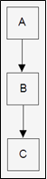

.. contents:: Table of Contents

Inheritance
==========

Inheritance
---------

Inheritance in most class-based object-oriented languages is a mechanism in which one object acquires all the properties and behaviours of the parent object. Inheritance allows programmers to: create classes that are built upon existing classes, to specify a new implementation to maintain the same behaviour (realizing an interface), to reuse code and to independently extend original software via public classes and interfaces.

The relationships of objects or classes through inheritance give rise to a directed graph.

Inheritance should not be confused with subtyping.

Inheritance is contrasted with object composition, where one object contains another object (or objects of one class contain objects of another class); see composition over inheritance. Composition implements a has-a relationship, in contrast to the is-a relationship of subtyping.

Subclasses and Superclasses
-----------

An inherited class is called a subclass of its parent class or super class.

Commonly the subclass automatically inherits the instance variables and member functions of its superclasses. The general form of defining a derived class is

.. code:: cpp

    class derived-class-name: visibility-mode base-class-name {
	    ....
    };

The colon indicates that the derived-class-name is derived from the base-class-name.

Visibility mode specifies whether the features of the base class are privately derived or publicly derived.

**The default visibility-mode is private.** The visibility-mode is optional and, if present, may be either public, private or protected.

Note:

**Inheritance doesn’t work in reverse.** The base class and its objects don’t know anything about any classes derived from the base class.

Types of Inheritance in C++
-----------

#. Single Inheritance
#. Multiple Inheritance
#. Multilevel Inheritance
#. Hierarchical Inheritance
#. Hybrid (Virtual) Inheritance

1. Single Inheritance
^^^^^^^^^^^^^^^^

One derived class is inherited from one base class only

.. code:: cpp

    class subclass_name : access_mode base_class {	
        //body of subclass
    };

2. Multiple Inheritance
^^^^^^^^^

A derived class is inherited from more than one base classes

.. code:: cpp

    class subclass_name : access_mode base_class1, access_mode base_class2, .... {
        //body of subclass
    };

For more info `05_CPP_OOP_Inheritance_Multiple_Inheritance.rst`_

3. Multilevel Inheritance
^^^^^^^^^^^^

A derived class is created from another derived class

.. code:: cpp

    class subclass_name_01 : access_mode base_class {
    	//body of subclass 01
    };
    class subclass_name_02 : access_mode subclass_name_01 {
	    //body of subclass 02
    };

4. Hierarchical Inheritance
^^^^^^^^^^^^

More than one derived class is created from a single base class
 
.. image:: ../.resources/CPP_OOP/05_hierarchical_inheritance.png

.. code:: cpp

    class subclass_name_01 : access_mode base_class {
        // body of subclass 01
    };
    class subclass_name_02 : access_mode base_class {
        // body of subclass 02
    };
    class subclass_name_03 : access_mode base_class {
        // body of subclass 03
    };

5. Hybrid (Virtual) Inheritance
^^^^^^^^^^^^^

Hybrid Inheritance is implemented by combining more than one type of inheritance

.. code:: cpp

    class subclass_name_01 : access_mode base_class {
        // body of subclass 01
    };
    class subclass_name_02 : access_mode base_class {
        // body of subclass 02
    };
    class derived_name: access_mode subclass_name_01, access_mode subclass_name_02 {
        // body of subclass
    };

Visibility of inherited members
----------

.. list-table::
    :header-rows: 1

    *   -   Base class visibility
        -   Derived class visibility
        -   
        -   

    *   -
        -   Public derivation
        -   Private derivation
        -   Protected derivation

    *   -   Private
        -   Not inherited
        -   Not inherited
        -   Not inherited

    *   -   Protected
        -   Protected
        -   Private
        -   Protected

    *   -   Public
        -   Public
        -   Private
        -   Protected

**Private members of a base class are never inherited** and thus will never become members of its derived class.

What all is Inherited?
-----------

A derived class inherits from its parent.

- Every data member defined in the parent class (although such members may not always be accessible in the derived class)
- Every ordinary member function of the parent class (although such members may not always be accessible in the derived class)
- The same initial data layout as the base class

Things which a derived class doesn’t inherits from its parent

- The base class’s constructors, destructor and operator=
- The base class’s friends

Is assignment operator inherited?
^^^^^^^^^^

In C++, assignment operator= doesn’t inherit because it performs a constructor-like activity. That is, just because you know how to assign all the members of an object on the left-hand side of the = from an object on the right-hand side doesn’t mean that assignment will still have the same meaning after inheritance.

Although, base class assignment operator function can be accessed using the derived class object.

.. code:: cpp

    #include <iostream>
    using namespace std;
    
    class Base {
        public:
        ~Base() { cout << "~Base()\n"; }
        Base() { cout << "Base()\n"; }
        Base(const Base &b) { cout << "Base(const Base &)\n"; }
        Base &operator=(const Base &b) {
            cout << "Base class assignment operator called" << '\n';
            return *this;
        }
    };
    
    class Derived : public Base {};
    
    int main() { 
        Derived d1, d2;
        Derived d3 = d1;
        Derived d4;
        d4 = d2;
        
        d1.Base::operator=(d2);
        return 0;
    }

Output::

        Base()
        Base()
        Base(const Base &)
        Base()
        Base class assignment operator called
        Base class assignment operator called
        ~Base()
        ~Base()
        ~Base()
        ~Base()

Operator overloading & inheritance
^^^^^^^^^^^^^^

Except for the assignment operator, other operators are automatically inherited into a derived class.

.. code:: cpp

    #include <iostream>
    using namespace std;
    class Base {
        public:
        Base() { cout << "Base()\n"; }
        virtual ~Base() { cout << "~Base()\n"; }
        virtual void * operator++() { cout << "Base ++ operator\n";  }
    };
    class Derived : public Base {
        public:
    };
    int main() {
        { Base b; ++b; }
        { Derived d; ++d; }
        return 0;
    }

Output::

        Base()
        Base ++ operator
        ~Base()
        Base()
        Base ++ operator
        ~Base()

Inheritance and friendship
^^^^^^^^^^

In C++, friendship is not inherited. If a base class has a friend function, then the function doesn’t become a friend of the derived classes.

.. code:: cpp

    #include <iostream>
    using namespace std; 
    class Base {
        protected:
        int x;
        public:
        Base() { x = 0;}
        friend void display();
    };
    class Derived: public Base {
        private:
        int y;
        public:
        Derived() : y (0) {}
    };
    void display() {
        Derived dobj;
        cout << "The default value of Base::x = " << dobj.x;	
        // Can't access private member declared in class 'B'
        cout << "The default value of Derived::y = " << dobj.y;
    }
    int main() {
        display();
        return 0;
    }

Compilation Error::

    error: 'int Derived::y' is private within this context

Hiding of all overloaded methods with same name in base class
^^^^^^^^^^^^^

In C++, if a derived class redefines base class member method, then all the base class methods with same name become are hidden in derived class.

For example, the following program doesn’t compile. In the following program, Derived redefines Base’s method fun() and this makes fun(int i) hidden.

**Note: This is true for both static and nonstatic methods.**

.. code:: cpp

    #include <iostream>
    using namespace std;
    class Base {
        public:
        void fun() { cout << "Base::fun() called" << endl; }
        void fun(int i) { cout << "Base::fun(int i) called" << endl; }
    };
    class Derived : public Base {
        public:
        void fun() { cout << "Derived::fun() called" << endl; }
    };
    int main() {
        Derived d;
        d.fun(5);  // CE: no matching function for call to 'Derived::fun(int)'
        return 0;
    }

Compilation Error::

    error: no matching function for call to 'Derived::fun(int)'

What happens when more restrictive access is given to a derived class method in C++?
^^^^^^^^^^^^^

Unlike Java, C++ allows to give more restrictive access to derived class methods. For example, the following program compiles fine.

In C++ we can set different access specifier for a method in derived class from base class.

Following program works fine because fun() is public in base class. 

**Access specifiers are checked at compile time** and fun() is public in base class. At run time, only the function corresponding to the pointed object is called and access specifier is not checked. 

So, a private function of derived class is being called through a pointer of base class.

.. code:: cpp

    #include <iostream>
    using namespace std;
    
    class Base {
        public:
        virtual void fun(int i) { 
            cout << "Base fun" << endl; 
        }
    };
    
    class Derived: public Base {
        private:
        void fun(int x) {	// no problem if fun is in private, it's a compiler error in Java
            cout << "Derived fun" << endl; 
        }
    };
    int main() {
        /* CASE - 1
        Derived d;
        d.fun(1);	// error: 'virtual void Derived::fun(int)' is private
        */
        
        // CASE - 2
        Base *ptr = new Derived;
        ptr->fun(10);
        return 0;
    }

Output::

    Derived fun

Does overloading work with Inheritance?
^^^^^^^^^^^^

If we have a function in base class and a function with same name in derived class, can the base class function be called from derived class object?

**Overloading doesn’t work for derived class in C++.** There is no overload resolution between Base and Derived. The compiler looks into the scope of Derived, finds the single function “double f(double)” and calls it. It never disturbs with the (enclosing) scope of Base. 

In C++, there is no overloading across scopes – derived class scopes are not an exception to this general rule.

In Java overloading works across scopes contrary to C++.

.. code:: cpp

    #include <iostream>
    using namespace std;
    class Base {
        public:
        int f(int i) {
            cout << "f(int): ";
            return i+3;
        }
    };
    class Derived : public Base {
        public:
        double f(double d) {
            cout << "f(double): ";
            return d+3.3;
        }
    };
    int main() {
        Derived* dp = new Derived;	
        cout << dp->f(3) << endl;
        cout << dp->f(3.3) << endl;
        delete dp;
        return 0;
    }

Output::

    f(double): 6.3
    f(double): 6.6

    //In Java
    f (int): 6
    f (double): 6.6 

Inheritance and static member functions
^^^^^^^^^^^^

static member functions act the same as non-static member functions

#. They inherit into the derived class
#. If you redefine a static member, all the other overloaded functions in the base class are hidden
#. If you change the signature of a function in the base class, all the base class versions with that function name are hidden

However, static member functions cannot be virtual.

Uninheritable classes
--------

A class may be declared as uninheritable by adding certain class modifiers to the class declaration. 

Examples

- "final" keyword in Java and C++11 onwards
- "sealed" keyword in C#

Such modifiers are added to the class declaration before the "class" keyword and the class identifier declaration. 

Such sealed classes restrict reusability, particularly when developers only have access to precompiled binaries and not source code.

.. code:: cpp

    class Base final { };
    class Derived : public Base { };
    int main() {
        return 0;
    }

Compilation Error::
    
    error: cannot derive from 'final' base 'Base' in derived type 'Derived'

Virtual Base Classes
------------

Virtual base class is used to avoid duplication of inherited members in case of multiple inheritance.

Example: Diamond ring problem

Virtual methods
----------

If the superclass method is a virtual method, then invocations of the superclass method will be dynamically dispatched (late binding). 

Some languages require methods to be specifically declared as virtual (e.g., C++) and in others all methods are virtual (e.g., Java). 

An invocation of a non-virtual method will always be statically dispatched (early binding i.e., the address of the function call is determined at compile-time). 

Static dispatch (early binding) is faster than dynamic dispatch (late binding) and allows optimisations such as inline expansion.

Abstract Classes
-------------

Sometimes implementation of all function cannot be provided in a base class because we don’t know the implementation. Such a class is called abstract class.

An abstract class is one that is **not used to create objects.** An abstract class is designed only to act as a base class (to be inherited by other classes).

By definition a class can only be considered as an abstract class if it has at least one pure function.

Interesting Facts

#. A class is abstract if it has at least one pure virtual function.
#. We can have pointers and references of abstract class type.
#. If we do not override the pure virtual function in derived class, then derived class also becomes abstract class.
#. An abstract class can have constructors.

Interface vs Abstract Classes
----------

An interface does not have implementation of any of its methods, it can be considered as a collection of method declarations. 

In C++, an interface can be simulated by making all methods as pure virtual. 

In Java, there is a separate keyword for interface.

Constructors in Derived Classes
-------------

As long as no base class constructor takes any arguments, the derived class need not have a constructor. 

If any base class contains a constructor with one or more arguments, then it is mandatory for the derived class to have a constructor and pass the arguments to the base class constructors.

Why the base class’s constructor is called on creating an object of derived class?
^^^^^^^^^^^^^^^^

When we create an object of derived class, all of the members of derived class must be initialized but the inherited members in derived class can only be initialized by the base class’s constructor as the definition of these members exists in base class only. This is why the constructor of base class is called first to initialize all the inherited members.

Important Points

- Whenever the derived class’s default constructor is called, the base class’s default constructor is called automatically.
- To call the parameterised constructor of base class inside the parameterised constructor of sub class, we have to mention it explicitly.
- The parameterised constructor of base class cannot be called in default constructor of sub class, it should be called in the parameterised constructor of sub class.

Order of Constructor/ Destructor Call in C++
^^^^^^^^^^^^^^

The base constructor is executed first and then the constructor in the derived class is executed.

In case of multiple inheritance: base classes are constructed in the order in which they appear in the declaration of the derived class. 

In case of multilevel inheritance: the constructors will be executed in the order pf inheritance.

Constructors for virtual base classes are invoked before any non-virtual base classes.

If there are multiple virtual base classes, they are invoked in the order in which they are declared.

**Destructors in C++ are called in the opposite order of that of Constructors.**

.. list-table::
    :header-rows: 1

    *   -   Method of Inheritance
        _   Order of execution

    *   -
            .. code:: cpp

                class D: public B {
                };

        -   | B(): Base constructor
            | D(): Derived constructor

    *   -   
            .. code:: cpp

                class D: public B1, public B2 {
                };

        -   | B1(): base first
            | B2(): base second
            | D(): derived

    *   -   
            .. code:: cpp

                class D: public B1, virtual public B2 {
                };
                
        -   | B2(): virtual base
            | B1(): ordinary base
            | D(): derived

Applications
------

1. Overriding
^^^^^^^^^

2. Code reuse
^^^^^^^^^^^

Issues and alternatives
---------------

Object Slicing in C++
----------------------

In C++, **a derived class object can be assigned to a base class object,** but the other way is not possible.

Object slicing happens when a derived class object is assigned to a base class object, additional attributes of a derived class object are sliced off to form the base class object.

.. code:: cpp

    #include <iostream>
    using namespace std;
    
    class Base {
        int m_idb;
        public:
        Base(int id) : m_idb{id} { }
        virtual void display() { cout << "Base class = " << m_idb << '\n'; }
    };
    
    class Derived : public Base {
        int m_idd;
        public:
        Derived(int d) : Base(d), m_idd(d) { }
        virtual void display() { Base::display(); cout << "Derived class = " << m_idd << '\n'; }
    };
    
    void baseClassObjectAsParameter(Base bobj) { bobj.display();
    void derivedClassObjectAsParameter(Derived dobj) { dobj.display(); }
    
    int main() {
    
        Base b(1);
        Derived d(2);
        b.display();
        d.display();

        cout << "=== Object Slicing ===\n";
        baseClassObjectAsParameter(b);
        baseClassObjectAsParameter(d); //object Slicing, the member m_idd of Derived is sliced off

        // Base class object can not be assigned to Derived class object
        // error: could not convert 'b' from 'Base' to 'Derived'
        //derivedClassObjectAsParameter(b);
        return 0;
    }
    
    
Output::

        Base class = 1
        Base class = 2
        Derived class = 2
        === Object Slicing ===
        Base class = 1
        Base class = 2
        

How to avoid Object Slicing in C++
^^^^^^^^^^^^^^^^^^^^^

1. Using pointers or reference
~~~~~~~~~~~~~~~~~~~~~~~~

Object slicing doesn’t occur when pointers or references to objects are passed as function arguments since a pointer or reference of any type takes same amount of memory.

For example, following method baseClassObjectAsParameter() will not cause object slicing 

.. code:: cpp

    void baseClassObjectAsParameter(Base & bobj) { bobj.display(); }
    // rest of code is similar to above

Output::

    Base class = 1
    Base class = 2
    Derived class = 2
    === Object Slicing ===
    Base class = 1
    Base class = 2
    Derived class = 2

If we use pointers, then also object slicing can be avoided.

.. code:: cpp

    void baseClassObjectAsParameter(Base * bobj) { bobj->display(); }
    // rest of code is similar to above 
    int main() {
        …
        baseClassObjectAsParameter(&b);
        baseClassObjectAsParameter(&d);
        …	
        return 0;
    }

Output::

        Base class = 1
        Base class = 2
        Derived class = 2
        === Object Slicing ===
        Base class = 1
        Base class = 2
        Derived class = 2

2. Using pure virtual function
~~~~~~~~~~~~~~~~~~~~~~~~~~~~

Object slicing can be prevented by making the base class function pure virtual there by disallowing object creation. It is not possible to create the object of a class which contains a pure virtual method.

Simulating final class in C++
-----------------------------

- "final" keyword in Java and C++11 onwards
- "sealed" keyword in C#

final class in C++ can be created by use of private constructor, virtual inheritance and friend class. 

In following example, we make the Final class non-inheritable. When a class Derived tries to inherit from it, we get compilation error.

An extra class MakeFinal (whose default constructor is private) is used for our purpose. Constructor of Final can call private constructor of MakeFinal as Final is a friend of MakeFinal.

Note that MakeFinal is also a virtual base class. The reason for this is to call the constructor of MakeFinal through the constructor of Derived, not Final **(The constructor of a virtual base class is not called by the class that inherits from it, instead the constructor is called by the constructor of the concrete class).**

.. code:: cpp

    #include <iostream>
    using namespace std;
    
    class Final;	// The class to be made final
    
    class MakeFinal {	// used to make the Final class final
    
        private:
        MakeFinal() { cout << "MakFinal constructor" << '\n'; }
        
        friend class Final;
    };
    
    class Final : virtual MakeFinal {
        public:
        Final() { cout << "Final constructor" << '\n'; }
    };
    
    class Derived : public Final {	// compile error
        public:
        Derived() { cout << "Derived constructor" << '\n'; }
    };
    
    int main() { return 0; }

Output::

        <source>: In constructor 'Derived::Derived()':
        <source>:18:15: error: 'MakeFinal::MakeFinal()' is private within this context
           18 |     Derived() { cout << "Derived constructor" << '\n'; }
              |               ^
        <source>:8:5: note: declared private here
            8 |     MakeFinal() { cout << "MakFinal constructor" << '\n'; }
              |     ^~~~~~~~~

Derived‘s constructor directly invokes MakeFinal’s constructor, and the constructor of MakeFinal is private, therefore we get the compilation error.
The object of Final class as it is friend class of MakeFinal and has access to its constructor. For example, the following program works fine.

.. code:: cpp

    #include <iostream>
    using namespace std;
    
    class Final;  // The class to be made final
    
    class MakeFinal {  // used to make the Final class final
        private:
        MakeFinal() { cout << "MakFinal constructor" << '\n'; }
        friend class Final;
    };
    class Final : virtual MakeFinal {
        public:
        Final() { cout << "Final constructor" << '\n'; }
    };
    int main() {
        Final fobj;
        return 0;
    }

Output::

    MakFinal constructor
    Final constructor

Aggregation: Classes Within Classes
-----------------------------------

Aggregation is not directly related to inheritance, both aggregation and inheritance are class relationships that are more specialized than associations.

In Inheritance, if a class B is derived by inheritance from a class A, we can say that “B is a kind of A.” For this reason, **inheritance is often called a “is a kind of” relationship.** Example: starling is a kind of bird.

**Aggregation is called a “has a” relationship.** Aggregation is also called a “part-whole” relationship. Example: the book is part of the library.

In OOP, aggregation may occur when one object is an attribute of another. Here’s a case where an object of class A is an attribute of class B:

.. code:: cpp

    class A { };
    class B {
        A objA;	//define objA as an object of class A
    };

In the UML, aggregation is considered a special kind of association. 

Sometimes it’s hard to tell when an association is also an aggregation. It’s always safe to call a relationship an association, but if class A contains objects of class B, and is organizationally superior to class B, it’s a good candidate for aggregation.

Aggregation is shown in the same way as association in UML class diagrams, except that the “whole” end of the association line has an open diamond-shaped arrowhead.

 
UML class diagram showing aggregation

Composition: A Stronger Aggregation
-----------------------------------

Composition is a stronger form of aggregation. It has all the characteristics of aggregation, plus two more

- The part may belong to only one whole.
- The lifetime of the part is the same as the lifetime of the whole.

A car is composed of doors (among other things). The doors can’t belong to some other car, and they are born and die along with the car. 

Even a single object can be related to a class by composition. In a car there is only one engine.

While aggregation is a “has a” relationship, composition is a “consists of” relationship. 

In UML diagrams, composition is shown in the same way as aggregation, except that the diamond-shaped arrowhead is solid instead of open.

 
UML class diagram showing composition.

Choosing Composition vs. Inheritance
-------------------------------------

The is-a relationship is expressed with inheritance, and the has-a relationship is expressed with composition.

Composition is generally used when you want the features of an existing class inside your new class, but not its interface. That is, you embed an object to implement features of your new class, but the user of your new class sees the interface you’ve defined rather than the interface from the original class. To do this, you follow the typical path of embedding private objects of existing classes inside your new class.

Subtyping
^^^^^^^^^

What if you want everything in the class to come through?

This is called subtyping because you’re making a new type from an existing type, and you want your new type to have exactly the same interface as the existing type (plus any other member functions you want to add), so you can use it everywhere you’d use the existing type. This is where inheritance is essential. You can see that subtyping solves the problem in the preceding example perfectly.

.. code:: cpp

        #include <fstream>
        #include <iostream>
        #include <string>
        #include <cassert>
        using namespace std;

        class MyFileName : public ifstream {
            string fileName;
            bool named;
           public:
            MyFileName() : named(false) {}
            MyFileName(const string& fname) : ifstream(fname.c_str()), fileName(fname) {
                assert(*this);
                named = true;
            }
            string name() const { return fileName; }
            void name(const string& newName) {
                if(named)   return; // Don't overwrite
                fileName = newName;
                named = true;
            }
        };

        int main(int argc, char * argv[]) {
            MyFileName file(argv[1]);
            cout << "name: " << file.name() << '\n';
            assert(file);   // to assure file is open

            string s;
            getline(file, s);   // These work too! bcoz MyFileName is a type of ifstream
            file.seekg(-200, ios::end);
            file.close();
            
            return 0;
        }
        
Output::

        name: example.cpp

Private Inheritance
^^^^^^^^^^^^^^^^^^

When you inherit privately, you’re “implementing in terms of;” that is, you’re creating a new class that has all of the data and functionality of the base class, but that functionality is hidden, so it’s only part of the underlying implementation.

There may occasionally be situations where you want to produce part of the same interface as the base class and disallow the treatment of the object as if it were a base-class object. Private inheritance provides this ability.

You should think carefully before using private inheritance instead of composition; private inheritance has particular complications when combined with runtime type identification (RTTI).

Protected Inheritance
^^^^^^^^^^^^^^^^^^^^^

Protected derivation means “implemented-in-terms-of” to other classes but “is-a” for derived classes and friends.

Upcasting
----------

The act of converting a derived class reference or pointer into a base class reference or pointer is called upcasting.

Why “upcasting?”
^^^^^^^^^^^^^^

Upcasting is always safe because you’re going from a more specific type to a more generic type – the only thing that can occur to the class interface is that it can lose member functions, not gain them. This is why the compiler allows upcasting without any explicit casts or other special notation.

Upcasting and the Copy-constructor
^^^^^^^^^^^^^^^^^^^^^^^^^^^^^^^^^

If you allow the compiler to synthesize a copy-constructor for a derived class, it will automatically call the base-class copy constructor, and then the copy-constructors for all the member objects (or perform a bitcopy on built-in types) so you’ll get the right behaviour. 

If you cast to a base-class object instead of a reference you will usually get undesirable results.

You can see that Child has no explicitly-defined copy-constructor. The compiler then synthesizes the copy-constructor by calling the Parent copy-constructor and the Member copy-constructor. If you try to write your own copy-constructor for Child and you make an innocent mistake and do it badly

.. code:: cpp

    Child(const Child& c) : i(c.i), m(c.m) { }

then the default constructor will automatically be called for the base-class part of Child, since that’s what the compiler falls back on when it has no other choice of constructor to call.

You must remember to properly call the base-class copy-constructor (as the compiler does) whenever you write your own copy-constructor. This can seem a little strange looking at first but it’s another example of upcasting:

.. code:: cpp

        Child(const Child& c) : Parent(c), i(c.i), m(c.m) {
            cout << "Child(Child&)\n";
        }

The strange part is where the Parent copy-constructor is called: Parent(c). What does it mean to pass a Child object to a Parent constructor? But Child is inherited from Parent, so a Child reference is a Parent reference. The base-class copy-constructor call upcasts a reference to Child to a reference to Parent and uses it to perform the copy-construction. When you write your own copy constructors, you’ll almost always want to do the same thing.

Composition vs. Inheritance (revisited)
^^^^^^^^^^^^^^^^^^^^^^^^^^^

Composition: If you’ll never need to upcast from your new class
Inheritance: 

Pointer & reference upcasting
^^^^^^^^^^^^^^^^^^^^^

Upcasting can also occur during a simple assignment to a pointer or reference

.. code:: cpp

    Derived dobj;
    Base * bptr = &dobj;    // Upcasting
    Base & bref = dobj;     // Upcasting

Like the function call, neither of these cases requires an explicit cast.

References
-----------

https://www.geeksforgeeks.org/c-plus-plus/#Inheritance
Chapter 17 Inheritance | https://www.learncpp.com/
Thinking in C++, Volume 1, 2nd Edition

