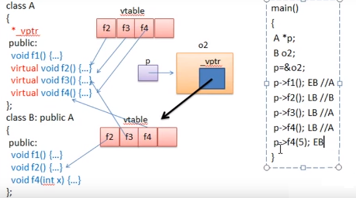

.. contents:: Table of Contents

Polymorphism and Virtual Functions
==================================

Polymorphism
------------

Polymorphism means one name many forms. It has two types

#. Static Polymorphism
#. Dynamic Polymorphism

**Static polymorphism** is achieved using method overloading.

**Dynamic polymorphism** using method overriding. It is closely related to inheritance. We can write a code that works on the superclass, and it will work with any subclass type as well.

This chapter deals with Dynamic polymorphism. 

Consider following code

.. code:: cpp

        #include <iostream>
        using namespace std;

        typedef enum note { middleC, Csharp, Eflat } note_t;

        class Instrument {
           public:
            void play(note_t) const { cout << "Instrument::play\n"; }
        };

        // Wind objects are Instruments because they have the same interface:
        class Wind : public Instrument {
           public:
            // Redefine interface function
            void play(note_t) const { cout << "Wind::play\n"; }
        };

        void tune(Instrument& i) { i.play(middleC); }

        int main() {
            Wind flute;
            tune(flute);  // Upcasting
            return 0;
        }

Output::

        Instrument::play

**Problem**

The output is Instrument::play. This is clearly not the desired output, because you happen to know that the object is actually a Wind and not just an Instrument. The call should produce Wind::play.

Function call binding
-----------------

Connecting a function call to a function body is called binding.

#. **Early binding:** When binding is performed before the program is run (by the compiler and linker), it’s called early binding.
#. **Late binding:** Late binding, which means the binding occurs at runtime, based on the type of the object. Late binding is also called **dynamic binding or runtime binding.**

Virtual Functions
-----------------

The virtual function allows one type to express its distinction from another, similar type, as long as they’re both derived from the same base type. This distinction is expressed through differences in behaviour of the functions that you can call through the base class.

To cause late binding to occur for a particular function, C++ requires that you **use the virtual keyword when declaring the function in the base class.** Late binding occurs only with virtual functions, and only when you’re using an address of the base class where those virtual functions exist, although they may also be defined in an earlier base class.

To create a member function as virtual, simply precede the declaration of the function with the keyword virtual. **Only the declaration needs the virtual keyword, not the definition. If a function is declared as virtual in the base class, it is virtual in all the derived classes.** The redefinition of a virtual function in a derived class is usually called overriding.

Notice that you are only required to declare a function virtual in the base class. All derived-class functions that match the signature of the base-class declaration will be called using the virtual mechanism. You can use the virtual keyword in the derived-class declarations (it does no harm to do so), but it is redundant and can be confusing.

Resolution of the problem in above program, add the virtual keyword in the base class before play().

**The virtual mechanism is ignored inside constructor or destructor, only local version of function is called from inside constructor or destructor.**

.. code:: cpp

        #include <iostream>
        using namespace std;

        typedef enum note { middleC, Csharp, Eflat } note_t;

        class Instrument {
           public:
            virtual void play(note_t) const { cout << "Instrument::play\n"; }
        };

        // Wind objects are Instruments because they have the same interface:
        class Wind : public Instrument {
           public:
            // Redefine interface function
            void play(note_t) const { cout << "Wind::play\n"; }
        };

        void tune(Instrument& i) { i.play(middleC); }

        int main() {
            Wind flute;
            tune(flute);  // Upcasting
            return 0;
        }

Output::

        Wind::play

Now output is as expected.

How C++ implements late binding
-----------------------------

Late-binding mechanism is implemented by creating virtual functions

Keyword virtual tells the compiler it should not perform early binding. Instead, it should automatically install all the mechanisms necessary to perform late binding.

Compiler creates a single table (called the VTABLE) for each class that contains virtual functions. The compiler places the addresses of the virtual functions for that particular class in the VTABLE. In each class with virtual functions, it secretly places a pointer, called the vpointer (abbreviated as VPTR), which points to the VTABLE for that object. 

When you make a virtual function call through a base-class pointer (that is, when you make a polymorphic call), the compiler quietly inserts code to fetch the VPTR and look up the function address in the VTABLE, thus calling the correct function and causing late binding to take place.

The proper function gets called for an object, even if the compiler cannot know the specific type of the object.

Storing type information
^^^^^^^^^^^^^^^^^^^^^^^^

There is no explicit type information stored in any of the classes.

There must be some sort of type information stored in the objects; otherwise, the type could not be established at runtime. This is true, but the type information is hidden.

Example: check size difference of classes with non-virtual and virtual functions

.. code:: cpp

        #include <iostream>
        using namespace std;
        class NonVirtual {
           public:
            void display() { cout << "NonVirtual\n"; }
        };
        class Virtual {
           public:
            virtual void display() { cout << "Virtual\n"; }
        };
        int main() {
            cout << "sizeof(NonVirtual) " << sizeof(NonVirtual) << '\n';
            cout << "sizeof(Virtual) " << sizeof(Virtual) << '\n';
            return 0;
        }

Output::

        sizeof(NonVirtual) 1
        sizeof(Virtual) 8		// size is different because of vptr

Picturing virtual functions
^^^^^^^^^^^^^^^^^^^^^^^^

Each time you create a class that contains virtual functions, or you derive from a class that contains virtual functions, the compiler creates a unique VTABLE for that class.

Then it places the VPTR into the class. There is only one VPTR for each object when using simple inheritance. The VPTR must be initialized to point to the starting address of the appropriate VTABLE. (This happens in the constructor.) Once the VPTR is initialized to the proper VTABLE, the object in effect “knows” what type it is.

 
**How to call p->f3()?**

When o2 is constructed it VPTR of class B is initialized to point to address of VTABLE of B class

When p->f3() is called function present at VPTR+1 is called (in case of early binding A::f3() will be called)

The compiler generates code that uses a simple numerical offset into the VTABLE to select the virtual function. Regardless of the specific subtype the object belongs to, its VTABLE is laid out the same way, so calls to the virtual functions will always be made the same way.

.. code:: cpp

        #include <iostream>
        using namespace std;

        class Base {
           public:
            virtual ~Base() {}
            void f1() { cout << "Base f1\n"; }
            virtual void f2() { cout << "Base virtual f2\n"; }
            virtual void f3() { cout << "Base virtual f3\n"; }
            virtual void f4() { cout << "Base virtual f4\n"; }
        };

        class Derived : public Base {
           public:
            void f1() { cout << "Derived f1\n"; }
            void f2() { cout << "Derived virtual f2\n"; }
            void f4(int ) { cout << "Derived f4\n"; }
        };

        int main(void) {
            Base *ptr_b = new Derived;

            ptr_b->f1();
            ptr_b->f2();
            ptr_b->f3();
            ptr_b->f4();
            //ptr_b->f4(5); // error: no matching function for call to 'Base::f4(int)'
            ((Derived *)ptr_b)->f4(5);              		// downcast
            dynamic_cast<Derived *>(ptr_b)->f4(5);	// downcast
            delete ptr_b;
            return 0;
        }

Output::

        Base f1
        Derived virtual f2
        Base virtual f3
        Base virtual f4
        Derived f4
        Derived f4

Compiler is doing its job by protecting you from making virtual calls to functions that exist only in base classes.

If you want to call a function that only exists in that subclass, then you must cast the pointer.

RTTI is all about casting base-class pointers down to derived-class pointers (“up” and “down” are relative to a typical class diagram, with the base class at the top). Casting up happens automatically, with no coercion, because it’s completely safe. Casting down is unsafe because there’s no compile time information about the actual types, so you must know exactly what type the object is. If you cast it into the wrong type, you’ll be in trouble.

Under the hood (Assembly Level)
^^^^^^^^^^^^^^^^^^^^^^^^^^^^

When function is called all the arguments along with this pointer are pushed on the stack

So, you’ll always see one more than the number of arguments pushed on the stack before a member function call (except for static member functions, which have no this).

Now the actual virtual function call must be performed. First, the VPTR must be produced, so the VTABLE can be found. For this compiler the VPTR is inserted at the beginning of the object, so the contents of this correspond to the VPTR.

Once the address of the proper function pointer in the VTABLE is calculated, that function is called.

Installing the v-pointer
^^^^^^^^^^^^^^^^^^^^^

VPTR determines the virtual function behaviour of the object. You cannot make a call to a virtual function before the VPTR is properly initialized. The place where initialization can be guaranteed is in the constructor.

That’s why virtual functions should not be called from inside constructor.

Objects are different
^^^^^^^^^^^^^^^^^^^

Upcasting deals only with addresses. If the compiler has an object, it knows the exact type and therefore (in C++) will not use late binding for any function calls – or at least, the compiler doesn’t need to use late binding.

.. code:: cpp

        #include <iostream>
        #include <string>
        using namespace std;

        class Pet {
            public:
            virtual string speak() const { return ""; }
        };

        class Dog : public Pet {
            public:
            string speak() const { return "Bark!"; }
        };

        int main() {
            Dog ralph;
            Pet* p1 = &ralph;
            Pet& p2 = ralph;
            Pet p3;
            
            // Late binding for both:
            cout << "p1->speak() = " << p1->speak() <<endl;
            cout << "p2.speak() = " << p2.speak() << endl;
            
            // Early binding (probably)
            cout << "p3.speak() = " << p3.speak() << endl;
            return 0;
        }

Output::

        p1->speak() = Bark!
        p2.speak() = Bark!
        p3.speak() = 

In p1–>speak() and p2.speak( ), addresses are used, which means the information is incomplete: p1 and p2 can represent the address of a Pet or something derived from Pet, so the virtual mechanism must be used. 

When calling p3.speak( ) there’s no ambiguity. The compiler knows the exact type and that it’s an object, so it can’t possibly be an object derived from Pet – it’s exactly a Pet. Thus, early binding is probably used. However, if the compiler doesn’t want to work so hard, it can still use late binding and the same behaviour will occur.

Why virtual functions?
-----------------------

Instead of one simple CALL to an absolute address, there are two – more sophisticated – assembly instructions required to set up the virtual function call. This requires both code space and execution time.

The virtual keyword is provided for efficiency tuning. If you’re going to use polymorphism, use virtual functions everywhere.

Override specifier (since C++11)
---------------------

Specifies that a virtual function overrides another virtual function.

In a member function declaration or definition, override specifier ensures that the function is virtual and is overriding a virtual function from a base class. The program is ill-formed (a compile-time error is generated) if this is not true.

Override is an identifier with a special meaning when used after member function declarators: it's not a reserved keyword otherwise.

When compiler comes across override keyword it checks for base class to check function with exact signature, if there is no such function it shows an error.

.. code:: cpp

	#include <iostream>
	using namespace std;

	class Base {
	   public:
	    virtual ~Base() {}
	    void fun() { cout << "Base fun\n"; }
	    virtual void fun(int) { cout << "Base fun(int)\n"; }
	};

	class Derived : public Base {
	   public:
	    void fun() { cout << "Derived fun\n"; }
	    void fun(int) override { cout << "Derived fun(int)\n"; }

	    // error: 'void Derived::fun(std::string)' marked 'override', but does not override
	    // void fun(string ) override { cout << "Derived fun(string)\n"; }
	    void fun(string ) { cout << "Derived fun(string)\n"; }

	};

	int main(void) {
	    Base *bp = new Derived;
	    bp->fun();
	    bp->fun(5);
	    dynamic_cast<Derived *>(bp)->fun("sample string");
	    delete bp;
	    return 0;
	}

Output::

	Base fun
	Derived fun(int)
	Derived fun(string)

Abstract base classes and pure virtual functions
------------------------------------------

If you want the base class to present only an interface for its derived classes. That is, you don’t want anyone to actually create an object of the base class, only to upcast to it so that its interface can be used.

This is accomplished by making that class abstract, which happens if you give it **at least one pure virtual function.** A pure virtual function uses the virtual keyword and is followed by = 0. When an abstract class is inherited, all pure virtual functions must be implemented, or the inherited class becomes abstract as well.

.. code:: cpp

        virtual void f() = 0;

By doing this, you tell the compiler to reserve a slot for a function in the VTABLE, but not to put an address in that particular slot. Even if only one function in a class is declared as pure virtual, the VTABLE is incomplete.

If the VTABLE for a class is incomplete, what is the compiler supposed to do when someone tries to make an object of that class? It cannot safely create an object of an abstract class, so you get an error message from the compiler.

**Prevent object slicing**

Pure virtual functions prevent an abstract class from being passed into a function by value. Thus, it is also a way to prevent object slicing. By making a class abstract, you can ensure that a pointer or reference is always used during upcasting to that class.

Pure virtual definitions
^^^^^^^^^^^^^^^^^^^^^^^^

It’s possible to provide a definition for a pure virtual function in the base class. You’re still telling the compiler not to allow objects of abstract base class, and the pure virtual functions must still be defined in derived classes in order to create objects.

Inline pure virtual definition is not possible.

Benefit to this feature is that it allows you to change from an ordinary virtual to a pure virtual without disturbing the existing code.

.. code:: cpp

        #include <iostream>
        using namespace std;
        class AbstractBaseClass {
           public:
            virtual ~AbstractBaseClass() {}
            void fun() { cout << "AbstractBaseClass::fun\n"; }
            virtual void pvirtual_fun() = 0;
        };
        void AbstractBaseClass::pvirtual_fun() {
            cout << "AbstractBaseClass::pvirtual_fun\n";
        }
        class Derived : public AbstractBaseClass {
           public:
            void pvirtual_fun() { cout << "Derived::pvirtual_fun\n"; }
        };
        int main() {
            // error: cannot declare variable 'obj' to be of abstract type
            // 'AbstractBaseClass' AbstractBaseClass obj;

            AbstractBaseClass* ptr = new Derived;
            ptr->fun();
            ptr->pvirtual_fun();
            delete ptr;
            return 0;
        };

Output::

        AbstractBaseClass::fun
        Derived::pvirtual_fun

Upcasting
---------

An object can be used as its own type or as an object of its base type. In addition, it can be manipulated through an address of the base type. 

Taking the address of an object (either a pointer or a reference) and treating it as the address of the base type is called upcasting because of the way inheritance trees are drawn with the base class at the top.

.. code:: cpp

        #include <iostream>
        using namespace std;

        class Base {
            public:
            void f() { cout << "Base::f()\n"; }
        };

        class Derived : public Base {
            public:
            void f() { cout << "Derived::f()\n"; }
        };

        void fun(Base & refB) { refB.f(); }

        int main() {
            Derived objD;
            fun(objD);
            return 0;
        }

Output::

        Base::f()	// because the passed arguent to fun has been upcast to base class

Object slicing
^^^^^^^^^^^

When upcasting to an object instead of a pointer or reference, the object is “sliced” until all that remains is the sub object that corresponds to the destination type of your cast.

The compiler knows the precise type of the object because the Derived object has been forced to become a Base object. When passing by value, the copy-constructor for a Base object is used, which initializes the VPTR to the Base VTABLE and copies only the Base parts of the object. There’s no explicit copy-constructor here, so the compiler synthesizes one. Under all interpretations, the object truly becomes a Base during slicing.

Object slicing actually removes part of the existing object as it copies it into the new object, rather than simply changing the meaning of an address as when using a pointer or reference.

The compiler would prevent object slicing if a pure virtual function is present in base class, because that wouldn’t allow you to “create” an object of the base type (which is what happens when you upcast by value). This could be the most important value of **pure virtual functions: to prevent object slicing** by generating a compile-time error message if someone tries to do it.

.. code:: cpp

        #include <iostream>
        using namespace std;

        class Base {
            public:
            virtual void fun() = 0;
        };
        void Base::fun(){ cout << "Virtual Base::fun\n"; }

        class Derived : public Base {
            public:
            void fun(){ cout << "Virtual Derived::fun\n"; }
        };

        void fun(Base b_obj) { cout << "Inside fun\n"; b_obj.fun(); }	

        int main(void) {
            Derived d_obj;
            fun(d_obj);
            return 0;
        }

Compiler Error::

        <source>:15:15: error: cannot declare parameter 'b_obj' to be of abstract type 'Base'
           15 | void fun(Base b_obj) { cout << "Inside fun\n"; b_obj.fun(); }
              |          ~~~~~^~~~~
        <source>:4:7: note:   because the following virtual functions are pure within 'Base':
            4 | class Base {
              |       ^~~~
        <source>:8:6: note:     'virtual void Base::fun()'
            8 | void Base::fun(){ cout << "Virtual Base::fun\n"; }
              |      ^~~~
        <source>: In function 'int main()':
        <source>:19:12: error: cannot allocate an object of abstract type 'Base'
           19 |         fun(d_obj);
              |         ~~~^~~~~~~

Downcasting
---------

Upcasting is easy since as you move up an inheritance hierarchy the classes always converge to more general classes. That is, when you upcast you are always clearly derived from an ancestor class (typically only one, except in the case of multiple inheritance).

When you downcast there are usually several possibilities that you could cast to. More specifically, a Circle is a type of Shape (that’s the upcast), but if you try to downcast a Shape it could be a Circle, Square, Triangle, etc. So, the dilemma is figuring out a way to safely downcast.

**dynamic_cast**

To cast down to a particular type, the return value will be a pointer to the desired type only if the cast is proper and successful, otherwise it will return zero to indicate that this was not the correct type.

dynamic_cast uses information stored in the VTABLE to determine the actual type.

In addition, static_cast won’t allow you to cast out of the hierarchy, as the traditional cast will, so it’s safer.

Overloading & overriding
----------------------

Redefining an overloaded function in the base class hides all of the other base-class versions of that function.

When virtual functions are involved, the behaviour is a little different.

The compiler will not allow you to change the return type of an overridden function (it will allow it if f() is not virtual).

This is an important restriction because the compiler must guarantee that you can polymorphically call the function through the base class, and if the base class is expecting an int to be returned from f(), then the derived-class version of f() must keep that contract or else things will break.

Override rule still works, if you override one of the overloaded member functions in the base class, the other overloaded versions become hidden in the derived class.

.. code:: cpp

        #include <iostream>
        #include <string>
        using namespace std;

        class Base {
           public:
            virtual int f() const { cout << "Base::f()\n"; return 1; }
            virtual void f(string) const { cout << "Base::f(string)\n"; }
            virtual void g() const { cout << "Base::g()\n"; }
        };

        class Derived1 : public Base {
           public:
            void g() const { cout << "Derived1::g()\n"; }
        };

        class Derived2 : public Base {
           public:
            // Overriding a virtual function:
            int f() const { cout << "Derived2::f()\n"; return 2; }
        };

        class Derived3 : public Base {
           public:
        /*
        <source>:40:10: error: conflicting return type specified for 'virtual void Derived3::f() const'
           40 |     void f() const{ cout << "Derived3::f()\n";}
              |          ^
        <source>:7:17: note: overridden function is 'virtual int Base::f() const'
            7 |     virtual int f() const {
              | 

        */
            //void f() const{ cout << "Derived3::f()\n"; } // can not change return type
        };

        class Derived4 : public Base {
           public:
            // Change argument list:
            int f(int) const { cout << "Derived4::f(int)\n"; return 4; }
        };

        int main() {
            string s("hello");
            Derived1 d1;
            int x = d1.f();
            d1.f(s);

            Derived2 d2;
            x = d2.f();

            // error: no matching function for call to 'Derived2::f(std::string&)'
            //d2.f(s);      // string version hidden 
            

            Derived4 d4;
            x = d4.f(1);
            
            // error: no matching function for call to 'Derived4::f()'
            //x = d4.f();     // f() version hidden

            Base& br = d4;  // Upcast
            br.f();   // Base version available
            br.f(s);  // Base version abailable

            // error: no matching function for call to 'Base::f(int)'
            //br.f(1); // Derived version unavailable
            ((Derived4 &)br).f(1);                  // Downcast
            dynamic_cast<Derived4 &>(br).f(1);      // Downcast
            return 0;
        }

Output::

        Base::f()
        Base::f(string)
        Derived2::f()
        Derived4::f(int)
        Base::f()
        Base::f(string)
        Derived4::f(int)
        Derived4::f(int)

Variant return type
^^^^^^^^^^^^^^^^^^^^

There is a special case in which you can slightly modify the return type. If you’re returning a pointer or a reference to a base class, then the overridden version of the function may return a pointer or reference to a class derived from what the base returns.

.. code:: cpp

        #include <iostream>
        #include <string>
        using namespace std;

        class PetFood {
            public:
            virtual string foodType() const = 0;
        };

        class Pet {
            public:
            virtual string type() const = 0;
            virtual PetFood* eats() = 0;
        };

        class Bird : public Pet {
            public:
            string type() const { return "Bird"; }
            
            class BirdFood : public PetFood {
                public:
                string foodType() const { return "Bird food"; }
            };
            
            // Upcast to base type:
            PetFood* eats() { return &bf; }
            
            private:
            BirdFood bf;
        };

        class Cat : public Pet {
            public:
            string type() const { return "Cat"; }
            
            class CatFood : public PetFood {
                public:
                string foodType() const { return "Cat food"; }
            };
            
            // Return exact type instead:
            CatFood* eats() { return &cf; }
            
            private:
            CatFood cf;
        };
        int main() {
            Bird b;
            Cat c;
            Pet* p[] = { &b, &c, };
            
            for(int i = 0; i < sizeof p / sizeof *p; i++)
                cout << p[i]->type() << " eats " << p[i]->eats()->foodType() << endl;

            // Can return the exact type:
            Cat::CatFood* cf = c.eats();
            Bird::BirdFood* bf;
            
            // Cannot return the exact type:
            //bf = b.eats();		// CE: error: invalid conversion from 'PetFood*' to 'Bird::BirdFood*' [-fpermissive]
            
            // Must downcast:
            bf = dynamic_cast<Bird::BirdFood*>(b.eats());
            
            cout << bf->foodType() << endl;
            cout << cf->foodType() << endl;
            return 0;
        }

Output::

        Bird eats Bird food
        Cat eats Cat food
        Bird food
        Cat food

Virtual functions & constructors
---------------------------

Compiler inserts hidden code into constructor function. Not only must it initialize the VPTR, it must also check the value of this (in case the operator new returns zero) and call base-class constructors.

Order of constructor calls
^^^^^^^^^^^^^^^^^^^^

All base-class constructors are always called in the constructor for an inherited class.

Behaviour of virtual functions inside constructors
^^^^^^^^^^^^^^^^^^^^^^^^^^^^^^^^^^

If you call a virtual function inside a constructor, only the local version of the function is used. That is, the virtual mechanism doesn’t work within the constructor.

This behaviour makes sense for two reasons. 

#. Conceptually, the constructor’s job is to bring the object into existence Inside any constructor, the object may only be partially formed – you can only know that the base-class objects have been initialized, but you cannot know which classes are inherited from you.

#. When a constructor is called, one of the first things it does is initialize its VPTR. However, it can only know that it is of the “current” type – the type the constructor was written for. The constructor code is completely ignorant of whether or not the object is in the base of another class. When the compiler generates code for that constructor, it generates code for a constructor of that class, not a base class and not a class derived from it (because a class can’t know who inherits it). So, the VPTR it uses must be for the VTABLE of that class.

For example, check `Virtuals in destructors`_

Destructors and virtual destructors
----------------------------

You cannot use the virtual keyword with constructors, but destructors can and often must be virtual.

Each destructor knows what its class is derived from, but not what is derived from it.

Forgetting to make a destructor virtual is an insidious bug because it often doesn’t directly affect the behaviour of your program, but it can quietly introduce a memory leak.

It is possible for the destructor to be virtual because the object already knows what type it is (whereas it doesn’t during construction). Once an object has been constructed, its VPTR is initialized, so virtual function calls can take place.

Pure virtual destructors
^^^^^^^^^^^^^^^^^^^^^^

While pure virtual destructors are legal in Standard C++, there is an added constraint when using them: **you must provide a function body for the pure virtual destructor.**

If you could leave off the definition for a pure virtual destructor, what function body would be called during destruction? Thus, it’s absolutely necessary that the compiler and linker enforce the existence of a function body for a pure virtual destructor.

The only difference you’ll see between the pure and non-pure virtual destructor is that the pure virtual destructor does cause the base class to be abstract, so you cannot create an object of the base class (although this would also be true if any other member function of the base class were pure virtual).

**What is the point of a pure virtual destructor?**

Unlike an ordinary pure virtual function, you must give it a function body. In a derived class, you aren’t forced to provide a definition since the compiler synthesizes the destructor for you.

**What’s the difference between a regular virtual destructor and a pure virtual destructor?**

The only distinction occurs when you have a class that only has a single pure virtual function: the destructor. In this case, the only effect of the purity of the destructor is to prevent the instantiation of the base class.

.. code:: cpp

        #include <iostream>
        using namespace std;

        class Base {
           public:
            virtual ~Base() = 0;
        };
        Base::~Base() { cout << "~Base()" << endl; }

        class Derived : public Base {
           public:
            ~Derived() { cout << "~Derived()" << endl; }
        };

        int main() {
            // error: cannot declare variable 'b' to be of abstract type 'Base'
            // Base b;

            Base* bp = new Derived;  // Upcast
            delete bp;               // Virtual destructor call
            return 0;
        }

Output::

        ~Derived() 
        ~Base()

Virtuals in destructors
^^^^^^^^^^^^^^^^^

If you’re inside an ordinary member function and you call a virtual function, that function is called using the late-binding mechanism. 

This is not true with destructors, virtual or not. **Inside a destructor, only the “local” version of the member function is called; the virtual mechanism is ignored.**

.. code:: cpp

        #include <iostream>
        using namespace std;

        class Base {
            public:
            virtual ~Base() { cout << "~Base()\n"; f(); }
            Base() { cout << "Base()\n"; f(); }
            virtual void f() { cout << "Base::f()\n"; }
        };

        class Derived : public Base {
            public:
            ~Derived() { cout << "~Derived()\n"; f(); }
            Derived() { cout << "Derived()\n"; f(); }
            void f() { cout << "Derived::f()\n"; }
        };

        int main() {
            Base* bp = new Derived;	// Upcast
            bp->f();
            delete bp;
            return 0;
        }

Output::

        Base()
        Base::f()
        Derived()
        Derived::f()
        Derived::f()
        ~Derived()
        Derived::f()
        ~Base()
        Base::f()

**Why is this?**

Suppose the virtual mechanism were used inside the destructor. Then it would be possible for the virtual call to resolve to a function that was “farther out” (more derived) on the inheritance hierarchy than the current destructor. But destructors are called from the “outside in” (from the most-derived destructor down to the base destructor), so the actual function called would rely on portions of an object that have already been destroyed!

Instead, the compiler resolves the calls at compile-time and calls only the “local” version of the function.

Notice that the same is true for the constructor (as described earlier), but **in the constructor’s case the type information wasn’t available,** whereas **in the destructor the information (that is, the VPTR) is there, but it isn’t reliable.**

Creating an object-based hierarchy
^^^^^^^^^^^^^^^^^^^

**Ownership Problem**

The “owner” refers to who or what is responsible for calling delete for objects that have been created dynamically (using new). The problem when using containers is that they need to be flexible enough to hold different types of objects. To do this, the containers have held void pointers and so they haven’t known the type of object they’ve held. Deleting a void pointer doesn’t call the destructor, so the container couldn’t be responsible for cleaning up its objects.

**Solution**

The solution is to use polymorphism by forcing all the objects held in the container to be inherited from the same base class. That is, the container holds the objects of the base class, and then you can call virtual functions – in particular, you can call virtual destructors to solve the ownership problem.

This solution uses what is referred to as a **singly-rooted hierarchy or an object-based hierarchy** (because the root class of the hierarchy is usually named “Object”).

In fact, every other object-oriented language but C++ enforces the use of such a hierarchy – when you create a class, you are automatically inheriting it directly or indirectly from a common base class, a base class that was established by the creators of the language. In C++, it was thought that the enforced use of this common base class would cause too much overhead, so it was left out.

References
------------

| Thinking in C++, Volume 1, 2nd Edition
| https://www.geeksforgeeks.org/c-plus-plus/#VirtualFunctions
| Chapter 18 Virtual Functions | https://www.learncpp.com/
| https://en.cppreference.com/w/cpp/language/override
| https://www.geeksforgeeks.org/override-keyword-c/

