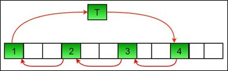

.. contents:: Table of Contents

Array FAQ
==========

Counting elements in two arrays
--------------------------------

Given two unsorted arrays arr1[] and arr2[]. They may contain duplicates. For each element in arr1[] count elements less than or equal to it in array arr2[].

Simple Approach
^^^^^^^^^^^^^^^^

Using two loops, outer loop for elements of array arr1[] and inner loop for elements of array arr2[]. Then for each element of arr1[], count elements less than or equal to it in arr2[].

**Time complexity:** O(m * n), considering arr1[] and arr2[] are of sizes m and n respectively.

Efficient Approach
^^^^^^^^^^^^^^^^^^^

Sort the elements of 2nd array, i.e., array arr2[]. Then perform a modified binary search on array arr2[]. For each element x of array arr1[], find the last index of the largest element smaller than or equal to x in sorted array arr2[].

**Time Complexity:** O(mlogn + nlogn), considering arr1[] and arr2[] are of sizes m and n respectively.

.. code:: cpp

	#include <iostream>
	#include <cstdlib>
	using namespace std;

	int compare (const void * a, const void * b);
	void countEleLessThanOrEqual(int arr1[], int arr2[], int m, int n);
	int binary_search(int arr[], int l, int h, int x);

	// Driver program
	int main() {
		int arr1[] = {1, 2, 3, 4, 7, 9};
		int arr2[] = {0, 1, 2, 1, 1, 4};
		
		int m = sizeof(arr1) / sizeof(arr1[0]);
		int n = sizeof(arr2) / sizeof(arr2[0]);
		
		countEleLessThanOrEqual(arr1, arr2, m, n);
		
		return 0;
	} 

	int compare (const void * a, const void * b) {
		return ( *(int*)a - *(int*)b );
	}

	// function to count for each element in 1st array, elements less than or equal to it in 2nd array
	void countEleLessThanOrEqual(int arr1[], int arr2[], int m, int n) {
		// sort the 2nd array
		qsort(arr2, n, sizeof(int), compare);
		
		// for each element of 1st array
		for (int i=0; i<m; i++) {
			
			// last index of largest element smaller than or equal to x
			int index = binary_search(arr2, 0, n-1, arr1[i]);
			
			// required count for the element arr1[i]
			cout << (index+1) << " ";
		}
	}

	// function to perform binary search and returnmax index
	int binary_search(int arr[], int l, int h, int x) {

		while (l <= h) {
			int mid = (l+h) / 2;
		
			// if 'x' is greater than or equal to arr[mid], 
			// then search in arr[mid+1...h]
			if (arr[mid] <= x) {
				l = mid + 1;
			}
			// else search in arr[l...mid-1]    
			else {
				h = mid - 1;
			}
		}
		
		// required index
		return h;
	}

Output::

	4 5 5 6 6 6

Pair in Array with sum as x
--------------------------------

Write a C program that, given an array A[] of n numbers and another number x, determines whether or not there exist two elements in S whose sum is exactly x.

1.	Use Sorting
^^^^^^^^^^^^^^^^

**Algorithm:**

hasArrayTwoCandidates (A[], ar_size, sum)
	1.	Sort the array in non-decreasing order.
	2.	Initialize two index variables to find the candidate elements in the sorted array.
		a.	Initialize first to the leftmost index: l = 0
		b.	second the rightmost index:  r = ar_size-1
	3.	Loop while l < r.
		a.	If (A[l] + A[r] == sum)  then return 1
		b.	Else if( A[l] + A[r] <  sum )  then l++
		c.	Else r--
	4.	No candidates in whole array - return 0

**Time Complexity:**

Depends on what sorting algorithm we use. 

If we use Merge Sort or Heap Sort then O(nlogn) in worst case. 

If we use Quick Sort then O(n \ :sup:`2` \ ) in worst case.

**Auxiliary Space:** Again, depends on sorting algorithm. For example auxiliary space is O(n) for merge sort and O(1) for Heap Sort.

.. code:: cpp

	#include <iostream>
	#include <algorithm>
	using namespace std;
	 
	// Function to check if array has 2 elements whose sum is equal to the given value
	bool hasArrayTwoCandidates(int A[], int arr_size, int sum) {
		int l, r;
		
		/* Sort the elements */
		sort(A, A + arr_size);
		
		/* Now look for the two candidates in the sorted array*/
		l = 0;
		r = arr_size - 1; 
		while (l < r) {
			if(A[l] + A[r] == sum)
				return 1; 
			else if(A[l] + A[r] < sum)
				l++;
			else // A[i] + A[j] > sum
				r--;
		} 
		return 0;
	}
	 
	/* Driver program to test above function */
	int main() {
		int A[] = {1, 4, 45, 6, 10, -8};
		int n = 16;
		int arr_size = sizeof(A) / sizeof(A[0]);
		
		// Function calling
		if(hasArrayTwoCandidates(A, arr_size, n))
			cout << "Array has two elements with given sum";
		else
			cout << "Array doesn't have two elements with given sum";
			
		return 0;
	}

Output::

	Array has two elements with the given sum

2.	Use Hashing O(n)
^^^^^^^^^^^^^^^^^^^^^

This method works in O(n) time.

1.	Initialize an empty hash tables.

2.	Do following for each element A[i] in A[]
	
	a.	If s[x - A[i]] is set then print the pair (A[i], x - A[i])
	
	b.	Insert A[i] into s.

.. code:: cpp

	#include <iostream>
	#include <unordered_set>
	using namespace std;
	 
	void printPairs(int arr[], int arr_size, int sum) {
		unordered_set<int> s;
		for (int i = 0; i < arr_size; i++) {
			int temp = sum - arr[i];
		
			if (temp >= 0 && s.find(temp) != s.end())
				cout << "Pair with given sum " << sum << " is (" << arr[i] << ", " << temp << ")" << endl;
			s.insert(arr[i]);
		}
	}
	 
	/* Driver program to test above function */
	int main() {
		int A[] = {1, 4, 45, 6, 10, 8};
		int n = 16;
		int arr_size = sizeof(A)/sizeof(A[0]);

		printPairs(A, arr_size, n);	// Function calling

		return 0;
	}
	
Output::

	Pair with given sum 16 is (10, 6)

Count pairs with given sum
---------------------------

Given an array of integers, and a number ‘sum’, find the number of pairs of integers in the array whose sum is equal to ‘sum’.

1.	Traverse each element
^^^^^^^^^^^^^^^^^^^^^^^^^^

A simple solution is to traverse each element and check if there’s another number in the array which can be added to it to give sum.

.. code:: cpp

	#include <iostream>
	using namespace std;
	 
	// Returns number of pairs in arr[0..n-1] with sum equal to 'sum'
	int getPairsCount(int arr[], int n, int sum) {
		int count = 0; // Initialize result
		
		// Consider all possible pairs and check their sums
		for (int i=0; i<n; i++)
			for (int j=i+1; j<n; j++)
				if (arr[i]+arr[j] == sum)
					count++;

		return count;
	}
	 
	// Driver function to test the above function
	int main() {
		int arr[] = {1, 5, 7, -1, 5} ;
		int n = sizeof(arr)/sizeof(arr[0]);
		int sum = 6;
		
		cout << "Count of pairs is " << getPairsCount(arr, n, sum);
		
		return 0;
	}
	
Output::

	Count of pairs is 3

**Time Complexity:** O(n \ :sup:`2` \ )

**Auxiliary Space:** O(1)

2.	Use map O(n)
^^^^^^^^^^^^^^^^^

**Algorithm:**

1.	Create a map to store frequency of each number in the array. (Single traversal is required)

2.	In the next traversal, for every element check if it can be combined with any other element (other than itself!) to give the desired sum. Increment the counter accordingly.

3.	After completion of second traversal, we’d have twice the required value stored in counter because every pair is counted two times. Hence divide count by 2 and return.

.. code:: cpp

	#include <iostream>
	#include <unordered_map>
	using namespace std;
	 
	// Returns number of pairs in arr[0..n-1] with sum equal to 'sum'
	int getPairsCount(int arr[], int n, int sum) {
		unordered_map<int, int> m;
		
		// Store counts of all elements in map m
		for (int i=0; i<n; i++)
			m[arr[i]]++;
		
		int twice_count = 0;
		
		// iterate through each element and increment the count (Notice that every pair is counted twice)
		for (int i=0; i<n; i++) {
			twice_count += m[sum-arr[i]];
			
			// if (arr[i], arr[i]) pair satisfies the condition, then we need to ensure that the count is
			// decreased by one such that the (arr[i], arr[i]) pair is not considered
			if (sum-arr[i] == arr[i])
				twice_count--;
		}
		
		// return the half of twice_count
		return twice_count/2;
	}
	 
	// Driver function to test the above function
	int main() {
		int arr[] = {1, 5, 7, -1, 5} ;
		int n = sizeof(arr)/sizeof(arr[0]);
		int sum = 6;
		cout << "Count of pairs is " << getPairsCount(arr, n, sum);
		
		return 0;
	}
	
Output::

	Count of pairs is 3

**Time Complexity:** O(n)

Find four elements that sum to a given value
--------------------------------------------

Given an array of integers, find all combination of four elements in the array whose sum is equal to a given value X.

Example, if the given array is {10, 2, 3, 4, 5, 9, 7, 8} and X = 23, then your function should print “3 5 7 8” (3 + 5 + 7 + 8 = 23).

1.	O(n  \ :sup:`4` \ ) solution
^^^^^^^^^^^^^^^^^^^^^^^^^^^^^^^^^^^^^^

.. code:: cpp

	#include <stdio.h>
	 
	/* A naive solution to print all combination of 4 elements in A[] with sum equal to X */
	void findFourElements(int A[], int n, int X) {
		// Fix the first element and find other three
		
		for (int i = 0; i < n-3; i++) {
		
			// Fix the second element and find other two		
			for (int j = i+1; j < n-2; j++) {
			
				// Fix the third element and find the fourth
				for (int k = j+1; k < n-1; k++) {
				
					// find the fourth
					for (int l = k+1; l < n; l++) {
						if (A[i] + A[j] + A[k] + A[l] == X)
							printf("%d, %d, %d, %d", A[i], A[j], A[k], A[l]);
					} //end of for l
				} //end of for k
			} //end of for j
		} //end of for i
	}
	 
	// Driver program to test above funtion
	int main() {
		int A[] = {10, 20, 30, 40, 1, 2};
		int n = sizeof(A) / sizeof(A[0]);
		int X = 91;
		findFourElements (A, n, X);
		return 0;
	}

Output::

	20, 30, 40, 1

2.	O(n  \ :sup:`3` \ ) Solution
^^^^^^^^^^^^^^^^^^^^^^^^^^^^^^^^^

The time complexity can be improved to O(n \ :sup:`3` \ ) with the **use of sorting** as a preprocessing step, and then finding pair (using method 1 of this post) to reduce a loop.

Following are the detailed steps:

1.	Sort the input array.

2.	Fix the first element as A[i] where i is from 0 to n–3. After fixing the first element of quadruple, fix the second element as A[j] where j varies from i+1 to n-2. Find remaining two elements in O(n) time, using the method 1 of this post

.. code:: cpp

	# include <stdio.h>
	# include <stdlib.h>

	int compare (const void *a, const void * b) {
		return ( *(int *)a - *(int *)b );
	}
	 
	/* A sorting based solution to print all combination of 4 elements in A[] with sum equal to X */
	void find4Numbers(int A[], int n, int X) {
		int l, r;
		
		// Sort the array in increasing order, using library function for quick sort
		qsort (A, n, sizeof(A[0]), compare);
		
		/* Now fix the first 2 elements one by one and find the other two elements */
		for (int i = 0; i < n - 3; i++) {
			
			for (int j = i+1; j < n - 2; j++) {
				// Initialize two variables as indexes of the first and last elements in the remaining elements
				l = j + 1;
				r = n-1;

				// To find the remaining two elements, move the index variables (l & r) toward each other.
				while (l < r) {
					if( A[i] + A[j] + A[l] + A[r] == X) {
						printf("%d, %d, %d, %d", A[i], A[j], A[l], A[r]);
						l++; r--;
					}
					else if (A[i] + A[j] + A[l] + A[r] < X)
						l++;
					else // A[i] + A[j] + A[l] + A[r] > X
						r--;
				} // end of while
			} // end of inner for loop
		} // end of outer for loop
	}
	 
	/* Driver program to test above function */
	int main() {
		int A[] = {1, 4, 45, 6, 10, 12};
		int X = 21;
		int n = sizeof(A)/sizeof(A[0]);

		find4Numbers(A, n, X);

		return 0;
	}

Output::

	1, 4, 6, 10

3.	O(n \ :sup:`2` \ Logn) Solution
^^^^^^^^^^^^^^^^^^^^^^^^^^^^^^^^^^^^^^^

Let the input array be A[].

1.	Create an auxiliary array aux[] and store sum of all possible pairs in aux[]. The size of aux[] will be n*(n-1)/2 where n is the size of A[].

2.	Sort the auxiliary array aux[].

3.	Now the problem reduces to find two elements in aux[] with sum equal to X. We can use method 1 of this post to find the two elements efficiently. There is following important point to note though. An element of aux[] represents a pair from A[]. While picking two elements from aux[], we must check whether the two elements have an element of A[] in common. For example, if first element sum of A[1] and A[2], and second element is sum of A[2] and A[4], then these two elements of aux[] don’t represent four distinct elements of input array A[].

.. code:: cpp

	#include <stdio.h>
	#include <stdlib.h>
	 
	// The following structure is needed to store pair sums in aux[]
	struct pairSum {
		int first; // index (int A[]) of first element in pair
		int sec; // index of second element in pair
		int sum;  // sum of the pair
	};
	 
	// Following function is needed for library function qsort()
	int compare (const void *a, const void * b) {
		return ( (*(pairSum *)a).sum - (*(pairSum*)b).sum );
	}
	 
	// Function to check if two given pairs have any common element or not
	bool noCommon(struct pairSum a, struct pairSum b) {
		if (a.first == b.first || a.first == b.sec || a.sec == b.first || a.sec == b.sec)
			return false;
		return true;
	}
	 
	 
	// The function finds four elements with given sum X
	void findFourElements (int arr[], int n, int X) {
		int i, j;
		
		// Create an auxiliary array to store all pair sums
		int size = (n*(n-1))/2;
		struct pairSum aux[size];
		
		/* Generate all possible pairs from A[] and store sums
		of all possible pairs in aux[] */
		int k = 0;
		for (i = 0; i < n-1; i++) {
			for (j = i+1; j < n; j++) {
				aux[k].sum = arr[i] + arr[j];
				aux[k].first = i;
				aux[k].sec = j;
				k++;
			}
		}
		
		// Sort the aux[] array using library function for sorting
		qsort (aux, size, sizeof(aux[0]), compare);
		
		// Now start two index variables from two corners of array and move them toward each other.
		i = 0;
		j = size-1;
		while (i < size && j >=0 ) {
			if ((aux[i].sum + aux[j].sum == X) && noCommon(aux[i], aux[j])) {
				printf ("%d, %d, %d, %d\n", arr[aux[i].first], arr[aux[i].sec], arr[aux[j].first], arr[aux[j].sec]);
				return;
			}
			else if (aux[i].sum + aux[j].sum < X)
				i++;
			else
				j--;
		}
	}
	 
	// Driver program to test above function
	int main() {
		int arr[] = {10, 20, 30, 40, 1, 2};
		int n = sizeof(arr) / sizeof(arr[0]);
		int X = 91;
		findFourElements (arr, n, X);
		
		return 0;
	}

Output::

	20, 1, 30, 40

**Note:** Above code prints only one quadruple. If we remove the return statement and add statements “i++; j–;”, then it prints same quadruple five times. The code can modified to print all quadruples only once. It has been kept this way to keep it simple.

**Time complexity:** 

The step 1 takes O(n\ :sup:`2` \) time. 

The second step is sorting an array of size O(n\ :sup:`2` \). 

Sorting can be done in O(n\ :sup:`2` \Logn) time using merge sort or heap sort or any other O(nLogn) algorithm. 

The third step takes O(n\ :sup:`2` \) time. So overall complexity is O(n\ :sup:`2` \Logn).

**Auxiliary Space:** O(n^2). The big size of auxiliary array can be a concern in this method.

4.	O(n \ :sup:`2` \ ) Hashing Based Solution
^^^^^^^^^^^^^^^^^^^^^^^^^^^^^^^^^^^

1.	Store sums of all pairs in a hash table

2.	Traverse through all pairs again and search for X – (current pair sum) in the hash table.

3.	If a pair is found with the required sum, then make sure that all elements are distinct array elements and an element is not considered more than once.

.. code:: cpp

	// A hashing based  CPP program to find if there are four elements with given sum.
	#include <iostream>
	#include <unordered_map>
	using namespace std;
	 
	// The function finds four elements with given sum X
	void findFourElements (int arr[], int n, int X) {
		// Store sums of all pairs in a hash table
		unordered_map<int, pair<int, int>> mp;
		
		for (int i = 0; i < n-1; i++)
			for (int j = i+1; j < n; j++)
				mp[arr[i] + arr[j]] = {i, j};
		
		// Traverse through all pairs and search for X - (current pair sum).    
		for (int i = 0; i < n-1; i++) {
				for (int j = i+1; j < n; j++) {
				int sum = arr[i] + arr[j];
		
				// If X - sum is present in hash table,            
				if (mp.find(X - sum) != mp.end()) {
		
					// Making sure that all elements are distinct array 
					// elements and an element is not considered more than once.
					pair<int, int> p = mp[X - sum];
					if (p.first != i && p.first != j && p.second != i && p.second != j)
					{
						cout << arr[i] << ", " << arr[j] << ", " << arr[p.first] << ", " << arr[p.second];
						return;
					}
				}
			}	// for j
		}	// for i
	}
	 
	// Driver program to test above function
	int main() {
		int arr[] = {10, 20, 30, 40, 1, 2};
		int n = sizeof(arr) / sizeof(arr[0]);
		int X = 91;
		findFourElements(arr, n, X);
		
		return 0;
	}

Output::

	20, 30, 40, 1

Check alphanumeric palindrome
^^^^^^^^^^^^^^^^^^^^^^^^^^^^^^

You are given a string containing the alphanumeric character. Find whether the string is palindrome or not.

.. code:: cpp

	#include <iostream>
	#include <cctype>
	#include <cstring>
	using namespace std;

	const int STRLEN = 100000;

	int check_alphanumeric_palindrome(const char* arg_str, int arg_slen);

	int main() {
		//code
		int ntc = 0;
		char *str = new char[STRLEN];
		size_t slen = 0;
		int res = 0;
		
		cin >> ntc;
		while('\n' != getchar());
		while(ntc--) {
			memset(str, '\0', STRLEN);
			slen = 0;
			res = 0;
			cin.getline(str, STRLEN);
			slen = strlen(str);	
			//cout << slen << " : " << str << endl;
			
			res = check_alphanumeric_palindrome(str, slen);
			if(1 == res) {
				cout << "YES" << endl;
			}
			else {
				cout << "NO" << endl;
			}
		}
		return 0;
	}

	int check_alphanumeric_palindrome(const char* arg_str, int arg_slen) {
		int i = 0;
		int j = 0;
		int flag_no = 0;
		
		j = arg_slen - 1;
		while(1) {
			if( (isalnum(arg_str[i])) && (isalnum(arg_str[j])) ) {
				if( (isalpha(arg_str[i])) && (isalpha(arg_str[j])) ) {			
					if(toupper(arg_str[i]) != toupper(arg_str[j])) {
						flag_no = 1;
						//cout << arg_str[i] << " - " << arg_str[j] << endl;
						break;
					}
				}
				else if(arg_str[i] != arg_str[j]) {
					flag_no = 1;
					//cout << arg_str[i] << " : " << arg_str[j] << endl;
					break;
				}
				
				i++;
				j--;
			}
			else {
				if(!isalnum(arg_str[i])) {
					i++;
				}
				if(!isalnum(arg_str[j])) {
					j--;
				}
			}
			
			if(i >= j) break;
		}
		
		if(1 == flag_no) {
			return 0;
		}
		
		return 1;
		
	}

Input::

	2
	I am :IronnorI Ma, i
	Ab?/Ba

Output::

	YES
	YES

Program for Array Rotation
---------------------------

Write a function rotate(ar[], d, n) that rotates arr[] of size n by d elements.

Before Rotation::

	1	2	3	4	5	6	7

After Rotation::

	3	4	5	6	7	1	2

1.	Using Temp Array
^^^^^^^^^^^^^^^^^^^^^

**Time complexity:** O(n)

**Auxiliary Space:** O(d)

Input arr[] = [1, 2, 3, 4, 5, 6, 7]

d = 2, n =7

**Algorithm:**

#.	Store d elements in a temp array
	
	temp[] = [1, 2]

#.	Shift rest of the arr[]

	arr[] = [3, 4, 5, 6, 7, 6, 7]

#.	Store back the d elements

	arr[] = [3, 4, 5, 6, 7, 1, 2]

2.	Rotate One by One
^^^^^^^^^^^^^^^^^^^^^^

**Time complexity:** O(n * d)

**Auxiliary Space:** O(1)

**Algorithm:**

.. code:: cpp

	leftRotate(arr[], d, n)
	start
		For i = 0 to i < d
			Left rotate all elements of arr[] by one
	end

	for(int i = 0; i < d; i++) {
		int temp = arr[0], j = 0;
		for (j = 0; j < n-1; j++) {
			arr[j] = arr[j+1];
		}
		
		arr[j] = temp;
	}

3.	A Juggling Algorithm
^^^^^^^^^^^^^^^^^^^^^^^^^^

**Time complexity:** O(n)

**Auxiliary Space:** O(1)

This is an extension of method 2.

Instead of moving one by one, divide the array in different sets where number of sets is equal to GCD of n and d and move the elements within sets.

Let arr[] be {1, 2, 3, 4, 5, 6, 7, 8, 9, 10, 11, 12}

a.	Elements are first moved in first set – (See below diagram for this movement)

arr[] after this step --> {4 2 3 7 5 6 10 8 9 1 11 12}

 
b.	Then in second set.

arr[] after this step --> {4 5 3 7 8 6 10 11 9 1 2 12}

c.	Finally in third set.

arr[] after this step --> {4 5 6 7 8 9 10 11 12 1 2 3}

.. code:: cpp

	// C++ program to rotate an array by d elements
	#include <iostream>
	using namespace std;
	 
	/*Fuction to get gcd of a and b*/
	int gcd(int a, int b) {
		if(b == 0)
			return a;
		else
			return gcd(b, a%b);
	}
	 
	/*Function to left rotate arr[] of siz n by d*/
	void leftRotate(int arr[], int d, int n) {
		
		int gcd_val = gcd(d, n);
		for (int i = 0; i < gcd_val; i++) {
			
			/* move i-th values of blocks */
			int temp = arr[i];
			int j = i;
			
			while(1) {
				int k = j + d;
				
				if (k >= n)
					k = k - n;
				
				if (k == i)
					break;
				
				arr[j] = arr[k];
				j = k;
				
			} // end of while loop
			
			arr[j] = temp;
		} // end of for loop
		
	}

	// Function to print an array 
	void printArray(int arr[], int size) {
		for(int i = 0; i < size; i++)
			cout << arr[i] << " ";
	}
	 
	/* Driver program to test above functions */
	int main() {
		int arr[] = {1, 2, 3, 4, 5, 6, 7, 8, 9, 10, 11, 12};
		int n = sizeof(arr) / sizeof(arr[0]);
		
		// Function calling
		leftRotate(arr, 3, n);
		printArray(arr, n);
		
		return 0;
	}

Output::

	4 5 6 7 8 9 10 11 12 1 2 3

References
-----------

