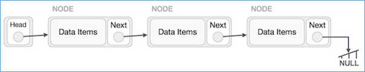
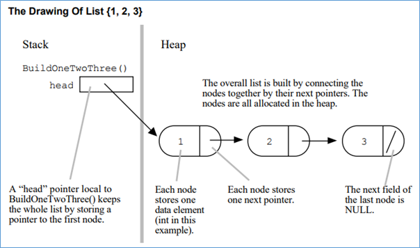
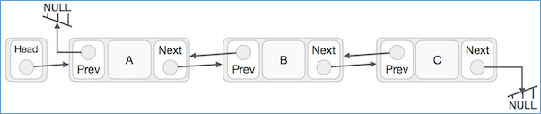

.. contents:: Table of Contents

Linked List
===========

Like arrays, Linked List is a linear data structure. 

Unlike arrays, linked list elements are not stored at contiguous location; the elements are linked using pointers.

An array allocates memory for all its elements lumped together as one block of memory.

In contrast, a linked list allocates space for each element separately in its own block of memory called a "linked list element" or "node".

Unlike an array, though, in which the linear order is determined by the array indices, the order in a linked list is determined by a pointer in each object.

Why Linked List?
----------------

Arrays can be used to store linear data of similar types, but arrays have following limitations.

#.	The size of the arrays is fixed: So we must know the upper limit on the number of elements in advance.
 
	Also, generally, the allocated memory is equal to the upper limit irrespective of the usage.

#.	Inserting a new element in an array of elements is expensive, because room has to be created for the new elements and to create room existing elements have to shifted.

	Example
	
	In a system if we maintain a sorted list of IDs in an array id[].
	
	id[] = [1000, 1010, 1050, 2000, 2040].
	
	And if we want to insert a new ID 1005, then to maintain the sorted order, we have to move all the elements after 1000 (excluding 1000).

#.	Deletion is also expensive with arrays until unless some special techniques are used. For example, to delete 1010 in id[], everything after 1010 has to be moved.

Advantages over arrays
-----------------------

#.	Dynamic size
#.	Ease of insertion/deletion

Drawbacks
---------

#.	Random access is not allowed. We have to access elements sequentially starting from the first node.

	**So we cannot do binary search with linked lists.**
	
#.	Extra memory space for a pointer is required with each element of the list.

#.	**Arrays have better cache locality** that can make a pretty big difference in performance.

Linked List Vs Array
---------------------

.. list-table::
	:header-rows: 1
	
	*	-	Linked List
		-	Array
		
	*	-	size of the linked list is dynamic
		-	size of the arrays is fixed

	*	-	allocated memory is equal to size of number of nodes inserted
		-	allocated memory is equal to the upper limit irrespective of the usage

	*	-	Insertion and deletion is easy No need to shift existing node
		-	Insertion and deletion is expensive because existing elements have to shifted
		
	*	-	Random access is not allowed so binary search is not possible
		-	Random access is allowed using index of the element [i]
	
	*	-	Extra memory space for a pointer is required with each element
		-	Space for only array element is required
		
	*	-	Linked list have poor cache locality than array
		-	Arrays have better cache locality than linked list

NOTE::

	Both Merge sort and Insertion sort can be used for linked lists.
	
	The slow random-access performance of a linked list makes other algorithms (such as quicksort) perform poorly, 
	and others (such as heapsort) completely impossible. Since worst case time complexity of Merge Sort is O(nLogn) 
	and Insertion sort is O(n^2), merge sort is preferred.
	
	See following for implementation of merge sort using Linked List.
	
	http://www.geeksforgeeks.org/merge-sort-for-linked-list/

 
Types of Linked List
---------------------

Following are the various types of linked list.

#.	Simple Linked List − Item navigation is forward only.
#.	Doubly Linked List − Items can be navigated forward and backward.
#.	Circular Linked List − Last item contains link of the first element as next and the first element has a link to the last element as previous.

Basic Operations
-----------------

Following are the basic operations supported by a list.

#.	Insertion − Adds an element at the beginning of the list.
#.	Deletion − Deletes an element at the beginning of the list.
#.	Display − Displays the complete list.
#.	Search − Searches an element using the given key.
#.	Delete − Deletes an element using the given key.

Application of linked list
---------------------------

#.	Linked lists can be used to implement:
#.	stacks and queues
#.	adjacency list representation of graphs
#.	hash tables with chaining
#.	For implementing non-binary trees
#.	Adjacency list representation of Graph
#.	Undo functionality in Photoshop or Word. Linked list of states for any polynomial operation, such as addition or multiplication of polynomials , linked list representation is more easier to deal with
#.	cache in your browser that allows you to hit the BACK button (a linked list of URLs)
#.	Linux Process Management. 
#.	Linux uses a circular linked list of process descriptor (task_struct) structures to identify a process in the process hierarchy. In such alignment, you can reach the init process (pid = 0 ) from any process and vice-versa. The next,prev pointers represent child-parent relationships respectively.

For more Check this:

https://www.cs.duke.edu/courses/cps100/spring03/notes/slides4-4up.pdf

Singly Linked List
-------------------

A linked list is represented by a pointer to the first node of the linked list.

The first node is called head.

If the linked list is empty, then value of head is NULL.

Each node in a list consists of at least two parts:

#.	Data
#.	pointer to the next node

In C, we can represent a node using structures. Below is an example of a linked list node with an integer data.

.. code:: cpp

	// A linked list node
	struct Node {
		int data;
		struct Node *next;
	};

 
The last node in the list has its .next field set to NULL to mark the end of the list.

The most common representation chosen for the empty list is a NULL head pointer.

Operations towards the front of the list are fast while operations which access node farther down thelist take longer the further they are from the front. 

This "linear" cost to access a node is fundamentally more costly then the constant time [ ] access provided by arrays.

In this respect, linked lists are definitely less efficient than arrays.

In Java, LinkedList can be represented as a class and a Node as a separate class.

The LinkedList class contains a reference of Node class type.

Doubly Linked List
-------------------

A Doubly Linked List (DLL) contains an extra pointer, typically called previous pointer, together with next pointer and data which are there in singly linked list.

Given an element x in the list, x:next points to its successor in the linked list, and x:prev points to its predecessor. If x:prev = NIL, the element x has no predecessor and is therefore the first element, or head, of the list. If x:next = NIL, the element x has no successor and is therefore the last element, or tail, of the list. An attribute L:head points to the first element of the list. If L:head = NIL, the list is empty.

A technique known as **XOR-linking allows a doubly linked list to be implemented using a single link field in each node.** However, this technique requires the ability to do bit operations on addresses, and therefore may not be available in some high-level languages.

Many modern operating systems use doubly linked lists to maintain references to active processes, threads, and other dynamic objects.

A common strategy for rootkits to evade detection is to unlink themselves from these lists.

.. code:: cpp

	/* Node of a doubly linked list */
	struct Node {
		int data;
		struct Node *next; // Pointer to next node in DLL
		struct Node *prev; // Pointer to previous node in DLL
	};
	

Advantages over singly linked list
^^^^^^^^^^^^^^^^^^^^^^^^^^^^^^^^^^^

#.	A DLL can be traversed in both forward and backward direction.
#.	The delete operation in DLL is more efficient if pointer to the node to be deleted is given.

In singly linked list, to delete a node, pointer to the previous node is needed. To get this previous node, sometimes the list is traversed. In DLL, we can get the previous node using previous pointer.

Disadvantages over singly linked list
^^^^^^^^^^^^^^^^^^^^^^^^^^^^^^^^^^^^^^

#.	Every node of DLL Require extra space for an previous pointer.

	It is possible to implement DLL with single pointer though using XOR Linked List

#.	All operations require an extra pointer previous to be maintained.

	Example, in insertion, we need to modify previous pointers together with next pointers.

Insertion
^^^^^^^^^^

A node can be added in four ways

#.	At the front of the DLL
#.	After a given node.
#.	At the end of the DLL
#.	Before a given node.

Doubly linked vs. singly linked
^^^^^^^^^^^^^^^^^^^^^^^^^^^^^^^^^

.. list-table::
	:header-rows: 1

	*	-	Doubly linked list
		-	Singly linked list

	*	-	easier to manipulate because they allow fast and easy sequential access to the list in both directions
		-	difficult to traverse in reverse direction

	*	-	insert or delete a node in a constant number of operations given only that node's address
		-	inserting and deletion in requires traversal to the node

	*	-	elementary operations are more expensive
		-	elementary operations are less expensive
		
	*	-	require more space per node (unless one uses XOR-linking)
		-	requires less space per node

	*	-	linked lists do not allow tail-sharing and cannot be used as persistent data structures	
		-	can be used as persistent data structures

Circular Linked List
---------------------

Circular linked list is a linked list where all nodes are connected to form a circle. There is no NULL at the end. A circular linked list can be a singly circular linked list or doubly circular linked list.

Advantages of Circular Linked Lists:
^^^^^^^^^^^^^^^^^^^^^^^^^^^^^^^^^^^^^

-	Any node can be a starting point. We can traverse the whole list by starting from any point. We just need to stop when the first visited node is visited again.
-	**Useful for implementation of queue.** Unlike this implementation, we don’t need to maintain two pointers for front and rear if we use circular linked list. We can maintain a pointer to the last inserted node and front can always be obtained as next of last.
-	**Circular lists are useful in applications to repeatedly go around the list.** For example, when multiple applications are running on a PC, it is common for the operating system to put the running applications on a list and then to cycle through them, giving each of them a slice of time to execute, and then making them wait while the CPU is given to another application. It is convenient for the operating system to use a circular list so that when it reaches the end of the list it can cycle around to the front of the list.
	(Source http://web.eecs.utk.edu/~bvz/teaching/cs140Fa09/notes/Dllists/ )
-	Circular Doubly Linked Lists are used for implementation of advanced data structures like Fibonacci Heap.

Circularly linked vs. linearly linked
^^^^^^^^^^^^^^^^^^^^^^^^^^^^^^^^^^^^^^

-	A circularly linked list may be a natural option to represent arrays that are naturally circular, e.g. the corners of a polygon, a pool of buffers that are used and released in FIFO ("first in, first out") order, or a set of processes that should be time-shared in round-robin order. In these applications, a pointer to any node serves as a handle to the whole list.
-	With a circular list, a pointer to the last node gives easy access also to the first node, by following one link. Thus, in applications that require access to both ends of the list (e.g., in the implementation of a queue), a circular structure allows one to handle the structure by a single pointer, instead of two.
-	A circular list can be split into two circular lists, in constant time, by giving the addresses of the last node of each piece. The operation consists in swapping the contents of the link fields of those two nodes. Applying the same operation to any two nodes in two distinct lists joins the two list into one. This property greatly simplifies some algorithms and data structures, such as the quad-edge and face-edge.
-	The simplest representation for an empty circular list (when such a thing makes sense) is a null pointer, indicating that the list has no nodes. Without this choice, many algorithms have to test for this special case, and handle it separately. By contrast, the use of null to denote an empty linear list is more natural and often creates fewer special cases.

Programs
--------- 	 	 

Header File(singlelinkedlist.h)
^^^^^^^^^^^^^^^^^^^^^^^^^^^^^^^^

.. code:: cpp

	#include <stdio.h>
	#include <stdlib.h>

	#define SUCCESS 0
	#define FAILURE -1

	struct singlelinkedlist
	{
		int data;
		struct singlelinkedlist * next;
	};

	int isListEmpty(struct singlelinkedlist * arg_head);

	int insertAtFront(struct singlelinkedlist ** arg_head, int arg_data);
	int insertAtEnd(struct singlelinkedlist ** arg_head, int arg_data);
	int insertAfterNode(struct singlelinkedlist * arg_node, int arg_data);

	int displayListIterative(struct singlelinkedlist * arg_head);
	int displayListRecursive(struct singlelinkedlist * arg_head);

	int searchInList(struct singlelinkedlist * arg_head, int arg_data);
	int deleteInList(struct singlelinkedlist ** arg_head, int arg_data);

	int free_list(struct singlelinkedlist ** arg_head);

Source File(singlelinkedlist.c)
^^^^^^^^^^^^^^^^^^^^^^^^^^^^^^^^

.. code:: cpp

	#include "singlelinkedlist.h"

	int main(void) {
		struct singlelinkedlist* head = NULL;
		int retval = FAILURE;
		int userChoice = -1;
		int userData = 0;

		fprintf(stdout,
				"0. To quit \n"
				"1. To insert at front \n"
				"2. To insert at end \n"
				"3. To insert after a node \n"
				"4. To check if list is empty \n"
				"5. To display iteratively \n"
				"6. To display recursively \n"
				"7. To search for a value \n"
				"8. To delete a value\n");

		do {
			fprintf(stdout, "Enter your choice: ");
			fscanf(stdin, "%d", &userChoice);

			retval = FAILURE;

			switch (userChoice) {
				case 1:
					fprintf(stdout, "Enter the data to insert: ");
					fscanf(stdin, "%d", &userData);
					retval = insertAtFront(&head, userData);
					if (SUCCESS != retval) {
						fprintf(stdout, "In file: %s, function: %s, line: %d\n",
								__FILE__, __func__, __LINE__);
						fprintf(stdout, "Error: Could not insert at front\n");
					}
					break;
				case 2:
					fprintf(stdout, "Enter the data to insert: ");
					fscanf(stdin, "%d", &userData);
					retval = insertAtEnd(&head, userData);
					if (SUCCESS != retval) {
						fprintf(stdout, "In file: %s, function: %s, line: %d\n",
								__FILE__, __func__, __LINE__);
						fprintf(stdout, "Error: Could not insert at end\n");
					}
					break;
					break;
				case 3:
					fprintf(stdout, "Enter the data to insert: ");
					fscanf(stdin, "%d", &userData);
					if ((NULL != head) && (NULL != (head->next))) {
						retval = insertAfterNode((head->next), userData);
					}
					if (SUCCESS != retval) {
						fprintf(stdout, "In file: %s, function: %s, line: %d\n",
								__FILE__, __func__, __LINE__);
						fprintf(stdout, "Error: Could not insert after node\n");
					}
					break;
				case 4:
					retval = isListEmpty(head);
					if (SUCCESS == retval) {
						fprintf(stdout, "List is empty\n");
					} else {
						fprintf(stdout, "List is not empty\n");
					}
					break;
				case 5:
					fprintf(stdout, "Elements in linked list are: ");
					displayListIterative(head);
					printf("\n");
					break;
				case 6:
					fprintf(stdout, "Elements in linked list are: ");
					displayListRecursive(head);
					printf("\n");
					break;
				case 7:
					fprintf(stdout, "Enter value to search in list: ");
					fscanf(stdin, "%d", &userData);
					retval = searchInList(head, userData);
					if (FAILURE == retval) {
						fprintf(stdout, "In file: %s, function: %s, line: %d\n",
								__FILE__, __func__, __LINE__);
						fprintf(stdout,
								"Error: Either list is empty or error occured "
								"during search in list.\n");
					} else {
						fprintf(stdout, "Value is present in list.\n");
					}
					break;
				case 8:
					fprintf(stdout, "Enter value to delete in list: ");
					fscanf(stdin, "%d", &userData);
					retval = deleteInList(&head, userData);
					if (FAILURE == retval) {
						fprintf(stdout, "In file: %s, function: %s, line: %d\n",
								__FILE__, __func__, __LINE__);
						fprintf(stdout,
								"Error : Either element is not present or error "
								"occured.\n");
					}
					break;
			}
		} while (0 != userChoice);

		// free linked list
		retval = free_list(&head);
		if (FAILURE == retval) {
			fprintf(stdout, "In file: %s, function: %s, line: %d\n", __FILE__,
					__func__, __LINE__);
			fprintf(stdout,
					"Error: Either list is empty or error during free of list.\n");
		}

		return SUCCESS;
	}

Function File(singlelinkedlist_functions.c)
^^^^^^^^^^^^^^^^^^^^^^^^^^^^^^^^^^^^^^^^^^^^

.. code:: cpp

	#include "singlelinkedlist.h"

	int isListEmpty(struct singlelinkedlist *arg_head) {
		if (NULL == arg_head)
			return SUCCESS;
		else
			return FAILURE;
	}

	int insertAtFront(struct singlelinkedlist **arg_head, int arg_data) {
		struct singlelinkedlist *temp_node =
			(struct singlelinkedlist *)malloc(sizeof(struct singlelinkedlist));
		if (NULL == temp_node) {
			fprintf(stdout, "In file: %s, function: %s, line: %d\n", __FILE__,
					__func__, __LINE__);
			fprintf(stdout,
					"Error: Allocation of memeory to create node has failed\n");
			return FAILURE;
		}

		(temp_node->data) = arg_data;
		(temp_node->next) = NULL;

		if (NULL == (*arg_head)) {
			(*arg_head) = temp_node;
		} else {
			(temp_node->next) = (*arg_head);
			(*arg_head) = temp_node;
		}

		return SUCCESS;
	}

	int insertAtEnd(struct singlelinkedlist **arg_head, int arg_data) {
		struct singlelinkedlist *temp_node =
			(struct singlelinkedlist *)malloc(sizeof(struct singlelinkedlist));
		struct singlelinkedlist *curr = (*arg_head);

		if (NULL == (*arg_head)) {
			fprintf(stdout, "In file: %s, function: %s, line: %d\n", __FILE__,
					__func__, __LINE__);
			fprintf(stdout,
					"Head of linked list is empty can not insert at end. Use "
					"insertAtFront()\n");
			return FAILURE;
		}

		if (NULL == temp_node) {
			fprintf(stdout, "In file: %s, function: %s, line: %d\n", __FILE__,
					__func__, __LINE__);
			fprintf(stdout,
					"Error: Allocation of memeory to create node has failed\n");
			return FAILURE;
		}

		(temp_node->data) = arg_data;
		(temp_node->next) = NULL;

		while (NULL != (curr->next)) {
			curr = curr->next;
		}

		if (NULL == curr) {
			fprintf(stdout, "In file: %s, function: %s, line: %d\n", __FILE__,
					__func__, __LINE__);
			fprintf(stdout,
					"Error: Reached past the last element in list during iteration "
					"insertion not possible\n");
			return FAILURE;
		} else {
			(curr->next) = temp_node;
		}

		return SUCCESS;
	}

	int insertAfterNode(struct singlelinkedlist *arg_node, int arg_data) {
		struct singlelinkedlist *temp_node =
			(struct singlelinkedlist *)malloc(sizeof(struct singlelinkedlist));

		if (NULL == (arg_node)) {
			fprintf(stdout, "In file: %s, function: %s, line: %d\n", __FILE__,
					__func__, __LINE__);
			fprintf(stdout,
					"Node of linked list is empty can not insert at this node.\n");
			return FAILURE;
		}

		if (NULL == temp_node) {
			fprintf(stdout, "In file: %s, function: %s, line: %d\n", __FILE__,
					__func__, __LINE__);
			fprintf(stdout,
					"Error: Allocation of memeory to create node has failed\n");
			return FAILURE;
		}

		(temp_node->data) = arg_data;
		(temp_node->next) = (arg_node->next);

		(arg_node->next) = temp_node;

		return SUCCESS;
	}

	int displayListIterative(struct singlelinkedlist *arg_head) {
		if (NULL == arg_head) {
			return FAILURE;
		}

		while (NULL != arg_head) {
			fprintf(stdout, "%d	", (arg_head->data));
			arg_head = (arg_head->next);
		}

		return SUCCESS;
	}

	int displayListRecursive(struct singlelinkedlist *arg_head) {
		if (NULL == arg_head) {
			return FAILURE;
		}

		fprintf(stdout, "%d     ", (arg_head->data));
		displayListRecursive(arg_head->next);

		return SUCCESS;
	}

	int searchInList(struct singlelinkedlist *arg_head, int arg_data) {
		while (NULL != arg_head) {
			if (arg_data == (arg_head->data)) break;
			arg_head = (arg_head->next);
		}

		if (NULL == arg_head) return FAILURE;

		return SUCCESS;
	}

	int deleteInList(struct singlelinkedlist **arg_head, int arg_data) {
		struct singlelinkedlist *curr = NULL;
		struct singlelinkedlist *prev = NULL;

		if (NULL == (*arg_head)) return FAILURE;

		curr = (*arg_head);

		while ((NULL != curr) && (arg_data != (curr->data))) {
			prev = curr;
			curr = (curr->next);
		}

		if (NULL == curr) return FAILURE;

		if (curr == (*arg_head)) {
			(*arg_head) = (curr->next);
			free(curr);
		} else if ((NULL != curr) && (NULL != prev)) {
			(prev->next) = (curr->next);
			(curr->next) = NULL;
			free(curr);
		} else {
			fprintf(stdout, "In file: %s, function: %s, line: %d\n", __FILE__,
					__func__, __LINE__);
			fprintf(stdout, "Error during delete of node.\n");
			return FAILURE;
		}

		return SUCCESS;
	}

	int free_list(struct singlelinkedlist **arg_head) {
		if (NULL == (*arg_head)) return FAILURE;

		while (NULL != (*arg_head)) {
			struct singlelinkedlist *temp = (*arg_head);
			(*arg_head) = ((*arg_head)->next);
			free(temp);
		}

		return SUCCESS;
	}

References
-----------

https://www.geeksforgeeks.org/linked-list-data-structure/

