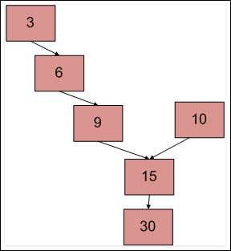

.. contents:: Table of Contents

Linked List FAQ
================

Detect loop in a linked list
-----------------------------

Check if the the linked list has loop or not. Below diagram shows a linked list with a loop.

 
Different Solutions::

-	Mark Visited Nodes
-	Use Hashing
-	Floyd’s Cycle-Finding Algorithm

Mark Visited Nodes
^^^^^^^^^^^^^^^^^^^

This solution requires modifications to basic linked list data structure.  Have a visited flag with each node.  Traverse the linked list and keep marking visited nodes.  If you see a visited node again then there is a loop. This solution works in O(n) but requires additional information with each node.

A variation of this solution that doesn’t require modification to basic data structure can be implemented using hash.  Just store the addresses of visited nodes in a hash and if you see an address that already exists in hash then there is a loop.

Use Hashing
^^^^^^^^^^^^

Traverse the list one by one and keep putting the node addresses in a Hash Table. At any point, if NULL is reached then return false and if next of current node points to any of the previously stored nodes in Hash then return true.

.. code:: cpp

	// C++ program to detect loop in a linked list
	#include<iostream>
	using namespace std;
	/* Link list node */
	struct Node {
		int data;
		struct Node* next;
	};

	void push(struct Node** head_ref, int new_data) {
		struct Node* new_node = new Node;		/* allocate node */
		new_node->data  = new_data;	/* put in the data  */
		new_node->next = (*head_ref);	/* link the old list off the new node */
		(*head_ref)    = new_node;	/* move the head to point to the new node */
	}

	// Returns true if there is a loop in linked list else returns false.
	bool detectLoop(struct Node *h) {
		unordered_set<Node *> s;
		while (h != NULL) {
			// If we have already has this node in hashmap it means their is a cycle
			// (Because you we encountering the node second time).
			if (s.find(h) != s.end())
				return true;
			
			// If we are seeing the node for the first time, insert it in hash
			s.insert(h);
			
			h = h->next;
		}
		
		return false;
	}
	 
	/* Drier program to test above function*/
	int main() {
		/* Start with the empty list */
		struct Node* head = NULL;
		
		push(&head, 20);
		push(&head, 4);
		push(&head, 15);
		push(&head, 10);
		
		/* Create a loop for testing */
		head->next->next->next->next = head;
		
		if (detectLoop(head))
			cout << "Loop found";
		else
			cout << "No Loop";

		return 0;
	}

Output::

	Loop Found

Floyd’s Cycle-Finding Algorithm
^^^^^^^^^^^^^^^^^^^^^^^^^^^^^^^^

This is the fastest method. Traverse linked list using two pointers.  Move one pointer by one and other pointer by two.  If these pointers meet at some node, then there is a loop.  If pointers do not meet, then linked list doesn’t have loop.

.. code:: cpp

	// C program to detect loop in a linked list
	#include<stdio.h>
	#include<stdlib.h>
	 
	/* Link list node */
	struct Node {
		int data;
		struct Node* next;
	};
	 
	void push(struct Node** head_ref, int new_data) {
		struct Node* new_node = (struct Node*) malloc(sizeof(struct Node));	/* allocate node */
		new_node->data  = new_data;	/* put in the data  */	
		new_node->next = (*head_ref);	/* link the old list off the new node */	
		(*head_ref)    = new_node;	/* move the head to point to the new node */
	}
	 
	int detectloop(struct Node *list) {
		struct Node  *slow_p = list, *fast_p = list;

		while (slow_p && fast_p && fast_p->next ) {
			slow_p = slow_p->next;
			fast_p  = fast_p->next->next;
			if (slow_p == fast_p) {
				printf("Found Loop");
				return 1;
			}
		}
		return 0;
	}
	 
	/* Drier program to test above function*/
	int main() {
		/* Start with the empty list */
		struct Node* head = NULL;
		
		push(&head, 20);
		push(&head, 4);
		push(&head, 15);
		push(&head, 10);
		
		/* Create a loop for testing */
		head->next->next->next->next = head;
		detectloop(head);
		
		return 0;
	}

Output::

	Found loop

Find length of loop in linked list
-----------------------------------

We know that Floyd’s Cycle detection algorithm terminates when fast and slow pointers meet at a common point. We also know that this common point is one of the loop nodes (2 or 3 or 4 or 5 in the above diagram). We store the address of this in a pointer variable say ptr2. Then we start from the head of the Linked List and check for nodes one by one if they are reachable from ptr2. When we find a node that is reachable, we know that this node is the starting node of the loop in Linked List and we can get pointer to the previous of this node.

.. code:: cpp

	// C program to count number of nodes in loop in a linked list if loop is present
	#include<stdio.h>
	#include<stdlib.h>
	 
	/* Link list node */
	struct Node {
		int data;
		struct Node* next;
	};
	 
	// Returns count of nodes present in loop.
	int countNodes(struct Node *n) {
		int res = 1;
		struct Node *temp = n;
		while (temp->next != n) {
			res++;
			temp = temp->next;
		}
		
		return res;
	}
	 
	/* This function detects and counts loop nodes in the list. 
	If loop is not there in then returns 0 */
	int countNodesinLoop(struct Node *list) {
		struct Node  *slow_p = list, *fast_p = list;
		
		while (slow_p && fast_p && fast_p->next) {
			slow_p = slow_p->next;
			fast_p  = fast_p->next->next;
			
			/* If slow_p and fast_p meet at some point then there is a loop */
			if (slow_p == fast_p)
				return countNodes(slow_p);
		}
		
		/* Return 0 to indeciate that ther is no loop*/
		return 0;
	}
	 
	struct Node *newNode(int key) {
		struct Node *temp = (struct Node*)malloc(sizeof(struct Node));
		temp->data = key;
		temp->next = NULL;
		return temp;
	}
	 
	/* Driver program to test above function*/
	int main() {
		struct Node *head = newNode(1);
		head->next = newNode(2);
		head->next->next = newNode(3);
		head->next->next->next = newNode(4);
		head->next->next->next->next = newNode(5);
		
		/* Create a loop for testing */
		head->next->next->next->next->next = head->next;
		
		printf("%d \n", countNodesinLoop(head));
		
		return 0;
	}

Output::

	4

Detect and Remove Loop in a Linked List
----------------------------------------

#. Floyd’s Cycle detection algorithm (Check one by one)
#. Floyd’s Cycle detection algorithm (Better Solution)
#. Without Counting Nodes in Loop (Optimized Method)

1. Floyd’s Cycle detection algorithm (Check one by one)
^^^^^^^^^^^^^^^^^^^^^^^^^^^^^^^^^^^^^^^^^^^^^^^^^^^^^^^^

.. code:: cpp

	#include<stdio.h>
	#include<stdlib.h>

	/* Link list node */
	struct Node {
		int data;
		struct Node* next;
	};

	/* Function to remove loop. Used by detectAndRemoveLoop() */
	void removeLoop(struct Node *, struct Node *);

	/* This function detects and removes loop in the list If loop was there in the list then it returns 1, otherwise returns 0 */
	int detectAndRemoveLoop(struct Node *list) {
		struct Node *slow_p = list, *fast_p = list;
		
		while (slow_p && fast_p && fast_p->next) {
			slow_p = slow_p->next;
			fast_p = fast_p->next->next;
			
			/* If slow_p and fast_p meet at some point then there is a loop */
			if (slow_p == fast_p) {
				removeLoop(slow_p, list);
				
				/* Return 1 to indicate that loop is found */
				return 1;
			}
		}
		
		/* Return 0 to indeciate that ther is no loop*/
		return 0;
	}

	/* Function to remove loop.
	loop_node --> Pointer to one of the loop nodes head --> Pointer to the start node of the linked list */
	void removeLoop(struct Node *loop_node, struct Node *head) {
		struct Node *ptr1;
		struct Node *ptr2;

		/* Set a pointer to the beging of the Linked List and move it one by one 
		to find the first node which is part of the Linked List */
		ptr1 = head;
		while (1) {
			/* Now start a pointer from loop_node and check if it ever reaches ptr2 */
			ptr2 = loop_node;
			while (ptr2->next != loop_node && ptr2->next != ptr1)
				ptr2 = ptr2->next;
			
			/* If ptr2 reahced ptr1 then there is a loop. So break the loop */
			if (ptr2->next == ptr1)
				break;
			
			/* If ptr2 did't reach ptr1 then try the next node after ptr1 */
			ptr1 = ptr1->next;
		}

		/* After the end of loop ptr2 is the last node of the loop. So make next of ptr2 as NULL */
		ptr2->next = NULL;
	}

	/* Function to print linked list */
	void printList(struct Node *node) {
		while (node != NULL) {
			printf("%d ", node->data);
			node = node->next;
		}
	}

	struct Node *newNode(int key) {
		struct Node *temp = (struct Node*)malloc(sizeof(struct Node));
		temp->data = key;
		temp->next = NULL;
		return temp;
	}

	/* Drier program to test above function*/
	int main(){
		struct Node *head = newNode(50);
		head->next = newNode(20);
		head->next->next = newNode(15);
		head->next->next->next = newNode(4);
		head->next->next->next->next = newNode(10);
		
		/* Create a loop for testing */
		head->next->next->next->next->next = head->next->next;
		
		detectAndRemoveLoop(head);
		
		printf("Linked List after removing loop \n");
		printList(head);
		return 0;
	}

Output::

	Linked List after removing loop 
	50 20 15 4 10

2. Floyd’s Cycle detection algorithm (Better Solution)
^^^^^^^^^^^^^^^^^^^^^^^^^^^^^^^^^^^^^^^^^^^^^^^^^^^^^^^^^

Method 2 (Better Solution)

This method is also dependent on Floyd’s Cycle detection algorithm.

#. Detect Loop using Floyd’s Cycle detection algorithm and get the pointer to a loop node
#. Count the number of nodes in loop. Let the count be k
#. Fix one pointer to the head and another to kth node from head
#. Move both pointers at the same pace, they will meet at loop starting node
#. Get pointer to the last node of loop and make next of it as NULL

.. code:: cpp

	#include<stdio.h>
	#include<stdlib.h>
	 
	/* Link list node */
	struct Node {
		int data;
		struct Node* next;
	};
	 
	/* Function to remove loop. */
	void removeLoop(struct Node *, struct Node *);
	 
	/* This function detects and removes loop in the list
	  If loop was there in the list then it returns 1,
	  otherwise returns 0 */
	int detectAndRemoveLoop(struct Node *list) {
		struct Node  *slow_p = list, *fast_p = list;
		
		while (slow_p && fast_p && fast_p->next) {
			slow_p = slow_p->next;
			fast_p  = fast_p->next->next;
			
			/* If slow_p and fast_p meet at some point then there is a loop */
			if (slow_p == fast_p) {
				removeLoop(slow_p, list);
				
				/* Return 1 to indicate that loop is found */
				return 1;
			}
		}
		
		/* Return 0 to indeciate that ther is no loop*/
		return 0;
	}
	 
	/* Function to remove loop.
	 loop_node --> Pointer to one of the loop nodes
	 head -->  Pointer to the start node of the linked list */
	void removeLoop(struct Node *loop_node, struct Node *head) {
		struct Node *ptr1 = loop_node;
		struct Node *ptr2 = loop_node;
		
		// Count the number of nodes in loop
		unsigned int k = 1, i;
		while (ptr1->next != ptr2) {
			ptr1 = ptr1->next;
			k++;
		}
		
		// Fix one pointer to head
		ptr1 = head;
		
		// And the other pointer to k nodes after head
		ptr2 = head;
		for (i = 0; i < k; i++)
		ptr2 = ptr2->next;
		
		/* Move both pointers at the same pace, they will meet at loop starting node */
		while (ptr2 != ptr1) {
			ptr1 = ptr1->next;
			ptr2 = ptr2->next;
		}
		
		// Get pointer to the last node
		ptr2 = ptr2->next;
		while (ptr2->next != ptr1)
		ptr2 = ptr2->next;
		
		/* Set the next node of the loop ending node
		to fix the loop */
		ptr2->next = NULL;
	}
	 
	/* Function to print linked list */
	void printList(struct Node *node) {
		while (node != NULL) {
			printf("%d  ", node->data);
			node = node->next;
		}
	}
	 
	struct Node *newNode(int key) {
		struct Node *temp = (struct Node*)malloc(sizeof(struct Node));
		temp->data = key;
		temp->next = NULL;
		return temp;
	}
	 
	/* Driver program to test above function*/
	int main() {
		struct Node *head = newNode(50);
		head->next = newNode(20);
		head->next->next = newNode(15);
		head->next->next->next = newNode(4);
		head->next->next->next->next = newNode(10);
		
		/* Create a loop for testing */
		head->next->next->next->next->next = head->next->next;
		
		detectAndRemoveLoop(head);
		
		printf("Linked List after removing loop \n");
		printList(head);
		return 0;
	}

Output::

	Linked List after removing loop 
	50 20 15 4 10 

3. Without Counting Nodes in Loop (Optimized Method)
^^^^^^^^^^^^^^^^^^^^^^^^^^^^^^^^^^^^^^^^^^^^^^^^^^^^^^^

We do not need to count number of nodes in Loop. After detecting the loop, if we start slow pointer from head and move both slow and fast pointers at same speed until fast don’t meet, they would meet at the beginning of the loop.

**How does this work?**

Let slow and fast meet at some point after Floyd’s Cycle finding algorithm. Below diagram shows the situation when cycle is found.

 
We can conclude below from above diagram

**Distance traveled by fast pointer = 2 * (Distance traveled by slow pointer)**

**(m + n*x + k) = 2*(m + n*y + k)**

Note that before meeting the point shown above, fast was moving at twice speed.

x --> Number of complete cyclic rounds made by fast pointer before they meet first time

y --> Number of complete cyclic rounds made by slow pointer before they meet first time

From above equation, we can conclude below
	
	**m + k = (x-2y)*n**
	
Which means m+k is a multiple of n.

So if we start moving both pointers again at same speed such that one pointer (say slow) begins from head node of linked list and other pointer (say fast) begins from meeting point. When slow pointer reaches beginning of linked list (has made m steps). Fast pointer would have made also moved m steps as they are now moving same pace. Since m+k is a multiple of n and fast starts from k, they would meet at the beginning. Can they meet before also? No because slow pointer enters the cycle first time after m steps.

.. code:: cpp

	// C++ program to detect and remove loop
	#include <iostream>
	using namespace std;
	 
	struct Node {
		int key;
		struct Node *next;
	};
	 
	Node *newNode(int key) {
		Node *temp = new Node;
		temp->key = key;
		temp->next = NULL;
		return temp;
	}
	 
	// A utility function to print a linked list
	void printList(Node *head) {
		while (head != NULL) {
			cout << head->key << " ";
			head = head->next;
		}
		cout << endl;
	}

	// Function to detect and remove loop in a linked list that may contain loop
	void detectAndRemoveLoop(Node *head) {
		// If list is empty or has only one node without loop
		if (head == NULL || head->next == NULL)
			return;
		
		Node *slow = head, *fast = head;

		// Move slow and fast 1 and 2 steps ahead respectively.
		slow = slow->next;
		fast = fast->next->next;
		
		// Search for loop using slow and fast pointers
		while (fast && fast->next) {
			if (slow == fast)
				break;
			slow = slow->next;
			fast = fast->next->next;
		}
		
		/* If loop exists */
		if (slow == fast) {
			slow = head;
			while (slow->next != fast->next) {
				slow = slow->next;
				fast = fast->next;
			}
			
			/* since fast->next is the looping point */
			fast->next = NULL;	/* remove loop */
		}
	}
	 
	/* Driver program to test above function*/
	int main() {
		Node *head = newNode(50);
		head->next = head;
		head->next = newNode(20);
		head->next->next = newNode(15);
		head->next->next->next = newNode(4);
		head->next->next->next->next = newNode(10);
	 
		/* Create a loop for testing */
		head->next->next->next->next->next = head->next->next;
	 
		detectAndRemoveLoop(head);
	 
		printf("Linked List after removing loop \n");
		printList(head);
	 
		return 0;
	}

Output::

	Linked List after removing loop 
	50 20 15 4 10

Intersection point of two Linked Lists
---------------------------------------

There are two singly linked lists in a system. By some programming error the end node of one of the linked list got linked into the second list, forming a inverted Y shaped list. Write a program to get the point where two linked list merge.

 
1.	Simply use two loops
^^^^^^^^^^^^^^^^^^^^^^^^^

Use 2 nested for loops. Outer loop will be for each node of the 1st list and inner loop will be for 2nd list. In the inner loop, check if any of nodes of 2nd list is same as the current node of first linked list.

**Time complexity: O(mn) where m and n are the number of nodes in two lists.**

2.	Mark Visited Nodes
^^^^^^^^^^^^^^^^^^^^^^^

This solution requires modifications to basic linked list data structure. Have a visited flag with each node. Traverse the first linked list and keep marking visited nodes. Now traverse second linked list, If you see a visited node again then there is an intersection point, return the intersecting node. 

**Time complexity: O(m+n) but requires additional information with each node. **

A variation of this solution that doesn’t require modification to basic data structure can be implemented using hash.

3.	Use Hashing
^^^^^^^^^^^^^^^^

Basically we need to find common node of two linked lists. So we hash all nodes of first list and then check second list.

#. Create an empty hash table such that node address is used as key and a binary value present/absent is used as value.
#. Traverse the first linked list and insert all nodes’ addresses in hash table.
#. Traverse the second list. For every node check if it is present in hash table. If we find a node in hash table, return the node.

4.	Traverse both lists and compare addresses of last nodes
^^^^^^^^^^^^^^^^^^^^^^^^^^^^^^^^^^^^^^^^^^^^^^^^^^^^^^^^^^^^

This method is only to detect if there is an intersection point or not.

#. Traverse the list 1, store the last node address
#. Traverse the list 2, store the last node address.
#. If nodes stored in 1 and 2 are same then they are intersecting.

5.	Reverse the first list and make equations
^^^^^^^^^^^^^^^^^^^^^^^^^^^^^^^^^^^^^^^^^^^^^^^^^^^^^^^^^^^^

#.	Let X be the length of the first linked list until intersection point.
	
	Let Y be the length of the second linked list until the intersection point.
	
	Let Z be the length of the linked list from intersection point to End of the linked list including the intersection node.
	We Have
	
	X + Z = C1;
	
	Y + Z = C2;

#.	Reverse first linked list.

#.	Traverse Second linked list. Let C3 be the length of second list - 1.

	Now we have
	
	X + Y = C3

#.	We have 3 linear equations. By solving them, we get

	X = (C1 + C3 – C2)/2;
	
	Y = (C2 + C3 – C1)/2;
	
	Z = (C1 + C2 – C3)/2;
	
	WE GOT THE INTERSECTION POINT.
	
#.	Reverse first linked list.

6.	Using difference of node counts
^^^^^^^^^^^^^^^^^^^^^^^^^^^^^^^^^^^^^

#. Get count of the nodes in first list, let count be c1.
#. Get count of the nodes in second list, let count be c2.
#. Get the difference of counts d = abs(c1 – c2)
#. Now traverse the bigger list from the first node till d nodes so that from here onwards both the lists have equal no of nodes.
#. Then we can traverse both the lists in parallel till we come across a common node. (Note that getting a common node is done by comparing the address of the nodes)

.. code:: cpp

	#include <stdio.h>
	#include <stdlib.h>
	 
	/* Link list node */
	struct Node {
		int data;
		struct Node* next;
	};
	 
	/* Function to get the counts of node in a linked list */
	int getCount(struct Node* head);
	 
	/* function to get the intersection point of two linked lists head1 and head2 where head1 has d more nodes than head2 */
	int _getIntesectionNode(int d, struct Node* head1, struct Node* head2);
	 
	/* function to get the intersection point of two linked lists head1 and head2 */
	int getIntesectionNode(struct Node* head1, struct Node* head2) {
		int c1 = getCount(head1);
		int c2 = getCount(head2);
		int d;
		
		if(c1 > c2) {
			d = c1 - c2;
			return _getIntesectionNode(d, head1, head2);
		}
		else {
			d = c2 - c1;
			return _getIntesectionNode(d, head2, head1);
		}
	}
	 
	/* function to get the intersection point of two linked lists head1 and head2 where head1 has d more nodes than head2 */
	int _getIntesectionNode(int d, struct Node* head1, struct Node* head2) {
		int i;
		struct Node* current1 = head1;
		struct Node* current2 = head2;
		
		for(i = 0; i < d; i++) {
			if(current1 == NULL) {	return -1;	}
			current1 = current1->next;
		}
		
		while(current1 !=  NULL && current2 != NULL) {
			if(current1 == current2)
				return current1->data;
				
			current1 = current1->next;
			current2 = current2->next;
		}
		return -1;
	}
	 
	/* Takes head pointer of the linked list and returns the count of nodes in the list */
	int getCount(struct Node* head) {
		struct Node* current = head;
		int count = 0;
		
		while (current != NULL) {
			count++;
			current = current->next;
		}
		return count;
	}
	 
	/* IGNORE THE BELOW LINES OF CODE. THESE LINES ARE JUST TO QUICKLY TEST THE ABOVE FUNCTION */
	int main() {
		/*
		Create two linked lists
		
		1st 3->6->9->15->30
		2nd 10->15->30
		
		15 is the intersection point
		*/
		
		struct Node* newNode;
		struct Node* head1 = (struct Node*) malloc(sizeof(struct Node));
		head1->data  = 10;
		
		struct Node* head2 = (struct Node*) malloc(sizeof(struct Node));
		head2->data  = 3;
		
		newNode = (struct Node*) malloc (sizeof(struct Node));
		newNode->data = 6;
		head2->next = newNode;
		
		newNode = (struct Node*) malloc (sizeof(struct Node));
		newNode->data = 9;
		head2->next->next = newNode;
		
		newNode = (struct Node*) malloc (sizeof(struct Node));
		newNode->data = 15;
		head1->next = newNode;
		head2->next->next->next  = newNode;
	 
		newNode = (struct Node*) malloc (sizeof(struct Node));
		newNode->data = 30;
		head1->next->next= newNode;
		
		head1->next->next->next = NULL;
		
		printf("\n The node of intersection is %d \n", getIntesectionNode(head1, head2));
		
		return 0;
	}

Output::

	The node of intersection is 15
	
**Time Complexity: O(m+n)**

**Auxiliary Space: O(1)**

References
-----------

https://www.geeksforgeeks.org/linked-list-data-structure/

