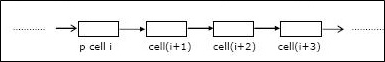

.. contents:: Table of Contents

1.
---

Which of the following sorting algorithms can be used to sort a random linked list with minimum time complexity?

A.  Insertion Sort
B.  Quick Sort
C.  Heap Sort
D.  **Merge Sort**

Both Merge sort and Insertion sort can be used for linked lists.

The slow random-access performance of a linked list makes other algorithms (such as quicksort) perform poorly, and others (such as heapsort) completely impossible. Since worst case time complexity of Merge Sort is O(nLogn) and Insertion sort is O(n^2), merge sort is preferred. 

See following for implementation of merge sort using Linked List. 

http://www.geeksforgeeks.org/merge-sort-for-linked-list/

2.
---

Suppose each set is represented as a linked list with elements in arbitrary order. Which of the operations among union, intersection, membership, cardinality will be the slowest? (GATE CS 2004)

A.  union only
B.  intersection, membership
C.  membership, cardinality
D.  **union, intersection**

For getting intersection of L1 and L2, search for each element of L1 in L2 and print the elements we find in L2. There can be many ways for getting union of L1 and L2. One of them is as follows a) Print all the nodes of L1 and print only those which are not present in L2. b) Print nodes of L2. All of these methods will require more operations than intersection as we have to process intersection node plus other nodes.

3.
---

A circularly linked list is used to represent a Queue. A single variable p is used to access the Queue. To which node should p point such that both the operations enQueue and deQueue can be performed in constant time? (GATE 2004) 

A.  **rear node**
B.  front node
C.  not possible with a single pointer
D.  node next to front

Answer is not "(b) front node", as we cannot get rear from front in O(1), but if p is rear we can implement both enQueue and deQueue in O(1) because from rear we can get front in O(1).

4.
----

Given pointer to a node X in a singly linked list. Only one pointer is given, pointer to head node is not given, can we delete the node X from given linked list?

A.  **Possible if X is not last node. Use following two steps (a) Copy the data of next of X to X. (b) Delete next of X.**
B.  Possible if size of linked list is even.
C.  Possible if size of linked list is odd
D.  Possible if X is not first node. Use following two steps (a) Copy the data of next of X to X. (b) Delete next of X.

.. code:: cpp

    struct node *temp  = X->next;
    X->data  = temp->data;
    X->next  = temp->next;
    free(temp);

5.
---

Let P be a singly linked list. Let Q be the pointer to an intermediate node x in the list. What is the worst-case time complexity of the best known algorithm to delete the node x from the list?

A.  O(n)
B.  O(log2 n)
C.  O(logn)
D.  **O(1)**

A simple solution is to traverse the linked list until you find the node you want to delete. But this solution requires pointer to the head node which contradicts the problem statement. Fast solution is to copy the data from the next node to the node to be deleted and delete the next node. Something like following.

.. code:: cpp

        // Find next node using next pointer
        struct node *temp  = node_ptr->next;

        // Copy data of next node to this node
        node_ptr->data  = temp->data;

        // Unlink next node
        node_ptr->next  = temp->next;

        // Delete next node
        free(temp);

Time complexity of this approach is O(1) Refer this for implementation. Note that this approach doesn't work when node to deleted is last node. Since the question says intermediate node, we can use this approach.

6.
---

N items are stored in a sorted doubly linked list. For a delete operation, a pointer is provided to the record to be deleted. For a decrease-key operation, a pointer is provided to the record on which the operation is to be performed. An algorithm performs the following operations on the list in this order: Θ(N) delete, O(log N) insert, O(log N) find, and Θ(N) decrease-key What is the time complexity of all these operations put together

A.  O(Log2N)
B.  O(N)
C.  **O(N2)**
D.  O(N2 Log N)

The time complexity of decrease-key operation is Θ(1) since we have the pointer to the record where we have to perform the operation. However, we must keep the doubly linked list sorted and after the decrease-key operation we need to find the new location of the key. This step will take Θ(N) time and since there are Θ(N) decrease-key operations, the time complexity becomes O(N²). Note that the other three operations have a lower bound than this one.

7.
---

Let p be a pointer as shown in the figure in a single linked list. 

What do the following assignment statements achieve?

.. code:: cpp

    q: = p → next
    p → next:= q → next 
    q → next:=(q → next) → next 
    (p → next) → next:= q

Answer::

    It swaps the second and third cell

8.
----

The concatenation of two lists is to be performed in O(1) time. Which of the following implementations of a list should be used?

A.  singly linked list
B.  doubly linked list
C.  **circular doubly linked list**
D.  array implementation of lists

Analyze below Code which is O(1)

Suppose List1's first element is pointed by pointer p1 

And List2's first element is pointed by p2

And tmp is a temporary pointer of node type.

.. code:: cpp

    p1->prev->next = p2;
    tmp= p2-> prev;
    p2-> prev= p1-> prev;
    p1-> prev = tmp-> next;
    tmp -> next = p1;

Option A&B of linked list are  not possible in O(1). Bcz they cant find out rear element without doing linear  traversal.

Option D Array implementation it requires O(n1+n2) Copy operation where n1 represents size of List1.

9.
---

Consider the following piece of ‘C’ code fragment that removes duplicates from an ordered list of integers.

.. code:: cpp

    Node  *remove-duplicates(Node *head, int *j)
    {
        Node *t1, *t2;
        *j=0;
        t1 = head;
        if (t1! = NULL) t2 = t1 →next;
        else return head;
        *j = 1;
        if(t2 == NULL)
            return head;
        while t2 != NULL)
        {
            if (t1.val != t2.val) --------------------------→ (S1)
            {
                (*j)++; t1 -> next = t2; t1 = t2: ----------→ (S2)
            }
            t2 = t2 →next;
        }
        t1 →next = NULL;
        return head;
    }

Assume the list contains n elements (n≥2) in the following questions.

A.  How many times is the comparison in statement S1 made?
B.  What is the minimum and the maximum number of times statements marked S2 get executed?
C.  What is the significance of the value in the integer pointed to by j when the function completes?

Answer:

A.  As we are comparing here pair wise so for n elements we require compulsory n−1 comparison O(n)
B.  S2 is executed only for distinct elements so max n−1 times and min 0 when all r duplicates or list contain no or 1 element.

    min: when all value in list are same O(1)
    
    max: when all the value in the list are distinct O(n) 

C.  j holds the count on number of distinct elements in the ordered list.
    
    j points to number of distinct elements in list

10.
---

Consider the following statements:

i.  First-in-first out types of computations are efficiently supported by STACKS.
ii. Implementing LISTS on linked lists is more efficient than implementing LISTS on

    an array for almost all the basic LIST operations.

iii.    Implementing QUEUES on a circular array is more efficient than implementing QUEUES

    on a linear array with two indices.

iv. Last-in-first-out type of computations are efficiently supported by QUEUES.

Which of the following is correct?

A.  **(ii) and (iii) are true**
B.  (i) and (ii) are true
C.  (iii) and (iv) are true
D.  (ii) and (iv) are true

11.
----

Suppose there are two singly linked lists both of which intersect at some point and become a single linked list. The head or start pointers of both the lists are known, but the intersecting node and lengths of lists are not known. What is worst case time complexity of optimal algorithm to find intersecting node from two intersecting linked lists?

A.  Θ(n*m), where m, n are lengths of given lists
B.  Θ(n^2), where m>n and m, n are lengths of given lists
C.  **Θ(m+n), where m, n are lengths of given lists**
D.  Θ(min(n, m)), where m, n are lengths of given lists

This takes Θ(m+n) time and O(1) space in worst case, where M and N are the total length of the linked lists.

#.  Traverse the two linked list to find m and n.
#.  Get back to the heads, then traverse |m − n| nodes on the longer list.
#.  Now walk in lock step and compare the nodes until you found the common ones.

Option (C) is correct.

References
-------------

https://www.geeksforgeeks.org/linked-list-data-structure/

