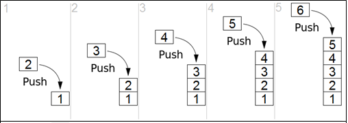
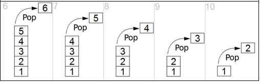

.. contents:: Table of Contents

Stack
======

Stack
------

A stack is an abstract data type that serves as a collection of elements, with two principal operations push and pop. 

A real-world stack allows operations at one end only. Likewise, Stack ADT allows all data operations at one end only. At any given time, we can only access the top element of a stack. This feature makes it LIFO (last in, first out) data structure.

Operations
-----------

Stack operations may involve initializing the stack, using it and then de-initializing it.

**All stack operations have time complexity O(1)**

Primary Operations
^^^^^^^^^^^^^^^^^^^

push
~~~~~

adds an element to the collection

If the stack is full and does not contain enough space to accept an entity to be pushed, the stack is then considered to be in an overflow state

.. list-table::
    :header-rows: 1

    *   -   Algorithm
        -   Example

    *   -   .. code:: cpp

                begin procedure push: stack, data
                    if stack is full
                        return null
                    endif
                    
                    top ← top + 1
                    stack[top] ← data
                end procedure	

        -   .. code:: cpp

                void push(int data) {
                    if(!isFull()) {
                        top = top + 1;
                        stack[top] = data;
                    }
                    else
                    {
                        printf("Could not insert data, Stack is full.\n");
                    }
                }

pop
~~~~

removes the most recently added element that was not yet removed

An underflow condition can occur in the pop operation if the stack is empty

.. list-table::
    :header-rows: 1

    *   -   Algorithm
        -   Example

    *   -   .. code:: cpp

                begin procedure pop: stack
                    if stack is empty
                        return null
                    endif
                    
                    data ← stack[top]
                    top ← top - 1
                    
                    return data
                end procedure	

        -   .. code:: cpp

                begin procedure pop: stack
                    if stack is empty
                        return null
                    endif
                    
                    data ← stack[top]
                    top ← top - 1
                    
                    return data
                end procedure

Additional Operations
^^^^^^^^^^^^^^^^^^^^^^^

peek
~~~~~~~~

give access to the top without modifying the stack

also known as "top of stack" operation

.. list-table::
    :header-rows: 1

    *   -   Algorithm
        -   Example

    *   -   .. code:: cpp

                begin procedure peek
                    return stack[top]
                end procedure	

        -   .. code:: cpp

                int peek() {
                    return stack[top];
                }

isFull
~~~~~~~~

check if stack is full

.. list-table::
    :header-rows: 1

    *   -   Algorithm
        -   Example

    *   -   .. code:: cpp

                begin procedure isfull
                    if top equals to MAXSIZE
                        return true
                    else
                        return false
                    endif
                end procedure
        
        -   .. code:: cpp

                bool isfull() {
                    if(top == MAXSIZE)
                        return true;
                    else
                        return false;
                }

isEmpty
~~~~~~~~~~

check if stack is empty

.. list-table::
    :header-rows: 1

    *   -   Algorithm
        -   Example

    *   -   .. code:: cpp

                begin procedure isempty
                    if top less than 1
                        return true
                    else
                        return false
                    endif
                end procedure	

        -   .. code:: cpp

                bool isempty() {
                    if(top == -1)
                        return true;
                    else
                        return false;
                }

At all times, we maintain a pointer to the last PUSHed data on the stack. As this pointer always represents the top of the stack, hence named top. The top pointer provides top value of the stack without actually removing it.

Application
--------------

#.  Expression evaluation and syntax parsing
#.  Backtracking
#.  Compile time memory management
#.  Efficient algorithms
#.  Balancing of symbols
#.  Infix to Postfix /Prefix conversion
#.  Redo-undo features at many places like editors, photoshop.
#.  Forward and backward feature in web browsers
#.  Used in many algorithms like Tower of Hanoi, tree traversals, stock span problem, histogram problem.
#.  Other applications can be Backtracking, Knight tour problem, rat in a maze, N queen problem and sudoku solver

Implementation
---------------

Two ways to implement a stack:

#.  Using array
#.  Using linked list

1.	Using array
^^^^^^^^^^^^^^^^

.. code:: cpp

    #include <stdio.h>

    int MAXSIZE = 8;       
    int stack[8];     
    int top = -1;            

    int isempty() {
        if(top == -1)
            return 1;
        else
            return 0;
    }
    
    int isfull() {
        if(top == MAXSIZE)
            return 1;
        else
            return 0;
    }

    int peek() {
        return stack[top];
    }

    int pop() {
    int data;
    
        if(!isempty()) {
            data = stack[top];
            top = top - 1;
            return data;
        } 
        else {
            printf("Could not retrieve data, Stack is empty.\n");
        }
    }

    int push(int data) {
        if(!isfull()) {
            top = top + 1;
            stack[top] = data;
        } 
        else {
            printf("Could not insert data, Stack is full.\n");
        }
    }

    int main() {
        // push items on to the stack
        push(3);
        push(5);
        push(9);
        push(1);
        push(12);
        push(15);
        
        printf("Element at top of the stack: %d\n" ,peek());
        printf("Elements: \n");
        
        // print stack data
        while(!isempty()) {
            int data = pop();
            printf("%d\n",data);
        }
        
        printf("Stack full: %s\n" , isfull()?"true":"false");
        printf("Stack empty: %s\n" , isempty()?"true":"false");
        
        return 0;
    }

Output::

    Element at top of the stack: 15
    Elements:
    15
    12
    1 
    9 
    5 
    3 
    Stack full: false
    Stack empty: true

2.	Using linked list
^^^^^^^^^^^^^^^^^^^^^^

.. code:: cpp

    #include <stdio.h>
    #include <stdlib.h>
    #include <limits.h>
    
    // A structure to represent a stack
    struct StackNode {
        int data;
        struct StackNode* next;
    };
    
    struct StackNode* newNode(int data) {
        struct StackNode* stackNode = (struct StackNode*) malloc(sizeof(struct StackNode));
        stackNode->data = data;
        stackNode->next = NULL;
        return stackNode;
    }
    
    int isEmpty(struct StackNode *root) {
        return !root;
    }
    
    void push(struct StackNode** root, int data) {
        struct StackNode* stackNode = newNode(data);
        stackNode->next = *root;
        *root = stackNode;
        printf("%d pushed to stack\n", data);
    }
    
    int pop(struct StackNode** root) {
        if (isEmpty(*root))
            return INT_MIN;
        struct StackNode* temp = *root;
        *root = (*root)->next;
        int popped = temp->data;
        free(temp);
        
        return popped;
    }
    
    int peek(struct StackNode* root) {
        if (isEmpty(root))
            return INT_MIN;
        return root->data;
    }
    
    int main() {
        struct StackNode* root = NULL;
        
        push(&root, 10);
        push(&root, 20);
        push(&root, 30);
        
        printf("%d popped from stack\n", pop(&root));
        printf("Top element is %d\n", peek(root));
        
        return 0;
    }

Output::

    10 pushed to stack
    20 pushed to stack
    30 pushed to stack
    30 popped from stack
    Top element is 20

3.	Implement Stack using Queues
^^^^^^^^^^^^^^^^^^^^^^^^^^^^^^^^^^^^

I.  Making push operation costly
II. Making pop operation costly
III.    A stack using single queue

A stack can be implemented using two queues. Let stack to be implemented be ‘s’ and queues used to implement be ‘q1’ and ‘q2’. Stack ‘s’ can be implemented in two ways:

I.	Making push operation costly
~~~~~~~~~~~~~~~~~~~~~~~~~~~~~~~~~~~~~

This method makes sure that newly entered element is always at the front of ‘q1’, so that pop operation just dequeues from ‘q1’. ‘q2’ is used to put every new element at front of ‘q1’.

**push(s, x)** // x is the element to be pushed and s is stack

#.  Enqueue x to q2
#.  One by one dequeue everything from q1 and enqueue to q2.
#.  Swap the names of q1 and q2

    // Swapping of names is done to avoid one more movement of all elements from q2 to q1. 

**pop(s)**

#.  Dequeue an item from q1 and return it.

.. code:: cpp

    /* Program to implement a stack using two queue */
    #include <iostream>
    #include <queue>
    using namespace std;

    class Stack {
        // Two inbuilt queues
        queue<int> q1, q2;
        
        // To maintain current number of elements
        int curr_size;

        public:
            Stack() { curr_size = 0; }

            void push(int x) {
                curr_size++;

                // Push x first in empty q2
                q2.push(x);

                // Push all the remaining 
                // elements in q1 to q2. 
                while (!q1.empty()) {
                    q2.push(q1.front());
                    q1.pop();
                }

                // swap the names of two queues
                queue<int> q = q1;
                q1 = q2;
                q2 = q;
            }

            void pop(){
                // if no elements are there in q1 
                if (q1.empty())
                    return ;
                q1.pop();
                curr_size--;
            }

            int top() {
                if (q1.empty())
                    return -1;
                return q1.front();
            }

            int size() {
                return curr_size;
            }
    };

    // driver code
    int main() {
        Stack s;
        s.push(1);
        s.push(2);
        s.push(3);
        
        cout << "current size: " << s.size() << endl;
        cout << s.top() << endl;
        s.pop();
        cout << s.top() << endl;
        s.pop();
        cout << s.top() << endl;
        
        cout << "current size: " << s.size() << endl;
        return 0;
    }

Output::

    current size: 3
    3
    2
    1
    current size: 1

II.	Making pop operation costly
~~~~~~~~~~~~~~~~~~~~~~~~~~~~~~~~~~~

In push operation, the new element is always enqueued to q1. In pop() operation, if q2 is empty then all the elements except the last, are moved to q2. Finally the last element is dequeued from q1 and returned.

**push(s,  x)**

#.  Enqueue x to q1 (assuming size of q1 is unlimited).

**pop(s)**

#.  One by one dequeue everything except the last element from q1 and enqueue to q2.
#.  Dequeue the last item of q1, the dequeued item is result, store it.
#.  Swap the names of q1 and q2
#.  Return the item stored in step 2.

    // Swapping of names is done to avoid one more movement of all elements from q2 to q1.

.. code:: cpp

    /* Program to implement a stack using two queue */
    #include <iostream>
    #include <queue>
    using namespace std;
    
    class Stack {
        queue<int> q1, q2;
        int curr_size;
        
        public:
        Stack() { curr_size = 0; }
        
        void pop() {
            if (q1.empty())
                return;
            
            // Leave one element in q1 and 
            // push others in q2.
            while (q1.size() != 1) {
                q2.push(q1.front());
                q1.pop();
            }
            
            // Pop the only left element from q1
            q1.pop();
            curr_size--;
            
            // swap the names of two queues
            queue<int> q = q1;
            q1 = q2;
            q2 = q;
        }
        
        void push(int x) {
            q1.push(x);
            curr_size++;
        }
        
        int top() {
            if (q1.empty())
                return -1;
            
            while( q1.size() != 1 ) {
                q2.push(q1.front());
                q1.pop();
            }
            
            // last pushed element
            int temp = q1.front();
            
            // push last element to q2
            q2.push(temp);
            
            // swap the two queues names
            queue<int> q = q1;
            q1 = q2;
            q2 = q;
            return temp;
        }
        
        int size() {
            return curr_size;
        }
        
    };
    
    // driver code
    int main() {
        Stack s;
        s.push(1);
        s.push(2);
        s.push(3);
        s.push(4);
        
        cout << "current size: " << s.size() << endl;
        cout << s.top() << endl;
        s.pop();
        cout << s.top() << endl;
        s.pop();
        cout << s.top() << endl;
        cout << "current size: " << s.size() << endl;
        return 0;
    }

Output::

    current size: 4
    4
    3
    2
    current size: 2

For more designs and problems:
https://www.cdn.geeksforgeeks.org/stack-data-structure/

III.	A stack using single queue
~~~~~~~~~~~~~~~~~~~~~~~~~~~~~~~~~~~~

**push(s, x)**  // x is the element to be pushed and s is stack

#.  Let size of q be s. 
#.  Enqueue x to q
#.  One by one Dequeue s items from queue and enqueue them.

**pop(s)**  // Removes an item from stack

#.  Dequeue an item from q

.. code:: cpp

    #include <cstdio>
    #include <iostream>
    #include <queue>
    using namespace std;

    class stack {
            queue<int> qu;
        
        public:
            void push(int num);
            void pop(void);
            int top(void);
            bool empty(void);
            int size(void);
    };

    void stack::push(int num) {
        int num_stack_elements = qu.size();
        qu.push(num);
        
        for(int i = 0; i < num_stack_elements; ++i) {
            qu.push(qu.front());
            qu.pop();
        }
    }

    void stack::pop(void) {
        if(!qu.empty())
            qu.pop();
    }

    int stack::top(void) {
        if(!qu.empty())
            return qu.front();
        return -1;
    }

    bool stack::empty(void) {
        return qu.empty();
    }

    int stack::size(void) {
        return qu.size();
    }

    int main(){
        stack s; 

        s.push(10); 
        s.push(20); 
        cout << s.top() << endl; 
        s.pop(); 

        s.push(30); 
        s.pop(); 
        cout << s.top() << endl; 

        return 0; 
    }

Output::

    20
    10

References
------------

https://www.cdn.geeksforgeeks.org/stack-data-structure/

