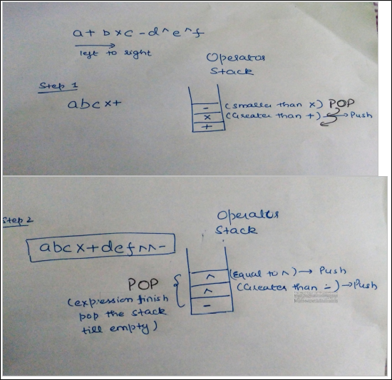

.. contents:: Table of Contents

Stack
======

1.
----

The following postfix expression with single digit operands is evaluated using a stack:

	8 2 3 ^ / 2 3 * + 5 1 * - 

Note that ^ is the exponentiation operator. The top two elements of the stack after the first * is evaluated are:

**Ans:	1, 6**

The algorithm for evaluating any postfix expression is fairly straightforward:

#.  While there are input tokens left

    -   Read the next token from input.
    -   If the token is a value

        \+ Push it onto the stack.

    -   Otherwise, the token is an operator (operator here includes both operators, and functions).

        - It is known a priori that the operator takes n arguments.
        - If there are fewer than n values on the stack
            (Error) The user has not input sufficient values in the expression.
        - Else, Pop the top n values from the stack.
        - Evaluate the operator, with the values as arguments.
        - Push the returned results, if any, back onto the stack.

#.  If there is only one value in the stack

    -   That value is the result of the calculation.

#.  If there are more values in the stack

    -   (Error)  The user input has too many values.

Source for algorithm: http://en.wikipedia.org/wiki/Reverse_Polish_notation#The_postfix_algorithm 

Let us run the above algorithm for the given expression. First three tokens are values, so they are simply pushed. After pushing 8, 2 and 3, the stack is as follows

    8, 2, 3

When ^ is read, top two are popped and power(2^3) is calculated

    8, 8

When / is read, top two are popped and division(8/8) is performed

    1

Next two tokens are values, so they are simply pushed. After pushing 2 and 3, the stack is as follows

    1, 2, 3

When * comes, top two are popped and multiplication is performed.

    1, 6

2.
---

Let S be a stack of size n >= 1. Starting with the empty stack, suppose we push the first n natural numbers in sequence, and then perform n pop operations. Assume that Push and Pop operation take X seconds each, and Y seconds elapse between the end of one such stack operation and the start of the next operation. For m >= 1, define the stack-life of m as the time elapsed from the end of Push(m) to the start of the pop operation that removes m from S. The average stack-life of an element of this stack is

**Ans: n(X + Y) - X**

3.
---

A single array A[1..MAXSIZE] is used to implement two stacks. The two stacks grow from opposite ends of the array. Variables top1 and top2 (topl< top 2) point to the location of the topmost element in each of the stacks. If the space is to be used efficiently, the condition for “stack full” is (GATE CS 2004)

**Ans:	top1= top2 -1**

If we are to use space efficiently then size of the any stack can be more than MAXSIZE/2. Both stacks will grow from both ends and if any of the stack top reaches near to the other top then stacks are full. So the condition will be top1 = top2 -1 (given that top1 < top2)

4.
---

Let S be a stack of size n >= 1. Starting with the empty stack, suppose we push the first n natural numbers in sequence, and then perform n pop operations. Assume that Push and Pop operation take X seconds each, and Y seconds elapse between the end of one such stack operation and the start of the next operation. For m >= 1, define the stack-life of m as the time elapsed from the end of Push(m) to the start of the pop operation that removes m from S. The average stack-life of an element of this stack is

    #. n(X+ Y)
    #. 3Y + 2X
    #. **n(X + Y)-X**
    #. Y + 2X

We can easily arrive at the result by taking few examples.

5.
---

Assume that the operators +, -, × are left associative and ^ is right associative. The order of precedence (from highest to lowest) is ^, x , +, -. The postfix expression corresponding to the infix expression a + b × c - d ^ e ^ f is

    #. **abc × + def ^ ^ -**
    #. abc × + de ^ f ^ -
    #. ab + c × d - e ^ f ^
    #. - + a × bc ^ ^ def

6.
---

To evaluate an expression without any embedded function calls:

    #. **One stack is enough**
    #. Two stacks are needed
    #. As many stacks as the height of the expression tree are needed
    #. A Turing machine is needed in the general case

Any expression can be converted into Postfix or Prefix form.

Prefix and postfix evaluation can be done using a single stack. 

For example : Expression '10 2 8 * + 3 -' is given. PUSH 10 in the stack. PUSH 2 in the stack. PUSH 8 in the stack. When operator '*' occurs, POP 2 and 8 from the stack. PUSH 2 * 8 = 16 in the stack. When operator '+' occurs, POP 16 and 10 from the stack. PUSH 10 * 16 = 26 in the stack. PUSH 3 in the stack. When operator '-' occurs, POP 26 and 3 from the stack. PUSH 26 - 3 = 23 in the stack. So, 23 is the answer obtained using single stack. 

Thus, option (A) is correct.

7.
---

Consider n elements that are equally distributed in k stacks. In each stack, elements of it are arranged in ascending order (min is at the top in each of the stack and then increasing downwards). Given a queue of size n in which we have to put all n elements in increasing order. What will be the time complexity of the best known algorithm?

    #. **O(n logk)**
    #. O(nk)
    #. O(n2)
    #. O(k2)

In nlogk it can be done by creating a min heap of size k and adding all the top - elements of all the stacks. After extracting the min , add the next element from the stack from which we have got our 1st minimum. Time Complexity = O(k) (For Creating Heap of size k) + (n-k)log k (Insertions into the heap).

8.
---

The minimum number of stacks needed to implement a queue is

    #. 3
    #. 1
    #. **2**
    #. 4

References
-----------

https://www.geeksforgeeks.org/stack-data-structure/

