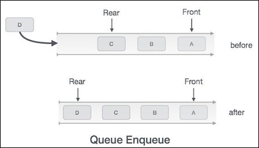
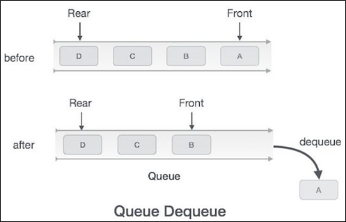

.. contents:: Table of Contents

Queue
=======

Queue
--------

A queue is an abstract data type or collection in which the entities in the collection are kept in order and the principle (or only) operations on the collection are the addition of entities to the rear terminal position (enqueue), and removal of entities from the front terminal position (dequeue). This makes the queue a First-In-First-Out **(FIFO) data structure**.

Types of Queue
---------------

#.  Queue
#.  Double-ended queue (Deque)
#.  Circular Queue
#.  Priority Queue

Time Complexity
-----------------

.. list-table::
    :header-rows: 1

    *   -   Algorithm
        -   Average
        -   Worst case

    *   -   Space
        -   O(n)
        -   O(n)

    *   -   Search
        -   O(n)
        -   O(n)

    *   -   Insert
        -   O(1)
        -   O(1)

    *   -   Delete
        -   O(1)
        -   O(1)

Operations
------------

Queue operations may involve initializing or defining the queue, utilizing it, and then completely erasing it from the memory.

Queues maintain two data pointers, front and rear. Therefore, its operations are comparatively difficult to implement than that of stacks.

Primary Operations
^^^^^^^^^^^^^^^^^^^

#.  enqueue
#.  dequeue

1.	enqueue()
~~~~~~~~~~~~~~

add (store) an item to the queue
 

.. list-table::
    :header-rows: 1

    *   -   Algorithm
        -   Example

    *   -   .. code:: cpp

                procedure enqueue(data)
                    if queue is full
                        return overflow
                    endif
                    
                    rear ← rear + 1
                    
                    queue[rear] ← data
                    return true

                end procedure	

        -   .. code:: cpp

                int enqueue(int data)
                    if(isfull())
                        return 0;
                        
                    rear = rear + 1;
                    
                    queue[rear] = data;
                    return 1;
                    
                end procedure

2.	dequeue()
~~~~~~~~~~~~~~

remove (access) an item from the queue

.. list-table::
    :header-rows: 1

    *   -   Algorithm
        -   Example

    *   -   .. code:: cpp

                procedure dequeue
                    if queue is empty
                        return underflow
                    end if
                    
                    data = queue[front]
                    front ← front + 1
                    return true

                end procedure

        -   .. code:: cpp

                int dequeue() {

                    if(isempty())
                        return 0;
                        
                    int data = queue[front];
                    front = front + 1;
                    
                    return data;
                }

Additional Operations
^^^^^^^^^^^^^^^^^^^^^^^^

3.	peek()
~~~~~~~~~~~~~~~

Gets the element at the front of the queue without removing it

.. list-table::
    :header-rows: 1

    *   -   Algorithm
        -   Example

    *   -   .. code:: cpp

                begin procedure peek
                    return queue[front]

        -   .. code:: cpp

                end procedure	int peek() {
                    return queue[front];
                }

4.	isfull()
~~~~~~~~~~~~~~~

Checks if the queue is full

.. list-table::
    :header-rows: 1

    *   -   Algorithm
        -   Example

    *   -   .. code:: cpp

                begin procedure isfull
                    
                    if rear equals to MAXSIZE
                        return true
                    else
                        return false
                    endif

                end procedure	

        -   .. code:: cpp

                bool isfull() {
                    if(rear == MAXSIZE - 1)
                        return true;
                    else
                        return false;
                }

5.	isempty()
~~~~~~~~~~~~~~

Checks if the queue is empty

.. list-table::
    :header-rows: 1

    *   -   Algorithm
        -   Example

    *   -   .. code:: cpp

                begin procedure isempty

                    if front is less than MIN  OR front is greater than rear
                        return true
                    else
                        return false
                    endif
                    
                end procedure	

        -   .. code:: cpp

                bool isempty() {
                    if(front < 0 || front > rear)
                        return true;
                    else
                        return false;
                }

Applications
----------------

#.  When a resource is shared among multiple consumers, like a printer, CPU task scheduling etc.
#.  **Asynchronous Data Transfer:** When data is transferred asynchronously (data not necessarily received at same rate as sent) between two processes. Examples include IO Buffers, pipes, file IO, etc.
#.  In real life scenario, Call Center phone systems uses Queues to hold people calling them in an order, until a service representative is free
#.  Handling of interrupts in real-time systems. The interrupts are handled in the same order as they arrive i.e. First come first served
#.  **M/M/1 queue:** One of the most important queueing models is known as an M/M/1 queue, which has been shown to accurately model many real-world situations. It is characterized by three properties:

    I.  There is one server—a FIFO queue.
    II. Interarrival times to the queue obey an exponential distribution with rate λ per minute.
    III.    Service times from a nonempty queue obey an exponential distribution with rate μ per minute.

Queue Implementations
-----------------------

1.	Using Array
^^^^^^^^^^^^^^^^^^^^

.. code:: cpp

    #include <stdio.h>
    #include <stdlib.h>
    #include <limits.h>
    
    // A structure to represent a queue
    struct Queue {
        int front, rear, size;
        unsigned capacity;
        int* array;
    };
    
    // function to create a queue of given capacity. It initializes size of queue as 0
    struct Queue* createQueue(unsigned capacity) {
        struct Queue* queue = (struct Queue*) malloc(sizeof(struct Queue));
        queue->capacity = capacity;
        queue->front = queue->size = 0; 
        queue->rear = capacity - 1;  // This is important, see the enqueue
        queue->array = (int*) malloc(queue->capacity * sizeof(int));
        return queue;
    }
    
    // Queue is full when size becomes equal to the capacity 
    int isFull(struct Queue* queue) {  
        return (queue->size == queue->capacity);  
    }
    
    // Queue is empty when size is 0
    int isEmpty(struct Queue* queue) {  
        return (queue->size == 0); 
    }
    
    // Function to add an item to the queue. It changes rear and size
    void enqueue(struct Queue* queue, int item) {
        if (isFull(queue))
            return;
        queue->rear = (queue->rear + 1) % queue->capacity;
        queue->array[queue->rear] = item;
        queue->size = queue->size + 1;
        printf("%d enqueued to queue\n", item);
    }
    
    // Function to remove an item from queue. It changes front and size
    int dequeue(struct Queue* queue) {
        if (isEmpty(queue))
            return INT_MIN;
        int item = queue->array[queue->front];
        queue->front = (queue->front + 1) % queue->capacity;
        queue->size = queue->size - 1;
        return item;
    }
    
    // Function to get front of queue
    int front(struct Queue* queue) {
        if (isEmpty(queue))
            return INT_MIN;
        return queue->array[queue->front];
    }
    
    // Function to get rear of queue
    int rear(struct Queue* queue) {
        if (isEmpty(queue))
            return INT_MIN;
        return queue->array[queue->rear];
    }
    
    // Driver program to test above functions./
    int main() {
        struct Queue* queue = createQueue(1000);

        enqueue(queue, 10);
        enqueue(queue, 20);
        enqueue(queue, 30);
        enqueue(queue, 40);

        printf("%d dequeued from queue\n", dequeue(queue));

        printf("Front item is %d\n", front(queue));
        printf("Rear item is %d\n", rear(queue));

        return 0;
    }

Output::

    10 enqueued to queue
    20 enqueued to queue
    30 enqueued to queue
    40 enqueued to queue
    10 dequeued from queue
    Front item is 20
    Rear item is 40

2.	Using Linked List
^^^^^^^^^^^^^^^^^^^^^^^^

.. code:: cpp

    // A C program to demonstrate linked list based implementation of queue
    #include <stdlib.h>
    #include <stdio.h>
    
    // A linked list (LL) node to store a queue entry
    struct QNode {
        int key;
        struct QNode *next;
    };
    
    // The queue, front stores the front node of LL and rear stores the last node of LL
    struct Queue {
        struct QNode *front, *rear;
    };
    
    // A utility function to create a new linked list node.
    struct QNode* newNode(int k) {
        struct QNode *temp = (struct QNode*)malloc(sizeof(struct QNode));
        temp->key = k;
        temp->next = NULL;
        return temp; 
    }
    
    // A utility function to create an empty queue
    struct Queue *createQueue() {
        struct Queue *q = (struct Queue*)malloc(sizeof(struct Queue));
        q->front = q->rear = NULL;
        return q;
    }
    
    // The function to add a key k to q
    void enQueue(struct Queue *q, int k) {
        // Create a new LL node
        struct QNode *temp = newNode(k);

        // If queue is empty, then new node is front and rear both
        if (q->rear == NULL) {
            q->front = q->rear = temp;
            return;
        }

        // Add the new node at the end of queue and change rear
        q->rear->next = temp;
        q->rear = temp;
    }
    
    // Function to remove a key from given queue q
    struct QNode *deQueue(struct Queue *q) {
        // If queue is empty, return NULL.
        if (q->front == NULL)
            return NULL;

        // Store previous front and move front one node ahead
        struct QNode *temp = q->front;
        q->front = q->front->next;

        // If front becomes NULL, then change rear also as NULL
        if (q->front == NULL)
            q->rear = NULL;
        return temp;
    }
    
    // Driver Program to test anove functions
    int main() {
        struct Queue *q = createQueue();
        
        enQueue(q, 10);
        enQueue(q, 20);
        
        deQueue(q);
        deQueue(q);
        
        enQueue(q, 30);
        enQueue(q, 40);
        enQueue(q, 50);
        
        struct QNode *n = deQueue(q);
        
        if (n != NULL)
            printf("Dequeued item is %d", n->key);
        
        return 0;
    }

Output::

    Dequeued item is 30

3.	Implement Queue using Stacks
^^^^^^^^^^^^^^^^^^^^^^^^^^^^^^^^^^^^^^

I.  Making enqueue operation costly
II. Making dequeue operation costly

A queue can be implemented using two stacks. Let queue to be implemented be q and stacks used to implement q be stack1 and stack2. q can be implemented in two ways:

I.	Making enqueue operation costly
~~~~~~~~~~~~~~~~~~~~~~~~~~~~~~~~~~~~~~~

In this method oldest entered element is always at the top of stack 1, so that dequeue operation just pops from stack1. To put the element at top of stack1, stack2 is used.

**enQueue(q, x)**

#.  While stack1 is not empty, push everything from satck1 to stack2
#.  Push x to stack1 (assuming size of stacks is unlimited)
#.  Push everything back to stack1

**dnQueue(q)**

#.  If stack1 is empty, then error
#.  Pop an item from stack1 and return it

II.	Making dequeue operation costly
~~~~~~~~~~~~~~~~~~~~~~~~~~~~~~~~~~~~~~

In this method, in en-queue operation, the new element is entered at the top of stack1. In de-queue operation, if stack2 is empty then all the elements are moved to stack2 and finally top of stack2 is returned.

**enQueue(q,  x)**

#.  Push x to stack1 (assuming size of stacks is unlimited).

**deQueue(q)**

#.  If both stacks are empty, then error.
#.  If stack2 is empty

    While stack1 is not empty, push everything from stack1 to stack2

#.  Pop the element from stack2 and return it

Method 2 is definitely better than method 1.

Method 1 moves all the elements twice in enqueue operation, while method 2 (in dequeue operation) moves the elements once and moves elements only if stack2 empty.

.. code:: cpp

    /* Program to implement a queue using two stacks */
    #include <stdio.h>
    #include <stdlib.h>
    
    /* structure of a stack node */
    struct sNode {
        int data;
        struct sNode *next;
    };
    

    /* Function to push an item to stack*/
    void push(struct sNode** top_ref, int new_data);
    
    /* Function to pop an item from stack*/
    int pop(struct sNode** top_ref);
    
    /* structure of queue having two stacks */
    struct queue {
        struct sNode *stack1;
        struct sNode *stack2;
    };
    
    /* Function to enqueue an item to queue */
    void enQueue(struct queue *q, int x) {
        push(&q->stack1, x);
    }
    
    /* Function to dequeue an item from queue */
    int deQueue(struct queue *q) {
        int x;
        /* If both stacks are empty then error */
        if(q->stack1 == NULL && q->stack2 == NULL) {
            printf("Q is empty");
            getchar();
            exit(0);
        }

        /* Move elements from satck1 to stack 2 only if stack2 is empty */
        if(q->stack2 == NULL) {
            while(q->stack1 != NULL) {
                x = pop(&q->stack1);
                push(&q->stack2, x);
            }
        }

        x = pop(&q->stack2);
        return x;
    }
    
    /* Function to push an item to stack*/
    void push(struct sNode** top_ref, int new_data) {
        /* allocate node */
        struct sNode* new_node = (struct sNode*) malloc(sizeof(struct sNode));
        if(new_node == NULL) {
            printf("Stack overflow \n");
            getchar();
            exit(0); 
        }

        /* put in the data */
        new_node->data = new_data;

        /* link the old list off the new node */
        new_node->next = (*top_ref);

        /* move the head to point to the new node */
        (*top_ref) = new_node;
    }
    
    /* Function to pop an item from stack*/
    int pop(struct sNode** top_ref) {
        int res;
        struct sNode *top;

        /*If stack is empty then error */
        if(*top_ref == NULL) {
            printf("Stack overflow \n");
            getchar();
            exit(0);
        }
        else {
            top = *top_ref;
            res = top->data;
            *top_ref = top->next;
            free(top);
            return res; 
        }
    }
    
    /* Driver function to test anove functions */
    int main() {
        /* Create a queue with items 1 2 3*/
        struct queue *q = (struct queue*)malloc(sizeof(struct queue));
        q->stack1 = NULL;
        q->stack2 = NULL;
        
        enQueue(q, 1);
        enQueue(q, 2);
        enQueue(q, 3);
        
        /* Dequeue items */
        printf("%d ", deQueue(q));
        printf("%d ", deQueue(q));
        printf("%d ", deQueue(q));

        return 0;
    }

Output::

    1 2 3

References
--------------

https://www.geeksforgeeks.org/queue-data-structure/

