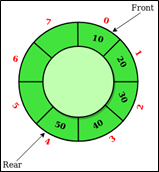

.. contents:: Table of Contents

Circular Queue
===============

Circular Queue
------------------

A circular queue is a data structure that uses a single, fixed-size buffer as if it were connected end-to-end. This structure lends itself easily to buffering data streams.

**Also known as circular buffer, circular queue, cyclic buffer or ring buffer**

Time Complexity
----------------

Time complexity of enqueue(), dequeue() operation is O(1) as there is no loop in any of the operation

Operations
----------

Primary Operations
^^^^^^^^^^^^^^^^^^^^

1.	enqueue
~~~~~~~~~~~~~~~~~

    Adds an item at the front of Circular queue

2.	circular queueue
~~~~~~~~~~~~~~~~~~~~~~

    Deletes an item from front of Circular queue

Additional Operations
^^^^^^^^^^^^^^^^^^^^^^

3.	peek
~~~~~~~~~~~~~~

    Gets the front item from Circular queue

4.	check empty
~~~~~~~~~~~~~~~~

    Checks whether Circular queue is empty or not

5.	check full
~~~~~~~~~~~~~~~

    Checks whether Circular queue is full or not

Applications
--------------

#.  **Memory Management:** The unused memory locations in the case of ordinary queues can be utilized in circular queues
#.  **Traffic system:** In computer controlled traffic system, circular queues are used to switch on the traffic lights one by one repeatedly as per the time set
#.  **CPU Scheduling:** Operating systems often maintain a queue of processes that are ready to execute or that are waiting for a particular event to occur

Circular Queue Implementations
----------------------------------

#.  Using Array
#.  Using Linked List

1.	Using Array
^^^^^^^^^^^^^^^^^

.. code:: cpp

    // C or C++ program for insertion and deletion in Circular Queue
    #include<bits/stdc++.h>
    using namespace std;
    
    struct Queue {
        // Initialize front and rear
        int rear, front;

        // Circular Queue
        int size;
        int *arr;

        Queue(int s) {
            front = rear = -1;
            size = s;
            arr = new int[s];
        }

        void enQueue(int value);
        int deQueue();
        void displayQueue();
    };
    

    
    /* Function to create Circular queue */
    void Queue::enQueue(int value) {
        if ((front == 0 && rear == size-1) || (rear == front-1)) {
            printf("\nQueue is Full");
            return;
        }
        else if (front == -1) /* Insert First Element */ {
            front = rear = 0;
            arr[rear] = value;
        }
        else if (rear == size-1 && front != 0) {
            rear = 0;
            arr[rear] = value;
        }
        else {
            rear++;
            arr[rear] = value;
        }
    }
    
    // Function to delete element from Circular Queue
    int Queue::deQueue() {
        if (front == -1) {
            printf("\nQueue is Empty");
            return INT_MIN;
        }

        int data = arr[front];
        arr[front] = -1;
        if (front == rear) {
            front = -1;
            rear = -1;
        }
        else if (front == size-1)
            front = 0;
        else
            front++;

        return data;
    }
    
    // Function displaying the elements of Circular Queue
    void Queue::displayQueue() {
        if (front == -1) {
            printf("\nQueue is Empty");
            return;
        }
        printf("\nElements in Circular Queue are: ");
        if (rear >= front) {
            for (int i = front; i <= rear; i++)
                printf("%d ",arr[i]);
        }
        else {
            for (int i = front; i < size; i++)
                printf("%d ", arr[i]);

            for (int i = 0; i <= rear; i++)
                printf("%d ", arr[i]);
        }
    }
    
    /* Driver of the program */
    int main() {
        Queue q(5);

        // Inserting elements in Circular Queue
        q.enQueue(14);
        q.enQueue(22);
        q.enQueue(13);
        q.enQueue(-6);

        // Display elements present in Circular Queue
        q.displayQueue();

        // Deleting elements from Circular Queue
        printf("\nDeleted value = %d", q.deQueue());
        printf("\nDeleted value = %d", q.deQueue());

        q.displayQueue();

        q.enQueue(9);
        q.enQueue(20);
        q.enQueue(5);

        q.displayQueue();

        q.enQueue(20);
        
        return 0;
    }

Output::

    Elements in Circular Queue are: 14 22 13 -6 
    Deleted value = 14
    Deleted value = 22
    Elements in Circular Queue are: 13 -6 
    Elements in Circular Queue are: 13 -6 9 20 5 
    Queue is Full

2.	Using Linked List
^^^^^^^^^^^^^^^^^^^^^^^^^

.. code:: cpp

    // C or C++ program for insertion and /deletion in Circular Queue
    #include <bits/stdc++.h>
    using namespace std;
    
    // Structure of a Node
    struct Node {
        int data;
        struct Node* link;
    };
    
    struct Queue {
        struct Node *front, *rear;
    };
    
    // Function to create Circular queue
    void enQueue(Queue *q, int value) {
        struct Node *temp = new Node;
        temp->data = value;
        if (q->front == NULL)
            q->front = temp;
        else
            q->rear->link = temp;

        q->rear = temp;
        q->rear->link = q->front;
    }
    
    // Function to delete element from Circular Queue
    int deQueue(Queue *q) {
        if (q->front == NULL) {
            printf ("Queue is empty");
            return INT_MIN;
        }

        // If this is the last node to be deleted
        int value; // Value to be dequeued
        if (q->front == q->rear) {
            value = q->front->data;
            free(q->front);
            q->front = NULL;
            q->rear = NULL;
        }
        else {  // There are more than one nodes
            struct Node *temp = q->front;
            value = temp->data;
            q->front = q->front->link;
            q->rear->link= q->front;
            free(temp);
        }

        return value ;
    }
    
    // Function displaying the elements of Circular Queue
    void displayQueue(struct Queue *q) {
        struct Node *temp = q->front;
        printf("\nElements in Circular Queue are: ");
        while (temp->link != q->front) {
            printf("%d ", temp->data);
            temp = temp->link;
        }
        printf("%d", temp->data);
    }
    
    /* Driver of the program */
    int main() {
        // Create a queue and initialize front and rear
        Queue *q = new Queue;
        q->front = q->rear = NULL;

        // Inserting elements in Circular Queue
        enQueue(q, 14);
        enQueue(q, 22);
        enQueue(q, 6);

        // Display elements present in Circular Queue
        displayQueue(q);

        // Deleting elements from Circular Queue
        printf("\nDeleted value = %d", deQueue(q));
        printf("\nDeleted value = %d", deQueue(q));

        // Remaining elements in Circular Queue
        displayQueue(q);

        enQueue(q, 9);
        enQueue(q, 20);
        displayQueue(q);

        return 0;
    }

Output::

    Elements in Circular Queue are: 14 22 6
    Deleted value = 14
    Deleted value = 22
    Elements in Circular Queue are: 6
    Elements in Circular Queue are: 6 9 20

References
-------------

https://www.geeksforgeeks.org/introduction-to-circular-queue

