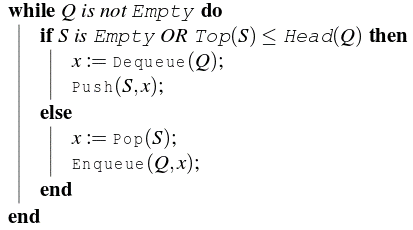

.. contents:: Table of Contents

1.
----

Which one of the following is an application of Queue Data Structure?

#.  When a resource is shared among multiple consumers.
#.  When data is transferred asynchronously (data not necessarily received at same rate as sent) between two processes
#.  Load Balancing
#.  **All of the above**

2.
----

A priority queue can efficiently implemented using which of the following data structures? Assume that the number of insert and peek (operation to see the current highest priority item) and extraction (remove the highest priority item) operations are almost same.

#.  Array
#.  Linked List
#.  **Heap Data Structures like Binary Heap, Fibonacci Heap**
#.  None of the above

3.
----

Suppose a circular queue of capacity (n – 1) elements is implemented with an array of n elements. Assume that the insertion and deletion operation are carried out using REAR and FRONT as array index variables, respectively. Initially, REAR = FRONT = 0. The conditions to detect queue full and queue empty are

#.  **Full: (REAR+1) mod n == FRONT, empty: REAR == FRONT**
#.  Full: (REAR+1) mod n == FRONT, empty: (FRONT+1) mod n == REAR
#.  Full: REAR == FRONT, empty: (REAR+1) mod n == FRONT
#.  Full: (FRONT+1) mod n == REAR, empty: REAR == FRONT

Suppose we start filling the queue.

Let the maxQueueSize ( Capacity of the Queue) is 4.
So the size of the array which is used to implement 
this circular queue is 5, which is n.

In the begining when the queue is empty, FRONT and REAR 
point to 0 index in the array.

REAR represents insertion at the REAR index.
FRONT represents deletion from the FRONT index.

enqueue("a"); REAR = (REAR+1)%5; ( FRONT = 0, REAR = 1)

enqueue("b"); REAR = (REAR+1)%5; ( FRONT = 0, REAR = 2)

enqueue("c"); REAR = (REAR+1)%5; ( FRONT = 0, REAR = 3)

enqueue("d"); REAR = (REAR+1)%5; ( FRONT = 0, REAR = 4)

Now the queue size is 4 which is equal to the maxQueueSize. 
Hence overflow condition is reached.

Now, we can check for the conditions.

When Queue Full :

( REAR+1)%n = (4+1)%5 = 0

FRONT is also 0.

Hence ( REAR + 1 ) %n is equal to FRONT.

When Queue Empty :

REAR was equal to FRONT when empty ( because in the starting 
before filling the queue FRONT = REAR = 0 )

Hence Option A is correct.

4.
---

An implementation of a queue Q, using two stacks S1 and S2, is given below:

.. code:: cpp

    void insert(Q, x) {
        push (S1, x);
    }
    
    void delete(Q){
        if(stack-empty(S2)) then
            if(stack-empty(S1)) then {
                print(“Q is empty”);
                return;
            }
            else 
                while (!(stack-empty(S1))){
                    x=pop(S1);
                    push(S2,x);
            }
            
        x=pop(S2);
    }

Let n insert and m (<=n) delete operations be performed in an arbitrary order on an empty queue Q. Let x and y be the number of push and pop operations performed respectively in the process. Which one of the following is true for all m and n?

#.  **n+m <= x < 2n and 2m <= y <= n+m**
#.  n+m <= x < 2n and 2m<= y <= 2n
#.  2m <= x < 2n and 2m <= y <= n+m
#.  2m <= x <2n and 2m <= y <= 2n

5.
----

Consider the following operation along with Enqueue and Dequeue operations on queues, where k is a global parameter.

.. code:: cpp

    MultiDequeue(Q){
        m = k
        while (Q is not empty and m  > 0) {
            Dequeue(Q)
            m = m - 1
        }
    }

What is the worst case time complexity of a sequence of n MultiDequeue() operations on an initially empty queue?
 
A.  Θ(n)
B.  Θ(n+k)
C.  Θ(nk)
D.  Θ(n^2)

#.  **A**
#.  B
#.  C
#.  D

6.
---

Suppose implementation supports an instruction REVERSE, which reverses the order of elements on the stack, in addition to the PUSH and POP instructions. Which one of the following statements is TRUE with respect to this modified stack?

#.  A queue cannot be implemented using this stack.
#.  A queue can be implemented where ENQUEUE takes a single instruction and DEQUEUE takes a sequence of two instructions.
#.  **A queue can be implemented where ENQUEUE takes a sequence of three instructions and DEQUEUE takes a single instruction.**
#.  A queue can be implemented where both ENQUEUE and DEQUEUE take a single instruction each.

7.
----

Let Q denote a queue containing sixteen numbers and S be an empty stack. Head(Q) returns the element at the head of the queue Q without removing it from Q. Similarly Top(S) returns the element at the top of S without removing it from S. Consider the algorithm given below. 

The maximum possible number of iterations of the while loop in the algorithm is______ [This Question was originally a Fill-in-the-Blanks question]

#.  16
#.  32
#.  **256**
#.  64

The worst case happens when the queue is sorted in decreasing order. In worst case, loop runs n*n times.

Queue: 4 3 2 1

Stack: Empty

3 2 1

4

3 2 1 4

Empty

2 1 4

3

2 1 4 3

Empty

1 4 3

2

1 4 3 2

Empty

4 3 2

1

3 2

1 4

3 2 4

1

2 4

1 3

2 4 3

1

4 3

1 2

3 

1 2 4

3 4 

1 2

4

1 2 3

Empty

1 2 3 4

8.
---

Suppose you are given an implementation of a queue of integers. The operations that can be performed on the queue are: 

i.  isEmpty (Q) — returns true if the queue is empty, false otherwise. 
ii. delete (Q) — deletes the element at the front of the queue and returns its value. 
iii.    insert (Q, i) — inserts the integer i at the rear of the queue. 

Consider the following function:

.. code:: cpp

    void f (queue Q) {
        int i ;
        if (!isEmpty(Q)) {
            i = delete(Q);
            f(Q);
            insert(Q, i);
        }
    }

What operation is performed by the above function f?

#.  Leaves the queue Q unchanged
#.  **Reverses the order of the elements in the queue Q**
#.  Deletes the element at the front of the queue Q and inserts it at the rear keeping the other elements in the same order
#.  Empties the queue Q

References
-----------

https://www.geeksforgeeks.org/quizzes/top-mcqs-on-queue-data-structure-with-answers/

