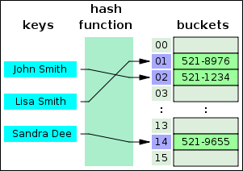
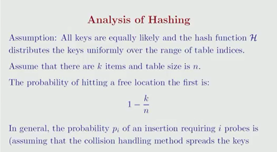
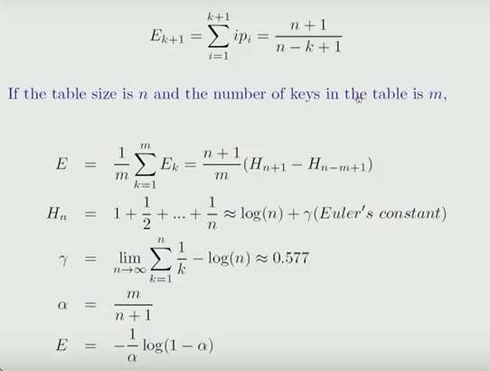
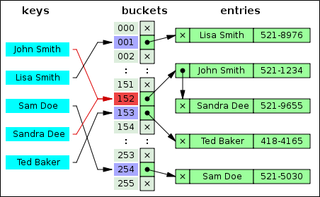
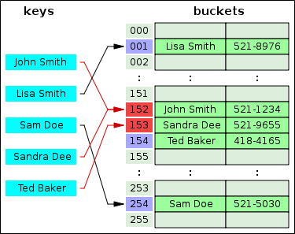

.. contents:: Table of Contents

Hash Table
============

Hash Table
--------------

A hash table (hash map) is a data structure which implements an **associative array abstract data type**, a structure that can map keys to values.

A hash table uses a hash function to compute an index into an array of buckets or slots, from which the desired value can be found. In a hash table, each data value has its own unique index value. In a well-dimensioned hash table, the average cost (number of instructions) for each lookup is independent of the number of elements stored in the table. Access of data becomes very fast if we know the index of the desired data.
 

 
A hash table

Time Complexity
----------------

.. list-table::
    :header-rows: 1

    *   -   Algorithm
        -   Average
        -   Worst case

    *   -   Space
        -   O(n)
        -   O(n)

    *   -   Search
        -   O(1)
        -   O(n)

    *   -   Insert
        -   O(1)
        -   O(n)

    *   -   Delete
        -   O(1)
        -   O(n)

Advantages of BST over Hash Table
-----------------------------------

Hash Table supports following operations in Θ(1) time.

-   Search
-   Insert
-   Delete

The time complexity of above operations in a self-balancing Binary Search Tree (BST) (like Red-Black Tree, AVL Tree, Splay Tree, etc) is O(Logn).

In favour of BSTs:

#.  Inorder Traversal of BST gives sorted output.#.   
#.  Doing order statistics, finding closest lower and greater elements, doing range queries are easy to do with BSTs. Like sorting, these operations are not a natural operation with Hash Tables.#.  
#.  BSTs are easy to implement compared to hashing, we can easily implement our own customized BST. To implement Hashing, we generally rely on libraries provided by programming languages.#. 
#.  With Self-Balancing BSTs, all operations are guaranteed to work in O(Logn) time. But with Hashing, Θ(1) is average time and some particular operations may be costly, especially when table resizing happens.

Operations
-----------

1.	Insert
^^^^^^^^^^^^^^^

Inserts an element in a hash table

2.	Delete
^^^^^^^^^^^^^^^

Deletes an element from a hash table

3.	Search
^^^^^^^^^^^^^^^

Searches an element in a hash table

Applications
--------------

#.  Associative arrays
#.  Database indexing
#.  Caches
#.  Sets
#.  Object representation
#.  Unique data representation
#.  Transposition table

Hashing
-----------

The idea of hashing is to distribute the entries (key/value pairs) across an array of buckets. Given a key, the algorithm computes an index that suggests where the entry can be found:

**index = f(key, array_size)**

Often this is done in two steps:

**hash = hashfunc(key)**

**index = hash % array_size**

In the case that the array size is a power of two, the remainder operation is reduced to masking, which improves speed, but can increase problems with a poor hash function.

It is important to have a good hash function with the following basic requirements:

**Easy to compute:** It should be easy to compute and must not become an algorithm in itself.

**Uniform distribution:** It should provide a uniform distribution across the hash table and should not result in clustering.

**Less collisions:** Collisions occur when pairs of elements are mapped to the same hash value. These should be avoided.

Irrespective of how good a hash function is, collisions are bound to occur. Therefore, to maintain the performance of a hash table, it is important to manage collisions through various collision resolution techniques.

Perfect Hash Function
-----------------------

If all keys are known ahead of time, a perfect hash function can be used to create a perfect hash table that has no collisions. If minimal perfect hashing is used, every location in the hash table can be used as well.

Perfect hashing allows for constant time lookups in all cases. This is in contrast to most chaining and open addressing methods, where the time for lookup is low on average, but may be very large, O(n), for instance when all the keys hash to a few values.

Key Statistics
-----------------

load factor, defined as	

**load factor = (k/n)**

-   k is the number of entries occupied in the hash table
-   n is the number of buckets

As the load factor grows larger, the hash table becomes slower, and it may even fail to work (depending on the method used). The expected constant time property of a hash table assumes that the load factor is kept below some bound.

A low load factor is not especially beneficial. As the load factor approaches 0, the proportion of unused areas in the hash table increases, but there is not necessarily any reduction in search cost. This results in wasted memory.

The load factor is a measure of how full the hash table is allowed to get before its capacity is automatically increased. When the number of entries in the hash table exceeds the product of the load factor and the current capacity, the hash table is rehashed (that is, internal data structures are rebuilt) so that the hash table has approximately twice the number of buckets.

As a general rule, the default load factor (.75) offers a good trade-off between time and space costs. Higher values decrease the space overhead but increase the lookup cost. The expected number of entries in the hash table and its load factor should be taken into account when setting its initial capacity, so as to minimize the number of rehash operations. 

If the 

**initial capacity > (maximum number of entries / load factor)**

    , no rehash operations will ever occur.

Analysis of Hashing
---------------------

 

Collision Resolution
-----------------------

#.  Separate chaining
#.  Open addressing or Probing
#.  Robin Hood hashing
#.  2-choice hashing

Collisions are practically unavoidable when hashing a random subset of a large set of possible keys. Therefore, almost all hash table implementations have some collision resolution strategy to handle such events. All these methods require that the keys (or pointers to them) be stored in the table, together with the associated values. Following are some common strategies:

1.	Separate chaining
^^^^^^^^^^^^^^^^^^^^^^^^

In the method known as separate chaining, each bucket is independent, and has some sort of list of entries with the same index. The time for hash table operations is the time to find the bucket (which is constant) plus the time for the list operation.

**time for hash table operation = time to find the bucket + time for the list operation**

In a good hash table, each bucket has zero or one entries, and sometimes two or three, but rarely more than that. Therefore, structures that are efficient in time and space for these cases are preferred. Structures that are efficient for a fairly large number of entries per bucket are not needed or desirable. If these cases happen often, the hashing function needs to be fixed.

Hash collision resolved by separate chaining

Advantages
~~~~~~~~~~~~~~

-   Simple to implement
-   Hash table never fills up; we can always add more elements to chain
-   Less sensitive to the hash function or load factors
-   It is mostly used when it is unknown how many and how frequently keys may be inserted or deleted

Drawback
~~~~~~~~~~~~~~

-   Cache performance of chaining is not good as keys are stored using linked list. Open addressing provides better cache performance as everything is stored in same table
-   Wastage of Space (Some Parts of hash table are never used)
-   If the chain becomes long, then search time can become O(n) in worst case
-   Uses extra space for links

I.  Separate chaining with linked lists
II. Separate chaining with list head cells
III.    Separate chaining with other structures

2.	Open addressing or Probing
^^^^^^^^^^^^^^^^^^^^^^^^^^^^^^^^

In another strategy, called open addressing, all entry records are stored in the bucket array itself. 

When a new entry has to be inserted, the buckets are examined, starting with the hashed-to slot and proceeding in some probe sequence, until an unoccupied slot is found.

When searching for an entry, the buckets are scanned in the same sequence, until either the target record is found, or an unused array slot is found, which indicates that there is no such key in the table.

Well-known probe sequences include:

-   **Linear probing:** in which the interval between probes is fixed (usually 1)
-   **Quadratic probing:** in which the interval between probes is increased by adding the successive outputs of a quadratic polynomial to the starting value given by the original hash computation
-   **Double hashing:** in which the interval between probes is computed by a second hash function

Advantages
~~~~~~~~~~~~

-   Cache performance of chaining is not good as keys are stored using linked list. Open addressing provides better cache performance as everything is stored in same table
-   Wastage of Space (Some Parts of hash table in chaining are never used). In Open addressing, a slot can be used even if an input doesn’t map to it
-   Chaining uses extra space for links

Drawback
~~~~~~~~~~~~

The number of stored entries cannot exceed the number of slots in the bucket array. In fact, even with good hash functions, their performance dramatically degrades when the load factor grows beyond 0.7 or so. For many applications, these restrictions mandate the use of dynamic resizing, with its attendant costs.

I.  Coalesced hashing
II. Cuckoo hashing
III.    Hopscotch hashing
 

3.	Robin Hood hashing
^^^^^^^^^^^^^^^^^^^^^^^^^^

4.	2-choice hashing
^^^^^^^^^^^^^^^^^^^^^^^^^^

Advantages
------------

-   Speed (more apparent when the number of entries is large)

Drawbacks
----------

-   The cost of a good hash function can be significantly higher than the inner loop of the lookup algorithm for a sequential list or search tree
-   Hash tables are not effective when the number of entries is very small
-   For certain string processing applications, such as spell-checking, hash tables may be less efficient than tries, finite automata, or Judy arrays
-   If the hash table uses dynamic resizing, an insertion or deletion operation may occasionally take time proportional to the number of entries. This may be a serious drawback in real-time or interactive applications
-   Hash tables become quite inefficient when there are many collisions

Implementations
-------------------

.. code:: cpp

    // CPP program to implement direct index mapping with negative values allowed.

    #include <iostream>
    using namespace std;

    #define MAX 1000

    // Since array is global, it is initialized as 0
    bool has[MAX + 1][2];

    // searching if X is Present in the given array or not
    bool search(int X) {
        if (X >= 0) {
            if (has[X][0] == 1)
                return true;
            else
                return false;
        }

        // if X is negative take the absolute value of X
        X = abs(X);
        if (has[X][1] == 1)
            return true;

        return false;
    }

    void insert(int a[], int n) {
        for (int i = 0; i < n; i++) {
            if (a[i] >= 0) 
                has[a[i]][0] = 1;
            else
                has[abs(a[i])][1] = 1;
        }
    }

    // Driver code
    int main() {
        int a[] = { -1, 9, -5, -8, -5, -2 };
        int n = sizeof(a)/sizeof(a[0]);
        int x = -5;
        insert(a, 6);
        if (search(x) == true)
            cout << "Present"; 
        else
            cout << "Not Present";
        cout << endl;
        
        x = -10;
        if (search(x) == true)
            cout << "Present"; 
        else
            cout << "Not Present";
        
        return 0;
    }

Output::

    Present
    Not Present

References
-----------

https://www.geeksforgeeks.org/hashing-data-structure/

