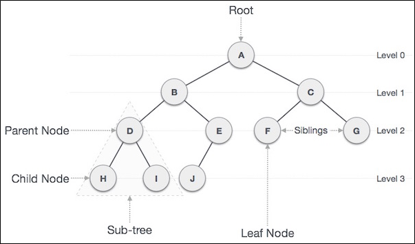

.. contents:: Table of Contents

Tree
======

Tree
---------

A tree is a widely used abstract data type (ADT)—or data structure implementing this ADT—that simulates a hierarchical data structure. 

**Definition:**

A tree is a data structure made up of nodes or vertices and edges without having any cycle. 

The tree with no nodes is called the null or empty tree. A tree that is not empty consists of a root node and potentially many levels of additional nodes that form a hierarchy.

A tree data structure can be defined recursively (locally) as a collection of nodes (starting at a root node), where each node is a data structure consisting of a value, together with a list of references to nodes (the "children"), with the constraints that no reference is duplicated, and none points to the root.

Alternatively, a tree can be defined abstractly as a whole (globally) as an ordered tree, with a value assigned to each node.

Basic Terms
----------------

**Root:** The top node in a tree.

**Child:** A node directly connected to another node when moving away from the Root.

**Parent:** The converse notion of a child.

**Siblings:** A group of nodes with the same parent.

**Descendant:** A node reachable by repeated proceeding from parent to child.

**Ancestor:** A node reachable by repeated proceeding from child to parent.

**Leaf (External node):** A node with no children. 

**Branch (Internal node):** A node with at least one child.

**Degree:** The number of subtrees of a node.

**Edge:** The connection between one node and another.

**Path:** A sequence of nodes and edges connecting a node with a descendant.

**Level:** The level of a node is defined by 1 + (the number of connections between the node and the root).

**Height of node:** The height of a node is the number of edges on the longest path between that node and a leaf.

**Height of tree:** The height of a tree is the height of its root node.

**Depth:** The depth of a node is the number of edges from the tree's root node to the node.

**Subtree:** Subtree represents the descendants of a node.

**Visiting:** Visiting refers to checking the value of a node when control is on the node.

**Traversing:** Traversing means passing through nodes in a specific order.

**Keys:** Key represents a value of a node based on which a search operation is to be carried out for a node.

**Forest:** A forest is a set of n ≥ 0 disjoint trees.
 

Common operations
-------------------

#.  Enumerating all the items
#.  Enumerating a section of a tree
#.  Searching for an item
#.  Adding a new item at a certain position on the tree
#.  Deleting an item
#.  Pruning: Removing a whole section of a tree
#.  Grafting: Adding a whole section to a tree
#.  Finding the root for any node
#.  Finding the lowest common ancestor of two nodes

Common uses
----------------

#.  Representing hierarchical data
#.  Storing data in a way that makes it efficiently searchable (see binary search tree and tree traversal)
#.  Representing sorted lists of data
#.  As a workflow for compositing digital images for visual effects
#.  Router algorithms
#.  Form of a multi-stage decision-making

Why Trees?
--------------

#.  One reason to use trees might be because you want to store information that naturally forms a hierarchy. For example, the file system on a computer. 
#.  Trees (with some ordering e.g., BST) provide moderate access/search (quicker than Linked List and slower than arrays).
#.  Trees provide moderate insertion/deletion (quicker than Arrays and slower than Unordered Linked Lists).
#.  Like Linked Lists and unlike Arrays, Trees don’t have an upper limit on number of nodes as nodes are linked using pointers.

Advantages of trees
----------------------

-   Trees reflect structural relationships in the data
-   Trees are used to represent hierarchies
-   Trees provide an efficient insertion and searching
-   Trees are very flexible data, allowing to move subtrees around with minimum effort

References
-------------

https://www.geeksforgeeks.org/tree-data-structure/

