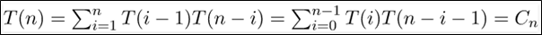

.. contents:: Table of Contents

Binary Tree
=============

Binary tree
----------------

A binary tree is a rooted tree data structure that is also an ordered tree (a.k.a. plane tree) in which each node has at most two children, which are referred to as the left child and the right child.

A recursive definition using just set theory notions is that a (non-empty) binary tree is a tuple (L, S, R), where L and R are binary trees or the empty set and S is a singleton set.

Types of Binary Trees
------------------------

#.  Rooted Binary Tree
#.  Full Binary Tree
#.  Perfect Binary Tree
#.  Complete Binary Tree
#.  Infinite Complete Binary Tree
#.  Balanced Binary Tree
#.  Degenerate Binary Tree

1.	Rooted Binary Tree
^^^^^^^^^^^^^^^^^^^^^^^^^^

A rooted binary tree has a root node and every node has at most two children.

2.	Full Binary Tree
^^^^^^^^^^^^^^^^^^^^^^^^^^

A full binary tree (a.k.a proper or plane binary tree) is a tree in which every node has either 0 or 2 children.

We can also say a full binary tree is a binary tree in which all nodes except leaves have two children.

::

    In a Full Binary Tree

    L = I + 1
    
    Where 
    
    L = Number of leaf nodes
    
    I = Number of internal nodes

::

    number of nodes n in a full binary tree

    at least	n = 2h+1
    
    at most	n = (2^(h+1)) – 1
    
    h is the height of the tree. 
    
    A tree consisting of only a root node has a height of 0.

3.	Perfect Binary Tree
^^^^^^^^^^^^^^^^^^^^^^^^^^

A perfect binary tree is a binary tree in which all interior nodes have two children and all leaves have the same depth or same level. (This is ambiguously also called a complete binary tree.)

::
    
    A Perfect Binary Tree of height h (where height is number of nodes on path from root to leaf) has 
    
    No of node = (2^h) – 1

4.	Complete Binary Tree
^^^^^^^^^^^^^^^^^^^^^^^^^^

In a complete binary tree every level, except possibly the last, is completely filled, and all nodes in the last level are as far left as possible.

**A complete binary tree can be efficiently represented using an array.**

Example of Complete Binary Tree is Binary Heap.

:: 	 
    
    It can have between 1 and 2h-1 nodes at the last level h
    
    1 <= nodes <= ((2^h)-1)

5.	Infinite Complete Binary Tree
^^^^^^^^^^^^^^^^^^^^^^^^^^^^^^^^^^^^

In the infinite complete binary tree, every node has two children (and so the set of levels is countably infinite). The set of all nodes is countably infinite, but the set of all infinite paths from the root is uncountable, having the cardinality of the continuum. These paths correspond by an order-preserving bijection to the points of the Cantor set, or (using the example of a Stern–Brocot tree) to the set of positive irrational numbers.

6.	Balanced Binary Tree
^^^^^^^^^^^^^^^^^^^^^^^^^^

A balanced binary tree has the minimum possible maximum height (a.k.a. depth) for the leaf nodes because, for any given number of leaf nodes, the leaf nodes are placed at the greatest height possible.

A binary tree is balanced if height of the tree is O(Log n) where n is number of nodes. For Example, AVL tree maintain O(Log n) height by making sure that the difference between heights of left and right subtrees is 1.

7.	Degenerate Binary Tree
^^^^^^^^^^^^^^^^^^^^^^^^^^

A degenerate (or pathological) tree is where each parent node has only one associated child node. This means that performance-wise, the tree will behave like a linked list data structure.

Properties of Binary Trees
----------------------------

#.  maximum number of nodes at level 'l' = 2l

    where for root l = 0

#.  Maximum number of nodes in a binary tree of height 'h' is 2h+1 – 1

    for root h = 0

#.  In a Binary Tree with n nodes

    minimum possible height or minimum number of levels is log2(N+1) – 1
    
    where for root l = 0 and h = 0

#.  A Binary Tree with l leaves has at least (log2l) levels root is at level 0

#.  In Binary tree, number of leaf nodes is always one more than nodes with two children.

    l = (n + 1)		n is no of nodes with 2 children
 

in a **full binary tree** number of nodes n 

    at least n = 2h+1

    at most n = (2^(h+1) – 1)

h is the height of the tree. A tree consisting of only a root node has a height of 0.

in a **perfect binary tree**

number of leaf nodes l = (n+1) / 2

number of non-leaf (a.k.a. internal) nodes

No of nodes n = 2l – 1		where l is no of leaves

In a **perfect full binary tree**

    l = 2h
    
    n = 2h + 1

where l is no of leaves, n is no of nodes and h is height
 

In a **balanced full binary tree**

Where h is height of tree, n is no of nodes

In a **complete binary tree**

number of internal nodes i = n / 2,		where n is no of nodes

maximum possible number of null links 

(i.e., absent children of the nodes) = n + 1

where only 1 node exists in bottom-most level to the far left

For any **non-empty binary tree**

    n0 = n2 + 1

n0 leaf nodes

n2 nodes of degree 2

 
Common Operations
------------------

1.	Insertion
^^^^^^^^^^^^^^

Nodes can be inserted into binary trees in between two other nodes or added after a leaf node.

2.	Leaf nodes
^^^^^^^^^^^^^^

To add a new node after leaf node A, A assigns the new node as one of its children and the new node assigns node A as its parent.

3.	Internal nodes
^^^^^^^^^^^^^^^^^^^

Insertion on internal nodes is slightly more complex than on leaf nodes. 

Say that the internal node is node A and that node B is the child of A. A assigns its child to the new node and the new node assigns its parent to A. Then the new node assigns its child to B and B assigns its parent as the new node.

4.	Deletion
^^^^^^^^^^^^^^^^^^^

-   Node with zero or one children

    Deletion is the process whereby a node is removed from the tree. Only certain nodes in a binary tree can be removed unambiguously.

    .. image:: .resources/07_Tree_Binary_Tree_Deletion

-   Node with two children

    In a binary tree, a node with two children cannot be deleted unambiguously. However, in certain binary trees (including binary search trees) these nodes can be deleted, though with a rearrangement of the tree structure.

5.	Traversal
^^^^^^^^^^^^^^^^

a.	Breadth First Traversal (Or Level Order Traversal)

b.	Depth First Traversals

    -   Inorder Traversal (Left-Root-Right)
    -   Preorder Traversal (Root-Left-Right)
    -   Postorder Traversal (Left-Right-Root)

Traversal
------------

Check file `07_Tree_Binary_Tree_Traversal.rst`_ for traversal

Methods for storing Binary Trees
------------------------------------

1.	Nodes and references
^^^^^^^^^^^^^^^^^^^^^^^^^^

In a language with records and references, binary trees are typically constructed by having a tree node structure which contains some data and references to its left child and its right child. Sometimes it also contains a reference to its unique parent. If a node has fewer than two children, some of the child pointers may be set to a special null value, or to a special sentinel node.

2.	Arrays
^^^^^^^^^^^^^^^

Binary trees can also be stored in breadth-first order as an implicit data structure in arrays, and if the tree is a **complete binary tree, this method wastes no space.**

If a node has an index i, its children are found at indices 

.. list-table::
    
    *   -   Left child	2i+1
        -   Right child	2i+2

while its parent (if any) is found at index

**parent index = (i - 1) / 2	 	 (assuming the root has index zero)**

This method of storage is often used for binary heaps. No space is wasted because nodes are added in breadth-first order.

Enumeration of Binary Trees
-----------------------------

A Binary Tree is labeled if every node is assigned a label and a Binary Tree is unlabeled if nodes are not assigned any label.

**How many different unlabeled Binary Trees can be there with n nodes?**

The idea is to consider all possible pair of counts for nodes in left and right subtrees and multiply the counts for a particular pair. Finally add results of all pairs.
For n  = 1, there is only one tree			
   o

For n  = 2, there are two trees

.. image:: .resources/07_Tree_Binary_Tree_EnumerationN2.png

For n  = 3, there are five trees

 
For example, let T(n) be count for n nodes.

T(0) = 1  [There is only 1 empty tree]

T(1) = 1

T(2) = 2

T(3) =  T(0)*T(2) + T(1)*T(1) + T(2)*T(0) = 1*2 + 1*1 + 2*1 = 5

T(4)	=  T(0)*T(3) + T(1)*T(2) + T(2)*T(1) + T(3)*T(0)

        =  1*5 + 1*2 + 2*1 + 5*1

        =  14 

T(i-1) represents number of nodes on the left-sub-tree

T(n−i-1) represents number of nodes on the right-sub-tree

n’th **Catalan Number** can also be evaluated using direct formula.
 

**How many labeled Binary Trees can be there with n nodes?**

Every unlabeled tree with n nodes can create n! different labeled trees by assigning different permutations of labels to all nodes.

For example, for n = 3, there are 5 * 3! = 5*6 = 30 different labeled trees.

References
-------------

https://www.geeksforgeeks.org/binary-tree-data-structure/
