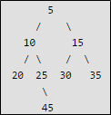
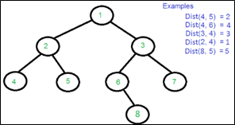

.. contents:: Table of Contents

Binary Tree Operations
========================

Find distance from root to given node in a binary tree
-------------------------------------------------------------

Distance means number of edges between two nodes.

Given root of a binary tree and a key x in it, find distance of the given key from root.

.. code:: cpp

    // CPP
    #include <iostream>
    using namespace std;

    struct tNode {
        int data;
        struct tNode * left;
        struct tNode * right;
    };

    struct tNode * newNode(int arg_val);
    int find_distance_from_root(struct tNode * arg_root, int arg_key);

    struct tNode * newNode(int arg_val) {
        struct tNode * node = new struct tNode;

        node -> data = arg_val;
        node -> left = NULL;
        node -> right = NULL;
        
        return node;
    }

    int find_distance_from_root(struct tNode * arg_root, int arg_key) {
        int distance = -1;
        
        if(NULL == arg_root)
            return distance;
        
        if(arg_key == (arg_root -> data)) {
            return (distance + 1);
        }
        else if((distance = find_distance_from_root((arg_root -> left), arg_key)) >= 0) {
            return (distance + 1);
        }
        else if((distance=find_distance_from_root((arg_root -> right), arg_key)) >= 0) {
            return (distance + 1);
        }
        else {
            // do nothing
        }
        
        return distance;
    }

    int main() {
        struct tNode * root = NULL;
        int distance = 0;
        
        root = newNode(5);
        
        root -> left = newNode(10);
        root -> right = newNode(15);
        
        (root -> left) -> left = newNode(20);
        (root -> left) -> right = newNode(25);

        (root -> right) -> left = newNode(30);
        (root -> right) -> right = newNode(35);
        
        ((root -> left) -> right) -> right = newNode(45);
        
        distance = find_distance_from_root(root, 45);
        cout << "Distance from root is : " << distance << endl;

        return 0;
    }

Output::

    Distance from root is : 3

Distance between two nodes of a Binary Tree
------------------------------------------------

Distance between two nodes is the minimum number of edges to be traversed to reach one node from other.

Find the distance between two keys in a binary tree, no parent pointers are given.

1.  Formula in terms of LCA and distance from root
^^^^^^^^^^^^^^^^^^^^^^^^^^^^^^^^^^^^^^^^^^^^^^^^^^^^^^^

**Dist(n1, n2) = Dist(root, n1) + Dist(root, n2) - 2*Dist(root, lca)**

'n1' and 'n2' are the two given keys

'root' is root of given Binary Tree.

'lca' is lowest common ancestor of n1 and n2

Dist(n1, n2) is the distance between n1 and n2

.. code:: cpp

    #include <iostream>
    #include <vector>
    using namespace std;

    // A Bianry Tree node
    struct Node {
        int key;
        struct Node *left, *right;
    };

    Node * newNode(int k);
    Node *findLCA(Node *root, int n1, int n2);
    int findDistance(Node *root, int n1, int n2);
    int find_distance_from_root(Node * arg_root, int arg_key);

    // Driver program to test above functions
    int main() {
        // Let us create the Binary Tree shown in above diagram.
        Node * root = newNode(1);
        
        root->left = newNode(2);
        root->right = newNode(3);
        
        root->left->left = newNode(4);
        root->left->right = newNode(5);
        
        root->right->left = newNode(6);
        root->right->right = newNode(7);
        
        root->right->left->right = newNode(8);
        
        cout << "Distance(4, 5) = " << findDistance(root, 4, 5) << endl;
        cout << "Distance(4, 6) = " << findDistance(root, 4, 6) << endl;
        cout << "Distance(3, 4) = " << findDistance(root, 3, 4) << endl;
        cout << "Distance(2, 4) = " << findDistance(root, 2, 4) << endl;
        cout << "Distance(8, 5) = " << findDistance(root, 8, 5) << endl;
        return 0;
    }

    // Utility function creates a new binary tree node with given key
    Node * newNode(int k) {
        Node *temp = new Node;
        temp->key = k;
        temp->left = temp->right = NULL;
        
        return temp;
    }

    int findDistance(Node *root, int n1, int n2) {
        Node * lca = NULL;	
        int dis_n1 = 0;
        int dis_n2 = 0;
        int dis_lca = 0;
        
        lca = findLCA(root, n1, n2);
        dis_n1 = find_distance_from_root(root, n1);
        dis_n2 = find_distance_from_root(root, n2);
        
        if(NULL != lca)
            dis_lca = find_distance_from_root(root, lca -> key);
        else {
            cout << "LCA is null";
            return -1;
        }

        return ((dis_n1 + dis_n2) - 2*dis_lca);
    }

    Node *findLCA(Node *root, int n1, int n2) {
        Node* left_lca;
        Node* right_lca;
        
        if (root == NULL)
            return root;
            
        if (root->key == n1 || root->key == n2)
            return root;
            
        left_lca = findLCA(root->left, n1, n2);
        right_lca = findLCA(root->right, n1, n2);
        
        if (left_lca && right_lca)
            return root;
            
        if (left_lca != NULL)
            return findLCA(root->left, n1, n2);
            
        return findLCA(root->right, n1, n2);
    }

    int find_distance_from_root(Node * arg_root, int arg_key) {
        int distance = -1;
        
        if(NULL == arg_root)
            return distance;
        
        if(arg_key == (arg_root -> key)) {
            return (distance + 1);
        }
        else if((distance = find_distance_from_root((arg_root -> left), arg_key)) >= 0) {
            return (distance + 1);
        }
        else if((distance=find_distance_from_root((arg_root -> right), arg_key)) >= 0) {
            return (distance + 1);
        }
        else {
            // do nothing
        }
        
        return distance;
    }

Output::

    Distance(4, 5) = 2
    Distance(4, 6) = 4
    Distance(3, 4) = 3
    Distance(2, 4) = 1
    Distance(8, 5) = 5

2.  Distance from LCA (Better Solution)
^^^^^^^^^^^^^^^^^^^^^^^^^^^^^^^^^^^^^^^^^^

We first find LCA of two nodes. Then we find distance from LCA to two nodes.

.. code:: cpp

    #include <iostream>
    #include <vector>
    using namespace std;

    // A Bianry Tree node
    struct Node {
        int key;
        struct Node *left, *right;
    };

    Node * newNode(int k);
    Node *findLCA(Node *root, int n1, int n2);
    int findDistance(Node *root, int n1, int n2);
    int findLevel(Node *root, int k, int level);

    // Driver program to test above functions
    int main() {
        // Let us create the Binary Tree shown in above diagram.
        Node * root = newNode(1);
        
        root->left = newNode(2);
        root->right = newNode(3);
        
        root->left->left = newNode(4);
        root->left->right = newNode(5);
        
        root->right->left = newNode(6);
        root->right->right = newNode(7);
        
        root->right->left->right = newNode(8);
        
        cout << "Distance(4, 5) = " << findDistance(root, 4, 5) << endl;
        cout << "Distance(4, 6) = " << findDistance(root, 4, 6) << endl;
        cout << "Distance(3, 4) = " << findDistance(root, 3, 4) << endl;
        cout << "Distance(2, 4) = " << findDistance(root, 2, 4) << endl;
        cout << "Distance(8, 5) = " << findDistance(root, 8, 5) << endl;
        return 0;
    }

    // Utility function creates a new binary tree node with given key
    Node * newNode(int k) {
        Node *temp = new Node;
        temp->key = k;
        temp->left = temp->right = NULL;
        
        return temp;
    }

    int findDistance(Node *root, int n1, int n2) {
        Node * lca = NULL;	
        int dis_n1 = 0;
        int dis_n2 = 0;
        
        lca = findLCA(root, n1, n2);

        dis_n1 = findLevel(lca, n1, 0);
        dis_n2 = findLevel(lca, n2, 0);

        return (dis_n1 + dis_n2);
    }

    Node *findLCA(Node *root, int n1, int n2) {
        Node* left_lca;
        Node* right_lca;
        
        if (root == NULL)
            return root;
            
        if (root->key == n1 || root->key == n2)
            return root;
            
        left_lca = findLCA(root->left, n1, n2);
        right_lca = findLCA(root->right, n1, n2);
        
        if (left_lca && right_lca)
            return root;
            
        if (left_lca != NULL)
            return findLCA(root->left, n1, n2);
            
        return findLCA(root->right, n1, n2);
    }

    // Returns level of key k if it is present in
    // tree, otherwise returns -1
    int findLevel(Node *root, int k, int level) {
        if(root == NULL) return -1;
        if(root->key == k) return level;
        
        int left_level = findLevel(root->left, k, level+1);
        if (left_level == -1)
            return findLevel(root->right, k, level+1);
            
        return left_level;
    }

Output::
    
    Distance(4, 5) = 2
    Distance(4, 6) = 4
    Distance(3, 4) = 3
    Distance(2, 4) = 1
    Distance(8, 5) = 5

References
------------

https://www.geeksforgeeks.org/binary-tree-data-structure/

