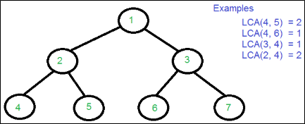

.. contents:: Table of Contents

Binary Tree Operations
============================

Lowest (or Least) Common Ancestor in a Binary Tree
----------------------------------------------------

**Lowest (or Least) Common Ancestor**

Let T be a rooted tree. The lowest common ancestor between two nodes n1 and n2 is defined as the lowest node in T that has both n1 and n2 as descendants (where we allow a node to be a descendant of itself).

The LCA of n1 and n2 in T is the shared ancestor of n1 and n2 that is located farthest from the root.

Given a binary tree (not a binary search tree) and two values say n1 and n2, write a program to find the least common ancestor.

1.	By Storing root to n1 and root to n2 paths O(n)
----------------------------------------------------

**Algorithm:**

#.  Find path from root to n1 and store it in a vector or array.
#.  Find path from root to n2 and store it in another vector or array.
#.  Traverse both paths till the values in arrays are same. Return the common element just before the mismatch.

**Time Complexity: O(n)**

The tree is traversed twice, and then path arrays are compared.

**Drawback:**	Requires three tree traversals plus extra spaces for path arrays

.. code:: cpp

    //CPP A O(n) solution to find LCA of two given values n1 and n2
    #include <iostream>
    #include <vector>
    using namespace std;

    // A Bianry Tree node
    struct Node {
        int key;
        struct Node *left, *right;
    };

    // Utility function creates a new binary tree node with given key
    Node * newNode(int k) {
        Node *temp = new Node;
        temp->key = k;
        temp->left = temp->right = NULL;
        
        return temp;
    }

    // Finds the path from root node to given root of the tree, Stores the
    // path in a vector path[], returns true if path exists otherwise false
    bool findPath(Node *root, vector<int> &path, int k) {
        // base case
        if (root == NULL) return false;
        
        // Store this node in path vector. 
    // The node will be removed if not in path from root to k
        path.push_back(root->key);
        
        // See if the k is same as root's key
        if (root->key == k)
            return true;
        
        // Check if k is found in left or right sub-tree
        if (root->left && findPath(root->left, path, k)) {
            return true;
        }
        else if(root->right && findPath(root->right, path, k)) {
            return true;
        }
        else {
            // do nothing
        }

        // If not present in subtree rooted with root, remove root from
        // path[] and return false
        path.pop_back();
        return false;
    }

    // Returns LCA if node n1, n2 are present in the given binary tree,
    // otherwise return -1
    int findLCA(Node *root, int n1, int n2) {
        // to store paths to n1 and n2 from the root
        vector<int> path1, path2;
        
        // Find paths from root to n1 and root to n1. If either n1 or n2
        // is not present, return -1
        if ( !findPath(root, path1, n1) || !findPath(root, path2, n2))
            return -1;
        
        /* Compare the paths to get the first different value */
        int i;
        cout << "Path1: ";
        for (i = 0; i < path1.size(); i++)
            cout << path1[i] << " ";
        cout << endl;
        
        cout << "Path2: ";
        for (i = 0; i < path2.size(); i++)
            cout << path2[i] << " ";
        cout << endl;
        
        for (i = 0; i < path1.size() && i < path2.size() ; i++)
            if (path1[i] != path2[i])
                break;
        return path1[i-1];
    }

    // Driver program to test above functions
    int main() {
        // Let us create the Binary Tree shown in above diagram.
        Node * root = newNode(1);
        
        root->left = newNode(2);
        root->right = newNode(3);
        
        root->left->left = newNode(4);
        root->left->right = newNode(5);
        
        root->right->left = newNode(6);
        root->right->right = newNode(7);
        
        cout << "LCA(4, 5) = " << findLCA(root, 4, 5) << endl << endl;
        cout << "LCA(4, 6) = " << findLCA(root, 4, 6) << endl << endl;
        cout << "LCA(3, 4) = " << findLCA(root, 3, 4) << endl << endl;
        cout << "LCA(2, 4) = " << findLCA(root, 2, 4) << endl << endl;
        return 0;
    }

Output::

    Path1: 1 2 4 
    Path2: 1 2 5 
    LCA(4, 5) = 2

    Path1: 1 2 4 
    Path2: 1 3 6 
    LCA(4, 6) = 1

    Path1: 1 3 
    Path2: 1 2 4 
    LCA(3, 4) = 1

    Path1: 1 2 
    Path2: 1 2 4 
    LCA(2, 4) = 2

2.	Using Single Traversal O(n)
----------------------------------

**Assumption:**	Both the keys n1 and n2 are present in Binary Tree

If one key is present and other is absent, then it returns the present key as LCA (Ideally should have returned NULL).

The idea is to traverse the tree starting from root. If any of the given keys (n1 and n2) matches with root, then root is LCA (assuming that both keys are present). If root doesn’t match with any of the keys, we recur for left and right subtree. The node which has one key present in its left subtree and the other key present in right subtree is the LCA. If both keys lie in left subtree, then left subtree has LCA also, otherwise LCA lies in right subtree.

**Time Complexity: O(n)**

.. code:: cpp

    // This function returns pointer to LCA of two given values n1 and n2.
    // This function assumes that n1 and n2 are present in Binary Tree
    struct Node *findLCA(struct Node* root, int n1, int n2) {
        // Base case
        if (root == NULL)
            return NULL;
        
        // If either n1 or n2 matches with root's key, report
        // the presence by returning root (Note that if a key is
        // ancestor of other, then the ancestor key becomes LCA
        if (root->key == n1 || root->key == n2)
            return root;
        
        // Look for keys in left and right subtrees
        Node *left_lca  = findLCA(root->left, n1, n2);
        Node *right_lca = findLCA(root->right, n1, n2);
        
        // If both of the above calls return Non-NULL, then one key
        // is present in once subtree and other is present in other,
        // So this node is the LCA
        if (left_lca && right_lca)  return root;
        
        // Otherwise check if left subtree or right subtree is LCA
        return (left_lca != NULL)? left_lca: right_lca;
    }

3.	Using Single Traversal O(n) (Improved Method)
----------------------------------------------------

We can extend above second method to handle all cases by passing two Boolean variables v1 and v2. v1 is set as true when n1 is present in tree and v2 is set as true if n2 is present in tree.

.. code:: cpp

    // This function returns pointer to LCA of two given values n1 and n2.
    // v1 is set as true by this function if n1 is found
    // v2 is set as true by this function if n2 is found
    struct Node *findLCAUtil(struct Node* root, int n1, int n2, bool &v1, bool &v2) {
        // Base case
        if (root == NULL)
            return NULL;
        
        // If either n1 or n2 matches with root's key, report the presence
        // by setting v1 or v2 as true and return root (Note that if a key
        // is ancestor of other, then the ancestor key becomes LCA)
        if (root->key == n1) {
            v1 = true;
            return root;
        }
        if (root->key == n2) {
            v2 = true;
            return root;
        }
        
        // Look for keys in left and right subtrees
        Node *left_lca  = findLCAUtil(root->left, n1, n2, v1, v2);
        Node *right_lca = findLCAUtil(root->right, n1, n2, v1, v2);
        
        // If both of the above calls return Non-NULL, then one key
        // is present in once subtree and other is present in other,
        // So this node is the LCA
        if (left_lca && right_lca)
            return root;
        
        // Otherwise check if left subtree or right subtree is LCA
        return (left_lca != NULL)? left_lca: right_lca;
    }
    
    // Returns true if key k is present in tree rooted with root
    bool find(Node *root, int k) {
        // Base Case
        if (root == NULL)
            return false;
        
        // If key is present at root, or in left subtree or right subtree,
        // return true;
        if (root->key == k || find(root->left, k) ||  find(root->right, k))
            return true;
        
        // Else return false
        return false;
    }
    
    // This function returns LCA of n1 and n2 only if both n1 and n2 are present
    // in tree, otherwise returns NULL;
    Node *findLCA(Node *root, int n1, int n2) {
        // Initialize n1 and n2 as not visited
        bool v1 = false, v2 = false;
        
        // Find lca of n1 and n2 using the technique discussed above
        Node *lca = findLCAUtil(root, n1, n2, v1, v2);
        
        // Return LCA only if both n1 and n2 are present in tree
        if (v1 && v2 || v1 && find(lca, n2) || v2 && find(lca, n1))
            return lca;
        
        // Else return NULL
        return NULL;
    }

4.	Using Parent Pointer O(h Log h)
-------------------------------------

**Assumption:**

-   Both nodes exist in the tree
-   Node has address of parent pointer

**Algorithm:**

-   Create an empty hash table
-   Insert n1 and all of its ancestors in hash table
-   Check if n2 or any of its ancestors exist in hash table, if yes return the first existing ancestor

**Time Complexity:**

-   O(h) where h is height of Binary Tree (with hash table)
-   O(h Log h) (with map) because map takes O(Log h) time to insert and find

**Auxiliary Space: O(h)**

.. code:: cpp

    #include <iostream>
    #include <map>
    using namespace std;
    
    // A Bianry Tree node
    struct Node {
        int key;
        struct Node *left, *right, *parent;
    };
    
    // Utility function creates a new binary tree node with given key
    Node * newNode(int k) {
        Node *temp = new Node;
        temp->key = k;
        temp->left = temp->right = temp->parent = NULL;
        
        return temp;
    }

    // To find LCA of nodes n1 and n2 in Binary Tree
    Node * findLCA(Node * arg_n1, Node * arg_n2) {
        // Creata a map to store ancestors of n1
        map <Node *, bool> ancestor;
        
        // Insert n1 and all its ancestors in map
        while(NULL != arg_n1) {
            ancestor[arg_n1] = true;
            arg_n1 = arg_n1 -> parent;
        }
        // Check if n2 or any of its ancestors is in map
        while(NULL != arg_n2) {
            if(ancestor.find(arg_n2) != ancestor.end()) {
                return arg_n2;
            }
            
            arg_n2 = arg_n2 -> parent;
        }

        return NULL;
    }

    // Driver program to test above functions
    int main() {
        // Let us create the Binary Tree shown in above diagram.
        Node * n1;
        Node * n2;
        Node * lca;
        
        Node * root = newNode(1);
        
        root->left = newNode(2);
        root->right = newNode(3);
        root->left->parent = root;
        root->right->parent = root;
        
        root->left->left = newNode(4);
        root->left->right = newNode(5);
        root->left->left->parent = root->left;
        root->left->right->parent = root->left;
        
        root->right->left = newNode(6);
        root->right->right = newNode(7);
        root->right->left->parent = root->right;
        root->right->right->parent = root->right;
        
        n1 = root->left->left;
        n2 = root->left->right;
        lca = findLCA(n1, n2);
        if(NULL != lca) {
            cout << "LCA(" << n1 -> key << ", " << n2 -> key << ") = " << lca -> key << endl;
        }
        else {
            cout << "Error" << endl;
        }
        
        n1 = root->left->left;
        n2 = root->right->right;
        lca = findLCA(n1, n2);
        if(NULL != lca) {
            cout << "LCA(" << n1 -> key << ", " << n2 -> key << ") = " << lca -> key << endl;
        }
        else {
            cout << "Error" << endl;
        }
        
        return 0;
    }

Output::

    LCA(4, 5) = 2
    LCA(4, 7) = 1

5.	Using Parent Pointer O(h)
--------------------------------

**Assumption:**

-   Both nodes exist in the tree
-   Node has address of parent pointer

**Algorithm:**

The idea is to find depths of given nodes and move up the deeper node pointer by the difference between depths. Once both nodes reach same level, traverse them up and return the first common node.

**Time Complexity:** O(h) 

**Auxiliary Space:** O(1)

.. code:: cpp

    #include <iostream>
    #include <map>
    using namespace std;
    
    // A Bianry Tree node
    struct Node {
        int key;
        struct Node *left, *right, *parent;
    };
    
    // Utility function creates a new binary tree node with given key
    Node * newNode(int k) {
        Node *temp = new Node;
        temp->key = k;
        temp->left = temp->right = temp->parent = NULL;
        
        return temp;
    }
    // A utility function to find depth of a node
    // (distance of it from root)
    int depth(Node * arg_node) {
        int depth = -1;

        while(NULL != arg_node) {
            depth = depth + 1;
            arg_node = arg_node -> parent;
        }

        return depth;
    }

    // To find LCA of nodes n1 and n2 in Binary Tree
    Node * findLCA(Node * arg_n1, Node * arg_n2) {
        Node * temp = NULL;

        // Find depths of two nodes and differences
        int d1 = depth(arg_n1);
        int d2 = depth(arg_n2);
        int diff = d1 - d2;

        // If n2 is deeper, swap n1 and n2
        if(0 > diff) {
            temp = arg_n1;
            arg_n1 = arg_n2;
            arg_n2 = temp;
            
            diff = -diff;
        }
        
        // Move n1 up until it reaches the same level as n2
        while(0 != diff) {
            arg_n1 = arg_n1 -> parent;
            diff = diff – 1;
        }
        
        // Now n1 and n2 are at same levels, traverse up
        while(arg_n1 && arg_n2) {
            if(arg_n1 == arg_n2)
                return arg_n1;
            
            arg_n1 = arg_n1 -> parent;
            arg_n2 = arg_n2 -> parent;
        }
            
        return NULL;
    }

    // Driver program to test above functions
    int main() {
        // Let us create the Binary Tree shown in above diagram.
        Node * n1;
        Node * n2;
        Node * lca;
        
        Node * root = newNode(1);
        
        root->left = newNode(2);
        root->right = newNode(3);
        root->left->parent = root;
        root->right->parent = root;
        
        root->left->left = newNode(4);
        root->left->right = newNode(5);
        root->left->left->parent = root->left;
        root->left->right->parent = root->left;
        
        root->right->left = newNode(6);
        root->right->right = newNode(7);
        root->right->left->parent = root->right;
        root->right->right->parent = root->right;
        
        n1 = root->left->left;
        n2 = root->left->right;
        lca = findLCA(n1, n2);
        if(NULL != lca) {
            cout << "LCA(" << n1 -> key << ", " << n2 -> key << ") = " << lca -> key << endl;
        }
        else {
            cout << "Error" << endl;
        }
        
        n1 = root->left->left;
        n2 = root->right->right;
        lca = findLCA(n1, n2);
        if(NULL != lca) {
            cout << "LCA(" << n1 -> key << ", " << n2 -> key << ") = " << lca -> key << endl;
        }
        else {
            cout << "Error" << endl;
        }
        
        return 0;
    }

Output::

    LCA(4, 5) = 2
    LCA(4, 7) = 1

References
----------------

https://www.geeksforgeeks.org/binary-tree-data-structure/

