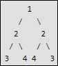

.. contents:: Table of Contents

Binary Tree Operations
========================

Insertion and Deletion in a Binary Tree
-----------------------------------------

Given a binary tree and a key, insert the key into the binary tree at first position available in level order.

.. code::   cpp

    #include <iostream>
    #include <queue>
    using namespace std;

    struct tree_Node {
        int value;
        struct tree_Node * left;
        struct tree_Node * right;
    };

    struct tree_Node * newNode(int arg_val);
    void insert(struct tree_Node * arg_root, struct tree_Node * arg_node);
    void preorder_traverse(struct tree_Node * arg_root);

    void delete_node(struct tree_Node * arg_root, int arg_key);
    void delete_rightmost(struct tree_Node * arg_root, struct tree_Node * rightmost);	// to be used by delete_node

    int main(void) {
        int n = 0;
        int key = 0;
        int delete_key = 0;
        struct tree_Node * node = NULL;
        
        cout << "How many nodes you want to insert: ";
        cin >> n;
        
        cout << "Enter key: ";
        cin >> key;
        struct tree_Node * root = newNode(key);
        
        cout << "Preorder Traversal: ";
        preorder_traverse(root); cout << endl;
        
        while(0 != (n-1)) {
            cout << "Enter key: ";
            cin >> key;
            
            node = NULL;
            node = newNode(key);
            if((NULL != root) && (NULL != node)) {
                insert(root, node);
            }
            
            cout << "Preorder Traversal: ";
            preorder_traverse(root); cout << endl;
            
            n = n - 1;
        }
        
        
        cout << "Enter key to delete: ";
        cin >> delete_key;
        
        delete_node(root, delete_key);
        
        cout << "Preorder Traversal: ";
        preorder_traverse(root); cout << endl;

        return 0;
    }

    struct tree_Node * newNode(int arg_val) {
        struct tree_Node * node = new tree_Node;
        node -> value = arg_val;
        node -> left = NULL;
        node -> right = NULL;
        
        return node;
    }

    void preorder_traverse(struct tree_Node * arg_root) {

        if(NULL == arg_root) {
            return;
        }

        cout << (arg_root -> value) << " ";
        preorder_traverse(arg_root -> left);
        preorder_traverse(arg_root -> right);
        
    }

    void insert(struct tree_Node * arg_root, struct tree_Node * arg_node) {
        queue<struct tree_Node *> qt;
        qt.push(arg_root);
        
        while(!qt.empty()) {
        
            struct tree_Node * temp = qt.front();
            qt.pop();
            
            if(NULL == (temp -> left)) {
                temp -> left = arg_node;
                break;
            }
            else {
                qt.push(temp -> left);
            }
            
            if(NULL == (temp -> right)) {
                temp -> right = arg_node;
                break;
            }
            else {
                qt.push(temp -> right);
            }
        
        } // end of while
        
        return;
    }

    // this function identifies the nodes with key and rightmost node
    void delete_node(struct tree_Node * arg_root, int arg_key) {
        struct tree_Node * temp = NULL;
        struct tree_Node * key_node = NULL;
        struct tree_Node * rightmost_node = NULL;
        queue<struct tree_Node *> qt;
        
        if(NULL == arg_root) {
            return;
        }
        
        qt.push(arg_root);
        
        while(!qt.empty()) {
            temp = qt.front();
            qt.pop();
            
            if(arg_key == (temp -> value)) {
                key_node = temp;
            }
            
            if(NULL != (temp -> left)) {
                qt.push(temp -> left);
            }
            
            if(NULL != (temp -> right)) {
                qt.push(temp -> right);
            }
            
        }	// end of while
        
        rightmost_node = temp;
        
        int x = rightmost_node -> value;		// store value of rightmost node
        delete_rightmost(arg_root, rightmost_node);	// to delete right node
        key_node -> value = x;			// replace value of key node with value of rightmost node

        return;
    }

    void delete_rightmost(struct tree_Node * arg_root, struct tree_Node * rightmost) {
        struct tree_Node * temp = NULL;
        queue<struct tree_Node *>qt;
        
        if(NULL == arg_root) {
            return;
        }
        
        qt.push(arg_root);
        
        while(!qt.empty()) {
            temp = qt.front();
            qt.pop();
            
            if(NULL != (temp -> right)) {
                if(rightmost == (temp -> right)) {
                    temp -> right = NULL;
                    delete(rightmost);
                    break;
                }
                else {
                    qt.push(temp -> right);
                }
            }
            
            if(NULL != (temp -> left)) {
                if(rightmost == (temp -> left)) {
                    temp -> left = NULL;
                    delete(rightmost);
                    break;
                }
                else {
                    qt.push(temp -> left);
                }		
            }
            
        } // end of while
        
        return;
    }

Output::

    How many nodes you want to insert: 7
    Enter key: 1
    Preorder Traversal: 1 
    Enter key: 2
    Preorder Traversal: 1 2 
    Enter key: 3
    Preorder Traversal: 1 2 3 
    Enter key: 4
    Preorder Traversal: 1 2 4 3 
    Enter key: 5
    Preorder Traversal: 1 2 4 5 3 
    Enter key: 6
    Preorder Traversal: 1 2 4 5 3 6 
    Enter key: 7
    Preorder Traversal: 1 2 4 5 3 6 7 
    Enter key to delete: 2
    Preorder Traversal: 1 7 4 5 3 6 

Binary Tree (Array implementation)
-----------------------------------------

If a node has an index i, its children are found at indices 

.. list-table::

    *   -   Left child	2i+1
        -   Right child	2i+2

while its parent (if any) is found at index

**parent index = (i - 1) / 2	 	 (assuming the root has index zero)**

.. code:: cpp

    #include <stdio.h>
    #include <stdlib.h>

    #define SUCCESS 0
    #define FAILURE -1
    #define TREE_ELEMENTS 16
    int tree_arr[TREE_ELEMENTS];

    int set_root(const int root, const int key);
    int set_left(const int root, const int key);
    int set_right(const int root, const int key);
    int print_BFS(void);

    int main(void) {
        int index = 0;
        int root = 0;

        for(index = 0; index < TREE_ELEMENTS; index++) {
            tree_arr[index] = -1;
        }	
        
        set_root(root, 1);

        set_left(0, 2);
        set_right(0, 3);

        set_left(1, 4);
        set_right(1, 5);

        set_left(2, 6);
        set_right(2, 7);

        print_BFS();	
        return 0;
    }

    int set_root(const int root, const int key) {
        tree_arr[root] = key;
        return SUCCESS;
    }

    int set_left(const int root, const int key) {
        int index = (root * 2) + 1;
        
        if(-1 == tree_arr[root])
            return FAILURE;
        else
            tree_arr[index] = key;
        
        return SUCCESS;
    }

    int set_right(const int root, const int key) {
        int index = (root * 2) + 2;
        
        if(-1 == tree_arr[root])
            return FAILURE;
        else
            tree_arr[index] = key;
        
        return SUCCESS;
    }

    int print_BFS(void) {
        int index = 0;
        
        for(index = 0; index < TREE_ELEMENTS; index++) {
            if(-1 != tree_arr[index])
                printf("%d", tree_arr[index]);
            else
                printf("%c", '-');
        }
        
        return SUCCESS;
    }

Output::

    1234567---------

Print leaf nodes of a Binary tree
---------------------------------------

.. code:: cpp

    #include <iostream>
    #include <queue>
    using namespace std;

    struct tree_Node {
        int value;
        struct tree_Node * left;
        struct tree_Node * right;
    };

    struct tree_Node * newNode(int arg_val);
    void insert(struct tree_Node * arg_root, struct tree_Node * arg_node);

    void preorder_traverse(struct tree_Node * arg_root);
    void print_leafNodes(struct tree_Node * arg_root);

    int main(void) {
        int n = 0;
        int key = 0;
        struct tree_Node * node = NULL;
        
        cout << "How many nodes you want to insert: ";
        cin >> n;
        
        cout << "Enter key: ";
        cin >> key;
        struct tree_Node * root = newNode(key);
        
        cout << "Preorder Traversal: ";
        preorder_traverse(root); cout << endl;
        
        while(0 != (n-1)) {
            cout << "Enter key: ";
            cin >> key;
            
            node = NULL;
            node = newNode(key);
            if((NULL != root) && (NULL != node)) {
                insert(root, node);
            }
            
            cout << "Preorder Traversal: ";
            preorder_traverse(root); cout << endl;
            
            n = n - 1;
        }
        
        cout << "Preorder Traversal: ";
        preorder_traverse(root); cout << endl;
        
        cout << endl;
        
        cout << "Leaf nodes: ";
        print_leafNodes(root); cout << endl;

        return 0;
    }

    struct tree_Node * newNode(int arg_val) {
        struct tree_Node * node = new tree_Node;
        node -> value = arg_val;
        node -> left = NULL;
        node -> right = NULL;
        
        return node;
    }

    void preorder_traverse(struct tree_Node * arg_root) {

        if(NULL == arg_root) {
            return;
        }

        cout << (arg_root -> value) << " ";
        preorder_traverse(arg_root -> left);
        preorder_traverse(arg_root -> right);
        
    }

    void print_leafNodes(struct tree_Node * arg_root) {
        queue<struct tree_Node *>qt;
        struct tree_Node * temp = NULL;

        int noLeft = 0;
        int noRight = 0;
        
        if(NULL == arg_root) {
            return;
        }
        
        qt.push(arg_root);
        
        while(!qt.empty()) {
            temp = qt.front();
            qt.pop();
            
            if(NULL == (temp -> left)) {
                noLeft = 1;
            }
            else {
                qt.push(temp -> left);
            }
            
            if(NULL == (temp -> right)) {
                noRight = 1;
            }
            else {
                qt.push(temp -> right);
            }
            
            if(noLeft && noRight) {
                cout << (temp ->value) << " ";
            }
            
            noLeft = 0;
            noRight = 0;
        
        } // end of while
        
        return;

    }

    void insert(struct tree_Node * arg_root, struct tree_Node * arg_node) {
        queue<struct tree_Node *> qt;
        qt.push(arg_root);
        
        while(!qt.empty()) {
        
            struct tree_Node * temp = qt.front();
            qt.pop();
            
            if(NULL == (temp -> left)) {
                temp -> left = arg_node;
                break;
            }
            else {
                qt.push(temp -> left);
            }
            
            if(NULL == (temp -> right)) {
                temp -> right = arg_node;
                break;
            }
            else {
                qt.push(temp -> right);
            }
        
        } // end of while
        
        return;
    }

Output::

    How many nodes you want to insert: 7
    Enter key: 1
    Preorder Traversal: 1 
    Enter key: 2
    Preorder Traversal: 1 2 
    Enter key: 3
    Preorder Traversal: 1 2 3 
    Enter key: 4
    Preorder Traversal: 1 2 4 3 
    Enter key: 5
    Preorder Traversal: 1 2 4 5 3 
    Enter key: 6
    Preorder Traversal: 1 2 4 5 3 6 
    Enter key: 7
    Preorder Traversal: 1 2 4 5 3 6 7 
    Preorder Traversal: 1 2 4 5 3 6 7 

    Leaf nodes: 4 5 6 7

Symmetric Tree (Mirror Image of itself)
------------------------------------------

Given a binary tree, check whether it is a mirror of itself.

.. code:: cpp

    #include <iostream>
    #include <queue>
    using namespace std;

    struct tree_Node {
        int value;
        struct tree_Node * left;
        struct tree_Node * right;
    };

    struct tree_Node * newNode(int arg_val);
    void insert(struct tree_Node * arg_root, struct tree_Node * arg_node);

    void preorder_traverse(struct tree_Node * arg_root);
    int is_symmetric(struct tree_Node * arg_root);
    int check_symmetric(struct tree_Node * arg_root1, struct tree_Node * arg_root2);

    int main(void) {
        int n = 0;
        int key = 0;
        struct tree_Node * node = NULL;
        int is_symtr = 0;
        
        cout << "How many nodes you want to insert: ";
        cin >> n;
        
        cout << "Enter key: ";
        cin >> key;
        struct tree_Node * root = newNode(key);
        
        cout << "Preorder Traversal: ";
        preorder_traverse(root); cout << endl;
        
        while(0 != (n-1)) {
            cout << "Enter key: ";
            cin >> key;
            
            node = NULL;
            node = newNode(key);
            if((NULL != root) && (NULL != node)) {
                insert(root, node);
            }
            
            cout << "Preorder Traversal: ";
            preorder_traverse(root); cout << endl;
            
            n = n - 1;
        }
        
        cout << "Preorder Traversal: ";
        preorder_traverse(root); cout << endl;
        
        cout << endl;
        
        is_symtr = is_symmetric(root);
        if(1 == is_symtr) {
            cout << "Tree is symmetric" << endl;
        }
        else {
            cout << "Tree is not symmetric" << endl;
        }
        

        return 0;
    }

    struct tree_Node * newNode(int arg_val) {
        struct tree_Node * node = new tree_Node;
        node -> value = arg_val;
        node -> left = NULL;
        node -> right = NULL;
        
        return node;
    }

    void preorder_traverse(struct tree_Node * arg_root) {

        if(NULL == arg_root) {
            return;
        }

        cout << (arg_root -> value) << " ";
        preorder_traverse(arg_root -> left);
        preorder_traverse(arg_root -> right);
        
    }

    int is_symmetric(struct tree_Node * arg_root) {
        return check_symmetric(arg_root, arg_root);
    }

    int check_symmetric(struct tree_Node * arg_root1, struct tree_Node * arg_root2) {

        if((NULL == arg_root1) && (NULL == arg_root2)) {
            return 1;
        }
        
        
        if((arg_root1 -> value) == (arg_root2 -> value)) {
            return (check_symmetric((arg_root1 -> left), (arg_root2 -> right)) && check_symmetric((arg_root1 -> right), (arg_root2 -> left)));
        }
        
        return 0;
    }

    void insert(struct tree_Node * arg_root, struct tree_Node * arg_node) {
        queue<struct tree_Node *> qt;
        qt.push(arg_root);
        
        while(!qt.empty()) {
        
            struct tree_Node * temp = qt.front();
            qt.pop();
            
            if(NULL == (temp -> left)) {
                temp -> left = arg_node;
                break;
            }
            else {
                qt.push(temp -> left);
            }
            
            if(NULL == (temp -> right)) {
                temp -> right = arg_node;
                break;
            }
            else {
                qt.push(temp -> right);
            }
        
        } // end of while
        
        return;
    }

Output 1::

    How many nodes you want to insert: 7
    Enter key: 1
    Preorder Traversal: 1 
    Enter key: 2
    Preorder Traversal: 1 2 
    Enter key: 2
    Preorder Traversal: 1 2 2 
    Enter key: 3
    Preorder Traversal: 1 2 3 2 
    Enter key: 4
    Preorder Traversal: 1 2 3 4 2 
    Enter key: 4
    Preorder Traversal: 1 2 3 4 2 4 
    Enter key: 3
    Preorder Traversal: 1 2 3 4 2 4 3 
    Preorder Traversal: 1 2 3 4 2 4 3 

    Tree is symmetric

Output 2:: 

    How many nodes you want to insert: 7
    Enter key: 1
    Preorder Traversal: 1 
    Enter key: 2
    Preorder Traversal: 1 2 
    Enter key: 2
    Preorder Traversal: 1 2 2 
    Enter key: 3
    Preorder Traversal: 1 2 3 2 
    Enter key: 4
    Preorder Traversal: 1 2 3 4 2 
    Enter key: 5
    Preorder Traversal: 1 2 3 4 2 5 
    Enter key: 3
    Preorder Traversal: 1 2 3 4 2 5 3 
    Preorder Traversal: 1 2 3 4 2 5 3 

    Tree is not symmetric

Level order traversal line by line
--------------------------------------

Given a Binary Tree, print the nodes level wise, each level on a new line.

Following methods can be use:

#.  Use function to print each level
#.  Use Queue
#.  Use two queue
#.  Use queue with delimiter NULL

1.	Use function to print each level
^^^^^^^^^^^^^^^^^^^^^^^^^^^^^^^^^^^^^^^^^

Modify method Use function to print a given level O(n^2) to print each level at different line by inserting a new line

.. code:: cpp

    void levelOrderTraverse(struct tree_Node * arg_root) {
        int tHeight = 0;
        
        if(NULL == arg_root) {
            return;
        }
        
        tHeight = tree_height(arg_root);
            
        for(int i = 1; i <= tHeight; i++) {
            printGivenLevel(arg_root, i);
            cout << endl;		// added to print each level at new line
        }

        return;
    }

    void printGivenLevel(struct tree_Node * arg_node, int arg_level) {

        if(NULL == arg_node) {
            return;
        }
        
        if(1 == arg_level) {
            cout << (arg_node -> value) << " ";
        }
        else if(1 < arg_level){
            printGivenLevel((arg_node -> left), arg_level - 1);
            printGivenLevel((arg_node -> right), arg_level - 1);
        }
        else {
            // do nothing
        }
        
        return;
    }

Output::

    Level Order Traversal: 
    1 
    2 3 
    4 5 6 7

**Time complexity: O(n^2)**

2.	Use Queue
^^^^^^^^^^^^^^^^^^^

Modify method Use Queue O(n) to print each level at new line with the help of no of elements present in queue

.. code:: cpp

    void levelOrderTraverse(struct tree_Node * arg_root) {
        queue<struct tree_Node *>qt;
        struct tree_Node * temp = NULL;
        int count = 0;
        
        if(NULL == arg_root) {
            return;
        }
        
        qt.push(arg_root);
        
        while(1) {
            count = qt.size();
            if(0 == count) {
                break;
            }
            
            while(0 != count) {
                temp = qt.front();
                qt.pop();
                
                cout << (temp -> value) << " ";
                
                if(NULL != (temp -> left)) {
                    qt.push(temp -> left);
                }
                            
                if(NULL != (temp -> right)) {
                    qt.push(temp -> right);
                }
                
                count = count - 1;
                
            } // end of while(0 != count)
            cout << endl;
        
        } // end of while(1) 
        
        return;
    }

Level Order Traversal::

    1 
    2 3 
    4 5 6 7

**Time complexity: O(n)**

3.	Use two queues
^^^^^^^^^^^^^^^^^^^^^

We can insert the first level in first queue and print it and while popping from the first queue insert its left and right nodes into the second queue. Now start printing the second queue and before popping insert its left and right child nodes into the first queue. Continue this process till both the queues become empty.

.. code:: cpp

    void levelOrderTraverse(struct tree_Node * arg_root) {
        queue<struct tree_Node *>qt1;
        queue<struct tree_Node *>qt2;
        struct tree_Node * temp = NULL;
        
        if(NULL == arg_root) {
            return;
        }
        
        qt1.push(arg_root);
        while(!qt1.empty() || !qt2.empty()) {

            while(!qt1.empty()) {
                temp = qt1.front();
                qt1.pop();
                
                cout << (temp -> value) << " ";
                
                if(NULL != (temp -> left)) {
                    qt2.push(temp -> left);
                }

                if(NULL != (temp -> right)) {
                    qt2.push(temp -> right);
                }
                
            } // end of while(!qt1.empty())	
            cout << endl;

            while(!qt2.empty()) {
                temp = qt2.front();
                qt2.pop();
                
                cout << (temp -> value) << " ";
                
                if(NULL != (temp -> left)) {
                    qt1.push(temp -> left);
                }
                
                if(NULL != (temp -> right)) {
                    qt1.push(temp -> right);
                }
                
            } // end of while(!qt2.empty())
            cout << endl;	
        
        } // end of while(!qt1.empty() || !qt2.empty())
        
        return;
    }

Level Order Traversal::

    1 
    2 3 
    4 5 6 7

**Time complexity: O(n)**

4.	Use queue with delimiter NULL
^^^^^^^^^^^^^^^^^^^^^^^^^^^^^^^^^^^^^

First insert the root and a null element into the queue. This null element acts as a delimiter. Next pop from the top of the queue and add its left and right nodes to the end of the queue and then print the top of the queue. Continue this process till the queues become empty.

.. code:: cpp

    void levelOrderTraverse(struct tree_Node * arg_root) {
        queue<struct tree_Node *>qt;
        struct tree_Node * temp = NULL;
        
        if(NULL == arg_root) {
            return;
        }
        
        qt.push(arg_root);
        qt.push(NULL);
        
        while(!qt.empty()) {
            temp = qt.front();
            qt.pop();
            
            if(NULL == temp) {
                if(!qt.empty()) {
                    qt.push(NULL);
                }
                cout << endl;
            }
            else {
                cout << (temp -> value) << " ";
                
                if(NULL != (temp -> left)) {
                    qt.push(temp -> left);
                }
                
                if(NULL != (temp -> right)) {
                    qt.push(temp -> right);
                }
            }
            
        } // end of while
        
        return;
    }

Level Order Traversal::

    1 
    2 3 
    4 5 6 7

Reverse Level Order Traversal
-------------------------------

We have discussed level order traversal of a post in previous post. The idea is to print last level first, then second last level, and so on. Like Level order traversal, every level is printed from left to right.

1.	Recursive function to print a given level
^^^^^^^^^^^^^^^^^^^^^^^^^^^^^^^^^^^^^^^^^^^^^^^^^^^

.. code:: cpp

    void reverse_levelOrderTraverse(struct tree_Node * arg_root) {
        int tHeight = 0;
        
        if(NULL == arg_root) {
            return;
        }
        
        tHeight = tree_height(arg_root);
            
        for(int i = tHeight; i >= 1; i--) {
            printGivenLevel(arg_root, i);
        
        }

        return;
    }

    void printGivenLevel(struct tree_Node * arg_node, int arg_level) {

        if(NULL == arg_node) {
            return;
        }
        
        if(1 == arg_level) {
            cout << (arg_node -> value) << " ";
        }
        else if(1 < arg_level){
            printGivenLevel((arg_node -> left), arg_level - 1);
            printGivenLevel((arg_node -> right), arg_level - 1);
        }
        else {
            // do nothing
        }
        
        return;
    }

Preorder Traversal::
    
    1 2 4 5 3 6 7 

Reverse Level Order Traversal::
    
    4 5 6 7 2 3 1

2.	Using Queue and Stack O(n)
^^^^^^^^^^^^^^^^^^^^^^^^^^^^^^^^

.. code:: cpp

    void reverse_levelOrderTraverse(struct tree_Node * arg_root) {
        queue<struct tree_Node *>qt;
        stack<struct tree_Node *>st;
        struct tree_Node * temp = NULL;
        
        if(NULL == arg_root) {
            return;
        }
        
        qt.push(arg_root);
        
        while(!qt.empty()) {
        
            temp = qt.front();
            qt.pop();
            
            st.push(temp);
                    
            // FIRST VISIT RIGHT NODE SO THAT IT WILL BE POP AFTER LEFT NODE FROM STACK
            if(NULL != (temp -> right)) {
                qt.push(temp -> right);
            }
            
            if(NULL != (temp -> left)) {
                qt.push(temp -> left);
            }
        
        }	
        
        while(!st.empty()) {
            temp = st.top();
            cout << (temp -> value) << " ";
            st.pop();
        }
        cout << endl;
        return;
    }

Preorder Traversal::
    
    1 2 4 5 3 6 7 

Reverse Level Order Traversal::
    
    4 5 6 7 2 3 1

References
-----------------

https://www.geeksforgeeks.org/binary-tree-data-structure/

