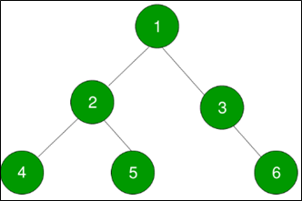
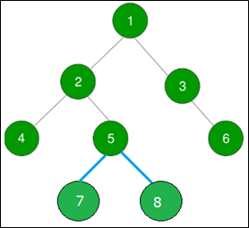

.. contents:: Table of Contents

Binary Tree Operations
=========================

Inorder Successor of a node in Binary Tree
-----------------------------------------------

Inorder Successor of a node in binary tree is the next node in Inorder traversal of the Binary Tree. Inorder Successor is NULL for the last node in Inoorder traversal.

Take care of 3 cases for any node to find its inorder successor:

#.  Right child of node is not NULL. The inorder successor of this node will be the leftmost node in it’s right subtree.

#.  Right Child of the node is NULL. If the right child of node is NULL. Then we keep finding the parent of the given node x, say p such that p->left = x. 

    Algorithm for this case:

    i.  Suppose the given node is x. Start traversing the tree from root node to find x recursively.
    ii. If root == x, stop recursion otherwise find x recursively for left and right subtrees.
    iii.    Now after finding the node x, recursion will backtrack to the root. Every recursive call will return the node itself to the calling function, we will store this in a temporary node say temp. Now, when it back­tracked to its parent which will be root now, check whether root.left = temp, if not , keep going up.

#.  If node is the rightmost node. There will be no inorder successor of this node. i.e. Inorder Successor of the rightmost node in a tree is NULL.
 

.. code:: cpp

    #include <iostream>
    using namespace std;
    
    // A Binary Tree Node
    struct Node {
        int data;
        struct Node *left, *right;
    };
    
    // Temporary node for case 2
    Node* temp = new Node;
    
    // Utility function to create a new tree node
    Node* newNode(int data) {
        Node *temp = new Node;
        temp->data = data;
        temp->left = temp->right = NULL;
        
        return temp;
    }
    
    // function to find left most node in a tree
    Node* leftMostNode(Node* node) {
        while (node != NULL && node->left != NULL)
            node = node->left;
        
        return node;
    }
    
    // function to find right most node in a tree
    Node* rightMostNode(Node* node) {
        while (node != NULL && node->right != NULL)
            node = node->right;
        
        return node;
    }
    
    // recursive function to find the Inorder Scuccessor
    // when the right child of node x is NULL
    Node* findInorderRecursive(Node* root, Node* x ) {
        if(!root)
            return NULL;
        
        if ((root==x) || 
            (temp = findInorderRecursive(root->left,x)) || 
            (temp = findInorderRecursive(root->right,x))
            )
        {
            if(temp) {
                if ((root->left) == temp) {
                    cout << root -> data << "\n";
                    return NULL;
                }
            }
            
            return root;
        }
    
        return NULL;
    }
    
    // function to find inorder successor of a node
    void inorderSuccesor(Node* root, Node* x) {
        cout<<"Inorder Successor of " << x->data << " is ";
        
        // Case1: If right child is not NULL
        if ((x -> right) != NULL) {
            Node* inorderSucc = leftMostNode(x->right);
            cout << inorderSucc->data << "\n";
        }
    
        // Case2: If right child is NULL
        if ((x -> right) == NULL) {
            Node* rightMost = rightMostNode(root);
            
            // case3: If x is the right most node
            if (rightMost == x)
                cout << "No inorder successor! Right most node.\n";
            else
                findInorderRecursive(root, x);
        }
    }
    
    // Driver program to test above functions
    int main(void) {
        // Let's construct the binary tree 
        // as shown in above diagram
        
        Node* root = newNode(1);
        
        root->left = newNode(2);
        root->right = newNode(3);
        
        root->left->left = newNode(4);
        root->left->right = newNode(5);
        
        root->right->right = newNode(6);
        
        // Case 1 
        inorderSuccesor(root, root->right);
    
        // case 2
        inorderSuccesor(root, root->left->left);
    
        // case 3
        inorderSuccesor(root, root->right->right);
    
        return 0;
    }

Output::

    Inorder Successor of 3 is 6
    Inorder Successor of 4 is 2
    Inorder Successor of 6 is No inorder successor! Right most node.

Method 2 - Updated findInorderRecursive definition
^^^^^^^^^^^^^^^^^^^^^^^^^^^^^^^^^^^^^^^^^^^^^^^^^^^^^^^

.. code:: cpp

    #include <iostream>
    using namespace std;
    
    // A Binary Tree Node
    struct Node {
        int data;
        struct Node *left, *right;
    };
    
    // Temporary node for case 2
    Node* temp = new Node;
    
    // Utility function to create a new tree node
    Node* newNode(int data) {
        Node *temp = new Node;
        temp->data = data;
        temp->left = temp->right = NULL;
        
        return temp;
    }
    
    // function to find left most node in a tree
    Node* leftMostNode(Node* node) {
        while (node != NULL && node->left != NULL)
            node = node->left;
        
        return node;
    }
    
    // function to find right most node in a tree
    Node* rightMostNode(Node* node) {
        while (node != NULL && node->right != NULL)
            node = node->right;
        
        return node;
    }
    
    // recursive function to find the Inorder Scuccessor
    // when the right child of node x is NULL
    void findInorderRecursive(Node* root, Node* x ) {
        Node * temp = NULL;
        
        if(!root)
            return;
        
        // check right most node in left subtree
        temp = rightMostNode(root -> left);
        if(x == temp) {
            cout << (root -> data) << endl;
            return;
        }
        
        // check right most node in right subtree
        temp = rightMostNode(root -> right);
        if(x == temp) {
            cout << (root -> data) << endl;
            return;
        }
        
        // call function recursively for left and right node
        findInorderRecursive(root -> left, x);
        findInorderRecursive(root -> right, x);
        
        return;
    }

    // function to find inorder successor of a node
    void inorderSuccesor(Node* root, Node* x) {
        cout<<"Inorder Successor of " << x->data << " is: ";
        
        // Case1: If right child is not NULL
        if ((x -> right) != NULL) {
            Node* inorderSucc = leftMostNode(x->right);
            cout << inorderSucc->data << "\n";
        }
        
        // Case2: If right child is NULL
        if ((x -> right) == NULL) {
            Node* rightMost = rightMostNode(root);
            
            // case3: If x is the right most node
            if (rightMost == x)
                cout << "No inorder successor! Right most node.\n";
            else
                findInorderRecursive(root, x);
            }
    }

    // Driver program to test above functions
    int main(void) {
        // Let's construct the binary tree 
        // as shown in above diagram
        
        Node* root = newNode(1);
        
        root->left = newNode(2);
        root->right = newNode(3);
        
        root->left->left = newNode(4);
        root->left->right = newNode(5);
        
        root->right->right = newNode(6);

        root->left->right->left = newNode(7);
        root->left->right->right = newNode(8);
        
        
        inorderSuccesor(root, root);	// case 1

        inorderSuccesor(root, root->left);		// case 1
        inorderSuccesor(root, root->right);	// case 1
        
        inorderSuccesor(root, root->left->left);	// case 2
        inorderSuccesor(root, root->left->right); // case 1
        
        inorderSuccesor(root, root->right->right);	// case 3
        
        inorderSuccesor(root, root->left->right->left);	// case 2
        inorderSuccesor(root, root->left->right->right); // case 2
    
        return 0;
    }

Output::

    Inorder Successor of 1 is: 3
    Inorder Successor of 2 is: 7
    Inorder Successor of 3 is: 6
    Inorder Successor of 4 is: 2
    Inorder Successor of 5 is: 8
    Inorder Successor of 6 is: No inorder successor! Right most node.
    Inorder Successor of 7 is: 5
    Inorder Successor of 8 is: 1

Inorder Predecessor of a node in Binary Tree
------------------------------------------------

Inorder predecessor of a node in binary tree is the previous node in Inorder traversal of the Binary Tree.

Take care of 3 cases for any node to find its inorder predecessor:

#.  Left child of node is not NULL, then the inorder predecessor of this node will be the rightmost node in it’s left subtree.

#.  Left Child of the node is NULL. Then the inorder predecessor will be that node p which left or right subtree has the leftmost node as x i.e.
    
    **x == leftmostnode(p -> left) or x == leftmostnode(p -> right)**

#.  If node is the leftmost node. In this case, there will be no inorder predecessor of this node.
 

.. code:: cpp

    #include <iostream>
    using namespace std;
    
    // A Binary Tree Node
    struct Node {
        int data;
        struct Node *left, *right;
    };
    
    // Utility function to create a new tree node
    Node* newNode(int data) {
        Node *temp = new Node;
        temp->data = data;
        temp->left = temp->right = NULL;
        
        return temp;
    }
    
    // function to find left most node in a tree
    Node* leftMostNode(Node* node) {
        while (node != NULL && node->left != NULL)
            node = node->left;
        
        return node;
    }
    
    // function to find right most node in a tree
    Node* rightMostNode(Node* node) {
        while (node != NULL && node->right != NULL)
            node = node->right;
        
        return node;
    }

    // recursive function to find the Inorder Predecessor
    // when the left child of node x is NULL
    void findInorderRecursive(Node* root, Node* x ) {
        Node * temp = NULL;
        
        if(!root)
            return;
        
        // check left most node in left subtree
        temp = leftMostNode(root -> left);
        if(x == temp) {
            cout << (root -> data) << endl;
            return;
        }
        
        // check left most node in right subtree
        temp = leftMostNode(root -> right);
        if(x == temp) {
            cout << (root -> data) << endl;
            return;
        }
        
        // call function recursively for left and right node
        findInorderRecursive(root -> left, x);
        findInorderRecursive(root -> right, x);
        
        return;
    }
    
    // function to find inorder predecessor of a node
    void inorderPredecessor(Node* root, Node* x) {
        cout<<"Inorder predecessor of " << x->data << " is: ";
        
        // Case1: If left child is not NULL
        if (NULL != (x -> left)) {
            Node* inorderPrede = rightMostNode(x -> left);
            cout << inorderPrede->data << endl;
        }
        
        // Case2: If left child is NULL
        if (NULL == (x -> left))  {
            Node* leftmost = leftMostNode(root);
            
            // case3: If x is the left most node
            if (leftmost == x)
                cout << "No Inorder Predecessor! Left most node" << endl;
            else
                findInorderRecursive(root, x);
        }
    }
    
    // Driver program to test above functions
    int main(void) {
        
        Node* root = newNode(1);
        
        root->left = newNode(2);
        root->right = newNode(3);
        
        root->left->left = newNode(4);
        root->left->right = newNode(5);
        
        root->right->right = newNode(6);
        
        root->left->right->left = newNode(7);
        root->left->right->right = newNode(8);
        
        
        inorderPredecessor(root, root);	// case 1

        inorderPredecessor(root, root->left);		// case 1
        inorderPredecessor(root, root->right);	// case 2
        
        inorderPredecessor(root, root->left->left);	// case 3
        inorderPredecessor(root, root->left->right); // case 1
        
        inorderPredecessor(root, root->right->right);	// case 2
        
        inorderPredecessor(root, root->left->right->left);	// case 2
        inorderPredecessor(root, root->left->right->right); // case 2
        
        return 0;
    }

Output::

    Inorder predecessor of 1 is: 8
    Inorder predecessor of 2 is: 4
    Inorder predecessor of 3 is: 1
    Inorder predecessor of 4 is: No Inorder Predecessor! Left most node
    Inorder predecessor of 5 is: 7
    Inorder predecessor of 6 is: 3
    Inorder predecessor of 7 is: 2
    Inorder predecessor of 8 is: 5

References
-----------

https://www.geeksforgeeks.org/binary-tree-data-structure/

