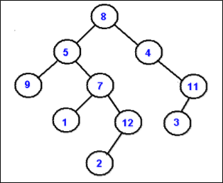
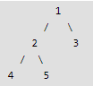

.. contents:: Table of Contents

Traversal
=============

Breadth-first order
----------------------

Breadth-first order, always attempts to visit the node closest to the root that it has not already visited.

8, 5, 4, 9, 7, 11, 1, 12, 3, 2 	 

Depth-first order
------------------

Depth-first order, always attempt to visit the node farthest from the root node that we can, but with the caveat that it must be a child of a node we have already visited. Unlike a depth-first search on graphs, there is no need to remember all the nodes we have visited, because a tree cannot contain cycles.

1.	Inorder Traversal (Left-Root-Right)
^^^^^^^^^^^^^^^^^^^^^^^^^^^^^^^^^^^^^^^^^^^^^^

Inorder traversal visit the left child, then the parent and the right child

9, 5, 1, 7, 2, 12, 8, 4, 3, 11

2.	Preorder Traversal (Root-Left-Right)
^^^^^^^^^^^^^^^^^^^^^^^^^^^^^^^^^^^^^^^^^^^^^^

Preorder traversal visit the parent first and then left and right children

8, 5, 9, 7, 1, 12, 2, 4, 11, 3

3.	Postorder Traversal (Left-Right-Root)
^^^^^^^^^^^^^^^^^^^^^^^^^^^^^^^^^^^^^^^^^^^^^^

Postorder traversal visit left child, then the right child and then the parent

9, 1, 2, 12, 7, 5, 3, 11, 4, 8

**Why do we care?**

There are many tree questions that can be solved using any of the above four traversals. Examples of such questions are size, maximum, minimum, print left view, etc.

**Is there any difference in terms of Time Complexity?**

All four traversals require O(n) time as they visit every node exactly once.

**Is there any difference in terms of Extra Space?**

There is difference in terms of extra space required.

Extra Space required for Level Order Traversal is O(w) where w is maximum width of Binary Tree. In level order traversal, queue one by one stores nodes of different level.

Extra Space required for Depth First Traversals is O(h) where h is maximum height of Binary Tree. In Depth First Traversals, stack (or function call stack) stores all ancestors of a node.

Implementation of Breadth First Traversal (Or Level Order Traversal)
--------------------------------------------------------------------

1.	Use function to print a given level
^^^^^^^^^^^^^^^^^^^^^^^^^^^^^^^^^^^^^^^^^^^

.. code:: CPP

    /*Function to print level order traversal of tree*/
    printLevelorder(tree)
    for d = 1 to height(tree)
        printGivenLevel(tree, d);

    /*Function to print all nodes at a given level*/
    printGivenLevel(tree, level)
    if tree is NULL then return;

    if level is 1, then
        print(tree->data);
    else if level greater than 1, then
        printGivenLevel(tree->left, level-1);
        printGivenLevel(tree->right, level-1);

.. code:: cpp

    // Recursive C program for level order traversal of Binary Tree
    #include <stdio.h>
    #include <stdlib.h>
    
    /* A binary tree node has data, pointer to left child and a pointer to right child */
    struct node {
        int data;
        struct node* left, *right;
    };
    
    /* Function protoypes */
    void printGivenLevel(struct node* root, int level);
    int height(struct node* node);
    struct node* newNode(int data);
    
    /* Function to print level order traversal a tree*/
    void printLevelOrder(struct node* root) {
    int h = height(root);
    int i;

    for (i=1; i<=h; i++)
        printGivenLevel(root, i);
    }
    
    /* Print nodes at a given level */
    void printGivenLevel(struct node* root, int level) {
        if (root == NULL)
            return;
        
        if (level == 1)
            printf("%d ", root->data);
        else if (level > 1) {
            printGivenLevel(root->left, level-1);
            printGivenLevel(root->right, level-1);
        }
    }
    
    /* Compute the "height" of a tree -- the number of nodes along the longest path from the root node down to the farthest leaf node.*/
    int height(struct node* node) {
        if (node==NULL)
            return 0;
        else {
            /* compute the height of each subtree */
            int lheight = height(node->left);
            int rheight = height(node->right);
        
            /* use the larger one */
            if (lheight > rheight)
                return(lheight+1);
            else 
                return(rheight+1);
        }
    }
    
    /* Helper function that allocates a new node with the given data and NULL left and right pointers. */
    struct node* newNode(int data) {
        struct node* node = (struct node*) malloc(sizeof(struct node));
        
        node->data = data;
        node->left = NULL;
        node->right = NULL;
        
        return(node);
    }
    
    /* Driver program to test above functions*/
    int main() {
        struct node *root	= newNode(1);
        root->left		= newNode(2);
        root->right		= newNode(3);
        root->left->left	= newNode(4);
        root->left->right	= newNode(5);
        
        printf("Level Order traversal of binary tree is \n");
        printLevelOrder(root);
        
        return 0;
    }

Output::

    Level order traversal of binary tree is
    1 2 3 4 5 

**Time Complexity: O(n^2) in worst case.** 

For a skewed tree, printGivenLevel() takes O(n) time where n is the number of nodes in the skewed tree. 

So time complexity of printLevelOrder() is O(n) + O(n-1) + O(n-2) + .. + O(1) which is O(n^2).

2.	Use Queue
^^^^^^^^^^^^^^^^

For each node, first the node is visited and then it’s child nodes are put in a FIFO queue.

printLevelorder(tree)

#.  Create an empty queue q
#.  temp_node = root		/*start from root*/
#.  Loop while temp_node is not NULL
    
    -   print temp_node->data.
    -   Enqueue temp_node’s children (first left then right children) to q
    -   Dequeue a node from q and assign it’s value to temp_node	

.. code:: cpp

    // Iterative Queue based C program to do level order traversal of Binary Tree
    #include <stdio.h>
    #include <stdlib.h>
    #define MAX_Q_SIZE 500 
    /* A binary tree node has data, pointer to left child and a pointer to right child */
    struct node {
        int data;
        struct node* left;
        struct node* right;
    };
    /* frunction prototypes */
    struct node** createQueue(int *, int *);
    void enQueue(struct node **, int *, struct node *);
    struct node *deQueue(struct node **, int *);
    
    /* Given a binary tree, print its nodes in level order using array for implementing queue */
    void printLevelOrder(struct node* root) {
        int rear, front;
        struct node **queue = createQueue(&front, &rear);
        struct node *temp_node = root;
        
        while (temp_node) {
            printf("%d ", temp_node->data);
            
            /*Enqueue left child */
            if (temp_node->left)
                enQueue(queue, &rear, temp_node->left);
            
            /*Enqueue right child */
            if (temp_node->right)
                enQueue(queue, &rear, temp_node->right);
            
            /*Dequeue node and make it temp_node*/
            temp_node = deQueue(queue, &front);
        }
    }
    
    /*UTILITY FUNCTIONS*/
    struct node** createQueue(int *front, int *rear) {
        struct node **queue = (struct node **)malloc(sizeof(struct node*)*MAX_Q_SIZE);
        *front = *rear = 0;
        
        return queue;
    }
    
    void enQueue(struct node **queue, int *rear, struct node *new_node) {
        queue[*rear] = new_node;
        (*rear)++;
    }
    struct node *deQueue(struct node **queue, int *front) {
        (*front)++;
        return queue[*front - 1];
    }
    
    /* Helper function that allocates a new node with the given data and NULL left and right pointers. */
    struct node* newNode(int data) {
        struct node* node = (struct node*) malloc(sizeof(struct node));
        node->data = data;
        node->left = NULL;
        node->right = NULL;
        
        return(node);
    }
    
    /* Driver program to test above functions*/
    int main() {
        struct node *root	= newNode(1);
        root->left		= newNode(2);
        root->right		= newNode(3);
        root->left->left	= newNode(4);
        root->left->right	= newNode(5);
        
        printf("Level Order traversal of binary tree is \n");
        printLevelOrder(root);
        
        return 0;
    }

Output::

    Level order traversal of binary tree is
    1 2 3 4 5

**Time Complexity: O(n)** where n is number of nodes in the binary tree

Implementation of Depth First Traversals
---------------------------------------------

Implementation of Inorder Traversal (Left-Root-Right)
^^^^^^^^^^^^^^^^^^^^^^^^^^^^^^^^^^^^^^^^^^^^^^^^^^^^^^^^^

Inorder(tree)

#.  Traverse the left subtree, i.e., call Inorder(left-subtree)
#.  Visit the root.
#.  Traverse the right subtree, i.e., call Inorder(right-subtree)

In case of binary search trees (BST), Inorder traversal gives nodes in non-decreasing order. To get nodes of BST in non-increasing order, a variation of Inorder traversal where Inorder itraversal s reversed, can be used.   

Implementation of Preorder Traversal (Root-Left-Right)
^^^^^^^^^^^^^^^^^^^^^^^^^^^^^^^^^^^^^^^^^^^^^^^^^^^^^^^^^^^^

Preorder(tree)

#.  Visit the root.
#.  Traverse the left subtree, i.e., call Preorder(left-subtree)
#.  Traverse the right subtree, i.e., call Preorder(right-subtree) 

Preorder traversal is used to create a copy of the tree. 

Preorder traversal is also used to get prefix expression on of an expression tree.

Implementation of Postorder Traversal (Left-Right-Root)
^^^^^^^^^^^^^^^^^^^^^^^^^^^^^^^^^^^^^^^^^^^^^^^^^^^^^^^^^^^^

Postorder(tree)

#.  Traverse the left subtree, i.e., call Postorder(left-subtree)
#.  Traverse the right subtree, i.e., call Postorder(right-subtree)
#.  Visit the root.

Postorder traversal is used to delete the tree. 

Postorder traversal is also useful to get the postfix expression of an expression tree.

1.	Recursive Implementation of Inorder, Preorder and Postorder
^^^^^^^^^^^^^^^^^^^^^^^^^^^^^^^^^^^^^^^^^^^^^^^^^^^^^^^^^^^^^^^^^^^^^^^

.. code:: cpp

    // C program for different tree traversals

    #include <stdio.h>
    #include <stdlib.h>
    
    /* A binary tree node has data, pointer to left child and a pointer to right child */
    struct node {
        int data;
        struct node* left;
        struct node* right;
    };
    
    /* Helper function that allocates a new node with the given data and NULL left and right pointers. */
    struct node* newNode(int data) {
        struct node* node = (struct node*) malloc(sizeof(struct node));
        node->data = data;
        node->left = NULL;
        node->right = NULL;
        
        return(node);
    }

    /* Given a binary tree, print its nodes in inorder*/
    void printInorder(struct node* node) {
        if (node == NULL)
            return;

        printInorder(node->left);		/* first recur on left child */
        printf("%d ", node->data);		/* then print the data of node */
        printInorder(node->right);		/* now recur on right child */
        
    }

    /* Given a binary tree, print its nodes in preorder*/
    void printPreorder(struct node* node) {
        if (node == NULL)
            return;
        

        printf("%d ", node->data);		/* first print data of node */  
        printPreorder(node->left);		/* then recur on left sutree */
        printPreorder(node->right);		/* now recur on right subtree */

    }    

    /* Given a binary tree, print its nodes according to the "bottom-up" postorder traversal. */
    void printPostorder(struct node* node) {
        if (node == NULL)
            return;
        
        printPostorder(node->left);			// first recur on left subtree
        printPostorder(node->right);		// then recur on right subtree
        printf("%d ", node->data);			// now deal with the node

    }

    /* Driver program to test above functions*/
    int main() {
        struct node *root  = newNode(1);
        root->left             = newNode(2);
        root->right           = newNode(3);
        root->left->left     = newNode(4);
        root->left->right   = newNode(5); 
        
        printf("\nPreorder traversal of binary tree is \n");
        printPreorder(root);
        
        printf("\nInorder traversal of binary tree is \n");
        printInorder(root);  
        
        printf("\nPostorder traversal of binary tree is \n");
        printPostorder(root);
        
        getchar();
        return 0;
    }

Output::

    Preorder traversal of binary tree is
    1 2 4 5 3 
    Inorder traversal of binary tree is
    4 2 5 1 3 
    Postorder traversal of binary tree is
    4 5 2 3 1

**Time Complexity: O(n)**

2.	Iterative Inorder Tree Traversal
^^^^^^^^^^^^^^^^^^^^^^^^^^^^^^^^^^^^^^^

Stack is used to traverse tree without recursion for depth first. Below is an algorithm for traversing binary tree using stack

#.  Create an empty stack S.
#.  Initialize current node as root
#.  Push the current node to S and set current = current->left until current is NULL
#.  If current is NULL and stack is not empty then 
    -   Pop the top item from stack.
    -   Print the popped item, set current = popped_item->right 
    -   Go to step 3.
#.  If current is NULL and stack is empty, then we are done.
 

.. code:: cpp

    #include<stdio.h>
    #include<stdlib.h>
    #define bool int
    
    /* A binary tree tNode has data, pointer to left child and a pointer to right child */
    struct tNode { 
        int data;
        struct tNode* left;
        struct tNode* right;
    };
    
    /* Structure of a stack node. Linked List implementation is used for stack. A stack node contains a pointer to tree node and a pointer to next stack node */
    struct sNode {
        struct tNode *t;
        struct sNode *next;
    };
    
    /* Stack related functions */
    void push(struct sNode** top_ref, struct tNode *t);
    struct tNode *pop(struct sNode** top_ref);
    bool isEmpty(struct sNode *top);
    
    /* Iterative function for inorder tree traversal */
    void inOrder(struct tNode *root) {
        /* set current to root of binary tree */
        struct tNode *current = root;
        struct sNode *s = NULL;  /* Initialize stack s */
        bool done = 0;
        
        while (!done) {
            /* Reach the left most tNode of the current tNode */
            if(current !=  NULL) {
                /* place pointer to a tree node on the stack before traversing 
                the node's left subtree */
                push(&s, current);                                               
                current = current->left;  
            }
            /* backtrack from the empty subtree and visit the tNode at the top of the stack; however, if the stack is empty, you are done */
            else {
                if (!isEmpty(s)) {
                    current = pop(&s);
                    printf("%d ", current->data);
                    /* we have visited the node and its left subtree. Now, it's right subtree's turn */
                    current = current->right;
                }
                else
                    done = 1; 
            }
        } /* end of while */ 
    }     
    
    /* UTILITY FUNCTIONS */
    /* Function to push an item to sNode*/
    void push(struct sNode** top_ref, struct tNode *t) {
        /* allocate tNode */
        struct sNode* new_tNode = (struct sNode*) malloc(sizeof(struct sNode));
        
        if(new_tNode == NULL) {
            printf("Stack Overflow \n");
            getchar();
        }            
        
        new_tNode->t  = t;	/* put in the data  */	
        new_tNode->next = (*top_ref);	/* link the old list off the new tNode */
        (*top_ref)    = new_tNode;	/* move the head to point to the new tNode */

    }
    
    /* The function returns true if stack is empty, otherwise false */
    bool isEmpty(struct sNode *top) {
    return (top == NULL)? 1 : 0;
    }   
    
    /* Function to pop an item from stack*/
    struct tNode *pop(struct sNode** top_ref) {
        struct tNode *res;
        struct sNode *top;
        
        /*If sNode is empty then error */
        if(isEmpty(*top_ref)) {
            printf("Stack Underflow \n");
            exit(0);
        }
        else {
            top = *top_ref;
            res = top->t;
            *top_ref = top->next;
            free(top);
            return res;
        }
    }
    
    /* Helper function that allocates a new tNode with the given data and NULL left and right pointers. */
    struct tNode* newtNode(int data) {
        struct tNode* tNode = (struct tNode*) malloc(sizeof(struct tNode));
        tNode->data = data;
        tNode->left = NULL;
        tNode->right = NULL;
        
        return(tNode);
    }
    
    /* Driver program to test above functions*/
    int main() {
        struct tNode *root	= newtNode(1);
        root->left		= newtNode(2);
        root->right		= newtNode(3);
        root->left->left	= newtNode(4);
        root->left->right	= newtNode(5);

        inOrder(root);
        
        return 0;
    }

Output::

    4 2 5 1 3
 
**Time Complexity: O(n)**

3.	Iterative Preorder Traversal
^^^^^^^^^^^^^^^^^^^^^^^^^^^^^^^^^^^^^

#.  Create an empty stack nodeStack and push root node to stack.
#.  Do following while nodeStack is not empty.

    -   Pop an item from stack and print it.
    -   Push right child of popped item to stack
    -   Push left child of popped item to stack	

.. code:: cpp

    #include <stdlib.h>
    #include <stdio.h>
    #include <iostream>
    #include <stack>
    
    using namespace std;
    
    /* A binary tree node has data, left child and right child */
    struct node {
        int data;
        struct node* left;
        struct node* right;
    };
    
    /* Helper function that allocates a new node with the given data and NULL left and right  pointers.*/
    struct node* newNode(int data) {
        struct node* node = new struct node;
        node->data = data;
        node->left = NULL;
        node->right = NULL;
        
        return(node);
    }
    
    // An iterative process to print preorder traversal of Binary tree
    void iterativePreorder(node *root) {
        // Base Case
        if (root == NULL)
            return;
        
        // Create an empty stack and push root to it
        stack<node *> nodeStack;
        nodeStack.push(root);
        
        /* Pop all items one by one. Do following for every popped item
            a) print it
            b) push its right child
            c) push its left child
            Note that right child is pushed first so that left is processed first 
        */
        while (nodeStack.empty() == false) {
            // Pop the top item from stack and print it
            struct node *node = nodeStack.top();
            printf ("%d ", node->data);
            nodeStack.pop();
        
            // Push right and left children of the popped node to stack
            if (node->right)
                nodeStack.push(node->right);	// push right before left so that it will be visited later
            if (node->left)
                nodeStack.push(node->left); 	// push left after right so that it will be visited early

        }
    }
    
    // Driver program to test above functions
    int main() {
        
        struct node *root	= newNode(10);
        root->left		= newNode(8);
        root->right		= newNode(2);
        root->left->left	= newNode(3);
        root->left->right	= newNode(5);
        root->right->left	= newNode(2);
        
        iterativePreorder(root);
        
        return 0;
    }

Output::

    10 8 3 5 2 2

4.	Iterative Postorder Traversal (Using Two Stacks)
^^^^^^^^^^^^^^^^^^^^^^^^^^^^^^^^^^^^^^^^^^^^^^^^^^^^^^^^

Following is the complete algorithm. After step 2, we get reverse postorder traversal in second stack. We use first stack to get this order.

**Algorithm:**

#.  Push root to first stack.
#.  Loop while first stack is not empty

    a.	Pop a node from first stack and push it to second stack
    b.	Push left and right children of the popped node to first stack

#.  Print contents of second stack

.. code:: cpp

    // CPP
    #include <iostream>
    #include <stack>
    using namespace std;

    struct tNode {
        int data;
        struct tNode * left;
        struct tNode * right;
    };

    struct tNode * newNode(int arg_val);
    void iterativePostorderTraversal(struct tNode * arg_root);

    struct tNode * newNode(int arg_val) {
        struct tNode * node = NULL;
        
    node = new struct tNode;
        node -> data = arg_val;
        node -> left = NULL;
        node -> right = NULL;

        return node;
    }

    void iterativePostorderTraversal(struct tNode * arg_root) {
        stack<tNode *> s1;
        stack<tNode *> s2;
        struct tNode * curr = NULL;
        
        if(NULL == arg_root)
            return;

        curr = arg_root;
        s1.push(curr);
        
        while(true != s1.empty()) {
        
            curr = s1.top();
            s1.pop();
            
            s2.push(curr);
            if(NULL != (curr -> left)) {
                s1.push(curr -> left);
            }
            
            if(NULL != (curr -> right)) {
                s1.push(curr -> right);
            }
            
            curr = NULL;		// reset curr to NULL
        }
            
        while(true != s2.empty()) {
            
            curr = s2.top();
            s2.pop();
            cout << (curr -> data) << " ";
            curr = NULL;
        }
        
        return;
    }

    int main() {
        struct tNode * root = NULL;
        root = newNode(1);
        
        root -> left = newNode(2);
        root -> right = newNode(3);
        
        (root -> left) -> left = newNode(4);
        (root -> left) -> right = newNode(5);

        (root -> right) -> left = newNode(6);
        (root -> right) -> right = newNode(7);
        
        iterativePostorderTraversal(root);

        return 0;
    }

Output::

    4 5 2 6 7 3 1

5.	Iterative Postorder Traversal (Using One Stack)
^^^^^^^^^^^^^^^^^^^^^^^^^^^^^^^^^^^^^^^^^^^^^^^^^^^^^^^^^^

The idea is to move down to leftmost node using left pointer. While moving down, push root and root’s right child to stack. Once we reach leftmost node, print it if it doesn’t have a right child. If it has a right child, then change root so that the right child is processed before.

**Algorithm:**

#.  Create an empty stack
#.  Do following while root is not NULL

    a.	Push root's right child and then root to stack
    b.	Set root as root's left child

#.  Pop an item from stack and set it as root

    a.	If the popped item has a right child and the right child is at top of stack, then remove the right child from stack, push the root back and set root as root's right child
    b.	Else print root's data and set root as NULL

#.  Repeat steps 2.1 and 2.2 while stack is not empty.

.. code:: cpp

    // CPP

    #include <iostream>
    #include <stack>
    using namespace std;

    struct tNode {
        int data;
        struct tNode * left;
        struct tNode * right;
    };

    struct tNode * newNode(int arg_val);
    void iterativePostorderTraversal(struct tNode * arg_root);

    struct tNode * newNode(int arg_val) {
        struct tNode * node = NULL;
                    node = new struct tNode;

        node -> data = arg_val;
        node -> left = NULL;
        node -> right = NULL;
        
        return node;
    }

    void iterativePostorderTraversal(struct tNode * arg_root) {
        stack<tNode *> st;
        struct tNode * curr = NULL;
        struct tNode * rightNode = NULL;
        int done = 0;
        
        if(NULL == arg_root)
            return;
        
        curr = arg_root;
        while(!done) {

            while(NULL != curr) {
                if(NULL != (curr -> right)) {
                    st.push(curr -> right);	
                }
                st.push(curr);
                
                curr = (curr -> left);
            }
            
            curr = st.top();
            st.pop();

            if((curr -> right) && (!st.empty()) && (st.top() == (curr -> right))) {
                rightNode = st.top();
                st.pop();
                
                st.push(curr);
                
                curr = rightNode;
            }
            else {
                cout << (curr -> data) << " ";
                curr = NULL;
            }
            
            if(true == st.empty()) {
                done = 1;
            }
            
        }	// end of while(!done)
        
        return;
    }

    int main() {
        struct tNode * root = NULL;
        root = newNode(1);
        
        root -> left = newNode(2);
        root -> right = newNode(3);
        
        (root -> left) -> left = newNode(4);
        (root -> left) -> right = newNode(5);

        (root -> right) -> left = newNode(6);
        (root -> right) -> right = newNode(7);
        
        iterativePostorderTraversal(root);
        cout << endl;

        return 0;
    }

Output::

    4 5 2 6 7 3 1

Morris Inorder Traversal (without recursion and without stack)
--------------------------------------------------------------------

The idea of Morris Traversal is based on Threaded Binary Tree. In this traversal, we first create links to Inorder successor and print the data using these links, and finally revert the changes to restore original tree.

**Algorithm:**

#.  Initialize current as root
#.  While current is not NULL

    If current does not have left child
        i.	Print current’s data
        ii.	Go to the right, i.e., current = current->right
	Else
        i.	Make current as right child of the rightmost node in current's left subtree
        ii.	Go to this left child, i.e., current = current->left

**Time Complexity: O(n)**

If we take a closer look, we can notice that every edge of the tree is traversed at-most two times. And in worst case same number of extra edges (as input tree) are created and removed.

**Limitations:** the algorithm cannot be applied if write operations are not allowed.

.. code:: cpp

    #include <iostream>
    using namespace std;
    
    /* A binary tree node has data, left child and right child */
    struct node {
        int data;
        struct node* left;
        struct node* right;
    };
    
    /* Helper function that allocates a new node with the given data and NULL left and right  pointers */
    struct node* newNode(int data) {
        struct node* node = new struct node;
        node->data = data;
        node->left = NULL;
        node->right = NULL;
        
        return(node);
    }
    
    // An iterative process to print preorder traversal of Binary tree
    void MorrisInorderTraversal(node *root) {
        node * curr = NULL;
        node * pred = NULL;
        
        // Base Case
        if (root == NULL)
            return;
        
        curr = root;
        while(NULL != curr) {

            if(NULL == (curr -> left)) {
                cout << (curr -> data) << " - ";
                curr = (curr -> right);
            }
            else {
                //Find the inorder predecessor of current
                pred = (curr -> left);
                while((NULL != (pred -> right)) && (curr != (pred -> right))) {
                    pred = pred -> right;
                }

                if (NULL == (pred -> right)) {
                    // Make current as right child of its inorder predecessor

                    pred -> right = curr;
                    curr = curr -> left;
                }
                else {
                    //Revert the changes made in if part to restore the
                    // original treei.e., fix the right child of predecssor

                    pred -> right = NULL;
                    cout << (curr -> data) << " -- ";
                    curr = (curr -> right);
                }
            
            } // end of if(NULL == (curr -> left))

        }	//end of while(NULL != curr)
        
    }
    
    // Driver program to test above functions
    int main() {

        struct node *root	= newNode(1);
        
        root->left		= newNode(2);
        root->right		= newNode(3);
        
        root->left->left	= newNode(4);
        root->left->right	= newNode(5);
        
        root->right->left	= newNode(6);
        
        MorrisInorderTraversal(root);
        
        return 0;
    }

Output::

    4 - 2 -- 5 - 1 -- 6 - 3 -- 

Morris Preorder Traversal
---------------------------

The algorithm for Preorder is almost similar to Morris traversal for Inorder.

#.  **If** left child is null, print the current node data. Move to right child.

    **Else**, Make the right child of the inorder predecessor point to the current node. Two cases arise:

    i.	The right child of the inorder predecessor already points to the current node. Set right child to NULL. Move to right child of current node.
    ii.	The right child is NULL. Set it to current node. Print current node’s data and move to left child of current node.

#.  Iterate until current node is not NULL.

**Limitations:** the algorithm cannot be applied if write operations are not allowed.

.. code:: cpp

    #include <iostream>
    using namespace std;
    
    /* A binary tree node has data, left child and right child */
    struct node {
        int data;
        struct node* left;
        struct node* right;
    };
    
    /* Helper function that allocates a new node with the given data and NULL left and right  pointers.*/
    struct node* newNode(int data) {
        struct node* node = new struct node;
        node->data = data;
        node->left = NULL;
        node->right = NULL;
        
        return(node);
    }
    
    // An iterative process to print preorder traversal of Binary tree
    void MorrisPreorderTraversal(node *root) {
        node * curr = NULL;
        node * pred = NULL;
        
        // Base Case
        if (root == NULL)
            return;
        
        curr = root;	
        while(NULL != curr) {
            
            if(NULL == (curr -> left)) {
                cout << (curr -> data) << " - ";
                curr = (curr -> right);
            }
            else {
                //	Find the inorder predecessor of current
                pred = (curr -> left);
                while((NULL != (pred -> right)) && (curr != (pred -> right))) {
                    pred = pred -> right;
                }

                // If the right child of inorder predecessor already points to this node
                if (curr == (pred -> right)) {
                    pred -> right = NULL;
                    curr = curr -> right;
                }
                else {
                    // If right child doesn't point to this node, 
                    // then print this node and make right child point to this node

                    cout << (curr -> data) << " -- ";
                    pred -> right = curr;
                    curr = (curr -> left);
                }
            
            } // end of if(NULL == (curr -> left))

        }	//end of while(NULL != curr)
        
    }
    // Driver program to test above functions
    int main() {
        struct node *root	= newNode(1);	

        root->left		= newNode(2);
        root->right		= newNode(3);
        
        root->left->left	= newNode(4);
        root->left->right	= newNode(5);
        
        root->right->left	= newNode(6);
        
        MorrisPreorderTraversal(root);
        return 0;
    }

Output::

    1 -- 2 -- 4 - 5 - 3 -- 6 –

References
-------------

https://www.geeksforgeeks.org/binary-tree-data-structure/

