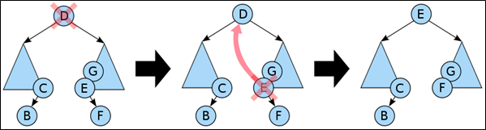

.. contents:: Table of Contents

Binary Search Tree
======================

Binary Search Tree
----------------------

Binary Search Tree, is a node-based binary tree data structure which has the following properties:

-   The left subtree of a node contains only nodes with keys lesser than or equal to the node’s key.
-   The right subtree of a node contains only nodes with keys greater than the node’s key.
-   The left and right subtree each must also be a binary search tree.

Operations
------------

1.	Searching
^^^^^^^^^^^^^^^^^

Searching a binary search tree for a specific key can be programmed recursively or iteratively.

-   We begin by examining the root node. 
-   If the tree is null, the key we are searching for does not exist in the tree. Otherwise, 
-   if the key equals that of the root, the search is successful and we return the node. 
-   If the key is less than that of the root, we search the left subtree. 
-   If the key is greater than that of the root, we search the right subtree. 
-   This process is repeated until the key is found or the remaining subtree is null. 

.. code:: cpp

    // BST Recursive search
    Node * search(Node * root, int key) {
        if (root == NULL || root->key == key)	// Base Cases: root is null or key is present at root
            return root;
        
        if (root->key < key)		// Key is greater than root's key
            return search(root->right, key);

        return search(root->left, key);	// Key is smaller than root's key

    }

.. code:: cpp

    // BST Iterative search
    Node * search(Node * root, int key) {
        Node *current_node = node;
        
        while (NULL != current_node) {
            if (key == current_node.key)
                return current_node;
            if (key < current_node.key)
                current_node = current_node.left;
            else		// key > current_node.key
                current_node = current_node.right;
        }
        
        return current_node;
    }

2.	Insertion
^^^^^^^^^^^^^^^^^

Examine the root and recursively insert the new node to the left subtree if its key is less than that of the root, or the right subtree if its key is greater than or equal to the root.

.. code:: cpp

    Node* insert(Node* root, int key, int value) {
        if (NULL == root)
            root = new Node(key, value);
        else if (key == root->key)
            root->value = value;
        else if (key < root->key)
            root->left = insert(root->left, key, value);
        else  // key > root->key
            root->right = insert(root->right, key, value);

        return root;
    }

Above destructive procedural variant modifies the tree in place. It uses only constant heap space (and the iterative version uses constant stack space as well), but the prior version of the tree is lost.

3.	Deletion
^^^^^^^^^^^^^^^^^

When removing a node from a binary search tree it is mandatory to maintain the in-order sequence of the nodes.

There are three possible cases to consider:

#.  Deleting a node with no children: simply remove the node from the tree.
#.  Deleting a node with one child: remove the node and replace it with its child.
#.  Deleting a node with two children: call the node to be deleted D. Do not delete D. Instead, choose either its in-order predecessor node or its in-order successor node as replacement node E. Copy the user values of E to D. If E does not have a child simply remove E from its previous parent G. If E has a child, say F, it is a right child. Replace E with F at E's parent.

In all cases, when D happens to be the root, make the replacement node root again.

Nodes with children are harder to delete.

Deleting a node with two children from a binary search tree.

.. code:: cpp

    /* Given a binary search tree and a key, this function deletes the key and returns the new root */

    Node * deleteNode(Node * root, int key) {
        // base case
        if (root == NULL) return root;
        
        // If the key to be deleted is smaller than the root's key, then it lies in left subtree
        if (key < root->key)
            root->left = deleteNode(root->left, key);
        
        // If the key to be deleted is greater than the root's key, then it lies in right subtree
        else if (key > root->key)
            root->right = deleteNode(root->right, key);
        
        // if key is same as root's key, then This is the node to be deleted
        else {
            // node with only one child or no child
            if (root->left == NULL) {
                struct node *temp = root->right;
                free(root);
                return temp;
            }
            else if (root->right == NULL) {
                struct node *temp = root->left;
                free(root);
                return temp;
            }
        
            // node with two children: Get the inorder successor (smallest in the right subtree)
            Node * temp = minValueNode(root->right);
        
            // Copy the inorder successor's content to this node
            root->key = temp->key;
        
            // Delete the inorder successor
            root->right = deleteNode(root->right, temp->key);
        }
        
        return root;
    }

4.	Traversal
^^^^^^^^^^^^^^^^^^

Check Tree Traversal notes.

5.	Verification
^^^^^^^^^^^^^^^^^^^

Advantages of BST over Hash Table
------------------------------------

#.  We can get all keys in sorted order by just doing Inorder Traversal of BST. This is not a natural operation in Hash Tables and requires extra efforts.
#.  Doing order statistics, finding closest lower and greater elements, doing range queries are easy to do with BSTs. Like sorting, these operations are not a natural operation with Hash Tables.
#.  BSTs are easy to implement compared to hashing, we can easily implement our own customized BST. To implement Hashing, we generally rely on libraries provided by programming languages.
#.  With Self-Balancing BSTs, all operations are guaranteed to work in O(logn) time. But with Hashing, Θ(1) is average time and some particular operations may be costly, especially when table resizing happens.

References
-----------

https://www.geeksforgeeks.org/binary-search-tree-data-structure/

