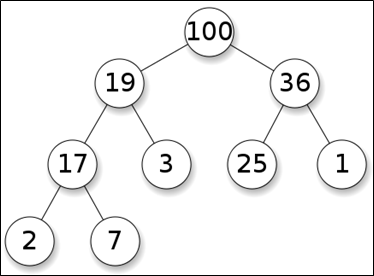

.. contents:: Table of Contents

Heap
=======

A heap is a specialized tree-based data structure that satisfies the heap property.

Heap property: if P is a parent node of C, then 

-   The key (the value) of P is either >= the key of C (in a max heap) 
-   The key (the value) of P is <= to the key of C (in a min heap).

The node at the "top" of the heap (with no parents) is called the root node.

Introduced by J. W. J. Williams in 1964, as a data structure for the heapsort sorting algorithm

Heap is one maximally efficient implementation of an abstract data type called a priority queue, and in fact priority queues are often referred to as "heaps", regardless of how they may be implemented. 

A common implementation of a heap is the binary heap, in which the tree is a binary tree.
 

Example of a binary max-heap with node keys being integers from 1 to 100

Operations
-------------

Basic
^^^^^^

**find-max [or find-min]:** find a maximum item of a max-heap, or a minimum item of a min-heap, respectively (a.k.a. peek)

**insert:** adding a new key to the heap (a.k.a., push)

**extract-max [or extract-min]:** returns the node of maximum value from a max heap [or minimum value from a min heap] after removing it from the heap (a.k.a., pop)

**delete-max [or delete-min]:** removing the root node of a max heap [or min heap], respectively

**replace:** pop root and push a new key. More efficient than pop followed by push, since only need to balance once, not twice, and appropriate for fixed-size heaps

Creation
^^^^^^^^^^

**create-heap:** create an empty heap

**heapify:** create a heap out of given array of elements

**merge (union):** joining two heaps to form a valid new heap containing all the elements of both, preserving the original heaps

**meld:** joining two heaps to form a valid new heap containing all the elements of both, destroying the original heaps

Inspection
^^^^^^^^^^^^^

**size:** return the number of items in the heap.

**is-empty:** return true if the heap is empty, false otherwise.

Internal
^^^^^^^^^^^

**increase-key or decrease-key:** updating a key within a max- or min-heap, respectively

**delete:** delete an arbitrary node (followed by moving last node and sifting to maintain heap)

**sift-up:** move a node up in the tree, as long as needed; used to restore heap condition after insertion. Called "sift" because node moves up the tree until it reaches the correct level, as in a sieve.

**sift-down:** move a node down in the tree, similar to sift-up; used to restore heap condition after deletion or replacement.

Implementation
----------------

Heaps are usually implemented in an array (fixed size or dynamic array), and do not require pointers between elements. After an element is inserted into or deleted from a heap, the heap property may be violated and the heap must be balanced by internal operations.

Binary heaps may be represented in a very space-efficient way (as an implicit data structure) using an array alone. 

The first (or last) element will contain the root. The next two elements of the array contain its children. The next four contain the four children of the two child nodes, etc. **Thus the children of the node at position n would be at positions 2n and 2n + 1 in a one-based array, or 2n + 1 and 2n + 2 in a zero-based array.**

This allows moving up or down the tree by doing simple index computations. Balancing a heap is done by sift-up or sift-down operations (swapping elements which are out of order). As we can build a heap from an array without requiring extra memory, **heapsort can be used to sort an array in-place.**

Time Complexity
-------------------

O(f) is an asymptotic upper bound and Θ(f) is an asymptotically tight bound. Function names assume a min-heap.

.. list-table::
    :header-rows: 1

    *   -   Operation
        -   Binary	
        -   Leftist
        -   Binomial
        -   Fibonacci

    *   -   find-min
        -   Θ(1)
        -   Θ(1)
        -   Θ(log n)
        -   Θ(1)

    *   -   delete-min
        -   Θ(log n)
        -   Θ(log n)
        -   Θ(log n)
        -   O(log n)

    *   -   insert
        -   O(log n)
        -   Θ(log n)
        -   Θ(1)
        -   Θ(1)

    *   -   decrease-key
        -   Θ(log n)
        -   Θ(n)
        -   Θ(log n)
        -   Θ(1)

    *   -   Merge
        -   Θ(n)
        -   Θ(log n)
        -   O(log n)
        -   Θ(1)

.. list-table::
    :header-rows: 1

    *   -   Operation
        -   Pairing
        -   Brodal
        -   Rank-pairing
        -   Strict Fibonacci
        
    *   -   find-min
        -   Θ(1)
        -   Θ(1)
        -   Θ(1)
        -   Θ(1)

    *   -   delete-min
        -   O(log n)
        -   O(log n)
        -   O(log n)
        -   O(log n)

    *   -   Insert
        -   Θ(1)
        -   Θ(1)
        -   Θ(1)
        -   Θ(1)

    *   -   decrease-key
        -   o(log n)
        -   Θ(1)
        -   Θ(1)
        -   Θ(1)
        
    *   -   Merge
        -   Θ(1)
        -   Θ(1)
        -   Θ(1)
        -   Θ(1)

Applications
---------------

#.  Heapsort: One of the best sorting methods being in-place and with no quadratic worst-case scenarios.
#.  Selection algorithms: A heap allows access to the min or max element in constant time, and other selections (such as median or kth-element) can be done in sub-linear time on data that is in a heap.
#.  Graph algorithms: By using heaps as internal traversal data structures, run time will be reduced by polynomial order. Examples of such problems are Prim's minimal-spanning-tree algorithm and Dijkstra's shortest-path algorithm.
#.  Priority Queue: A priority queue is an abstract concept like "a list" or "a map"; just as a list can be implemented with a linked list or an array, a priority queue can be implemented with a heap or a variety of other methods.
#.  Order statistics: The Heap data structure can be used to efficiently find the kth smallest (or largest) element in an array.

References
-------------

https://www.geeksforgeeks.org/heap-data-structure/

