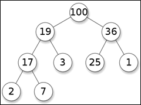
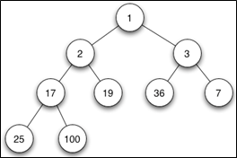
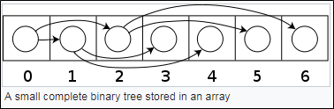
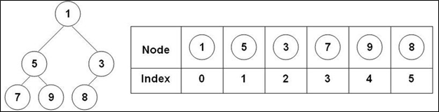
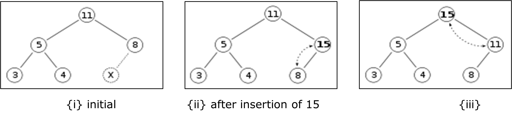
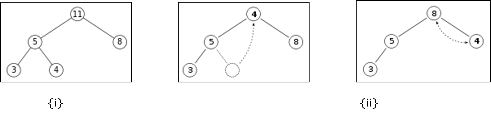
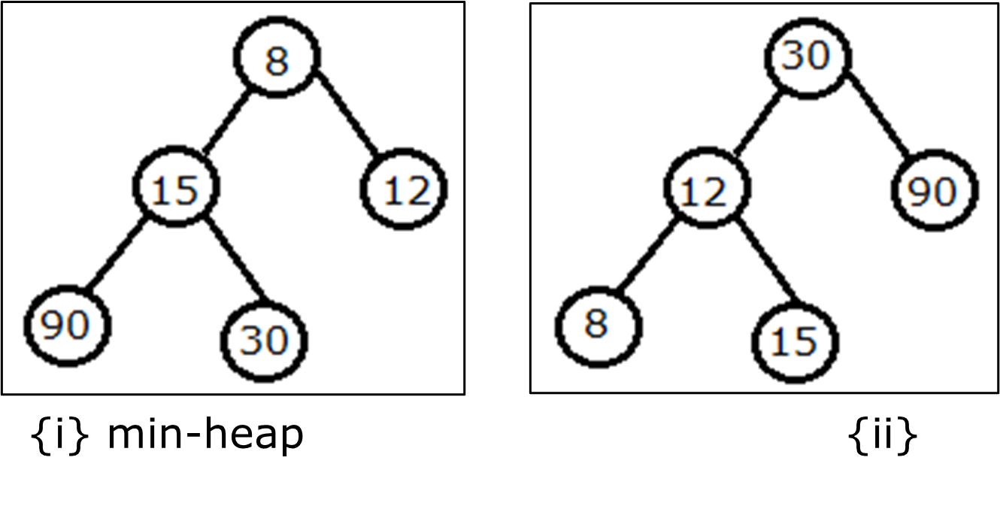
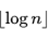
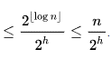
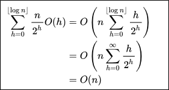

.. contents:: Table of Contents

Binary Heap
==============

Binary Heap
--------------

A binary heap is a heap data structure that takes the form of a binary tree. Binary heaps are a common way of implementing priority queues.

Introduced by J. W. J. Williams in 1964, as a data structure for heapsort

A binary heap is defined as a binary tree with two additional constraints:

**Shape property:** a binary heap is a complete binary tree; that is, all levels of the tree, except possibly the last one (deepest) are fully filled, and, if the last level of the tree is not complete, the nodes of that level are filled from left to right.

**Heap property:** the key stored in each node is either greater than or equal to (≥) or less than or equal to (≤) the keys in the node's children, according to some total order.

**Max-heaps:** Heaps where the parent key is >= the child keys

**Min-heaps:** Heaps where the parent key is <= the child keys

complete binary max heap

complete binary min heap

**Application in Priority Queue:** Efficient (logarithmic time) algorithms are known for the two operations needed to implement a priority queue on a binary heap: inserting an element, and removing the smallest or largest element from a min-heap or max-heap, respectively. 

**Application in Sorting:** Binary heaps are also commonly employed in the heapsort sorting algorithm, which is an in-place algorithm owing to the fact that binary heaps can be implemented as an implicit data structure, storing keys in an array and using their relative positions within that array to represent child-parent relationships.

Heap Implementation
-------------------

Using Array
^^^^^^^^^^^^

Heaps are commonly implemented with an array. Any binary tree can be stored in an array, but because a binary heap is always a complete binary tree, it can be stored compactly.

The parent and children of each node can be found by arithmetic on array indices.

Let n be the number of elements in the heap and i be an arbitrary valid index of the array storing the heap. 

If the tree **root is at index 0**, with valid indices 0 through n − 1, then each element a at index i has

::

    Left child index    2i + 1
    Right child index   2i + 2
    Parent index        floor((i − 1) ∕ 2)

If the tree **root is at index 1**, with valid indices 1 through n, then each element a at index i has

::

    Left child index    2i
    Right child index   2i + 1
    Parent index        floor(i ∕ 2)

This implementation is used in 

-   Heapsort algorithm
-   A Priority queue where use of a dynamic array allows insertion of an unbounded number of items.

Using Binary Tree
^^^^^^^^^^^^^^^^^^^

A binary heap can be implemented with a traditional binary tree data structure, but there is an **issue** with finding the adjacent element on the last level on the binary heap when adding an element. This element can be determined algorithmically or by adding extra data to the nodes, called **"threading" the tree**—instead of merely storing references to the children, we store the inorder successor of the node as well.

Comparison between a binary heap and an array implementation

It is possible to modify the heap structure to allow extraction of both the smallest and largest element in O(log n) time. To do this, the rows alternate between min heap and max heap. The algorithms are roughly the same, but, in each step, one must consider the alternating rows with alternating comparisons. The performance is roughly the same as a normal single direction heap. This idea can be generalized to a min-max-median heap.

Heap Operations
-----------------

Both the insert and remove operations modify the heap to conform to the shape property first, by adding or removing from the end of the heap. Then the heap property is restored by traversing up or down the heap. Both operations take O(log n) time.

Insert
^^^^^^^^^^

To add an element to a heap we must perform an **up-heap operation** (also known as **bubble-up**, percolate-up, sift-up, trickle-up, heapify-up, or cascade-up), by following this algorithm:

#.  Add the element to the bottom level of the heap.
#.  Compare the added element with its parent; if they are in the correct order, stop.
#.  If not, swap the element with its parent and return to the previous step.

The number of operations required depends only on the number of levels the new element must rise to satisfy the heap property, 
thus the insertion operation has a 

-   worst-case time complexity of O(log n)
-   average-case complexity of O(1)

Example: Insertion in max-heap. We want to add the number 15 to the heap {i}. 

We first place the 15 in the position marked by the X. 

However, the heap property is violated since 15 > 8, so we need to swap the 15 and the 8. So, we have the heap looking as (ii) after the first swap:

However, the heap property is still violated since 15 > 11, so we need to swap again
{iii} is a valid max-heap. 

There is no need to check the left child after this final step: at the start, the max-heap was valid

Extract
^^^^^^^^

Procedure for deleting the root from the heap (effectively extracting the maximum element in a max-heap or the minimum element in a min-heap) and restoring the properties is called down-heap (also known as bubble-down, percolate-down, sift-down, trickle down, heapify-down, cascade-down, and extract-min/max).

#.  Replace the root of the heap with the last element on the last level.
#.  Compare the new root with its children; if they are in the correct order, stop.
#.  If not, swap the element with one of its children and return to the previous step. (Swap with its smaller child in a min-heap and its larger child in a max-heap.)

Example: We want to extract root from max-heap in {i}. We remove the 11 and replace it with the 4 {ii}.

Now the heap property is violated since 8 is greater than 4. In this case, swapping the two elements, 4 and 8, is enough to restore the heap property and we need not swap elements further. {iii}

Max-Heapify function as defined below in pseudocode for an array-backed heap A of length heap_length[A]. Note that "A" is indexed starting at 1.

.. code:: cpp

    Max-Heapify (A, i):
        left ← 2*I		// ← means "assignment"
        right ← 2*i + 1
        largest ← i
        
        if left ≤ heap_length[A] and A[left] > A[largest] then:
            largest ← left
        if right ≤ heap_length[A] and A[right] > A[largest] then:
            largest ← right
            
        if largest ≠ i then:
            swap A[i] and A[largest]
            Max-Heapify(A, largest)

In the worst case, the new root has to be swapped with its child on each level until it reaches the bottom level of the heap, meaning that the delete operation has a time complexity relative to the height of the tree, or O(log n).

Binary Heap over BST
----------------------

A typical Priority Queue requires following operations to be efficient:

.. list-table::
    :header-rows: 1

    *   -   Algorithm
        -   Complexity

    *   -   Peek
        -   O(1)

    *   -   Insert
        -   O(log n)

    *   -   Delete
        -   O(log n)

    *   -   Decrease-key
        -   Θ(log n)

A Binary Heap and also a Self Balancing Binary Search Tree like AVL Tree, Red-Black Tree, etc can also support above operations with same time complexities.

**why is Binary Heap Preferred for Priority Queue?**

-   Since Binary Heap is implemented using arrays, there is always better locality of reference and operations are more cache friendly.
-   Although operations are of same time complexity, constants in Binary Search Tree are higher.
-   We can build a Binary Heap in O(n) time. Self-Balancing BSTs require O(nLogn) time to construct.
-   Binary Heap doesn’t require extra space for pointers.
-   Binary Heap is easier to implement.
-   There are variations of Binary Heap like Fibonacci Heap that can support insert and decrease-key in Θ(1) time

**Is Binary Heap always better?**

Although Binary Heap is for Priority Queue, BSTs have their own advantages and the list of advantages is in-fact bigger compared to binary heap.

-   Searching an element in self-balancing BST is O(log n) which is O(n) in Binary Heap.
-   We can print all elements of BST in sorted order in O(n) time, but Binary Heap requires O(n log n) time.
-   Floor and ceil can be found in O(log n) time.
-   K’th largest/smallest element be found in O(log n) time by augmenting tree with an additional field.

Time complexity
----------------

.. list-table::
    :header-rows: 1

    *   -   Algorithm
        -   Average
        -   Worst case

    *   -   Space
        -   O(n)
        -   O(n)

    *   -   Search
        -   O(n)
        -   O(n)

    *   -   Insert
        -   O(1)
        -   O(log n)

    *   -   Delete
        -   O(log n)
        -   O(log n)

    *   -   Peek
        -   O(1)
        -   O(1)

**Running time**

O(f) is an asymptotic upper bound and Θ(f) is an asymptotically tight bound. Function names assume a min-heap.

.. list-table::
    :header-rows: 1

    *   -   Operation
        -   Binary

    *   -   find-min
        -   Θ(1)

    *   -   delete-min
        -   Θ(log n)

    *   -   Insert
        -   O(log n)

    *   -   decrease-key
        -   Θ(log n)

    *   -   Merge
        -   Θ(n)

Time Complexity of building a binary heap
------------------------------------------

Building a heap from an array of n input elements can be done by starting with an empty heap, then successively inserting each element. This approach, called Williams’ method after the inventor of binary heaps, is easily seen to run in 
**O(n log n)** time: it performs **n insertions at O(log n)** cost each

A faster method (due to Floyd) starts by arbitrarily putting the elements on a binary tree, respecting the shape property (the tree could be represented by an array, see below). Then starting from the lowest level and moving upwards, sift the root of each subtree downward as in the deletion algorithm until the heap property is restored.

Consider the following algorithm for building a Heap of an input array A.

.. code:: cpp

    Build-Max-Heap (A):
        heap_length[A] ← length[A]

        for each index i from floor(length[A]/2) downto 1 do:
            Max-Heapify(A, i)

For n nodes
Since the height of the heap is 

the number of nodes at height h is	 	

Therefore, the cost of heapifying all subtrees is:

References
---------------

https://www.geeksforgeeks.org/heap-data-structure/
