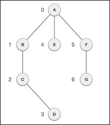
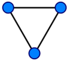
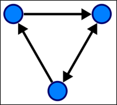
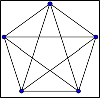

.. contents:: Table of Contents

Graph
=======

A graph is an abstract data type that is meant to implement the undirected graph and directed graph concepts from mathematics, specifically the field of graph theory.

A graph data structure consists of a finite (and possibly mutable) set of vertices or nodes or points, together with a set of unordered pairs of these vertices for an undirected graph or a set of ordered pairs for a directed graph.

The vertices may be part of the graph structure, or may be external entities represented by integer indices or references.

A graph data structure may also associate to each edge some edge value, such as a symbolic label or a numeric attribute (cost, capacity, length, etc.).

Important Terms
-----------------

1.	Vertex
^^^^^^^^^^^^^

Each node of the graph is represented as a vertex. Thus, A to G are vertices. We can represent them using an array as shown in the following image.

2.	Edge
^^^^^^^^^^^^^

Edge represents a path between two vertices or a line between two vertices. We can use a two-dimensional array to represent an array as shown in the following image.

3.	Adjacency
^^^^^^^^^^^^^

Two node or vertices are adjacent if they are connected to each other through an edge. In the following example, B is adjacent to A, C is adjacent to B, and so on.

4.	Path
^^^^^^^^^^^^^

Path represents a sequence of edges between the two vertices. In the following example, ABCD represents a path from A to D.

**V = {A, B, C, D, E, F, G}**

**E = {AB, AE, AF, BC, CD, FG}**

Operations
----------------

1.	adjacent(G, x, y)
^^^^^^^^^^^^^^^^^^^^^^^^^

tests whether there is an edge from the vertex x to the vertex y;

2.	neighbors(G, x)
^^^^^^^^^^^^^^^^^^^^^^^^^

lists all vertices y such that there is an edge from the vertex x to the vertex y;

3.	add_vertex(G, x)
^^^^^^^^^^^^^^^^^^^^^^^^^

adds the vertex x, if it is not there;

4.	remove_vertex(G, x)
^^^^^^^^^^^^^^^^^^^^^^^^^

removes the vertex x, if it is there;

5.	add_edge(G, x, y)
^^^^^^^^^^^^^^^^^^^^^^^^^

adds the edge from the vertex x to the vertex y, if it is not there;

6.	remove_edge(G, x, y)
^^^^^^^^^^^^^^^^^^^^^^^^^

removes the edge from the vertex x to the vertex y, if it is there;

7.	get_vertex_value(G, x)
^^^^^^^^^^^^^^^^^^^^^^^^^^^^

returns the value associated with the vertex x;

8.	set_vertex_value(G, x, v)
^^^^^^^^^^^^^^^^^^^^^^^^^^^^^^^

sets the value associated with the vertex x to v.

Structures that associate values to the edges usually also provide:

9.	get_edge_value(G, x, y)
^^^^^^^^^^^^^^^^^^^^^^^^^^^^^

returns the value associated with the edge (x, y);

10.	set_edge_value(G, x, y, v)
^^^^^^^^^^^^^^^^^^^^^^^^^^^^^^^^^

sets the value associated with the edge (x, y) to v

Representations
---------------------

Different data structures for the representation of graphs

1.	Adjacency list
^^^^^^^^^^^^^^^^^^^^^^^^^

Vertices are stored as records or objects, and every vertex stores a list of adjacent vertices. This data structure allows the storage of additional data on the vertices. Additional data can be stored if edges are also stored as objects, in which case each vertex stores its incident edges and each edge stores its incident vertices.

2.	Adjacency matrix
^^^^^^^^^^^^^^^^^^^^^^^^^

A two-dimensional matrix, in which the rows represent source vertices and columns represent destination vertices. Data on edges and vertices must be stored externally. Only the cost for one edge can be stored between each pair of vertices.

3.	Incidence matrix
^^^^^^^^^^^^^^^^^^^^^^^^^

A two-dimensional Boolean matrix, in which the rows represent the vertices and columns represent the edges. The entries indicate whether the vertex at a row is incident to the edge at a column.

Adjacency lists are generally preferred because they efficiently represent sparse graphs. An adjacency matrix is preferred if the graph is dense, that is the number of edges \|E\| is close to the number of vertices squared, \|V\|2, or if one must be able to quickly look up if there is an edge connecting two vertices.

Time Complexity
--------------------

.. list-table::
    :header-rows: 1

	*	-
		-	Adjacency list
		-	Adjacency matrix
		-	Incidence matrix
	
	*	-	Store graph
		-	O(\|V\|+\|E\|)
		-	O(\|V\|^2)
		-	O(\|V\|.\|E\|)
		
	*	-	Add vertex
		-	O(1)
		-	O(\|V\|^2)
		-	O(\|V\|.\|E\|)

	*	-	Add edge
		-	O(1)
		-	O(1)
		-	O(\|V\|.\|E\|)

	*	-	Remove vertex
		-	O(\|E\|)
		-	O(\|V\|^2)
		-	O(\|V\|.\|E\|)

	*	-	Remove edge
		-	O(\|V\|)
		-	O(1)
		-	O(\|V\|.\|E\|)

	*	- 	Query: are vertices x and y adjacent? (assuming that their storage positions are known)
		-	O(\|V\|)
		-	O(1)
		-	O(\|E\|)

	*	-	Remarks
		-	Slow to remove vertices and edges, because it needs to find all vertices or edges
		-	Slow to add or remove vertices, because matrix must be resized/copied
		-	Slow to add or remove vertices and edges, because matrix must be resized/copied

Types Of Graphs
------------------

Distinction in terms of the main definition
^^^^^^^^^^^^^^^^^^^^^^^^^^^^^^^^^^^^^^^^^^^^^^^^^^

1.	Undirected Graph
~~~~~~~~~~~~~~~~~~~~~~~~~~~

An undirected graph is a graph in which edges have no orientation. The edge (x, y) is identical to the edge (y, x). That is, th ey are not ordered pairs, but unordered pairs—i.e., sets of two vertices {x, y} (or 2-multisets in the case of loops). **The maximum number of edges in an undirected graph without a loop is n(n − 1)/2.**

2.	Directed Graph (Digraph )
~~~~~~~~~~~~~~~~~~~~~~~~~~~~~~~~~

A directed graph or digraph is a graph in which edges have orientations. It is written as an ordered pair G = (V, A) (sometimes G = (V, E)) with

-	V a set whose elements are called vertices, nodes, or points;
-	A a set of ordered pairs of vertices, called arrows, directed edges (sometimes simply edges with the corresponding set named E instead of A), directed arcs, or directed lines

An arrow (x, y) is considered to be directed from x to y; y is called the head and x is called the tail of the arrow; y is said to be a direct successor of x and x is said to be a direct predecessor of y. The arrow (y, x) is called the inverted arrow of (x, y).

**A directed graph G is called symmetric if,** for every arrow in G, the corresponding inverted arrow also belongs to G. A symmetric loopless directed graph G = (V, A) is equivalent to a simple undirected graph G′ = (V, E), where the pairs of inverse arrows in A correspond one-to-one with the edges in E; thus the number of edges in G′ is \|E\| = \|A\|/2, that is half the number of arrows in G.

3.	Weighted graph
~~~~~~~~~~~~~~~~~~~~~~~~

A weighted graph is a graph in which a number (the weight) is assigned to each edge. Such weights might represent for example costs, lengths or capacities, depending on the problem at hand. Some authors call such a graph a network.

Important classes of graph
^^^^^^^^^^^^^^^^^^^^^^^^^^^^^^

4.	Regular graph
~~~~~~~~~~~~~~~~~~~~~

A regular graph is a graph in which each vertex has the same number of neighbours, i.e., every vertex has the same degree. A regular graph with vertices of degree k is called a k‑regular graph or regular graph of degree k.

5.	Complete graph
~~~~~~~~~~~~~~~~~~~~~~~

A complete graph is a graph in which each p air of vertices is joined by an edge. A complete graph contains all possible edges.	

6.	Connected graph
~~~~~~~~~~~~~~~~~~~~~~~~~~

**In an undirected graph**, an unordered pair of vertices {x, y} is called **connected** if a path leads from x to y. Otherwise, the unordered pair is called **disconnected.**
A connected graph is an undirected graph in which every unordered pair of vertices in the graph is connected. Otherwise, it is called a disconnected graph.

**In a directed graph**, an ordered pair of vertices (x, y) is called **strongly connected** if a directed path leads from x to y. Otherwise, the ordered pair is called **weakly connected** if an undirected path leads from x to y after replacing all of its directed edges with undirected edges. Otherwise, the ordered pair is called disconnected.

A **strongly connected** graph is a directed graph in which every ordered pair of vertices in the graph is strongly connected. Otherwise, it is called a weakly connected graph if every ordered pair of vertices in the graph is weakly connected. Otherwise it is called a **disconnected graph.**

A k-vertex-connected graph or k-edge-connected graph is a graph in which no set of k − 1 vertices (respectively, edges) exists that, when removed, disconnects the graph. A k-vertex-connected graph is often called simply a k-connected graph.

7.	Cycle graph
~~~~~~~~~~~~~~~~~~

A cycle graph or circular graph of order n ≥ 3 is a graph in which the vertices can be listed in an order v1, v2, …, vn such that the edges are the {vi, vi+1} where i = 1, 2, …, n − 1, plus the edge {vn, v1}. Cycle graphs can be characterized as connected graphs in which the degree of all vertices is 2. If a cycle graph occurs as a subgraph of another graph, it is a cycle or circuit in that graph.

Properties of graphs
----------------------

#.	Two edges of a graph are called **adjacent** if they share a common vertex. 
#.	Two arrows of a directed graph are called **consecutive** if the head of the first one is the tail of the second one. 
#.	Similarly, two vertices are called **adjacent** if they share a common edge (consecutive if the first one is the tail and the second one is the head of an arrow), in which case the common edge is said to join the two vertices. 
#.	An edge and a vertex on that edge are called **incident.**
#.	The graph with only one vertex and no edges is called the **trivial graph.**
#.	A graph with only vertices and no edges is known as an **edgeless graph.**
#.	The graph with no vertices and no edges is sometimes called the **null graph or empty graph**, but the terminology is not consistent and not all mathematicians allow this object.

References
-----------

https://www.geeksforgeeks.org/graph-data-structure-and-algorithms/

