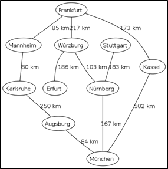
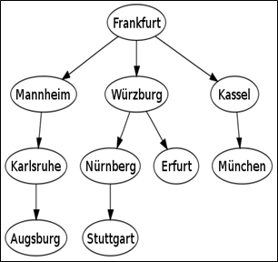

.. contents:: Table of Contents

Breadth-First Search (BFS)
================================

Breadth-First Search (BFS) is an algorithm for traversing or searching tree or graph data structures. It starts at the tree root (or some arbitrary node of a graph, sometimes referred to as a 'search key') and explores the neighbour nodes first, before moving to the next level neighbours.

Example
----------

Breadth-first tree obtained by running a BFS starting from Frankfurt

connections between cities			 

breadth-first tree obtained when running BFS on the given map and starting in Frankfurt

Time and space complexity
----------------------------

**Time complexity O(|V|+|E|)**

since every vertex and every edge will be explored in the worst case

|V| : Number of vertices

|E| : Number of edges

O(|E|) may vary between O(1) and O(|V|2) depending on how sparse the input graph is

When working with graphs that are too large to store explicitly (or infinite)

The complexity of breadth-first search in different terms: to find the nodes that are at distance d from the start node (measured in number of edge traversals)

BFS takes O(bd + 1) time and memory

b is the "branching factor" of the graph (the average out-degree)

Completeness
----------------

In the application of graph traversal methods in artificial intelligence the input may be an implicit representation of an infinite graph. In this context, a search method is described as being complete if it is guaranteed to find a goal state if one exists. Breadth-first search is complete, but depth-first search is not. 

When applied to infinite graphs represented implicitly, breadth-first search will eventually find the goal state, but depth-first search may get lost in parts of the graph that have no goal state and never return

Pseudocode
-----------

Breadth first traversal is accomplished by enqueueing each level of a tree sequentially as the root of any subtree is encountered. 
There are 2 cases in the iterative algorithm.

**Root case:** The traversal queue is initially empty so the root node must be added before the general case.

**General case:** Process any items in the queue, while also expanding their children, stop if the queue was empty. The general case will halt after processing the bottom level as leaf nodes have no children.

This non-recursive implementation is similar to the non-recursive implementation of depth-first search, but differs from it in two ways:

-   It uses a queue (First In First Out) instead of a stack (First In Last Out) and
-   It checks whether a vertex has been discovered before enqueueing the vertex rather than delaying this check until the vertex is dequeued from the queue

The open_set queue contains the frontier along which the algorithm is currently searching.

The closed_set set is used to track which vertices have been visited (required for a general graph search, but not for a tree search).

At the beginning of the algorithm, the set is empty.

At the end of the algorithm, it contains all vertices with a distance from root less than the goal.

Note that the word state is usually interchangeable with the word node or vertex.

Breadth-first search produces a so-called breadth-first tree.

Applications
--------------

Breadth-first search can be used to solve many problems in graph theory, for example:

#.  Shortest Path and Minimum Spanning Tree for unweighted graph
#.  Peer to Peer Networks. In Peer to Peer Networks like BitTorrent, Breadth First Search is used to find all neighbor nodes
#.  Crawlers in Search Engines: Crawlers build index using Breadth First.
#.  Social Networking Websites: In social networks, we can find people within a given distance ‘k’ from a person using Breadth First Search till ‘k’ levels
#.  GPS Navigation systems: Breadth First Search is used to find all neighboring locations
#.  Broadcasting in Network: In networks, a broadcasted packet follows Breadth First Search to reach all nodes
#.  In Garbage Collection: Breadth First Search is used in copying garbage collection using Cheney's algorithm
#.  Cycle detection in undirected graph: In undirected graphs, either Breadth First Search or Depth First Search can be used to detect cycle. In directed graph, only depth first search can be used
#.  Ford–Fulkerson algorithm In Ford-Fulkerson algorithm, we can either use Breadth First or Depth First Traversal to find the maximum flow. Breadth First Traversal is preferred as it reduces worst case time complexity to O(VE2)
#.  To test if a graph is Bipartite We can either use Breadth First or Depth First Traversal
#.  Path Finding We can either use Breadth First or Depth First Traversal to find if there is a path between two vertices
#.  Finding all nodes within one connected component: We can either use Breadth First or Depth First Traversal to find all nodes reachable from a given node
#.  Finding the shortest path between two nodes u and v, with path length measured by number of edges (an advantage over depth-first search)
#.  (Reverse) Cuthill–McKee mesh numbering
#.  Ford–Fulkerson method for computing the maximum flow in a flow network
#.  Serialization/Deserialization of a binary tree vs serialization in sorted order, allows the tree to be re-constructed in an efficient manner
#.  Construction of the failure function of the Aho-Corasick pattern matcher

Implementation
----------------

Graph BFS Recursive Connected
^^^^^^^^^^^^^^^^^^^^^^^^^^^^^^^^^^

Graph BFS Recursive Disconnected
^^^^^^^^^^^^^^^^^^^^^^^^^^^^^^^^^^

Graph BFS Iterative Connected
^^^^^^^^^^^^^^^^^^^^^^^^^^^^^^^^^^

.. code:: cpp

    // Program to print BFS traversal from a given source vertex. BFS(int s) traverses vertices reachable from s.

    #include <iostream>
    #include <list>
    
    using namespace std;
    
    // This class represents a directed graph using adjacency list representation
    class Graph
    {
        int V;    // No. of vertices
    
        list<int> *adj;    // Pointer to an array containing adjacency lists

    public:
        Graph(int V);  // Constructor
    
        void addEdge(int v, int w);    // function to add an edge to graph
    
        void BFS(int s);    // prints BFS traversal from a given source s

    };
    
    Graph::Graph(int V)
    {
        this->V = V;
        adj = new list<int>[V];
    }
    
    void Graph::addEdge(int v, int w)
    {
        adj[v].push_back(w); // Add w to v’s list.
    }
    
    void Graph::BFS(int s)
    {
        // Mark all the vertices as not visited
        bool *visited = new bool[V];
        for(int i = 0; i < V; i++)
            visited[i] = false;
    
        // Create a queue for BFS
        list<int> queue;
    
        // Mark the current node as visited and enqueue it
        visited[s] = true;
        queue.push_back(s);
    
        // 'i' will be used to get all adjacent vertices of a vertex
        list<int>::iterator i;
    
        while(!queue.empty())
        {
            // Dequeue a vertex from queue and print it
            s = queue.front();
            cout << s << " ";
            queue.pop_front();
    
            // Get all adjacent vertices of the dequeued vertex s. If a adjacent has not been visited, then mark it visited and enqueue it
            for (i = adj[s].begin(); i != adj[s].end(); ++i)
            {
                if (!visited[*i])
                {
                    visited[*i] = true;
                    queue.push_back(*i);
                }
            }
        }
    }
    
    // Driver program to test methods of graph class
    int main()
    {
        // Create a graph given in the above diagram
        Graph g(4);
        g.addEdge(0, 1);
        g.addEdge(0, 2);
        g.addEdge(1, 2);
        g.addEdge(2, 0);
        g.addEdge(2, 3);
        g.addEdge(3, 3);
    
        cout << "Following is Breadth First Traversal "
            << "(starting from vertex 2) \n";
        g.BFS(2);
    
        return 0;
    }

Output::

    Following is Breadth First Traversal (starting from vertex 2) 
    2 0 3 1 

Graph BFS Iterative Disconnected
^^^^^^^^^^^^^^^^^^^^^^^^^^^^^^^^^^

 		

References
-----------

https://www.geeksforgeeks.org/graph-data-structure-and-algorithms/

