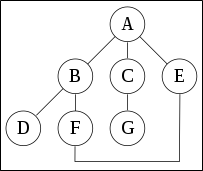

.. contents:: Table of Contents

Depth-First Search (DFS)
=============================

Depth-first search (DFS) is an algorithm for traversing or searching tree or graph data structures. One starts at the root and explores as far as possible along each branch before backtracking.

Output of a Depth-First Search
---------------------------------

1.	DFS ordering
^^^^^^^^^^^^^^^^^^^^

2.	Vertex orderings
^^^^^^^^^^^^^^^^^^^^^^

A **preordering** is a list of the vertices in the order that they were first visited by the depth-first search algorithm.

A **postordering** is a list of the vertices in the order that they were last visited by the algorithm. A postordering of an expression tree is the expression in reverse Polish notation.

A **reverse postordering** is the reverse of a postordering, i.e. a list of the vertices in the opposite order of their last visit. Reverse postordering is not the same as preordering.

Example
-----------

A depth-first search starting at A, will visit the nodes in the following order: A, B, D, F, E, C, G.

Pseudocode
------------

Input: A graph G and a vertex v of G

Output: All vertices reachable from v labeled as discovered

Recursive implementation of DFS
^^^^^^^^^^^^^^^^^^^^^^^^^^^^^^^^^

.. code:: cpp

    procedure DFS(G,v):
        label v as discovered
        for all edges from v to w in G.adjacentEdges(v) 
            do
            if vertex w is not labeled as discovered then
                recursively call DFS(G,w)

The order in which the vertices are discovered by this algorithm is called the lexicographic order.

Iterative implementation of DFS
^^^^^^^^^^^^^^^^^^^^^^^^^^^^^^^^^^^

.. code:: cpp

    procedure DFS-iterative(G,v):
        let S be a stack
        S.push(v)
        while S is not empty
            v = S.pop()
            if v is not labeled as discovered:
                label v as discovered
                for all edges from v to w in G.adjacentEdges(v)
                do
                S.push(w)			

**Worst-case space complexity O(|E|)**

These two variations of DFS visit the neighbours of each vertex in the opposite order from each other.

The first neighbour of v visited by the recursive variation is the first one in the list of adjacent edges, while in the iterative variation the first visited neighbour is the last one in the list of adjacent edges.

The recursive implementation will visit the nodes from the example graph in the following order: A, B, D, F, E, C, G.

The non-recursive implementation will visit the nodes as: A, E, F, B, D, C, G.

The non-recursive implementation is similar to breadth-first search but differs from it in two ways:

-   it uses a stack instead of a queue, and
-   it delays checking whether a vertex has been discovered until the vertex is popped from the stack rather than making this check before adding the vertex.

Applications
-----------------

Algorithms that use depth-first search as a building block include:

#.  For an unweighted graph, DFS traversal of the graph produces the minimum spanning tree and all pair shortest path tree
#.  Detecting cycle in a graph: A graph has cycle if and only if we see a back edge during DFS. So we can run DFS for the graph and check for back edges
#.  Test if a graph is bipartite: We can augment either BFS or DFS when we first discover a new vertex, color it opposited its parents, and for each other edge, check it doesn’t link two vertices of the same color. The first vertex in any connected component can be red or black
#.  Finding Strongly Connected Components of a graph: A directed graph is called strongly connected if there is a path from each vertex in the graph to every other vertex
#.  Finding connected components
#.  Topological sorting
#.  Finding 2-(edge or vertex)-connected components
#.  Finding 3-(edge or vertex)-connected components
#.  Finding the bridges of a graph
#.  Generating words in order to plot the Limit Set of a Group
#.  Finding strongly connected components
#.  Planarity testing
#.  Solving puzzles with only one solution, such as mazes. (DFS can be adapted to find all solutions to a maze by only including nodes on the current path in the visited set.
#.  Maze generation may use a randomized depth-first search
#.  Finding bi-connectivity in graphs

Complexity
------------

In theoretical computer science, DFS is typically used to traverse an entire graph, and takes time Θ(|V| + |E|), linear in the size of the graph.

In these applications it also uses space O(|V|) in the worst case to store the stack of vertices on the current search path as well as the set of already-visited vertices.

Implementation
------------------

Graph DFS Recursive Connected
^^^^^^^^^^^^^^^^^^^^^^^^^^^^^^^^^^^^^

.. code:: cpp

    // C++ program to print DFS traversal from a given vertex in a given graph
    #include<iostream>
    #include<list>
    using namespace std;

    // Graph class represents a directed graph using adjacency list representation
    class Graph
    {
        int V; // No. of vertices

        // Pointer to an array containing adjacency lists
        list<int> *adj;

        // A recursive function used by DFS
        void DFSUtil(int v, bool visited[]);
    public:
        Graph(int V); // Constructor

        // function to add an edge to graph
        void addEdge(int v, int w);

        // DFS traversal of the vertices reachable from v
        void DFS(int v);
    };

    Graph::Graph(int V)
    {
        this->V = V;
        adj = new list<int>[V];
    }

    void Graph::addEdge(int v, int w)
    {
        adj[v].push_back(w); // Add w to v’s list.
    }

    void Graph::DFSUtil(int v, bool visited[])
    {
        // Mark the current node as visited and print it
        visited[v] = true;
        cout << v << " ";

        // Recur for all the vertices adjacent to this vertex
        list<int>::iterator i;
        for (i = adj[v].begin(); i != adj[v].end(); ++i)
            if (!visited[*i])
                DFSUtil(*i, visited);
    }

    // DFS traversal of the vertices reachable from v. It uses recursive DFSUtil()
    void Graph::DFS(int v)
    {
        // Mark all the vertices as not visited
        bool *visited = new bool[V];
        for (int i = 0; i < V; i++)
            visited[i] = false;

        // Call the recursive helper function to print DFS traversal
        DFSUtil(v, visited);
    }

    int main()
    {
        // Create a graph given in the above diagram
        Graph g(4);
        g.addEdge(0, 1);
        g.addEdge(0, 2);
        g.addEdge(1, 2);
        g.addEdge(2, 0);
        g.addEdge(2, 3);
        g.addEdge(3, 3);

        cout << "Following is Depth First Traversal"
                " (starting from vertex 2) \n";
        g.DFS(2);

        return 0;
    }

Output::

    Following is Depth First Traversal (starting from vertex 2) 
    2 0 1 3 

Graph DFS Recursive Disconnected
^^^^^^^^^^^^^^^^^^^^^^^^^^^^^^^^^^^^^ 		 		

.. code:: cpp

    // C++ program to print DFS traversal for a given given graph

    #include <iostream>
    #include <list>
    using namespace std;
    
    class Graph
    {
        int V;    // No. of vertices
        list<int> *adj;    // Pointer to an array containing adjacency lists
        void DFSUtil(int v, bool visited[]);  // A function used by DFS
    public:
        Graph(int V);   // Constructor
        void addEdge(int v, int w);   // function to add an edge to graph
        void DFS();    // prints DFS traversal of the complete graph
    };
    
    Graph::Graph(int V)
    {
        this->V = V;
        adj = new list<int>[V];
    }
    
    void Graph::addEdge(int v, int w)
    {
        adj[v].push_back(w); // Add w to v’s list.
    }
    
    void Graph::DFSUtil(int v, bool visited[])
    {
        // Mark the current node as visited and print it
        visited[v] = true;
        cout << v << " ";
    
        // Recur for all the vertices adjacent to this vertex
        list<int>::iterator i;
        for(i = adj[v].begin(); i != adj[v].end(); ++i)
            if(!visited[*i])
                DFSUtil(*i, visited);
    }
    
    // The function to do DFS traversal. It uses recursive DFSUtil()
    void Graph::DFS()
    {
        // Mark all the vertices as not visited
        bool *visited = new bool[V];
        for (int i = 0; i < V; i++)
            visited[i] = false;
    
        // Call the recursive helper function to print DFS traversal starting from all vertices one by one
        for (int i = 0; i < V; i++)
            if (visited[i] == false)
                DFSUtil(i, visited);
    }
    
    int main()
    {
        // Create a graph given in the above diagram
        Graph g(4);
        g.addEdge(0, 1);
        g.addEdge(0, 2);
        g.addEdge(1, 2);
        g.addEdge(2, 0);
        g.addEdge(2, 3);
        g.addEdge(3, 3);
    
        cout << "Following is Depth First Traversal \n";
        g.DFS();
    
        return 0;
    }

Output::

    Following is Depth First Traversal 
    0 1 2 3 

Graph DFS Iterative Connected
^^^^^^^^^^^^^^^^^^^^^^^^^^^^^^^^^^^^^

.. code:: cpp

    // An Iterative C++ program to do DFS traversal from a given source vertex. DFS(int s) traverses vertices reachable from s.

    #include <iostream>
    #include <list>
    #include <vector>
    #include <stack>
    using namespace std;
    
    // This class represents a directed graph using adjacency list representation
    class Graph
    {
        int V;    // No. of vertices
        list<int> *adj;    // adjacency lists
    public:
        Graph(int V);  // Constructor
        void addEdge(int v, int w); // to add an edge to graph
        void DFS(int s);  // prints all vertices in DFS manner
        // from a given source.
    };
    
    Graph::Graph(int V)
    {
        this->V = V;
        adj = new list<int>[V];
    }
    
    void Graph::addEdge(int v, int w)
    {
        adj[v].push_back(w); // Add w to v’s list.
    }
    
    // prints all not yet visited vertices reachable from s
    void Graph::DFS(int s)
    {
        vector<bool> visited(V, false); // Initially mark all verices as not visited
        stack<int> stack;    // Create a stack for DFS
        stack.push(s);    // Push the current source node.
    
        while (!stack.empty())
        {
            // Pop a vertex from stack and print it
            s = stack.top();
            stack.pop();
    
            // Stack may contain same vertex twice. So we need to print the popped item only if it is not visited.
            if (!visited[s])
            {
                cout << s << " ";
                visited[s] = true;
            }
    
            // Get all adjacent vertices of the popped vertex s If a adjacent has not been visited, then puah it to the stack.
            for (auto i = adj[s].begin(); i != adj[s].end(); ++i)
                if (!visited[*i])
                    stack.push(*i);
        }
    }
    
    // Driver program to test methods of graph class
    int main()
    {
        Graph g(5); // Total 5 vertices in graph
        g.addEdge(1, 0);
        g.addEdge(0, 2);
        g.addEdge(2, 1);
        g.addEdge(0, 3);
        g.addEdge(1, 4);
    
        cout << "Following is Depth First Traversal\n";
        g.DFS(0);
    
        return 0;
    }

Output::

    Following is Depth First Traversal
    0 3 2 1 4     

Graph DFS Iterative Disconnected
^^^^^^^^^^^^^^^^^^^^^^^^^^^^^^^^^^^^^ 		 

.. code:: cpp

    // An Iterative C++ program to do DFS traversal from a given source vertex. DFS(int s) traverses vertices reachable from s.

    #include<iostream>
    #include <list>
    #include <vector>
    #include <stack>
    using namespace std;
    
    // This class represents a directed graph using adjacency list representation

    class Graph
    {
        int V;    // No. of vertices
        list<int> *adj;    // adjacency lists
    public:
        Graph(int V);  // Constructor
        void addEdge(int v, int w); // to add an edge to graph
        void DFS();  // prints all vertices in DFS manner
    
        // prints all not yet visited vertices reachable from s
        void DFSUtil(int s, vector<bool> &visited);
    };
    
    Graph::Graph(int V)
    {
        this->V = V;
        adj = new list<int>[V];
    }
    
    void Graph::addEdge(int v, int w)
    {
        adj[v].push_back(w); // Add w to v’s list.
    }
    
    // prints all not yet visited vertices reachable from s
    void Graph::DFSUtil(int s, vector<bool> &visited)
    {
        stack<int> stack;    // Create a stack for DFS
        
        stack.push(s);    // Puah the current source node.
    
        while (!stack.empty())
        {
            // Pop a vertex from stack and print it
            s = stack.top();
            stack.pop();
    
            // Stack may contain same vertex twice. So we need to print the popped item only if it is not visited.
            if (!visited[s])
            {
                cout << s << " ";
                visited[s] = true;
            }
    
            // Get all adjacent vertices of the popped vertex s If a adjacent has not been visited, then puah it to the stack.
            for (auto i = adj[s].begin(); i != adj[s].end(); ++i)
                if (!visited[*i])
                    stack.push(*i);
        }
    }
    
    // prints all vertices in DFS manner
    void Graph::DFS()
    {
        // Mark all the vertices as not visited
        vector<bool> visited(V, false);
    
        for (int i = 0; i < V; i++)
            if (!visited[i])
                DFSUtil(i, visited);
    }
    
    // Driver program to test methods of graph class
    int main()
    {
        Graph g(5);  // Total 5 vertices in graph
        g.addEdge(1, 0);
        g.addEdge(2, 1);
        g.addEdge(3, 4);
        g.addEdge(4, 0);
    
        cout << "Following is Depth First Traversal\n";
        g.DFS();
    
        return 0;
    }

Output::

    Following is Depth First Traversal
    0 1 2 3 4 

References
------------

https://www.geeksforgeeks.org/graph-data-structure-and-algorithms/

