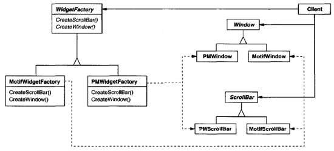
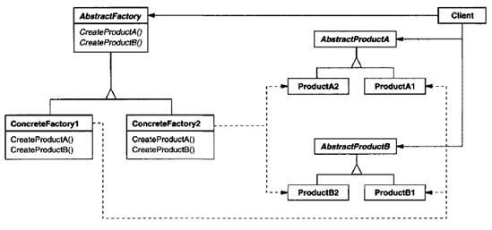

.. contents:: Table of Contents

Abstract Factory
================

Intent
-------

Provide an interface for creating families of related or dependent objects without specifying their concrete classes.

Also Known As
-------------

Kit

Motivation
----------

Consider a user interface toolkit that supports multiple look-and-feel standards, such as Motif and Presentation Manager. To be portable across look-and-f eel standards, an application should not hard-code its widgets for a particular look and feel.
We can solve this problem by defining an abstract WidgetFactory class that declares an interface for creating each basic kind of widget. There's also an abstract class for each kind of widget, and concrete subclasses implement widgets for specific look-and-f eel standards. WidgetFactory's interface has an operation that returns a new widget object for each abstract widget class. Clients call these operations to obtain widget instances, but clients aren't aware of the concrete classes they're using. Thus, clients stay independent of the prevailing look and feel.

 
Applicability
-------------

Use the Abstract Factory Pattern when
- a system should be independent of how its products are created, composed, and represented.
- a system should be configured with one of multiple families of products.
- a family of related product objects is designed to be used together, and you need to enforce th is constraint.
- you want to provide a class library of products, and you want to reveal just their interfaces, not their implementations.

Structure
---------

 
The Abstract Factory defines a Factory Method per product. Each Factory Method encapsulates the new operator and the concrete, platform-specific, product classes. Each "platform" is then modelled with a Factory derived class.

Participants
------------

AbstractFactory (WidgetFactory)
^^^^^^^^^^^^^^^^^^^^^^^^^^^^^^^^

declares an interface for operations that create abstract product objects.

ConcreteFactory (MotifWidgetFactory, PMWidgetFactory)
^^^^^^^^^^^^^^^^^^^^^^^^^^^^^^^^^^^^^^^^^^^^^^^^^^^^^

implements the operations to create concrete product objects.

AbstractProduct (Window, ScrollBar)
^^^^^^^^^^^^^^^^^^^^^^^^^^^^^^^^^^^

declares an interface for a type of product object.

ConcreteProduct (MotifWindow, MotifScrollBar)
^^^^^^^^^^^^^^^^^^^^^^^^^^^^^^^^^^^^^^^^^^^^^

defines a product object to be created by the corresponding concrete factory.

implements the AbstractProduct interface.

Client
^^^^^^

uses only interfaces declared by AbstractFactory and AbstractProduct classes.

Collaborations
--------------

AbstractFactory defers creation of product objects to its ConcreteFactory subclass.
Normally a single instance of a ConcreteFactory class is created at run-time. This concrete factory creates product objects having a particular implementation. To create different product objects, clients should use a different concrete factory.

Consequences
-------------

The Abstract Factory pattern has the following benefits and liabilities:

*It isolates concrete classes.* The Abstract Factory pattern helps you control the classes of objects that an application creates. Because a factory encapsulates the responsibility and the process of creating product objects, it isolates clients from implementation classes.

*It makes exchanging product families easy.* The class of a concrete factory appears only once in an application - that is, where it's instantiated. This makes it easy to change the concrete factory an application uses. It can use different product configurations simply by changing the concrete factory.

*It promotes consistency among products.* When product objects in a family are designed to work together, it's important that an application use objects from only one family at a time. AbstractFactory makes this easy to enforce.

*Supporting new kinds of products is difficult.* Extending abstract factories to produce new kinds of Products isn't easy. That's because the AbstractFactory interface fixes the set of products that can be created.

Implementation
---------------

#. *Factories as singletons:* ConcreteFactory is usually implemented as a Singleton, because an application only needs Its one instance.

#. *Creating the products:* AbstractFactory only declares an interface for creating products. It's up to ConcreteProduct subclasses to actually create them. 

        The most common way to do this is to define a factory method for each product. A concrete factory will specify its products by overriding the factory method for each. While this implementation is simple, it requires a new concrete factory subclass for each product family, even if the product families differ only slightly.

        If many product families are possible, the concrete factory can be implemented using the Prototype pattern. The concrete factory is initialized with a prototypical instance of each product in the family, and it creates a new product by cloning its prototype. The Prototype-based approach eliminates the need for a new concrete factory class for each new product family.

#. *Defining extensible factories:* AbstractFactory usually defines a different operation for each kind of product it can produce. The kinds of products are encoded in the operation signatures. Adding a new kind of product requires changing the AbstractFactory interface and all the classes that depend on it.

        A more flexible but less safe design is to add a parameter to operations that create objects. This parameter specifies the kind of object to be created. It could be a class identifier, an integer, a string, or anything else that identifies the kind of product. In fact, with this approach, AbstractFactory only needs a single "Make" operation with a parameter indicating the kind of object to create. This is the technique used in the Prototype- and the class-based abstract factories discussed earlier.

Sample Code
-----------

.. code:: cpp

	#include <iostream>
	#include <string>
	#include <memory>

	class Cheese {
			std::string name;
		public:
			~Cheese() { }
			Cheese(std::string name) : name(name) { }
			virtual std::string getName() { return name; }
	};

	class NyStyleCheese : public Cheese {
		public:
			~NyStyleCheese() { }
			NyStyleCheese() : Cheese("New York Cheese") { }
	};

	class ChicagoStyleCheese : public Cheese {
		public:
			~ChicagoStyleCheese() { }
			ChicagoStyleCheese() : Cheese("Chicago Style Cheese") { }
	};

	class Sauce {
			std::string name;
		public:
			~Sauce() { }
			Sauce(std::string name) : name(name) { }
			virtual std::string getName()	{ return name; }
	};

	class NyStyleSauce : public Sauce {
		public:
			~NyStyleSauce() { }
			NyStyleSauce() : Sauce("New York Style Sauce") { }
	};

	class ChicagoStyleSauce : public Sauce {
		public:
			~ChicagoStyleSauce() { }
			ChicagoStyleSauce() : Sauce("Chicago Style Sauce") { }
	};

	class PizzaIngredientFactory {
		public:
			virtual std::unique_ptr<Cheese> createCheese()  = 0;
			virtual std::unique_ptr<Sauce> createSauce()    = 0;
	};

	class NyPizzaIngredientFactory : public PizzaIngredientFactory {
		public:
			std::unique_ptr<Cheese> createCheese()  { return std::make_unique<NyStyleCheese>(); }
			std::unique_ptr<Sauce> createSauce()    { return std::make_unique<NyStyleSauce>();  }
	};

	class ChicagoPizzaIngredientFactory : public PizzaIngredientFactory {
		public:
			std::unique_ptr<Cheese> createCheese()  { return std::make_unique<ChicagoStyleCheese>();    }
			std::unique_ptr<Sauce> createSauce()    { return std::make_unique<ChicagoStyleSauce>();	    }
	};

	class Pizza {
	    std::string	name;

	    public:
		std::unique_ptr<Cheese> cheese  = nullptr;
		std::unique_ptr<Sauce>  sauce   = nullptr;
		
		Pizza(std::string name) : name(name) {  }
		virtual ~Pizza()    {  }
		
			virtual void prepare()  = 0;
			
		virtual void bake()     { std::puts("baking pizza"); }
		virtual void cut()      { std::puts("cutting pizza"); }
		virtual void box()      { std::puts("boxing pizza"); }
			virtual void setName(std::string name)	{ this->name = name; }
		virtual std::string getName()   { return name; }
	};

	class CheesePizza : public Pizza {
		std::shared_ptr<PizzaIngredientFactory> m_ingd_factory = nullptr;
	    public:
	    CheesePizza(std::shared_ptr<PizzaIngredientFactory> ingd_factory) : Pizza("Cheese Pizza"), m_ingd_factory(ingd_factory) {    }
	    virtual ~CheesePizza()   {   }
		
	    virtual void prepare()  { 
			std::puts("preparing ");

			cheese = m_ingd_factory->createCheese();
			sauce = m_ingd_factory->createSauce();

			std::puts("mixing ");
			std::puts(cheese->getName(). c_str());
			std::puts(sauce->getName(). c_str());
			std::puts(getName().c_str()); 
		}
	    virtual void bake()     { std::puts("baking pizza"); }
	    virtual void cut()      { std::puts("cutting pizza"); }
	    virtual void box()      { std::puts("boxing"); }
	};

	class NonvegPizza : public Pizza {

		std::shared_ptr<PizzaIngredientFactory> m_ingd_factory = nullptr;
	    public:
	    NonvegPizza(std::shared_ptr<PizzaIngredientFactory> ingd_factory) : Pizza("Non veg Pizza"), m_ingd_factory(ingd_factory) {    }
	    virtual ~NonvegPizza()   {   }
		
	    virtual void prepare()  { 
			std::puts("preparing ");
			cheese = m_ingd_factory->createCheese();
			sauce = m_ingd_factory->createSauce();
			std::puts("mixing ");
			std::puts(cheese->getName(). c_str());
			std::puts(sauce->getName(). c_str());
			std::puts(getName().c_str()); 
		}
	    virtual void bake()     { std::puts("baking pizza"); }
	    virtual void cut()      { std::puts("cutting pizza"); }
	    virtual void box()      { std::puts("boxing"); }
	};

	class PizzaStore {
	    public:
	    virtual std::unique_ptr<Pizza> createPizza(std::string type) = 0;  // abstract factory method
	    virtual ~PizzaStore()   {   }

	    std::unique_ptr<Pizza> orderPizza(std::string type) {

		std::unique_ptr<Pizza> pizza = createPizza(type);
		
		pizza->prepare();
		pizza->bake();
		pizza->cut();
		pizza->box();

		return pizza;
	    }
	};

	class NyPizzaStore : public PizzaStore {

		std::shared_ptr<PizzaIngredientFactory> ingd_factory = std::make_shared<NyPizzaIngredientFactory>();

	    std::unique_ptr<Pizza> pizza = nullptr;

	    std::unique_ptr<Pizza> createPizza(std::string type) {
		if(type.compare("cheese")) {
		    pizza = std::make_unique<CheesePizza>(ingd_factory);
				pizza->setName("New York Style Cheese Pizza");
		}
		else if(type.compare("nonveg")) {
		    pizza = std::make_unique<NonvegPizza>(ingd_factory);
				pizza->setName("New York Style Nonveg Pizza");
		}
		
		return std::move(pizza);
	    }  
	};

	class ChicagoPizzaStore : public PizzaStore {
		std::shared_ptr<PizzaIngredientFactory> ingd_factory = std::make_shared<ChicagoPizzaIngredientFactory>();
		
		std::unique_ptr<Pizza> pizza = nullptr;

	    std::unique_ptr<Pizza> createPizza(std::string type) {
		if(type.compare("cheese")) {
		    pizza = std::make_unique<CheesePizza>(ingd_factory);
				pizza->setName("Chicago Style Cheese Pizza");
		}
		else if(type.compare("nonveg")) {
		    pizza = std::make_unique<NonvegPizza>(ingd_factory);
				pizza->setName("Chicago Style Nonveg Pizza");
		}
		
		return std::move(pizza);
	    }  
	};

	int main() {
	    {
		std::unique_ptr<PizzaStore> ny_pizza_store = std::make_unique<NyPizzaStore>();
		std::unique_ptr<Pizza> nonveg_pizza = ny_pizza_store->orderPizza("nonveg");
		std::puts(nonveg_pizza->getName().c_str());
	    }
	    std::puts("");
	    {
		std::unique_ptr<PizzaStore> ny_pizza_store = std::make_unique<NyPizzaStore>();
		std::unique_ptr<Pizza> cheese_pizza = ny_pizza_store->orderPizza("cheese");
		std::puts(cheese_pizza->getName().c_str());
	    }

	    std::puts("");
	    {
		std::unique_ptr<PizzaStore> chicago_pizza_store = std::make_unique<ChicagoPizzaStore>();
		std::unique_ptr<Pizza> cheese_pizza = chicago_pizza_store->orderPizza("cheese");
		std::puts(cheese_pizza->getName().c_str());
	    
		std::puts("");
	    
		//std::unique_ptr<PizzaStore> chicago_pizza_store = std::make_unique<ChicagoPizzaStore>();
		std::unique_ptr<Pizza> nonveg_pizza = chicago_pizza_store->orderPizza("cheese");
		std::puts(nonveg_pizza->getName().c_str());
	    }

	    return 0;
	}

 
Known Uses
----------

Related Patterns
----------------

AbstractFactory classes are often implemented with Factory methods, but they can also be implemented using Prototype.

A concrete factory is often a Singleton.

Abstract Factory can be used as an alternative to Facade to hide platform-specific classes.

References
----------

| Book: Design Patterns Elements of Reusable Object-Oriented Software
| Book: Head First: Design Patterns
| https://sourcemaking.com/design_patterns/abstract_factory

