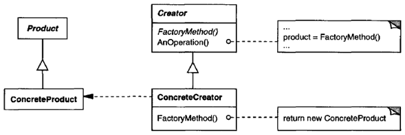
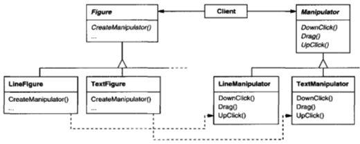
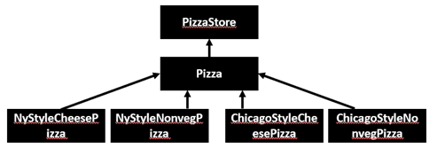

.. contents:: Table of Contents

Factory
=======

Intent
------
The Factory Method Pattern defines an interface for creating an object, but let’s subclasses decide which class to instantiate. Factory Method lets a class defer instantiation to subclasses.

- A factory method is abstract so the subclasses are counted on to handle object creation.
- A factory method returns a product that is typically used within methods defined in the superclass.
- A factory method isolates the client from knowing what kind of concreate product is actually created.

Also Known As
-------------
Virtual Constructor

Motivation
----------
Solves problems like:

- How can an object be created so that subclasses can redefine which class to instantiate?
- How can a class defer instantiation to subclasses?

Describes how to solve such problems:

- Define a separate operation (factory method) for creating an object
- Create an object by calling a factory method

Applicability
-------------
Use the Factory Method pattern when

- a class can't anticipate the class of objects it must create
- a class wants its subclasses to specify the obje cts it creates
- classes delegate responsibility to one of several helper subclasses, and you want to localize the knowledge of which helper subclass is the delegate

Structure
---------

Participants
------------
| **Product (Document)**
| defines the interface of objects the factory method creates

| **ConcreteProduct (MyDocument)**
| implements the Product interface

| **Creator (Application)**
| declares the factory method, which returns an object of type Product
| Creator may also define a default implementation of the factory method that
| returns a default ConcreteProduct object
| may call the factory method to create a Product object

| **ConcreteCreator (MyApplication)**
| overrides the factory method to return an instance of a Concrete Product

Collaborations
--------------
Creator relies on its subclasses to define the factory method so that it returns an instance of the appropriate ConcreteProduct.

Consequences
------------
The code only deals with the Product interface; therefore, it can work with any user-defined ConcreteProduct classes.

**Disadvantage of factory methods**

Clients might have to subclass the Creator class just to create a particular ConcreteProduct object

**1. Provides hooks for subclasses**

Creating objects inside a class with a factory method is always more flexible than creating an object directly. 
Factory Method gives subclasses a hook for providing an extended version of an object.

**2. Connects parallel class hierarchies**

Parallel class hierarchies result when a class delegates some of its responsibilities to a separate class. Consider graphical figures that can be manipulated interactively; that is, they can be stretched, moved, or rotated using the mouse. Implementing such interactions isn't always easy.
Different figures will use different Manipulator subclasses to handle particular interactions. The resulting Manipulator class hierarchy parallels (at least partially) the Figure class hierarchy:

The Figure class provides a CreateManipulator factory method that lets clients create a Figure's corresponding Manipulator. Figure subclasses override this method to return an instance of the Manipulator subclass that is right for them. Alternatively, the Figure class may implement CreateManipulator to return a default Manipulator instance, and Figure subclasses may simply inherit that default. The Figure classes that do so need no corresponding Manipulator subclass—hence the hierarchies are only partially parallel.

Notice how the factory method defines the connection between the two class hierarchies. It localizes knowledge of which classes belong together.

Implementation
--------------

1. Two major varieties
^^^^^^^^^^^^^^^^^^^^^^^^^^

i. The Creator class is an abstract class and does not provide an implementation for the factory method it declares, It is also possible to have an abstract class that defines a default implementation, but this is less common.
ii. The Creator is a concrete class and provides a default implementation for the factory method.

2. Parameterized factory methods
^^^^^^^^^^^^^^^^^^^^^^^^^^^^^^^^

The factory method takes a parameter that identifies the kind of object to create. All objects the factory method creates will share the Product interface.

A parameterized factory method has the following general form, where MyProduct and YourProduct are subclasses of Product:

.. code:: cpp

	class Creator {
	   public:
		virtual Product* Create(Productld);
	};

	Product* Creator::Create(Productld id) {
		if (id == MINE) return new MyProduct;
		if (id == YOURS) return new YourProduct;
		// repeat for remaining products...
		return 0;
	}

You can override a parameterized factory method and introduce new identifiers for new kinds of products, or you can associate existing identifiers with different products.

For example, a subclass MyCreator could swap MyProduct and YourProduct and support a new TheirProduct subclass:

.. code:: cpp

	Product* MyCreator::Create(Productld id) {
		if (id == YOURS) return new MyProduct;
		if (id == MINE) return new YourProduct;
		// N.B.: switched YOURS and MINE
		if (id == THEIRS) return new TheirProduct;
		return Creator::Create(id);  // called if all others fail
	}

3. Language-specific variants and issues
^^^^^^^^^^^^^^^^^^^^^^^^^^^^^^^^^^^^^^^^

Factory methods in C++ are always virtual functions and are often pure virtual.

**Just be careful not to call factory methods in the Creator's constructor the factory method in the ConcreteCreator will not be available yet.**

Instead of creating the concrete product in the constructor, the constructor merely initializes it to 0.

The accessor returns the product created using lazy initialization.

.. code:: cpp

	class Creator {
	   public:
		Product* GetProduct();

	   protected:
		virtual Product* CreateProduct();

	   private:
		Product* _product = nullptr;
	};

	Product* Creator::GetProduct() {
		if (nullptr == _product) {
			_product = CreateProduct();
		}
		return _product;
	}

4. Using templates to avoid subclassing
^^^^^^^^^^^^^^^^^^^^^^^^^^^^^^^^^^^^^^^

A potential problem with factory methods is that they might force you to subclass just to create the appropriate Product objects.

Another way to get around this in C++ is to provide a template subclass of Creator that's parameterized by the Product class:

.. code:: cpp

	class Creator {
	   public:
		virtual Product* CreateProduct() = 0;
	};

	template <class TheProduct>
	class StandardCreator : public Creator {
	   public:
		virtual Product* CreateProduct();
	};

	template <class TheProduct>
	Product* StandardCreator<TheProduct>::CreateProduct() {
		return new TheProduct;
	}

With this template, the client supplies just the product class—no subclassing of Creator is required.

.. code:: cpp
	class MyProduct : public Product {
	   public:
		MyProduct();
		// . . .
	};

	StandardCreator<MyProduct> myCreator;

5. Naming conventions
^^^^^^^^^^^^^^^^^^^^^

It is good practice to use naming conventions that make it clear you're using factory methods.

Sample Code
-----------

`01_Creational_Patterns_01_Factory.cpp`_

Known Uses
----------

Factory methods pervade toolkits and frameworks.

Related Patterns
----------------
Abstract Factory is often implemented with factory methods.

Factory methods are usually called within Template Methods.

Prototypes (117) don't require subclassing Creator. However, they often require an Initialize operation on the Product class. Creator uses Initialize to initialize the object. Factory Method does not require such an operation.

A few Points in from C++ prospective
-------------------------------------

Actually, the factory method is a way of circumventing following limitations of C++ constructor:

**No return type:** A constructor cannot return a result, which means that we cannot signal an error during object initialization. The only way of doing it is to throw an exception from a constructor.

**Naming:** A constructor should have the same name as the class, which means we cannot have two constructors that both take a single argument.

**Compile time bound:** At the time when we create an object, we must specify the name of a concrete class, which is known at compile time. There is no way of dynamic binding constructors at run time.

**There is no virtual constructor:** We cannot declare a virtual constructor. If we are constructing derived object, the compiler calls the base class constructor first, and the derived class has not been initialized yet. This is the reason why we cannot call virtual methods from the constructor.

What's the difference between Abstract Factory Pattern and Factory Method?
--------------------------------------------------------------------------

- Abstract Factory design pattern creates Factory
- Factory design pattern creates Products

Application
-----------

1. In ADO.NET, IDbCommand.CreateParameter is an example of the use of factory method to connect parallel class hierarchies.
2. In Qt, QMainWindow::createPopupMenu is a factory method declared in a framework that can be overridden in application code.
3. In Java, several factories are used in the javax.xml.parsers package. e.g. javax.xml.parsers.DocumentBuilderFactory or javax.xml.parsers.SAXParserFactory.

The Dependency Inversion Principle
----------------------------------

Dependency Inversion Principle makes an even stronger statement about abstraction. It suggests that our high-level components should not depend on our low-level components; rather, they should both depend on abstractions.
After applying factory method pattern for our example (sample code) diagram look like this

High-level component, the PizzaStore, and our low-level components, the pizzas, both depend on Pizza, the abstraction.
Factory Method is not the only technique for adhering to the Dependency Inversion Principle, but it is one of the more powerful ones.

References
----------

| Book: Design Patterns Elements of Reusable Object-Oriented Software
| Book: Head First: Design Patterns
| https://sourcemaking.com/design_patterns/factory_method
| https://en.wikipedia.org/wiki/Factory_method_pattern

